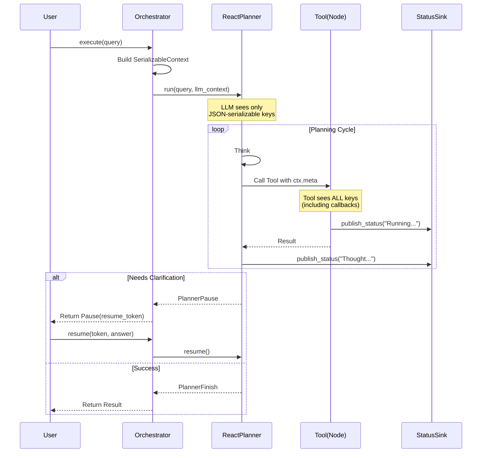
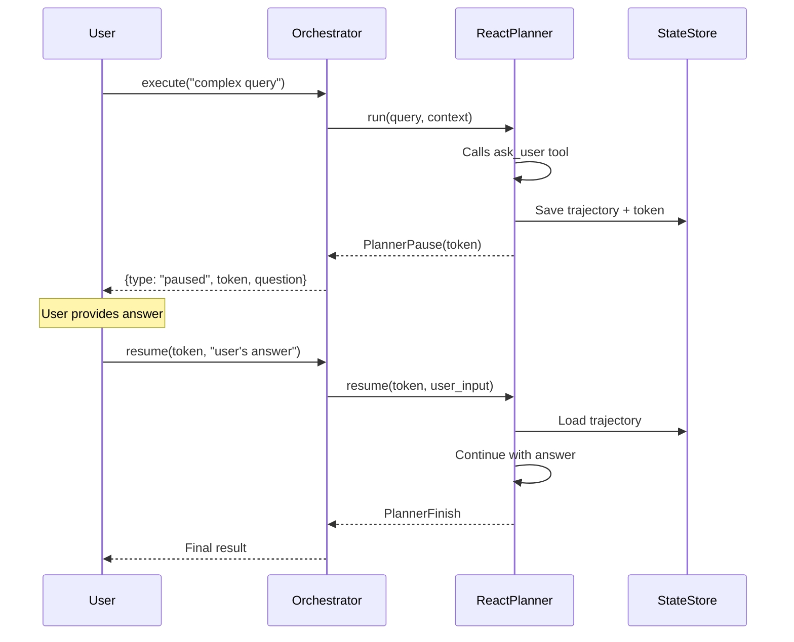
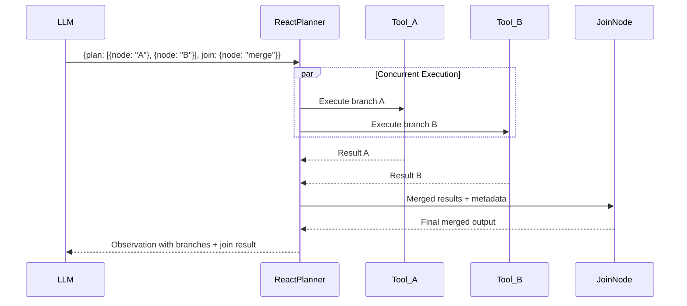

# PenguiFlow: React Planner Integration Guide (Gold Standard)

## 1. Introduction

This document serves as the architectural "North Star" for implementing a production-grade **React Planner** using `penguiflow`. It synthesizes patterns from `planner_enterprise_agent_v2`, `react_memory_context`, and `react_pause_resume` to create a system that:

1. **Plans and Executes**: Uses `ReactPlanner` to dynamically solve user requests.
2. **Live Status Updates**: Emits real-time progress to a sink (frontend/websocket) using a "Callback Pattern" (superior to the "Rookery" pattern for dynamic planners).
3. **Human-in-the-Loop**: Handles clarifying questions via `PlannerPause` and resumption.
4. **Context Aware**: Manages distinct contexts for the LLM (memories) and the internal system (telemetry, routing).
5. **Type Safe**: Properly handles serialization boundaries between LLM prompts and tool execution.

> **Reference Implementation**: See `examples/planner_enterprise_agent_v2/` for a complete, production-ready example.

---

## 2. Architecture Overview

The system consists of three main layers:

1. **The Orchestrator**: The entry point. It initializes the planner, manages the `STATUS_BUFFER`, handles the execution loop, and processes `PlannerPause` events.
2. **The Planner (ReactPlanner)**: The core engine. It receives the query and `llm_context`, generates thoughts, and invokes tools.
3. **The Tools (Nodes)**: Atomic units of work. They receive context via `ctx.meta` to publish status updates and perform actions.

### High-Level Data Flow



---

## 3. Understanding Context Types

PenguiFlow has **two distinct execution modes** with different context objects. Understanding this distinction is critical for building robust planners.

### 3.1 Flow Execution Context (`Context` class)

Used when nodes execute in a `PenguiFlow` graph (static flows):

```python
from penguiflow.core import Context

# In a flow node, ctx is a Context object with:
async def my_node(message: Message, ctx: Context) -> Message:
    # Queue-based message passing
    await ctx.emit(output_message)           # Send to next node
    msg = await ctx.fetch()                   # Receive from previous node

    # Streaming support
    await ctx.emit_chunk(parent=msg, text="partial", done=False)

    # Runtime access
    ctx.runtime.cancel(trace_id)              # Cancel a run

    # Backpressure monitoring
    depth = ctx.queue_depth_in()
```

### 3.2 Planner Execution Context (`_PlannerContext`)

Used when `ReactPlanner` dynamically calls tools:

```python
from typing import Any

# In a planner tool, ctx is a _PlannerContext object with:
@tool(desc="Analyze documents")
async def analyze(args: DocArgs, ctx: Any) -> DocResult:
    # Access merged context via ctx.meta
    meta = ctx.meta  # dict containing all llm_context values

    # Pause for human input
    await ctx.pause("approval_required", {"question": "Proceed?"})

    # NO emit/fetch - planner handles message routing
```

### 3.3 Key Differences

| Aspect | Flow Context | Planner Context |
|--------|--------------|-----------------|
| Class | `Context` | `_PlannerContext` |
| Message passing | `emit()`, `fetch()` | Not available |
| Metadata access | `message.meta` | `ctx.meta` |
| Pause support | No | `ctx.pause()` |
| Streaming | `emit_chunk()` | `_chunks` list |
| Use case | Static graphs | Dynamic tool invocation |

**Implication**: Tools designed for planner use should access `ctx.meta`, not `ctx.emit()`. Use polymorphic helper functions to safely extract metadata from either context type.

---

## 4. The Serialization Boundary (Critical Concept)

When you pass `llm_context` to `ReactPlanner.run()`, two things happen:

1. **For the LLM**: Only JSON-serializable values are included in the prompt
2. **For Tools**: ALL values (including functions, loggers) are accessible via `ctx.meta`

This creates a **serialization boundary** that you must manage correctly.

### 4.1 The Problem

```python
# ❌ WRONG: This will fail or confuse the LLM
result = await planner.run(
    query=query,
    llm_context={
        "memories": [...],                    # ✓ Serializable
        "status_publisher": publish_func,     # ✗ Function - not serializable!
        "telemetry": telemetry_obj,           # ✗ Object - not serializable!
    }
)
```

Without proper handling, either:
- Serialization fails with `TypeError`
- The LLM receives garbage representations of functions

### 4.2 The Solution: `_SerializableContext` Wrapper

The gold standard pattern wraps your context in a `Mapping` that filters non-serializable values:

```python
import json
from collections.abc import Iterator, Mapping
from typing import Any


class _SerializableContext(Mapping[str, Any]):
    """Context wrapper that filters non-serializable values for JSON serialization.

    This class allows passing both serializable and non-serializable objects
    in llm_context. When the planner serializes context for the LLM prompt,
    only JSON-serializable values are included. But tools can still access
    ALL values (including functions, loggers, etc.) via ctx.meta.

    How it works:
    - Implements Mapping protocol (dict-like)
    - __iter__ returns only serializable keys (for JSON/dict conversion)
    - __getitem__ returns ALL values (for tool access via ctx.meta)
    """

    def __init__(self, data: dict[str, Any]) -> None:
        self._data = data
        self._serializable_keys = self._find_serializable_keys()

    def _find_serializable_keys(self) -> frozenset[str]:
        """Identify which keys have JSON-serializable values."""
        serializable = set()
        for key, value in self._data.items():
            try:
                json.dumps(value)
                serializable.add(key)
            except (TypeError, ValueError):
                # Skip non-serializable values (functions, objects, etc.)
                pass
        return frozenset(serializable)

    def __getitem__(self, key: str) -> Any:
        """Allow access to ALL values (both serializable and non-serializable)."""
        return self._data[key]

    def __iter__(self) -> Iterator[str]:
        """Iterate only over serializable keys (for dict() and JSON conversion)."""
        return iter(self._serializable_keys)

    def __len__(self) -> int:
        """Return count of serializable keys."""
        return len(self._serializable_keys)

    def get(self, key: str, default: Any = None) -> Any:
        """Get value with default (allows access to ALL values)."""
        return self._data.get(key, default)
```

### 4.3 Usage Pattern

```python
# ✓ CORRECT: Use _SerializableContext wrapper
llm_visible = {
    "memories": [...],
    "user_preferences": {"verbose": True},
}

tool_only = {
    "trace_id": trace_id,
    "status_publisher": publish_func,
    "telemetry": telemetry_obj,
}

# Merge and wrap
combined = {**llm_visible, **tool_only}
safe_context = _SerializableContext(combined)

result = await planner.run(
    query=query,
    llm_context=safe_context,  # LLM sees: memories, user_preferences
                                # Tools see: ALL of the above
)
```

---

## 5. Core Components Implementation

### 5.1 The Status Model

Define a strict contract for status updates. This ensures the frontend knows exactly what to render.

```python
from typing import Literal
from pydantic import BaseModel


class RoadmapStep(BaseModel):
    """A step in the execution roadmap."""
    id: int
    name: str
    status: Literal["pending", "running", "ok", "error"] = "pending"


class StatusUpdate(BaseModel):
    """Event emitted to the status sink.

    This model defines the contract between the agent and frontend.
    All status updates should conform to this schema for consistent rendering.
    """
    status: Literal["thinking", "ok", "error", "paused"]
    message: str | None = None
    # Optional: For detailed UI progress bars
    roadmap_step_id: int | None = None
    roadmap_step_status: Literal["running", "ok", "error"] | None = None
    roadmap: list[RoadmapStep] | None = None
```

### 5.2 The Orchestrator

The Orchestrator is responsible for:
1. Building the `_SerializableContext`
2. Injecting the `publish_status` callback
3. Handling `PlannerPause` events

**Why Callback vs. Rookery?**

The "Rookery" pattern (wiring all nodes to a central `status_node` in a graph) works well for static flows. However, for a **React Planner**, tools are called dynamically at runtime—they don't exist in a static graph. Injecting a callback via `ctx.meta` is cleaner, decouples tools from graph structure, and allows for easier testing (mocking the callback).

```python
from collections import defaultdict
from typing import Any
from uuid import uuid4

from penguiflow.planner import ReactPlanner, PlannerPause, PlannerFinish
from penguiflow.catalog import build_catalog
from penguiflow.node import Node
from penguiflow.registry import ModelRegistry


# Global or Redis-backed buffer (in production: use message queue/websocket)
STATUS_BUFFER: defaultdict[str, list[StatusUpdate]] = defaultdict(list)


class AgentOrchestrator:
    """Production-ready agent orchestrator with ReactPlanner.

    Thread Safety:
        NOT thread-safe. Create separate instances per request/session.
    """

    def __init__(self, config: AgentConfig) -> None:
        self.config = config
        self.telemetry = AgentTelemetry(config)
        self._registry = self._build_registry()
        self._planner = self._build_planner()

    def _build_registry(self) -> ModelRegistry:
        """Register all type mappings for validation."""
        registry = ModelRegistry()
        registry.register("triage_query", UserQuery, RouteDecision)
        registry.register("analyze_docs", RouteDecision, FinalAnswer)
        # ... more registrations
        return registry

    def _build_planner(self) -> ReactPlanner:
        """Construct ReactPlanner with catalog and configuration."""
        nodes = [
            Node(triage_query, name="triage_query"),
            Node(analyze_documents, name="analyze_docs"),
            # ... more nodes
        ]
        catalog = build_catalog(nodes, self._registry)

        return ReactPlanner(
            llm=self.config.llm_model,
            catalog=catalog,
            max_iters=self.config.planner_max_iters,
            temperature=self.config.llm_temperature,
            # Document custom context format for LLM
            system_prompt_extra="""
## Context Usage
The user message may include a 'context' field with:
- **memories**: Conversation history and user preferences
- **status_history**: Real-time execution progress
""",
            # Wire up telemetry callback for observability
            event_callback=self.telemetry.record_planner_event,
        )

    async def execute(
        self,
        query: str,
        *,
        tenant_id: str = "default",
        memories: list[dict[str, Any]] | None = None,
    ) -> FinalAnswer:
        """Execute agent planning for a user query.

        Args:
            query: The user's question or request
            tenant_id: Tenant identifier for multi-tenancy
            memories: Optional conversation history for context-aware planning

        Returns:
            FinalAnswer with the agent's response
        """
        trace_id = uuid4().hex
        status_history = STATUS_BUFFER[trace_id]

        # 1. Define the Status Sink
        def publish_status(update: StatusUpdate) -> None:
            status_history.append(update)
            # In production: push to Redis/Websocket
            self.telemetry.logger.debug(
                "status_update",
                extra={"trace_id": trace_id, "status": update.status}
            )

        # 2. Context Separation (CRITICAL PATTERN)
        #
        # llm_visible: Data sent to LLM in prompt
        #   - Only JSON-serializable values
        #   - Domain knowledge, user preferences, memories
        #
        # tool_only: Data for tools only (via ctx.meta)
        #   - Non-serializable objects: functions, loggers
        #   - Internal routing: trace_id, tenant_id

        llm_visible: dict[str, Any] = {
            "status_history": status_history,
        }
        if memories:
            llm_visible["memories"] = memories

        tool_only: dict[str, Any] = {
            "trace_id": trace_id,
            "tenant_id": tenant_id,
            "status_publisher": publish_status,
            "telemetry": self.telemetry,
        }

        # 3. Wrap in SerializableContext
        combined = {**llm_visible, **tool_only}
        safe_context = _SerializableContext(combined)

        # 4. Execute Planner
        try:
            result = await self._planner.run(
                query=query,
                llm_context=safe_context,  # Use llm_context, NOT context_meta
            )

            # 5. Handle Results
            if isinstance(result, PlannerPause):
                publish_status(StatusUpdate(
                    status="paused",
                    message="Waiting for user input..."
                ))
                return FinalAnswer(
                    text="Workflow paused awaiting input.",
                    route="pause",
                    metadata={
                        "reason": result.reason,
                        "payload": dict(result.payload),
                        "resume_token": result.resume_token,
                    },
                )

            # PlannerFinish
            if result.reason == "answer_complete":
                return FinalAnswer.model_validate(result.payload)
            elif result.reason == "no_path":
                return FinalAnswer(
                    text=f"Could not complete: {result.metadata.get('thought', 'Unknown')}",
                    route="error",
                )
            elif result.reason == "budget_exhausted":
                return FinalAnswer(
                    text="Task interrupted due to resource constraints.",
                    route="error",
                )
            else:
                raise RuntimeError(f"Unexpected result: {result.reason}")

        except Exception as e:
            publish_status(StatusUpdate(status="error", message=str(e)))
            raise
        finally:
            if self.config.enable_telemetry:
                self.telemetry.emit_collected_events()

    async def resume(self, resume_token: str, user_input: str) -> FinalAnswer:
        """Resume a paused planning session.

        Args:
            resume_token: Token from PlannerPause
            user_input: User's response to the pause question

        Returns:
            FinalAnswer after resumption completes
        """
        result = await self._planner.resume(
            token=resume_token,
            user_input=user_input,
        )

        if isinstance(result, PlannerPause):
            # Another pause occurred
            return FinalAnswer(
                text="Workflow paused again.",
                route="pause",
                metadata={
                    "reason": result.reason,
                    "resume_token": result.resume_token,
                },
            )

        return FinalAnswer.model_validate(result.payload)
```

### 5.3 The Tools (Nodes)

Tools access the status sink via `ctx.meta`. Use helper functions to keep code clean and handle polymorphic context types.

```python
from collections.abc import MutableMapping
from typing import Any, Literal

from penguiflow.catalog import tool
from pydantic import BaseModel


def _resolve_meta(source: Any) -> MutableMapping[str, Any] | None:
    """Return mutable metadata mapping from planner or flow context.

    This helper handles both:
    - Planner context: source.meta is a dict
    - Flow messages: source is a Message with .meta
    - Dict-like objects: source is already a mapping
    """
    if isinstance(source, MutableMapping):
        return source
    meta = getattr(source, "meta", None)
    if isinstance(meta, MutableMapping):
        return meta
    return None


def _publish_status(
    ctx_or_meta: Any,
    *,
    status: Literal["thinking", "ok", "error"],
    message: str | None = None,
    roadmap_step_id: int | None = None,
    roadmap_step_status: Literal["running", "ok", "error"] | None = None,
) -> None:
    """Helper to safely access and use status publisher.

    This helper:
    - Safely extracts meta from various context types
    - Gracefully handles missing publisher (for testing)
    - Constructs proper StatusUpdate objects
    """
    meta = _resolve_meta(ctx_or_meta)
    if meta is None:
        return

    publisher = meta.get("status_publisher")
    if not callable(publisher):
        return

    update = StatusUpdate(
        status=status,
        message=message,
        roadmap_step_id=roadmap_step_id,
        roadmap_step_status=roadmap_step_status,
    )
    publisher(update)


def _trace_id_from_ctx(source: Any) -> str | None:
    """Extract trace ID from context for error reporting."""
    meta = _resolve_meta(source)
    if not meta:
        return None
    trace_id = meta.get("trace_id")
    return trace_id if isinstance(trace_id, str) else None


# Example tool implementation
class DocumentArgs(BaseModel):
    filename: str
    include_metadata: bool = False


class DocumentResult(BaseModel):
    entities: list[str]
    summary: str


@tool(
    desc="Analyze a document and extract key entities",
    tags=["documents", "analysis"],
    side_effects="read",
    latency_hint_ms=1000,
)
async def analyze_document(args: DocumentArgs, ctx: Any) -> DocumentResult:
    """Analyze document content and extract entities.

    Args:
        args: Document analysis parameters
        ctx: Planner context (access metadata via ctx.meta)

    Returns:
        DocumentResult with extracted entities and summary
    """
    # 1. Notify start
    _publish_status(
        ctx,
        status="thinking",
        message=f"Reading {args.filename}...",
        roadmap_step_status="running",
    )

    try:
        # 2. Do work
        content = await read_file(args.filename)

        # 3. Notify progress
        _publish_status(ctx, status="thinking", message="Extracting entities...")
        entities = extract_entities(content)

        # 4. Notify completion
        _publish_status(
            ctx,
            status="ok",
            message="Analysis complete.",
            roadmap_step_status="ok",
        )

        return DocumentResult(
            entities=entities,
            summary=f"Found {len(entities)} entities in {args.filename}",
        )

    except Exception as e:
        # 5. Notify error before re-raising
        _publish_status(
            ctx,
            status="error",
            message=f"Analysis failed: {e}",
            roadmap_step_status="error",
        )
        raise
```

---

## 6. Handling Clarifying Questions (Human-in-the-Loop)

To enable the planner to ask questions, you must:
1. Register a tool that calls `ctx.pause()`
2. Handle the `PlannerPause` result in the Orchestrator
3. Implement the `resume()` method

### 6.1 The "Ask User" Tool

```python
from penguiflow.planner import PlannerPauseReason


class ClarificationRequest(BaseModel):
    question: str
    options: list[str] | None = None


class ClarificationResponse(BaseModel):
    answer: str


@tool(
    desc="Ask the user for clarification when requirements are ambiguous",
    tags=["interaction", "clarification"],
    side_effects="external",
)
async def ask_user(args: ClarificationRequest, ctx: Any) -> ClarificationResponse:
    """Pause execution to get input from the user.

    When this tool is called, the planner will:
    1. Save the current trajectory state
    2. Return a PlannerPause with a resume_token
    3. Wait for orchestrator to call resume() with user's answer

    The user's answer will be returned as the result of this function
    when execution resumes.
    """
    _publish_status(
        ctx,
        status="paused",
        message=f"Asking: {args.question}",
    )

    # Pause the planner - this raises internally
    await ctx.pause(
        "await_input",  # PlannerPauseReason
        {
            "question": args.question,
            "options": args.options,
        },
    )

    # Unreachable - but keeps type checkers happy
    return ClarificationResponse(answer="")
```

### 6.2 PlannerPause Reasons

The planner supports several pause reasons:

```python
PlannerPauseReason = Literal[
    "approval_required",     # Waiting for human decision on an action
    "await_input",          # Waiting for user to provide information
    "external_event",       # Waiting for async external event
    "constraints_conflict", # Policy/constraint violation needs resolution
]
```

### 6.3 Resume Flow



---

## 7. Headers and Message Metadata (Hybrid Architectures)

When your planner tools spawn subflows (Pattern A: Wrapped Subflows), you need to properly construct `Message` objects with `Headers`.

### 7.1 Understanding Headers vs Meta

| Aspect | Headers | Meta |
|--------|---------|------|
| Purpose | Routing & infrastructure | Application-level auxiliary data |
| Structure | Strongly typed Pydantic model | Unstructured dictionary |
| Mutability | Immutable (should not change) | Mutable |
| Use in routing | Primary routing key (tenant) | Not used for routing |
| Scope | Framework concerns | Business logic concerns |

### 7.2 Headers Structure

```python
from penguiflow.types import Headers, Message

class Headers(BaseModel):
    tenant: str                  # REQUIRED - multi-tenancy identifier
    topic: str | None = None     # OPTIONAL - categorization
    priority: int = 0            # OPTIONAL - priority level
```

### 7.3 Constructing Messages in Tools

When a planner tool needs to spawn a subflow:

```python
from penguiflow.types import Headers, Message
from penguiflow.patterns import call_playbook


@tool(desc="Execute document analysis subflow")
async def analyze_documents_pipeline(args: RouteDecision, ctx: Any) -> FinalAnswer:
    """Execute complete document workflow as a single planner-visible operation.

    This demonstrates Pattern A: Wrapped Subflow
    - Planner sees ONE tool
    - Internally executes a 5-node subflow
    - Propagates context correctly
    """
    meta = _resolve_meta(ctx) or {}
    trace_id = meta.get("trace_id") or uuid4().hex

    # Construct Headers for subflow message
    headers = Headers(
        tenant=args.query.tenant_id,
        topic="documents",
    )

    # Propagate tool context to subflow
    message_meta = dict(meta)
    message_meta.setdefault("route", "documents")

    # Create properly structured Message
    message = Message(
        payload=args,
        headers=headers,          # Immutable routing metadata
        trace_id=trace_id,        # Correlation ID
        meta=message_meta,        # Propagate status_publisher, etc.
    )

    # Execute subflow
    def _playbook() -> tuple[PenguiFlow, ModelRegistry]:
        return build_document_analysis_subflow()

    try:
        result = await call_playbook(_playbook, message)
    except Exception as exc:
        _publish_status(meta, status="error", message="Subflow failed")
        raise

    return result
```

### 7.4 Anti-Patterns

```python
# ❌ DON'T modify headers in nodes
async def bad_node(msg: Message, ctx) -> Message:
    msg.headers.tenant = "different"  # Headers should be immutable!
    return msg

# ❌ DON'T use meta for routing decisions
policy = DictRoutingPolicy(
    key_getter=lambda req: req.message.meta.get("tenant")  # Wrong!
)

# ✓ DO use headers for routing
policy = DictRoutingPolicy(
    key_getter=lambda req: req.message.headers.tenant  # Correct!
)

# ❌ DON'T put routing data in meta
message.meta["tenant"] = "acme"  # This should be in headers

# ✓ DO use headers for routing data
headers = Headers(tenant="acme")
```

---

## 8. Best Practices Checklist

### 8.1 Type Safety

- [ ] Use `Pydantic` models for ALL tool inputs/outputs
- [ ] Register models in `ModelRegistry` for validation
- [ ] Use `@tool` decorator with proper type hints
- [ ] Validate at tool boundaries, trust internal code

### 8.2 Context Hygiene

- [ ] **ALWAYS** use `_SerializableContext` wrapper
- [ ] **NEVER** put non-serializable objects in llm-visible context without wrapper
- [ ] **ALWAYS** put callbacks, loggers, telemetry in tool-only context
- [ ] **ALWAYS** propagate `trace_id` for correlation
- [ ] Use `llm_context` parameter (NOT deprecated `context_meta`)

### 8.3 Status Updates

- [ ] Emit on: Tool Start, Significant Progress, Tool Success/Failure
- [ ] Use `thinking` for transient states
- [ ] Use `ok`/`error` for terminal states
- [ ] **DON'T** spam updates - emit meaningfully
- [ ] **ALWAYS** emit `error` status before raising exceptions

### 8.4 Error Handling

- [ ] Wrap tool logic in try/except
- [ ] Emit `status="error"` before raising
- [ ] Include `trace_id` in error context
- [ ] Use `FlowError` for structured errors 

### 8.5 Telemetry

- [ ] Wire up `event_callback` on ReactPlanner
- [ ] Use `record_planner_event` for structured observability
- [ ] Pass `telemetry` object in tool context for node-level logging
- [ ] Emit collected events in `finally` block

### 8.6 Testing

- [ ] Mock `status_publisher` callback for unit tests
- [ ] Test tools with `ctx.meta` as simple dict
- [ ] Test pause/resume flow with tokens
- [ ] Use `FlowTestKit` for integration tests

---

## 9. Migration Guide

### 9.1 From `context_meta` to `llm_context`

```python
# ❌ OLD (deprecated - will show warning)
result = await planner.run(
    query=query,
    context_meta={...},  # Deprecated parameter
)

# ✓ NEW (correct)
result = await planner.run(
    query=query,
    llm_context={...},  # Use this parameter
)
```

### 9.2 From Direct Context to SerializableContext

```python
# ❌ OLD (risky - may fail serialization)
result = await planner.run(
    query=query,
    llm_context={
        "memories": [...],
        "publisher": callback_func,  # Will cause issues!
    },
)

# ✓ NEW (safe)
context = _SerializableContext({
    "memories": [...],
    "publisher": callback_func,
})
result = await planner.run(query=query, llm_context=context)
```

### 9.3 From Rookery to Callback Pattern

```python
# ❌ OLD (Rookery pattern - doesn't work for dynamic planners)
flow = create(
    tool_node.to(status_node),  # Explicit edge to status sink
    status_node.to()
)

# ✓ NEW (Callback pattern)
def publish_status(update: StatusUpdate) -> None:
    STATUS_BUFFER[trace_id].append(update)

context = _SerializableContext({
    "status_publisher": publish_status,
})

# Tools call _publish_status(ctx, ...) internally
```

---

## 10. Troubleshooting

### 10.1 "TypeError: Object of type function is not JSON serializable"

**Cause**: Non-serializable object in `llm_context` without `_SerializableContext` wrapper.

**Fix**: Wrap your context:
```python
context = _SerializableContext({...})
```

### 10.2 "LLM receives garbled context"

**Cause**: The LLM is seeing string representations of functions/objects.

**Fix**: Use `_SerializableContext` - it filters non-serializable keys from iteration.

### 10.3 "ctx.meta is None or empty"

**Cause**: Context not properly passed to planner.

**Fix**: Ensure you're passing `llm_context` parameter:
```python
result = await planner.run(query=query, llm_context=context)
```

### 10.4 "Status updates not appearing"

**Cause**: Publisher not in context or helper not finding it.

**Fix**: Check that:
1. `status_publisher` is in the context dict
2. Helper function `_resolve_meta()` can find it
3. The callback is actually callable

### 10.5 "PlannerPause not being handled"

**Cause**: Not checking result type in orchestrator.

**Fix**: Always check for PlannerPause:
```python
result = await planner.run(...)
if isinstance(result, PlannerPause):
    # Handle pause
elif isinstance(result, PlannerFinish):
    # Handle completion
```

### 10.6 "Resume fails with 'token not found'"

**Cause**: In-memory pause records lost (server restart) or wrong token.

**Fix**: For production, configure a durable `state_store`:
```python
planner = ReactPlanner(
    ...,
    state_store=RedisStateStore(...),  # Persist across restarts
)
```

---

## 11. Parallel Tool Execution

ReactPlanner supports **concurrent execution of multiple tools** with automatic result merging. This is useful for fan-out/fan-in patterns like fetching from multiple sources, parallel processing, or map-reduce workflows.

### 11.1 How Parallel Execution Works

Instead of calling a single tool via `next_node`, the LLM can return a `plan` array to execute multiple tools concurrently:



### 11.2 The Parallel Action Schema

The LLM signals parallel execution by setting `plan` instead of `next_node`:

```python
# Sequential execution (normal)
{
    "thought": "Need to fetch documents",
    "next_node": "fetch_docs",
    "args": {"query": "..."}
}

# Parallel execution
{
    "thought": "Need to fetch from multiple shards concurrently",
    "plan": [
        {"node": "fetch_primary", "args": {"shard": 0}},
        {"node": "fetch_secondary", "args": {"shard": 1}},
        {"node": "fetch_tertiary", "args": {"shard": 2}},
    ],
    "join": {"node": "merge_results"}  # Optional join node
}
```

**Key rules**:
- `plan` and `next_node` are mutually exclusive
- Each item in `plan` specifies a `node` name and `args`
- `join` is optional - if omitted, results are returned directly to LLM
- All branches execute via `asyncio.gather()` (true concurrency)

### 11.3 Designing Parallel-Compatible Tools

Branch tools work exactly like regular tools - no special handling needed:

```python
class ShardQuery(BaseModel):
    topic: str
    shard: int


class ShardResult(BaseModel):
    shard: int
    documents: list[str]


@tool(
    desc="Fetch documents from a specific shard",
    tags=["retrieval", "parallel"],
    side_effects="read",
)
async def fetch_shard(args: ShardQuery, ctx: Any) -> ShardResult:
    """Fetch documents from a shard. Can be called in parallel."""
    _publish_status(ctx, status="thinking", message=f"Fetching shard {args.shard}...")

    # Simulate async work
    docs = await retrieve_from_shard(args.topic, args.shard)

    _publish_status(ctx, status="ok", message=f"Shard {args.shard} complete")
    return ShardResult(shard=args.shard, documents=docs)
```

### 11.4 Designing Join Nodes

Join nodes receive results from all branches. The planner **auto-injects** standard fields based on your schema:

```python
class MergeArgs(BaseModel):
    """Join node input schema.

    These field names are auto-populated by the planner:
    - results: List of successful branch outputs
    - expect: Number of branches that were launched
    - branches: All branch payloads (success + failure)
    - failures: List of failed branches (if any)
    - success_count: Number of successful branches
    - failure_count: Number of failed branches
    """
    results: list[ShardResult]      # Auto-injected: successful results
    expect: int = 0                  # Auto-injected: expected count
    # Optional: include these if you need failure info
    # failures: list[dict] = []
    # success_count: int = 0
    # failure_count: int = 0


class MergedDocuments(BaseModel):
    all_documents: list[str]
    shard_count: int


@tool(
    desc="Merge results from parallel shard fetches",
    tags=["aggregation", "join"],
    side_effects="pure",
)
async def merge_results(args: MergeArgs, ctx: Any) -> MergedDocuments:
    """Merge documents from multiple shards.

    This node is called automatically after parallel branches complete.
    """
    _publish_status(ctx, status="thinking", message="Merging shard results...")

    # Access parallel execution metadata (also available)
    meta = _resolve_meta(ctx) or {}
    success_count = meta.get("parallel_success_count", 0)
    failure_count = meta.get("parallel_failure_count", 0)

    if failure_count > 0:
        failures = meta.get("parallel_failures", [])
        _publish_status(
            ctx,
            status="thinking",
            message=f"Warning: {failure_count} shards failed: {failures}"
        )

    # Merge all documents
    all_docs = []
    for result in args.results:
        all_docs.extend(result.documents)

    _publish_status(ctx, status="ok", message=f"Merged {len(all_docs)} documents")
    return MergedDocuments(
        all_documents=all_docs,
        shard_count=len(args.results),
    )
```

### 11.5 Join Context Metadata

The join node receives rich metadata via `ctx.meta`:

```python
# Available in join node's ctx.meta:
{
    "parallel_results": [          # All branch payloads
        {
            "node": "fetch_shard",
            "args": {"topic": "...", "shard": 0},
            "observation": {"shard": 0, "documents": [...]},
        },
        {
            "node": "fetch_shard",
            "args": {"topic": "...", "shard": 1},
            "observation": {"shard": 1, "documents": [...]},
        },
    ],
    "parallel_success_count": 2,   # How many succeeded
    "parallel_failure_count": 0,   # How many failed
    "parallel_failures": [],       # Details of failures (if any)
    "parallel_input": {...},       # The join args before auto-injection

    # Plus all your regular context (trace_id, status_publisher, etc.)
    "trace_id": "...",
    "status_publisher": <function>,
}
```

### 11.6 Failure Handling

**Important**: If ANY branch fails, the join node is **skipped** by default (safety-first):

```python
# When a branch fails, the observation looks like:
{
    "branches": [
        {"node": "fetch_shard", "args": {...}, "observation": {...}},  # Success
        {"node": "fetch_shard", "args": {...}, "error": "Connection timeout"},  # Failed
    ],
    "stats": {"success": 1, "failed": 1},
    "join": {
        "node": "merge_results",
        "status": "skipped",          # Join was skipped!
        "reason": "branch_failures",
        "failures": [
            {
                "node": "fetch_shard",
                "args": {"shard": 1},
                "error": "Connection timeout",
            }
        ]
    }
}
```

The LLM sees this observation and can decide to:
1. Retry the failed branches
2. Proceed with partial results (call join manually)
3. Report an error to the user

### 11.7 Configuration Options

#### System-Level Limit

```python
planner = ReactPlanner(
    llm=model,
    catalog=catalog,
    absolute_max_parallel=50,  # Hard limit (default: 50)
)
```

This is a **safety limit** that prevents resource exhaustion regardless of other settings.

#### Planning Hints

```python
planner = ReactPlanner(
    llm=model,
    catalog=catalog,
    planning_hints={
        # Soft limit (LLM is asked to respect this)
        "max_parallel": 5,

        # Allowed parallel groupings (optional)
        "parallel_groups": [
            ["fetch_shard_a", "fetch_shard_b", "fetch_shard_c"],
            ["process_a", "process_b"],
        ],

        # Nodes that must run sequentially (never in parallel)
        "sequential_only": ["approve", "deploy", "send_email"],

        # Human-readable constraints for LLM
        "constraints": "max_parallel=5; sequential_only=approve,deploy",
    },
)
```

### 11.8 Constraint Enforcement

When a constraint is violated, the planner doesn't crash - it **asks the LLM to revise**:

```python
# LLM tries to execute 100 parallel branches
{
    "thought": "Fan out to all shards",
    "plan": [{"node": "fetch", "args": {"shard": i}} for i in range(100)]
}

# Planner rejects and provides feedback:
# "Parallel action exceeds max_parallel=50. Reduce parallel fan-out."

# LLM revises to batch approach:
{
    "thought": "Too many shards, will batch into groups of 10",
    "plan": [{"node": "fetch_batch", "args": {"shards": list(range(0, 10))}}]
}
```

### 11.9 Complete Parallel Execution Example

```python
from pydantic import BaseModel
from penguiflow.catalog import tool, build_catalog
from penguiflow.node import Node
from penguiflow.registry import ModelRegistry
from penguiflow.planner import ReactPlanner


# --- Models ---

class SearchQuery(BaseModel):
    query: str
    source: str


class SearchResult(BaseModel):
    source: str
    results: list[str]
    count: int


class MergeSearchArgs(BaseModel):
    results: list[SearchResult]  # Auto-injected
    expect: int = 0               # Auto-injected


class FinalSearchResult(BaseModel):
    all_results: list[str]
    sources_searched: int
    total_count: int


# --- Tools ---

@tool(desc="Search web source", tags=["search", "parallel"])
async def search_web(args: SearchQuery, ctx: Any) -> SearchResult:
    results = await web_search(args.query)
    return SearchResult(source="web", results=results, count=len(results))


@tool(desc="Search database source", tags=["search", "parallel"])
async def search_database(args: SearchQuery, ctx: Any) -> SearchResult:
    results = await db_search(args.query)
    return SearchResult(source="database", results=results, count=len(results))


@tool(desc="Search vector store", tags=["search", "parallel"])
async def search_vectors(args: SearchQuery, ctx: Any) -> SearchResult:
    results = await vector_search(args.query)
    return SearchResult(source="vectors", results=results, count=len(results))


@tool(desc="Merge search results from multiple sources", tags=["join"])
async def merge_searches(args: MergeSearchArgs, ctx: Any) -> FinalSearchResult:
    all_results = []
    total = 0
    for r in args.results:
        all_results.extend(r.results)
        total += r.count

    return FinalSearchResult(
        all_results=all_results,
        sources_searched=len(args.results),
        total_count=total,
    )


# --- Setup ---

nodes = [
    Node(search_web, name="search_web"),
    Node(search_database, name="search_database"),
    Node(search_vectors, name="search_vectors"),
    Node(merge_searches, name="merge_searches"),
]

registry = ModelRegistry()
registry.register("search_web", SearchQuery, SearchResult)
registry.register("search_database", SearchQuery, SearchResult)
registry.register("search_vectors", SearchQuery, SearchResult)
registry.register("merge_searches", MergeSearchArgs, FinalSearchResult)

planner = ReactPlanner(
    llm="gpt-4o",
    catalog=build_catalog(nodes, registry),
    planning_hints={
        "max_parallel": 10,
        "parallel_groups": [["search_web", "search_database", "search_vectors"]],
    },
)


# --- Execution ---
# The LLM will naturally decide to fan out:
# {
#     "thought": "Search all sources concurrently for best coverage",
#     "plan": [
#         {"node": "search_web", "args": {"query": "penguins", "source": "web"}},
#         {"node": "search_database", "args": {"query": "penguins", "source": "db"}},
#         {"node": "search_vectors", "args": {"query": "penguins", "source": "vec"}},
#     ],
#     "join": {"node": "merge_searches"}
# }

result = await planner.run("Find all information about penguins")
```

### 11.10 When to Use Parallel Execution

**Good use cases**:
- Fetching from multiple data sources (shards, APIs, databases)
- Map operations over independent items
- Parallel validation or enrichment steps
- Multi-source search and aggregation

**Avoid parallel execution when**:
- Steps have dependencies (use sequential instead)
- Order matters (use explicit sequencing)
- Side effects need coordination (use sequential with locks)
- Resources are limited (set appropriate `max_parallel`)

---

## 12. Complete Example

See `examples/planner_enterprise_agent_v2/` for a complete, production-ready implementation including:

- `main.py`: Full orchestrator with all patterns
- `nodes.py`: Tool definitions with proper status updates
- `config.py`: Environment-based configuration
- `telemetry.py`: Observability middleware

Run the example:
```bash
cd examples/planner_enterprise_agent_v2
cp .env.example .env
# Edit .env with your API keys
uv run python main.py --stream
```

---

## 13. Quick Reference

### Parameter Names
| Old (Deprecated) | New (Correct) |
|------------------|---------------|
| `context_meta` | `llm_context` |

### Context Access Patterns
```python
# In tools - access via ctx.meta
meta = ctx.meta
trace_id = meta.get("trace_id")
publisher = meta.get("status_publisher")

# Safe helper pattern
meta = _resolve_meta(ctx)  # Works with any context type
```

### Status Update Flow
```
Tool Start → status="thinking", message="Starting..."
Progress   → status="thinking", message="Processing..."
Success    → status="ok", message="Complete"
Failure    → status="error", message="Failed: {reason}"
Pause      → status="paused", message="Waiting for input"
```

### Pause Reasons
```python
"approval_required"   # Human approval needed
"await_input"         # User information needed
"external_event"      # Async event pending
"constraints_conflict" # Policy violation
```

### Parallel Execution Schema
```python
# Sequential (normal)
{"thought": "...", "next_node": "tool_name", "args": {...}}

# Parallel (fan-out)
{
    "thought": "...",
    "plan": [
        {"node": "tool_a", "args": {...}},
        {"node": "tool_b", "args": {...}},
    ],
    "join": {"node": "merge_tool"}  # Optional
}
```

### Join Node Auto-Injected Fields
```python
class JoinArgs(BaseModel):
    results: list[T]     # Successful branch outputs
    expect: int          # Number of branches launched
    branches: list[dict] # All payloads (success + failure)
    failures: list[dict] # Failed branch details
    success_count: int   # Count of successes
    failure_count: int   # Count of failures
```

### Parallel Context Metadata
```python
# Available in join node's ctx.meta:
ctx.meta["parallel_results"]        # All branch payloads
ctx.meta["parallel_success_count"]  # Successful count
ctx.meta["parallel_failure_count"]  # Failed count
ctx.meta["parallel_failures"]       # Failure details
```
