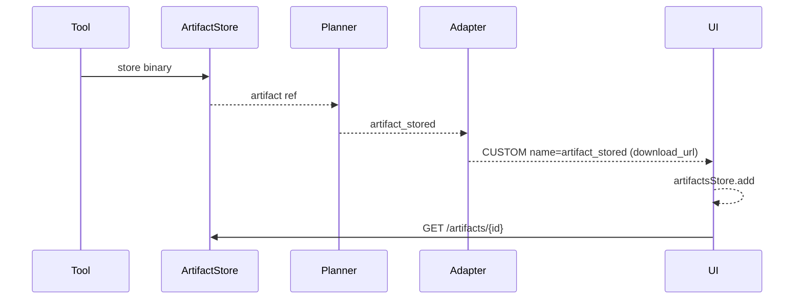
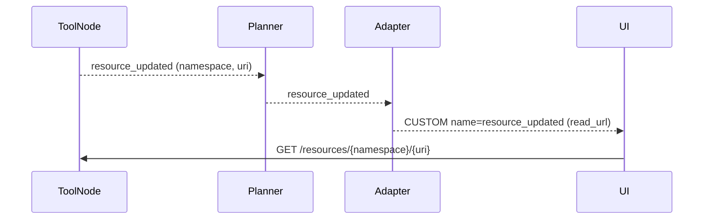

# Artifacts and MCP Resources

This diagram shows how artifacts and resource updates propagate to the UI.

```mermaid
sequenceDiagram
  participant Tool
  participant Store as ArtifactStore
  participant Planner
  participant Adapter
  participant UI

  Tool->>Store: store binary
  Store-->>Planner: artifact ref
  Planner-->>Adapter: artifact_stored
  Adapter-->>UI: CUSTOM name=artifact_stored (download_url)
  UI-->>UI: artifactsStore.add
  UI->>Store: GET /artifacts/{id}
```

Resource update flow:

```mermaid
sequenceDiagram
  participant ToolNode
  participant Planner
  participant Adapter
  participant UI

  ToolNode-->>Planner: resource_updated (namespace, uri)
  Planner-->>Adapter: resource_updated
  Adapter-->>UI: CUSTOM name=resource_updated (read_url)
  UI->>ToolNode: GET /resources/{namespace}/{uri}
```
