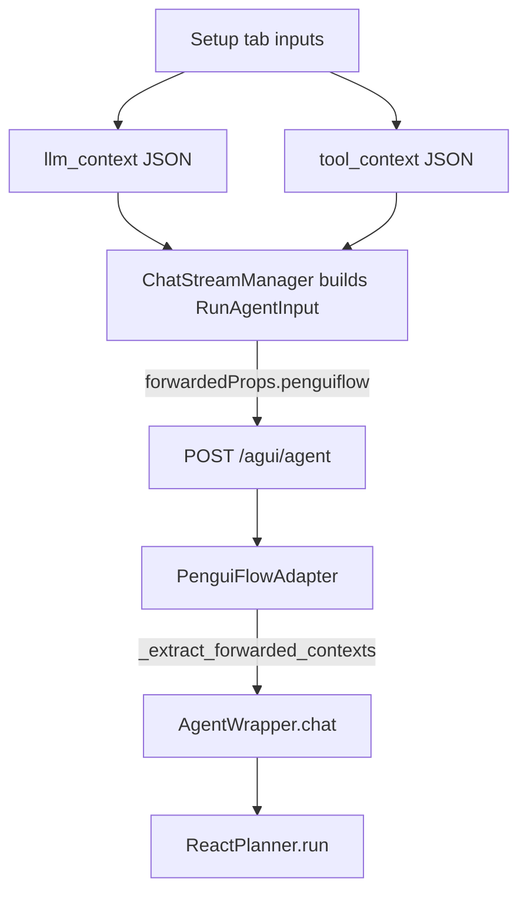

# Context Split Mapping (llm_context vs tool_context)

AG-UI does not define llm_context or tool_context fields. The Playground
packages them into forwardedProps so the adapter can unpack them and preserve
the split.



Request body shape (simplified):

```json
{
  "threadId": "session-id",
  "runId": "trace-id",
  "messages": [ ... ],
  "state": {},
  "forwardedProps": {
    "penguiflow": {
      "llm_context": { ... },
      "tool_context": { ... }
    }
  }
}
```
