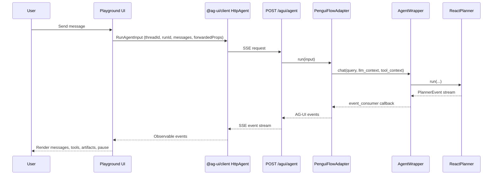

# AG-UI End to End Flow

This diagram shows the full request/response loop when the Playground UI
uses AG-UI.

Notes:
- The legacy SSE path still exists via /chat/stream and is selected when the
  UI toggle is off.
- AG-UI uses POST with SSE framing from ag-ui-protocol.
