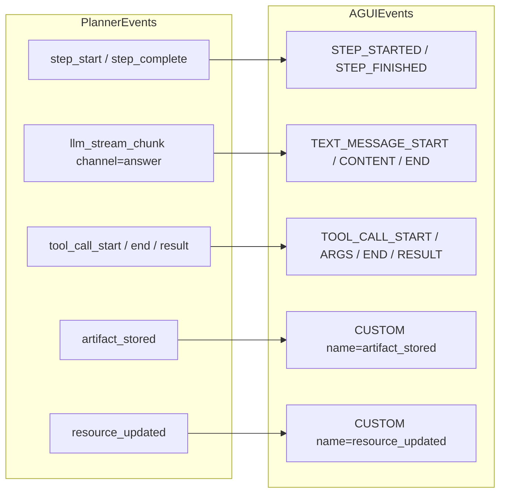

# PlannerEvent to AG-UI Event Mapping

This diagram shows how planner events are converted into AG-UI events by the
adapter.

Lifecycle events:
- RUN_STARTED and RUN_FINISHED always wrap the stream.
- RUN_ERROR is emitted on exceptions.
