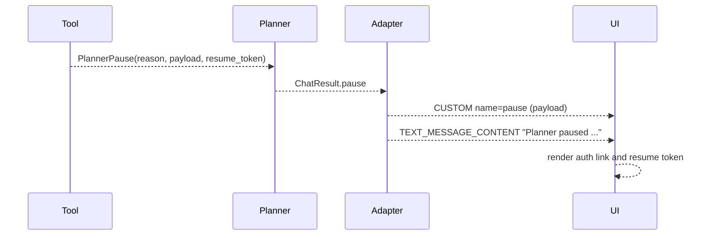

# Pause and Resume Signaling

This diagram shows how pause events (HITL or OAuth) reach the UI.

Notes:
- Resume is handled by existing HITL primitives; AG-UI only carries the pause
  payload and a message for the UI.
