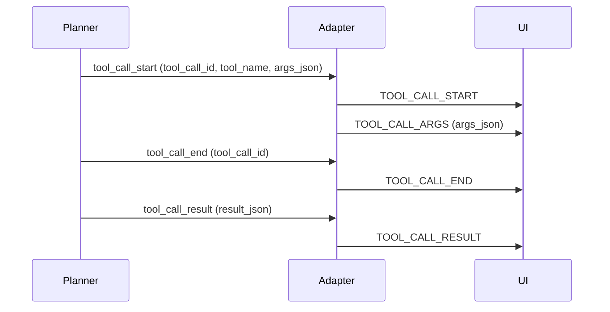

# Tool Call Lifecycle

Tool calls are emitted by the planner and become AG-UI tool call events.

Notes:
- The UI attaches tool calls to the current assistant message.
- The result is stored on the tool call and can be displayed inline.
