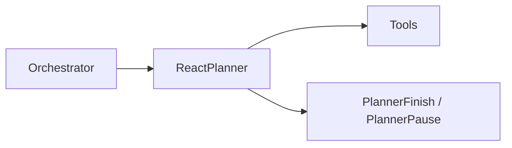

# Docs style guide (enterprise internal)

This page defines the quality bar and structure for PenguiFlow documentation.

## Scope tiers

PenguiFlow docs are organized into tiers so “quality” is measurable:

- **Tier A (Curated / MkDocs nav)**: enterprise-grade internal docs. These pages must be decision-ready and operational.
- **Tier B (Canonical internal guides)**: long-form references used to extract and curate Tier A. Must remain accurate and maintainable.
- **Tier C (Draft notes)**: RFCs/proposals. Useful for contributors; may be incomplete and are not part of the curated site.

The curated site intentionally does **not** include all repository docs.

## Required structure for Tier A pages

Every Tier A page must include these sections (short is fine, missing is not):

1. **What it is / when to use it**
2. **Non-goals / boundaries**
3. **Contract surface** (APIs / schemas / config knobs)
4. **Operational defaults** (safe defaults + when to change)
5. **Failure modes & recovery**
6. **Observability** (what to emit; what to alert on)
7. **Security / multi-tenancy notes**
8. **Runnable example(s)** (or link to `examples/`)
9. **Troubleshooting checklist**

## Writing conventions

### Audience and tone

- Write for **production engineers** and **platform teams**.
- Prefer concrete, testable statements (“Join is skipped if any branch fails”) over aspirations.
- Avoid “hand-wavy” language: “can”, “maybe”, “should” without a reason.

### Canonical pointers

If a Tier B doc contains information that is canonically documented elsewhere:

- Add a **“Canonical pages”** block at the top linking to Tier A pages.
- Keep Tier B accurate, but defer operational guidance to Tier A.

### Code snippets

- Snippets must be either:
  - **runnable** (copy/paste; includes imports), or
  - explicitly marked as **pseudocode**.
- Prefer examples that match the repo’s actual API:
  - use `Node(...).to(...)` and `create(...)` adjacency tuples,
  - avoid fictional APIs like `flow.node(...)` unless it exists.
- Include at least one **negative path** per major doc set (e.g. invalid args, join injection errors, missing env vars).

### Diagrams

Use Mermaid diagrams for system flows, but keep them simple:

### Admonitions

Use MkDocs Material admonitions to signal risk:

- `!!! note` for important behavior
- `!!! tip` for best practices
- `!!! warning` for foot-guns

## Content ownership

Prefer ownership by subsystem:

- `docs/planner/**`: planner maintainers
- `docs/tools/**`: ToolNode/integrations maintainers
- `docs/core/**`: runtime maintainers
- `docs/deployment/**` and `docs/observability/**`: platform/ops maintainers

