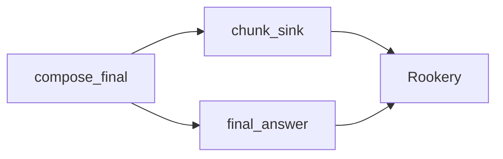

# Streaming

## What it is / when to use it

PenguiFlow supports streaming partial output (for example LLM token emission) using:

- `StreamChunk` (payload model), and
- `Context.emit_chunk(...)` (runtime helper that emits chunks as `Message(payload=StreamChunk, ...)`).

Use streaming when you want:

- low-latency UI updates (SSE/WebSocket),
- long-running synthesis where partial output is valuable,
- consistent “status + chunks + final answer” contracts.

## Non-goals / boundaries

- Streaming does not guarantee delivery ordering across different `stream_id`s.
- Streaming does not “replace” your final result contract; you still need a final, canonical output (often `FinalAnswer`).
- Streaming does not persist chunks unless you persist runtime events and/or store artifacts yourself.

## Contract surface

### `Context.emit_chunk(...)`

`emit_chunk` signature (core runtime):

- requires a `parent: Message`
- emits a `Message` whose payload is a `StreamChunk`

Key behaviors:

- default `stream_id` is the parent’s `trace_id`
- `seq` is monotonically increasing per `stream_id` (unless you supply it explicitly)
- `done=True` ends the stream and resets internal sequence tracking

!!! note
    `emit_chunk` requires a `parent` `Message` so chunks inherit `trace_id`, routing headers, deadlines, and metadata.

### Recommended envelope style

If you want streaming, use envelope-style flows:

- nodes accept and emit `Message`
- chunks and final answers share the same `trace_id`

See **[Messages & envelopes](messages-and-envelopes.md)**.

## Operational defaults

- Always stream to a dedicated sink node (don’t rely on side effects in the composing node).
- Use a single `trace_id` to correlate chunks and the final answer.
- Keep chunk sizes small; treat the stream as “progressive rendering”, not a blob transport.

## Failure modes & recovery

### No chunks appear

**Likely causes**

- your node is not receiving a `Message` envelope (so you can’t call `emit_chunk`)
- you aren’t routing chunks to a live consumer (sink node / UI bridge)

**Fix**

- switch to envelope-style (`Message`) for streaming flows
- add a chunk sink node and ensure it is connected in the graph

### Duplicate or missing chunks

**Likely causes**

- you are emitting chunks with manual `seq` values
- multiple producers emit to the same `stream_id` concurrently

**Fix**

- let `Context.emit_chunk` assign `seq`
- use one producer per `stream_id` (or separate stream ids)

### Backpressure stalls streaming

Chunks are normal messages and can back up behind bounded queues.

**Fix**

- ensure the sink consumer is fast
- tune `queue_maxsize` for the chunk edge, and avoid unbounded queues unless you accept memory risk

## Observability

Streaming is visible in runtime events:

- chunk sink nodes will emit `node_*` events like any other node
- queue depth signals tell you if chunk delivery is backing up

If you bridge to a UI, you typically also log:

- `stream_id`, `seq`, and chunk sizes
- time-to-first-chunk and time-to-final metrics

## Security / multi-tenancy notes

- Never stream secrets. Streams are user-visible surfaces.
- Correlate by `Headers.tenant` and `trace_id` to avoid cross-tenant mixing.

## Minimal end-to-end pattern

The simplest reliable pattern is to route chunks to a dedicated sink node:



In practice:

1. Your “compose” node receives a `Message` envelope.
2. It emits `StreamChunk`s to `chunk_sink`.
3. It returns (or emits) a final `FinalAnswer` as the canonical result.

### Runnable example

```python
from __future__ import annotations

import asyncio

from penguiflow import Headers, Message, Node, NodePolicy, create
from penguiflow.types import FinalAnswer


async def chunk_sink(msg: Message, _ctx) -> None:
    chunk = msg.payload
    print(chunk.text, end="")
    if chunk.done:
        print("")


async def deliver_final(msg: Message, _ctx) -> FinalAnswer:
    return msg.payload


async def compose(msg: Message, ctx) -> None:
    await ctx.emit_chunk(parent=msg, text="hello ", to=chunk_node)
    await ctx.emit_chunk(parent=msg, text="world", done=True, to=chunk_node)

    final = msg.model_copy(update={"payload": FinalAnswer(text="hello world")})
    await ctx.emit(final, to=final_node)


chunk_node = Node(chunk_sink, name="chunk_sink", policy=NodePolicy(validate="none"))
final_node = Node(deliver_final, name="final", policy=NodePolicy(validate="none"))
compose_node = Node(compose, name="compose", policy=NodePolicy(validate="none"))


async def main() -> None:
    flow = create(
        compose_node.to(chunk_node, final_node),
        chunk_node.to(),
        final_node.to(),
    )
    flow.run()

    message = Message(payload={"request": "ignored"}, headers=Headers(tenant="demo"))
    await flow.emit(message, trace_id=message.trace_id)
    result = await flow.fetch(trace_id=message.trace_id)
    print("Final:", result.text)

    await flow.stop()


if __name__ == "__main__":
    asyncio.run(main())
```

See `examples/roadmap_status_updates/flow.py` for a complete, tested implementation (status + chunks + final answer).

## Troubleshooting checklist

- **Chunks print but final answer missing**: ensure you emit a final result to an egress node (Rookery) and `fetch(trace_id=...)`.
- **Final answer arrives but chunks don’t**: confirm chunk routing to the sink edge and that the sink is connected.
- **Streaming is slow**: check queue depths and sink performance; tune `queue_maxsize` and reduce chunk volume.

## Further reading (internal notes)

- `docs/agui/flow-tool-calls.md` (tool-call event mapping)
- `docs/patterns/roadmap_status_updates.md` (status + roadmap streaming pattern)
