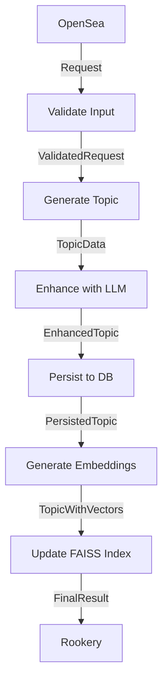

# Topic Generation Flow Pattern

## Overview

This document demonstrates a complete **topic generation pipeline** using PenguiFlow. It shows how to integrate LLM enhancement, vector storage (FAISS), database persistence, and external services in a maintainable, testable way.

**Use case**: Generate semantic topics with dimensions, persist to database, and index vectors for similarity search.

---

## Architecture



---

## Service Abstractions

### 1. Service Registry Pattern

```python
from abc import ABC, abstractmethod
from typing import AsyncContextManager, Protocol

class LLMService(ABC):
    """Abstract LLM service."""
    @abstractmethod
    async def enhance_topic(
        self,
        topic_name: str,
        context: str,
        max_tokens: int = 500
    ) -> EnhancedTopicData:
        """Enhance topic with additional dimensions and descriptions."""
        ...

class EmbeddingService(ABC):
    """Abstract embedding service."""
    @abstractmethod
    async def embed_batch(self, texts: list[str]) -> list[list[float]]:
        """Generate embeddings for batch of texts."""
        ...

class VectorIndexService(ABC):
    """Abstract vector index operations."""
    @abstractmethod
    async def update_index(
        self,
        topic_id: str,
        vectors: list[list[float]],
        metadata: dict
    ) -> None:
        """Add/update vectors in index."""
        ...

    @abstractmethod
    async def search(
        self,
        query_vector: list[float],
        k: int = 10
    ) -> list[SearchResult]:
        """Search for similar vectors."""
        ...

class DatabasePool(ABC):
    """Abstract database connection pool."""
    @abstractmethod
    def acquire(self) -> AsyncContextManager:
        """Get connection for single operation."""
        ...

    @abstractmethod
    def transaction(self) -> AsyncContextManager:
        """Get transactional connection."""
        ...
```

---

## Pydantic Models

```python
from pydantic import BaseModel, Field
from typing import Optional

class TopicRequest(BaseModel):
    """Initial request to generate a topic."""
    topic_name: str = Field(..., min_length=1, max_length=200)
    context: str = Field(..., min_length=10)
    tenant: str
    max_dimensions: int = Field(default=5, ge=1, le=20)

class ValidatedRequest(BaseModel):
    """Validated and sanitized request."""
    topic_name: str
    context: str
    tenant: str
    max_dimensions: int
    request_id: str

class TopicData(BaseModel):
    """Basic topic structure."""
    topic_name: str
    description: str
    tenant: str

class Dimension(BaseModel):
    """Single dimension of a topic."""
    name: str
    description: str
    importance: float = Field(ge=0.0, le=1.0)

class EnhancedTopic(BaseModel):
    """Topic enhanced with LLM-generated dimensions."""
    topic_name: str
    description: str
    dimensions: list[Dimension]
    tenant: str
    enhancement_metadata: dict

class PersistedTopic(BaseModel):
    """Topic persisted to database."""
    topic_id: int
    topic_name: str
    description: str
    dimensions: list[Dimension]
    tenant: str

class TopicWithVectors(BaseModel):
    """Topic with generated vector embeddings."""
    topic_id: int
    topic_name: str
    topic_vector: list[float]
    dimension_vectors: list[list[float]]

class FinalResult(BaseModel):
    """Final output."""
    topic_id: int
    topic_name: str
    status: str
    vector_count: int
```

---

## Flow Implementation

### Complete Flow Factory

```python
from penguiflow import create, Node, NodePolicy, ModelRegistry
from penguiflow.types import Message, Headers
import uuid

def create_topic_generation_flow(
    llm_service: LLMService,
    embedding_service: EmbeddingService,
    vector_index: VectorIndexService,
    db_pool: DatabasePool,
    config: dict
):
    """
    Factory function that creates topic generation flow with injected dependencies.

    Args:
        llm_service: LLM enhancement service
        embedding_service: Text embedding service
        vector_index: FAISS/vector index service
        db_pool: Database connection pool
        config: Configuration dictionary

    Returns:
        Configured PenguiFlow instance
    """

    # ===== Node Implementations =====

    async def validate_input(
        request: TopicRequest,
        ctx
    ) -> ValidatedRequest:
        """
        Validate and sanitize input request.

        Policies:
        - No retries (validation is deterministic)
        - Short timeout (should be instant)
        """
        # Sanitize inputs
        topic_name = request.topic_name.strip()
        context = request.context.strip()

        # Business validation
        if len(topic_name.split()) > config["max_topic_words"]:
            raise ValueError(
                f"Topic name too long: {len(topic_name.split())} words"
            )

        # Generate unique request ID
        request_id = str(uuid.uuid4())

        return ValidatedRequest(
            topic_name=topic_name,
            context=context,
            tenant=request.tenant,
            max_dimensions=request.max_dimensions,
            request_id=request_id
        )

    async def generate_base_topic(
        request: ValidatedRequest,
        ctx
    ) -> TopicData:
        """
        Generate base topic structure before LLM enhancement.

        Policies:
        - No retries (deterministic processing)
        """
        # Create basic structure
        description = f"Topic about {request.topic_name} in context: {request.context[:100]}"

        return TopicData(
            topic_name=request.topic_name,
            description=description,
            tenant=request.tenant
        )

    async def enhance_with_llm(
        topic: TopicData,
        ctx
    ) -> EnhancedTopic:
        """
        Enhance topic with LLM-generated dimensions and descriptions.

        Policies:
        - Retries: 3 (LLM calls can have transient failures)
        - Timeout: 30s (LLM calls can be slow)
        - Exponential backoff (avoid overwhelming API)
        """
        # Call LLM service (injected via closure)
        enhanced_data = await llm_service.enhance_topic(
            topic_name=topic.topic_name,
            context=topic.description,
            max_tokens=config.get("llm_max_tokens", 500)
        )

        # Track metadata for observability
        enhancement_metadata = {
            "model": enhanced_data.model_used,
            "tokens": enhanced_data.token_count,
            "latency_ms": enhanced_data.latency_ms
        }

        return EnhancedTopic(
            topic_name=topic.topic_name,
            description=enhanced_data.description,
            dimensions=enhanced_data.dimensions,
            tenant=topic.tenant,
            enhancement_metadata=enhancement_metadata
        )

    async def persist_to_database(
        topic: EnhancedTopic,
        ctx
    ) -> PersistedTopic:
        """
        Persist topic and dimensions to database in a transaction.

        Policies:
        - Retries: 2 (transient DB issues)
        - Timeout: 10s (writes should be fast)
        - Idempotent: Uses ON CONFLICT to handle retries safely
        """
        # Use transaction for atomicity
        async with db_pool.transaction() as tx:
            # Insert topic (idempotent via ON CONFLICT)
            topic_id = await tx.fetchval(
                """
                INSERT INTO topics (name, description, tenant, created_at)
                VALUES ($1, $2, $3, NOW())
                ON CONFLICT (name, tenant) DO UPDATE
                SET description = EXCLUDED.description
                RETURNING id
                """,
                topic.topic_name,
                topic.description,
                topic.tenant
            )

            # Clear existing dimensions (for retry safety)
            await tx.execute(
                "DELETE FROM dimensions WHERE topic_id = $1",
                topic_id
            )

            # Insert dimensions
            for dim in topic.dimensions:
                await tx.execute(
                    """
                    INSERT INTO dimensions (topic_id, name, description, importance)
                    VALUES ($1, $2, $3, $4)
                    """,
                    topic_id,
                    dim.name,
                    dim.description,
                    dim.importance
                )

            # Verify insertion
            count = await tx.fetchval(
                "SELECT COUNT(*) FROM dimensions WHERE topic_id = $1",
                topic_id
            )

            if count != len(topic.dimensions):
                raise RuntimeError(
                    f"Dimension count mismatch: inserted {count}, expected {len(topic.dimensions)}"
                )

            # Transaction commits on context exit
            return PersistedTopic(
                topic_id=topic_id,
                topic_name=topic.topic_name,
                description=topic.description,
                dimensions=topic.dimensions,
                tenant=topic.tenant
            )

    async def generate_embeddings(
        topic: PersistedTopic,
        ctx
    ) -> TopicWithVectors:
        """
        Generate vector embeddings for topic and dimensions.

        Policies:
        - Retries: 3 (embedding API can have transient failures)
        - Timeout: 20s (batch embedding can take time)
        """
        # Prepare texts for embedding
        texts = [
            f"{topic.topic_name}: {topic.description}",  # Topic text
            *[f"{dim.name}: {dim.description}" for dim in topic.dimensions]  # Dimension texts
        ]

        # Call embedding service (injected via closure)
        vectors = await embedding_service.embed_batch(texts)

        # Split into topic vector and dimension vectors
        topic_vector = vectors[0]
        dimension_vectors = vectors[1:]

        return TopicWithVectors(
            topic_id=topic.topic_id,
            topic_name=topic.topic_name,
            topic_vector=topic_vector,
            dimension_vectors=dimension_vectors
        )

    async def update_vector_index(
        topic_vectors: TopicWithVectors,
        ctx
    ) -> FinalResult:
        """
        Update FAISS index with new vectors.

        Policies:
        - Retries: 2 (index updates can fail transiently)
        - Timeout: 15s (index updates should be fast)

        Note: This uses advisory locking at the DB level, not locks in meta
        """
        # Acquire advisory lock for index update (prevents concurrent modifications)
        async with db_pool.acquire() as conn:
            # PostgreSQL advisory lock (automatically released on connection close)
            await conn.execute("SELECT pg_advisory_lock($1)", config["index_lock_id"])

            try:
                # Update vector index (injected via closure)
                await vector_index.update_index(
                    topic_id=str(topic_vectors.topic_id),
                    vectors=[topic_vectors.topic_vector] + topic_vectors.dimension_vectors,
                    metadata={
                        "topic_name": topic_vectors.topic_name,
                        "vector_count": len(topic_vectors.dimension_vectors) + 1
                    }
                )

            finally:
                # Release advisory lock
                await conn.execute("SELECT pg_advisory_unlock($1)", config["index_lock_id"])

        return FinalResult(
            topic_id=topic_vectors.topic_id,
            topic_name=topic_vectors.topic_name,
            status="success",
            vector_count=len(topic_vectors.dimension_vectors) + 1
        )

    # ===== Node Configuration =====

    validate_node = Node(
        validate_input,
        name="validate",
        policy=NodePolicy(
            timeout_s=2.0,
            max_retries=0,  # Validation is deterministic
            validate="both"
        )
    )

    generate_node = Node(
        generate_base_topic,
        name="generate",
        policy=NodePolicy(
            timeout_s=5.0,
            max_retries=0,
            validate="both"
        )
    )

    enhance_node = Node(
        enhance_with_llm,
        name="enhance_llm",
        policy=NodePolicy(
            timeout_s=30.0,
            max_retries=3,
            backoff_base=1.0,
            backoff_mult=2.0,
            max_backoff=10.0,
            validate="both"
        )
    )

    persist_node = Node(
        persist_to_database,
        name="persist_db",
        policy=NodePolicy(
            timeout_s=10.0,
            max_retries=2,
            backoff_base=0.5,
            backoff_mult=2.0,
            validate="both"
        )
    )

    embed_node = Node(
        generate_embeddings,
        name="embed_vectors",
        policy=NodePolicy(
            timeout_s=20.0,
            max_retries=3,
            backoff_base=1.0,
            backoff_mult=2.0,
            validate="both"
        )
    )

    index_node = Node(
        update_vector_index,
        name="update_index",
        policy=NodePolicy(
            timeout_s=15.0,
            max_retries=2,
            backoff_base=0.5,
            backoff_mult=2.0,
            validate="both"
        )
    )

    # ===== Flow Assembly =====

    flow = create(
        validate_node.to(generate_node),
        generate_node.to(enhance_node),
        enhance_node.to(persist_node),
        persist_node.to(embed_node),
        embed_node.to(index_node),
        emit_errors_to_rookery=True  # Send FlowError to Rookery for handling
    )

    return flow
```

---

## Service Implementations

### Production Implementations

```python
import openai
import faiss
import numpy as np
import asyncpg

class OpenAILLMService(LLMService):
    """Production LLM service using OpenAI."""

    def __init__(self, api_key: str, model: str = "gpt-4"):
        self._client = openai.AsyncOpenAI(api_key=api_key)
        self._model = model

    async def enhance_topic(
        self,
        topic_name: str,
        context: str,
        max_tokens: int = 500
    ) -> EnhancedTopicData:
        """Call OpenAI to enhance topic."""
        import time
        start = time.time()

        prompt = f"""
Given the topic "{topic_name}" with context: {context}

Generate:
1. An enhanced description (2-3 sentences)
2. 3-5 key dimensions that define this topic
3. For each dimension: name, description, and importance (0.0-1.0)

Return as JSON: {{"description": "...", "dimensions": [...]}}
"""

        response = await self._client.chat.completions.create(
            model=self._model,
            messages=[{"role": "user", "content": prompt}],
            max_tokens=max_tokens,
            temperature=0.7
        )

        result = response.choices[0].message.content
        data = json.loads(result)

        return EnhancedTopicData(
            description=data["description"],
            dimensions=[
                Dimension(
                    name=d["name"],
                    description=d["description"],
                    importance=d["importance"]
                )
                for d in data["dimensions"]
            ],
            model_used=self._model,
            token_count=response.usage.total_tokens,
            latency_ms=(time.time() - start) * 1000
        )

class OpenAIEmbeddingService(EmbeddingService):
    """Production embedding service using OpenAI."""

    def __init__(self, api_key: str, model: str = "text-embedding-3-small"):
        self._client = openai.AsyncOpenAI(api_key=api_key)
        self._model = model

    async def embed_batch(self, texts: list[str]) -> list[list[float]]:
        """Generate embeddings for batch of texts."""
        response = await self._client.embeddings.create(
            input=texts,
            model=self._model
        )
        return [item.embedding for item in response.data]

class FAISSVectorIndex(VectorIndexService):
    """FAISS-based vector index with async wrapper."""

    def __init__(self, index_path: str, dimension: int = 1536):
        self._index_path = index_path
        self._dimension = dimension
        self._index = None
        self._metadata_store = {}  # In production, use Redis/DB
        self._lock = asyncio.Lock()

    async def initialize(self):
        """Load or create index."""
        import os
        if os.path.exists(self._index_path):
            self._index = faiss.read_index(self._index_path)
        else:
            self._index = faiss.IndexFlatL2(self._dimension)

    async def update_index(
        self,
        topic_id: str,
        vectors: list[list[float]],
        metadata: dict
    ) -> None:
        """Add/update vectors in index."""
        async with self._lock:  # Lock at service level, not in meta
            # Convert to numpy array
            vectors_np = np.array(vectors, dtype=np.float32)

            # Add to index
            start_id = self._index.ntotal
            self._index.add(vectors_np)

            # Store metadata
            for i, vector in enumerate(vectors):
                self._metadata_store[start_id + i] = {
                    **metadata,
                    "topic_id": topic_id,
                    "vector_index": i
                }

            # Persist to disk
            faiss.write_index(self._index, self._index_path)

    async def search(
        self,
        query_vector: list[float],
        k: int = 10
    ) -> list[SearchResult]:
        """Search for similar vectors."""
        query_np = np.array([query_vector], dtype=np.float32)

        distances, indices = self._index.search(query_np, k)

        results = []
        for dist, idx in zip(distances[0], indices[0]):
            metadata = self._metadata_store.get(int(idx), {})
            results.append(
                SearchResult(
                    distance=float(dist),
                    metadata=metadata
                )
            )

        return results

class AsyncpgDatabasePool(DatabasePool):
    """PostgreSQL connection pool."""

    def __init__(self, connection_string: str):
        self._connection_string = connection_string
        self._pool = None

    async def initialize(self):
        """Create connection pool."""
        self._pool = await asyncpg.create_pool(
            self._connection_string,
            min_size=5,
            max_size=20
        )

    @asynccontextmanager
    async def acquire(self):
        """Get connection for single operation."""
        async with self._pool.acquire() as conn:
            yield conn

    @asynccontextmanager
    async def transaction(self):
        """Get transactional connection."""
        async with self._pool.acquire() as conn:
            async with conn.transaction():
                yield conn

    async def close(self):
        """Close pool."""
        await self._pool.close()
```

---

## Usage Example

```python
import asyncio
from penguiflow import ModelRegistry
from penguiflow.types import Message, Headers

async def main():
    # Initialize services
    llm_service = OpenAILLMService(api_key="sk-...")
    embedding_service = OpenAIEmbeddingService(api_key="sk-...")
    vector_index = FAISSVectorIndex("/data/topics.index", dimension=1536)
    db_pool = AsyncpgDatabasePool("postgresql://localhost/topics_db")

    await vector_index.initialize()
    await db_pool.initialize()

    # Configuration
    config = {
        "max_topic_words": 10,
        "llm_max_tokens": 500,
        "index_lock_id": 12345  # PostgreSQL advisory lock ID
    }

    # Create flow
    flow = create_topic_generation_flow(
        llm_service=llm_service,
        embedding_service=embedding_service,
        vector_index=vector_index,
        db_pool=db_pool,
        config=config
    )

    # Register models
    registry = ModelRegistry()
    registry.register("validate", TopicRequest, ValidatedRequest)
    registry.register("generate", ValidatedRequest, TopicData)
    registry.register("enhance_llm", TopicData, EnhancedTopic)
    registry.register("persist_db", EnhancedTopic, PersistedTopic)
    registry.register("embed_vectors", PersistedTopic, TopicWithVectors)
    registry.register("update_index", TopicWithVectors, FinalResult)

    # Run flow
    flow.run(registry=registry)

    try:
        # Create request
        request = TopicRequest(
            topic_name="Quantum Computing",
            context="Emerging technology for solving complex computational problems",
            tenant="acme-corp",
            max_dimensions=5
        )

        # Emit message
        message = Message(
            payload=request,
            headers=Headers(tenant="acme-corp"),
            trace_id="topic-gen-001"
        )

        await flow.emit(message)

        # Fetch result
        result = await asyncio.wait_for(flow.fetch(), timeout=120.0)

        if isinstance(result, FlowError):
            print(f"Error: {result.to_payload()}")
        else:
            print(f"Success: Topic {result.topic_id} created with {result.vector_count} vectors")

    finally:
        await flow.stop()
        await db_pool.close()

if __name__ == "__main__":
    asyncio.run(main())
```

---

## Testing

```python
import pytest
from penguiflow.testkit import run_one, assert_node_sequence

class MockLLMService(LLMService):
    """Test double for LLM service."""
    async def enhance_topic(self, topic_name, context, max_tokens=500):
        return EnhancedTopicData(
            description=f"Enhanced: {topic_name}",
            dimensions=[
                Dimension(name="dim1", description="test dimension", importance=0.8)
            ],
            model_used="mock-model",
            token_count=100,
            latency_ms=50
        )

class MockEmbeddingService(EmbeddingService):
    """Test double for embedding service."""
    async def embed_batch(self, texts):
        return [[0.1] * 1536 for _ in texts]

class MockVectorIndex(VectorIndexService):
    """Test double for vector index."""
    def __init__(self):
        self.updated_topics = []

    async def update_index(self, topic_id, vectors, metadata):
        self.updated_topics.append(topic_id)

    async def search(self, query_vector, k=10):
        return []

class MockDatabasePool(DatabasePool):
    """Test double for database."""
    def __init__(self):
        self.topics = {}
        self.next_id = 1

    @asynccontextmanager
    async def acquire(self):
        yield self

    @asynccontextmanager
    async def transaction(self):
        yield self

    async def fetchval(self, query, *args):
        if "INSERT INTO topics" in query:
            topic_id = self.next_id
            self.next_id += 1
            self.topics[topic_id] = args
            return topic_id
        elif "SELECT COUNT" in query:
            return 1

    async def execute(self, query, *args):
        pass

@pytest.mark.asyncio
async def test_topic_generation_flow():
    """Test complete flow with mocks."""
    # Create flow with test doubles
    mock_llm = MockLLMService()
    mock_embedding = MockEmbeddingService()
    mock_index = MockVectorIndex()
    mock_db = MockDatabasePool()

    config = {
        "max_topic_words": 10,
        "llm_max_tokens": 500,
        "index_lock_id": 99999
    }

    flow = create_topic_generation_flow(
        llm_service=mock_llm,
        embedding_service=mock_embedding,
        vector_index=mock_index,
        db_pool=mock_db,
        config=config
    )

    # Create test message
    request = TopicRequest(
        topic_name="Test Topic",
        context="Test context for topic generation",
        tenant="test-tenant",
        max_dimensions=3
    )

    message = Message(
        payload=request,
        headers=Headers(tenant="test-tenant"),
        trace_id="test-001"
    )

    # Run flow
    registry = ModelRegistry()
    registry.register("validate", TopicRequest, ValidatedRequest)
    registry.register("generate", ValidatedRequest, TopicData)
    registry.register("enhance_llm", TopicData, EnhancedTopic)
    registry.register("persist_db", EnhancedTopic, PersistedTopic)
    registry.register("embed_vectors", PersistedTopic, TopicWithVectors)
    registry.register("update_index", TopicWithVectors, FinalResult)

    result = await run_one(flow, message, registry=registry, timeout_s=5.0)

    # Assertions
    assert result.status == "success"
    assert result.topic_id == 1
    assert "1" in mock_index.updated_topics

    # Verify node execution order
    assert_node_sequence("test-001", [
        "validate",
        "generate",
        "enhance_llm",
        "persist_db",
        "embed_vectors",
        "update_index"
    ])
```

---

## Key Takeaways

1. **Dependency Injection via Closures**: All external services injected through factory function
2. **Proper Transaction Scoping**: Database transactions use context managers, not `meta`
3. **Advisory Locking**: PostgreSQL advisory locks for FAISS index, not asyncio locks in `meta`
4. **Idempotent Operations**: Database writes use `ON CONFLICT` for retry safety
5. **Comprehensive Testing**: Mock services injected via factory for unit tests
6. **Error Handling**: `emit_errors_to_rookery=True` surfaces FlowError at Rookery
7. **Observability**: Metadata tracked in models, not infrastructure in `meta`

For more patterns, see `docs/migration/penguiflow-adoption.md`.
