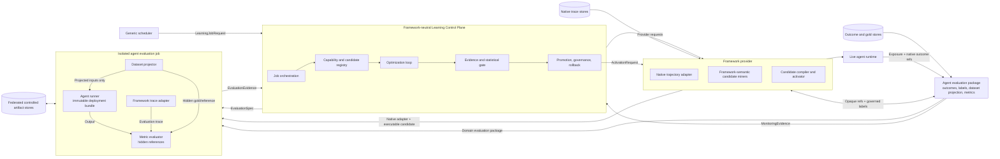

# Proposal: Framework-Agnostic Learning Control Plane

- **Status:** Discussion draft
- **Date:** 2026-08-25
- **Scope:** Executive architecture and decision boundaries
- **Relationship to existing RFC:** Supersedes the service-placement and
  ownership boundaries in
  [RFC_LEARNING_CONTROL_PLANE](./RFC_LEARNING_CONTROL_PLANE.md). PenguiFlow-specific
  mechanics from that RFC remain inputs to the first provider implementation;
  its scheduler, gate, ledger, and governance placement must be realigned to
  this architecture.

## 1. Executive decision

Build a **framework-agnostic Learning Control Plane** that owns optimization
orchestration, evidence policy, promotion, governance, and rollback. It does not
import PenguiFlow, interpret native trajectories, contain agent-domain metrics,
or run agent code in its own process.

Framework and domain semantics execute behind a stable provider contract:

- A **framework provider** understands native traces, candidate formats, and
  activation mechanisms.
- An **agent evaluation package** owns domain-specific dataset projection,
  gold/reference data, and metrics.
- An **isolated evaluation job**, created from the same immutable deployment
  bundle as the deployed agent, runs baseline and candidate variants.
- The control plane receives normalized, per-example evidence and makes the
  statistical and governance decision independently.

This is the middle ground between two undesirable extremes:

- A smart central service that duplicates every framework's trajectories and
  domain logic.
- A thin scheduler that delegates all learning and promotion authority to each
  agent.

The control plane remains generic without pretending that agent execution,
trajectory interpretation, and domain quality can be generic.

## 2. Non-negotiable requirements

1. **Framework neutrality.** Adding another agent framework must not require a
   control-plane code or schema change.
2. **No production self-editing.** Learning produces bounded runtime assets or
   configuration patches, never arbitrary code changes.
3. **Agent-owned semantics.** Domain metrics and metric-compatible dataset
   projections stay with the agent evaluation package.
4. **Independent decisions.** Agent code may produce evidence, but cannot make
   its own promotion decision.
5. **Reproducibility.** Every decision pins agent, dataset, metric, candidate,
   execution profile, and policy versions.
6. **Isolation.** Evaluation cannot mutate production state or share production
   traffic implicitly.
7. **Minimal duplication.** Native trajectories remain the source of truth;
   portable projections contain only evidence needed for a learning run.
8. **Reversibility.** Every activated asset is scoped, observable, auditable,
   expirable, and immediately disableable.
9. **Explicit authorization.** Provider capability never grants optimization
   authority; an operator must authorize the intersection of agent, surfaces,
   scope, evaluation package, and rollout modes.
10. **Complete evidence.** Every frozen cohort item produces a result, an
    explicit failure, or a centrally accepted exclusion. Silent dropping is a
    failed evaluation.

## 3. Core tension

A framework-neutral service cannot directly understand a PenguiFlow
`Trajectory`, create a valid `SkillRecord`, apply an auto-seq edge, or execute a
real agent. Doing so requires PenguiFlow and agent-specific knowledge.

At the same time, moving the entire loop into each agent would duplicate search,
statistics, governance, audit, rollout, and rollback logic, and would allow the
workload to grade and promote itself.

The architecture therefore separates three kinds of authority:

| Authority | Owner |
|---|---|
| **Orchestration authority**: when to learn, which window and scope to use | Control plane |
| **Semantic authority**: how to interpret traces and what task success means | Framework provider + agent evaluation package |
| **Decision authority**: whether evidence is sufficient to promote | Control plane |

Framework agnosticism applies to the control-plane boundary. It does not imply
that all learning semantics can or should be reduced to one universal model.

## 4. Selected architecture



This is one **logical** Learning Control Plane with durable state. It may run as
an always-on service, workflow, or serverless control process. Framework
providers may run as connectors or job executables. Evaluation workers are
ephemeral or pooled execution capacity, not another control plane.

The protocol boundary, rather than deployment count, provides neutrality.

## 5. Architecture elements and signatures

Signatures below define black-box responsibilities. They are contracts, not
implementation models.

### 5.1 Generic scheduler

**Responsibility:** Trigger work and observe job status.

```text
LearningJobRequest
  job_type
  agent_ref
  scope_ref
  time_window
  policy_version
  idempotency_key

returns JobReceipt
```

The scheduler knows nothing about trajectories, datasets, metrics, candidates,
or promotion states.

### 5.2 Learning Control Plane

**Responsibility:** Own learning lifecycle without importing framework or agent
code.

```text
register_provider(ProviderCapabilityDescriptor)
authorize_agent(AgentOptimizationRegistration)
start(LearningJobRequest) -> JobReceipt
register_candidate(CandidateEnvelope) -> CandidateRef
request_evaluation(EvaluationSpec) -> EvaluationRunRef
decide(EvaluationEvidence, PromotionPolicy) -> PromotionDecision
activate(PromotionDecision) -> ActivationRequest
rollback(AssetRef, reason) -> RollbackDecision
```

It owns:

- Job, candidate, and evaluation lifecycle.
- Mining, search, and sealed-promotion window separation.
- Generic black-box search and candidate ranking.
- Dataset, metric, runtime, and candidate version pinning.
- Supported objective algebra, minimum samples, confidence intervals, safety
  floors, and regression rules.
- Promotion ledger, approvals, expiry, kill-switch, and rollback policy.
- Cross-agent learning-system observability.

It does not own:

- Native framework trajectory schemas.
- Domain metric implementations.
- Agent imports, dependencies, prompts, tools, or secrets.
- Framework-specific asset compilation or activation.

### 5.3 Capability and authorization

**Responsibility:** Separate what a provider technically supports from what an
operator permits for a specific agent.

```text
ProviderCapabilityDescriptor
  provider_ref
  supported_frameworks[]
  supported_candidate_schemas[]
  supported_execution_profiles[]
  supported_activation_modes[]

AgentOptimizationRegistration
  agent_ref
  framework_provider_ref
  deployment_bundle_ref
  authorized_optimization_surfaces[]
  evaluation_package_ref
  objective_contract_ref
  allowed_execution_profiles[]
  allowed_activation_modes[]
  scope_policy
  operator_approval

effective capability = provider support intersect operator authorization
```

An optimization surface is an explicit, bounded patch point such as an advisory
strategy, prompt extension, routing hint, or deterministic transition. No
authorized surface means no optimization authority. Provider self-description
can never expand operator authorization.

### 5.4 Framework provider

**Responsibility:** Translate between framework-native semantics and neutral
control-plane contracts.

```text
discover_capabilities() -> ProviderCapabilityDescriptor
select_native_cohort(CohortRequest) -> CohortManifest
compile_candidate(CandidateEnvelope, agent_ref) -> CompiledCandidateManifest
activate(ActivationRequest) -> ActivationReceipt
deactivate(RollbackDecision) -> RollbackReceipt
```

For PenguiFlow, this provider understands `StateStore`, `Trajectory`,
`PlannerEvent`, learned skills, auto-seq edges, and runtime activation. Agent or
domain outcome connectors define how Iceberg or another outcome system maps to
domain labels. Provider and domain package may ship together, but their
ownership remains distinct.

Framework-native values may cross the boundary only as opaque artifact
references. Control-plane code and persistence never depend on their schemas.

### 5.5 Cohort manifest

**Responsibility:** Let the control plane select and freeze mining or evaluation
populations without owning native rows.

```text
CohortRequest
  agent_ref
  purpose: mining | search | sealed_promotion | canary_control
  scope_ref
  time_window
  inclusion_policy
  exclusion_refs[]

CohortManifest
  cohort_ref
  opaque_example_refs[]
  scope_ref
  source_versions
  redaction_profile
  count
  digest
  provider_attestation
```

The control plane owns cohort policy and manifest. The provider resolves opaque
references and enforces framework-native selection. Mining proposes initial
candidates; search evidence may tune candidate variants; a disjoint, later
**sealed promotion cohort** makes the final decision and is not exposed to any
generator or optimizer before the search closes. This supports out-of-time
holdouts and leakage exclusions without requiring the control plane to parse a
native trajectory. Manifest completeness is contractual: evaluation must return
one result or explicit disposition for every frozen reference.

### 5.6 Candidate envelope

**Responsibility:** Give every proposed improvement a common lifecycle while
allowing different semantic origins.

```text
CandidateEnvelope
  candidate_type
  optimization_surface
  payload_schema_ref
  standard_payload_or_opaque_artifact_ref
  provenance_cohort_ref
  generator_ref
  scope_ref
  generator_risk_hint
  compatibility_constraints
  digest
```

All candidate sources implement one provider-neutral black-box contract:

```text
generate(MiningSpec) -> CandidateEnvelope[]

MiningSpec
  agent_ref
  authorized_surface
  mining_cohort_ref
  generator_policy
  candidate_schema_ref
```

Candidate sources may be:

- A generic control-plane optimizer operating over a declared standard schema.
- A framework miner using native trajectories, such as PenguiFlow transition
  mining.
- An agent-domain generator using domain examples.
- A human proposal.

The control plane owns candidate identity, provenance, comparison, and state. A
provider owns framework-specific compilation. Initial mining generators receive
mining-only access. A registered search optimizer may consume results from the
search cohort to propose variants. Neither can access the sealed promotion
cohort, its hidden gold, or its evidence until the cycle closes.

Generator risk is advisory. Provider compilation emits authoritative effect and
side-effect bounds, constrained by operator-authorized surfaces; control plane
uses those bounds to select promotion policy:

```text
CompiledCandidateManifest
  executable_candidate_ref
  evaluated_surface
  effect_and_side_effect_class
  compatibility_digest
  provider_attestation
```

### 5.7 Agent evaluation package

**Responsibility:** Keep dataset semantics and metric semantics together with the
agent domain that defines them.

```text
AgentEvaluationPackage
  package_ref and version
  dataset_projection_ref
  metric_bundle_ref
  gold_or_reference_set_refs[]
  objective_contract_ref
  safety_contract
  required_runtime_capabilities[]
```

The package is versioned and independently governed. It owns:

- How native trace references become metric-compatible examples.
- Human-curated gold or task references.
- Domain success and safety metrics.
- Required fixtures, replay data, or controlled tool access.

The package binds dataset projection and metric versions; it does not own native
source data, cohort selection, exclusion policy, or promotion.

Domain outcome connectors and metric/gold publication require an approver
independent from candidate generation. This is governance independence, not a
claim that agent-produced evidence can be made fully trustless.

### 5.8 Objective contract

**Responsibility:** Define the evidence shape the control plane can evaluate
without understanding domain metric implementation.

```text
ObjectiveContract
  objective_contract_ref
  objectives[]
    id
    value_type
    direction
    pairing_key
    required_slices
    missing_and_exclusion_policy
    decision_method
  safety_vetoes[]
```

There is one immutable objective contract per evaluation. Agent registration,
evaluation package, run specification, and returned evidence must reference the
same version. Automatic promotion is limited to objective types and decision
methods supported by the control plane. Unsupported evidence routes to governed
human review rather than framework-specific code in the control plane.

### 5.9 Evaluation specification and execution job

**Responsibility:** Reproduce the deployed agent in an isolated context and run
the same search or sealed-promotion cohort against baseline and candidate.

```text
ExecutionBackend.run(EvaluationSpec) -> EvaluationEvidence

EvaluationSpec
  deployment_bundle_ref
  evaluation_package_ref
  cohort_ref
  baseline_ref
  executable_candidate_ref
  execution_profile
  objective_contract_ref
  policy_version
  idempotency_key

returns EvaluationEvidence
```

The deployment bundle pins agent code, runtime and framework versions,
production-relevant configuration, tool/model references, and a compatibility
digest. The default execution shape is a new evaluation instance created from
the same bundle revision used by production. This is runtime replication, not a
second agent implementation.

Control-plane orchestration dispatches the specification through a
framework-neutral execution backend selected by the operator. Provider code
runs inside the evaluation workload; it does not choose the cohort, policy, or
target deployment revision. The executor writes evidence under an identity
separate from candidate generation.

Agent runner and metric evaluator are separate trust domains. Agent-under-test
receives projected task inputs, never hidden gold, expected answers, or metric
logic. Evaluator receives returned output and evaluation trace, combines them
with hidden references, and produces evidence.

An existing live agent may serve evaluation only if it offers an explicitly
isolated, non-mutating evaluation capability. Sending replay traffic through an
ordinary production endpoint is not acceptable by default.

Execution profiles may select controlled real tools, sandbox tools, or replayed
read-only fixtures. Each arm and example receives an isolated or explicitly
reset state namespace, non-production credentials, and controlled side effects.
The profile is pinned as part of the evidence.

### 5.10 Evaluation evidence

**Responsibility:** Return enough normalized evidence for the control plane to
make an independent decision without knowing metric internals.

```text
EvaluationEvidence
  evaluation_run_ref
  agent_artifact_version
  cohort_digest
  metric_bundle_version
  candidate_digest
  execution_profile_version
  objective_contract_ref
  paired_example_results_ref
  objective_values
  safety_results
  cost_and_latency_values
  exclusions_and_failures
  executor_attestation
  evidence_digest
```

Per-example baseline and candidate results remain available as immutable
artifacts. The control plane computes confidence intervals, sample checks,
regression slices, and promotion decisions from those results. It does not trust
an aggregate pass/fail bit produced by the agent worker. Missing items and
exclusions are evaluated under the centrally pinned objective contract.

### 5.11 Promotion and activation

**Responsibility:** Separate framework-neutral authority from framework-specific
application.

```text
PromotionDecision
  candidate_ref
  state
  scope_ref
  rollout_policy
  approvals
  ttl
  evidence_ref
  reason

PromotionPolicy
  allowed_states_and_transitions
  evidence_required_per_transition
  exposure_and_control_policy
  approval_policy
  expiry_and_rollback_policy

ActivationRequest
  promotion_decision_ref
  executable_candidate_ref
  expected_deployment_digest
  scope_ref
  rollout_policy
  control_plane_authorization
```

The control plane decides state through a declarative lifecycle rather than
hardcoding PenguiFlow promotion ladders. The provider applies authorized state
to the framework only when target deployment remains compatible. Runtime rejects
missing, expired, or stale control-plane authorization and retains a local
emergency kill-switch. Activation receipts are reconciled against the ledger.

Live runtime returns assignment, exposure, propensity, native outcome
references, cost, safety, and failure signals. A governed monitoring evaluator
applies the pinned domain/objective contract and emits normalized evidence for
advancement or rollback; runtime does not interpret domain success for the
control plane.

## 6. Where data and logic live

| Object | Source of truth | Control-plane relationship |
|---|---|---|
| Native trajectory | Framework/agent trace store | Opaque reference only |
| User outcome signals | Agent/domain outcome store | Accessed through governed domain connector |
| Cohort selection | Control-plane policy + provider resolution | Manifest and digest stored |
| Materialized evaluation rows | Controlled artifact store, published by agent evaluation package | Versioned opaque artifact |
| Metric definition | Versioned agent evaluation package | Identity, version, and output contract pinned |
| Gold/reference set | Governed agent-domain artifact store | Immutable reference and digest pinned |
| Candidate | Control-plane candidate registry | Standard payload or opaque artifact reference |
| Executable candidate | Framework provider | Immutable reference pinned |
| Per-example evidence | Controlled artifact store | Read for central statistical decision |
| Promotion state | Control-plane ledger | Authoritative |
| Activated runtime asset | Framework runtime/store | Must reflect control-plane decision |

Dataset and metric are intentionally treated as one versioned evaluation
package because their semantics are coupled. Physical co-location is optional;
version coupling is mandatory.

## 7. End-to-end learning cycle

1. Scheduler asks the control plane to consider learning for an agent, scope,
   and window; control-plane policy decides eligibility and exact windows.
2. Control plane intersects provider capability with operator authorization and
   freezes disjoint mining, search, and later sealed-promotion windows.
3. Provider selects native trace references and returns cohort manifests.
4. Candidate generators propose improvements. Generic candidates may come from
   the control-plane optimizer; framework-semantic candidates may come from the
   provider. Initial generators see mining data only; registered optimization
   loops may use search evidence to propose variants.
5. Provider compiles each candidate against the pinned deployment bundle and
   emits authoritative effect/risk bounds.
6. Evaluation backend starts an isolated instance of that bundle with the
   pinned agent evaluation package.
7. Baseline and candidates iterate on the search cohort. Once search closes,
   final baseline and candidate run on the untouched sealed-promotion cohort.
8. Agent-owned metrics produce paired per-example domain evidence, including an
   explicit result or disposition for every frozen item.
9. Independent evaluation identity writes immutable evidence; the control plane
   applies generic statistical, safety, and governance policy.
10. Provider activates only assets carrying valid control-plane authorization
    and matching the evaluated deployment revision.
11. Control plane compares live outcomes against a concurrent control and
    advances, retires, or rolls back the asset.

## 8. Candidate, trace, and dataset are different objects

The term "candidate" must not refer to a trace selected for evaluation.

- A **trace cohort** is a set of historical run references.
- An **asset candidate** is a proposed change.
- An **evaluation dataset** is the agent-specific projection of a held-out trace
  cohort.

An asset candidate is never added to a dataset. Baseline and candidate variants
run against the same fixed dataset:

```text
Sealed promotion cohort
  |-- baseline deployment bundle + baseline configuration
  `-- same deployment bundle + candidate configuration

paired domain metric results -> central statistical gate
```

## 9. Framework-neutral optimization: exact boundary

The control plane can be an agnostic optimizer in two useful senses:

1. **Schema-aware search.** It can mutate and rank candidates for standardized
   surfaces such as advisory strategy text, prompt extensions, or bounded
   parameters.
2. **Black-box search.** It can request candidates from any generator, evaluate
   them on the search cohort through the standard contract, and drive iterative
   search from returned objective values. Sealed-promotion evidence is never
   optimizer input.

It cannot generically infer every framework-native improvement from opaque
traces. PenguiFlow auto-seq discovery, for example, requires PenguiFlow-aware
trajectory and tool-schema interpretation. That miner belongs in the provider,
while candidate lifecycle, evaluation requests, evidence comparison, and
promotion remain generic.

This limitation is deliberate. A universal semantic trajectory model would
either duplicate native traces or collapse them into a lowest-common-denominator
representation that is insufficient for framework-specific optimization.

## 10. Optional portable episode projection

Some cross-framework optimizers may eventually benefit from common execution
features. A provider could expose a minimal, derived episode artifact:

```text
PortableEpisodeArtifactRef
  schema_ref
  artifact_ref
  native_source_digest
  purpose_and_retention
```

This projection is optional, purpose-limited, redacted, and preferably
generated on demand. It is not a second canonical trace store and never replaces
the native trajectory. Control-plane core stores only its reference and digest;
schema-aware consumers are optional optimizer extensions.

If a candidate requires semantics absent from the portable projection, its
miner stays provider-owned. No normative portable episode schema should be
introduced until a second framework proves shared fields and value.

## 11. Frictions, decisions, and accepted costs

| Friction | Decision | Accepted cost |
|---|---|---|
| Provider support versus operator permission | Authorize only intersection of technical capability and operator registration | Registration and approval lifecycle is required |
| Framework neutrality versus native trajectory semantics | Keep native interpretation in provider | Every framework needs a provider |
| Generic optimization versus framework-specific candidates | Support both standard candidate schemas and provider-generated opaque candidates | Not every optimizer works on every surface |
| Iterative optimization can overfit evaluation data | Separate optimizer-visible search cohort from untouched sealed promotion cohort | More data and evaluation runs are required |
| Dataset tightly coupled to metric | Package projection, gold, and metric together with agent domain | Agent teams must version and govern evaluation packages |
| Control plane cannot reconstruct a real agent | Launch same immutable deployment bundle in isolated evaluation context | Additional evaluation compute and deployment capability |
| Native and portable trajectory representations can duplicate data | Keep native trace authoritative; use opaque references and minimal on-demand projections | Some derived evidence still exists and must be governed |
| Agent computes its own domain metric | Centralize cohort policy, version pinning, complete per-example evidence, statistics, and promotion | Metric publication needs independent review and calibration; evidence is governed, not trustless |
| Agent-under-test could inspect expected answers or metric logic | Separate agent runner from hidden-reference evaluator | Evaluation backend needs trust-domain isolation |
| Central service needs enough evidence but should not ingest customer data | Store controlled artifacts near source; pass references and normalized results | Artifact access, retention, and locality require operational policy |
| Generic contracts can become lowest-common-denominator abstractions | Keep payload schemas extensible and provider-namespaced; standardize lifecycle, not all semantics | Cross-framework optimization depth varies by provider |
| Evaluation environment can diverge from production | Use same immutable deployment bundle and pin execution profile | External systems may still require sandbox/replay fidelity work |
| Separate provider boundary appears to create another service | Define protocol boundary; allow connectors or jobs rather than mandatory long-running services | More distributed-job orchestration than an in-process design |
| Provider could fabricate favorable evidence | Require immutable cohorts, paired per-example artifacts, independent policy, metric governance, and audit | Full trustlessness is impossible when domain execution remains agent-owned |
| Frameworks need different promotion ladders | Express lifecycle and evidence requirements as declarative promotion policy | Policies must fit supported neutral evidence primitives or require human review |
| Activation occurs after evaluation and may target changed runtime | Bind authorization to evaluated deployment digest and fail closed on mismatch | Changed deployments require re-evaluation |
| Candidate generator can understate risk | Treat generator risk as advisory; derive authoritative bounds during provider compilation under operator authorization | Provider effect classification needs governance and conformance tests |

## 12. Alternatives considered

### A. Smart central control plane with canonical trajectories

The control plane ingests normalized copies of all framework traces, understands
candidate semantics, owns metrics, and runs optimization centrally.

**Rejected:** high duplication, privacy movement, lowest-common-denominator
schemas, central dependency growth, and unavoidable leakage of framework and
domain internals into the platform.

### B. Thin scheduler; all learning inside each agent

Each agent selects traces, mines candidates, evaluates, and promotes itself.

**Rejected:** duplicated optimization and governance logic, inconsistent
statistical standards, weak auditability, and self-grading promotion authority.

### C. PenguiFlow-specific control plane

Control plane imports PenguiFlow models and directly operates its stores and
runtime.

**Rejected:** violates framework neutrality and makes future framework support a
control-plane rewrite.

### D. Central metrics with agent-independent datasets

Move metric code and projected datasets into the control plane.

**Rejected:** domain metrics depend on agent behavior, trajectories, tools,
fixtures, and business definitions. Centralizing them transfers every agent's
internal logic and dependency graph into the platform.

### E. Selected hybrid

Centralize lifecycle, search coordination, evidence policy, statistics, and
governance. Federate native semantics and execution through versioned provider
and evaluation contracts.

**Selected:** preserves meaningful central optimization while containing
framework and domain coupling.

## 13. PenguiFlow mapping

The existing PenguiFlow proposal is split across the new boundaries. Its
service-placement claims are superseded; its PenguiFlow-specific mechanics
remain design input:

| Existing PenguiFlow concept | New architectural placement |
|---|---|
| StateStore trajectory access | PenguiFlow provider |
| Iceberg outcome access and domain-label projection | Governed agent data/evaluation package, composed with provider |
| Trace/outcome join | Provider execution using control-plane cohort policy and domain connector |
| Skill and auto-seq edge mining | Provider-neutral generator contract implemented by PenguiFlow-aware miners |
| `penguiflow/evals` schemas and runner | PenguiFlow evaluation adapter inside evaluation job |
| Agent-specific dataset views and metrics | Agent evaluation package |
| Baseline-versus-candidate execution | Isolated evaluation job using existing deployment bundle |
| Confidence intervals and promotion thresholds | Framework-neutral control plane |
| Promotion ledger, approvals, expiry, kill-switch | Framework-neutral control plane |
| Skill write path and auto-seq patch application | PenguiFlow provider/runtime |
| Live canary events and propensity data | PenguiFlow runtime, normalized back to control plane |

`penguiflow/evals` is not discarded. Its role changes from implied
control-plane internals to PenguiFlow's implementation of the evaluation
protocol.

## 14. Security and trust boundary

- Raw traces and customer content remain in native or controlled agent-side
  stores unless an approved evaluation projection requires them.
- Cohort manifests use opaque references and digests.
- Deployment bundle, metric bundle, gold set, candidate, and execution profile
  are immutable and pinned for each run.
- Gold/reference publication and metric-version changes require governance
  independent from candidate generation.
- Technical provider capability and operator authorization are independently
  signed and intersected by the control plane.
- Mining, search, and sealed-promotion cohorts are disjoint and ordered out of
  time.
- Initial generators cannot read search or promotion evidence. Registered
  optimizers may consume search evidence, but no generator or optimizer can read
  sealed-promotion items, gold, or evidence before search closes.
- Agent-under-test cannot access hidden gold/reference data or metric logic.
- Per-example results are retained for audit; aggregate scores alone are
  insufficient evidence.
- Evaluation returns one result, failure, or accepted exclusion per frozen
  cohort reference; executor identity is separate from candidate generation.
- Runtime requires valid control-plane activation authorization, fails closed on
  expiry or deployment mismatch, and retains an operator emergency kill-switch.
- Framework provider credentials are capability-scoped to trace reading,
  evaluation, or activation as appropriate.

## 15. Delivery approach

### Phase 0: Contract feasibility

- Define provider, candidate, evaluation, evidence, and activation contracts.
- Validate that PenguiFlow can implement them without importing PenguiFlow into
  the control-plane kernel.
- Build a conformance harness and a structurally different mock provider before
  contracts harden; any required framework-specific control-plane change fails
  the neutrality test.
- Prove one immutable deployment bundle can run as both baseline and isolated
  evaluation workload.
- Establish a pre-registered adoption gate: candidate supply, authoritative
  metric/gold readiness, evaluable volume, execution fidelity, expected gain,
  and operating-cost ceiling.

### Phase 1: Read-only dry loop

- Register one PenguiFlow agent and evaluation package.
- Produce mining, search, and sealed-promotion cohort manifests.
- Run candidate discovery and evaluation without activation.
- Measure signal density, evaluation cost, reproducibility, and metric/gold
  readiness.
- Apply the Phase 0 adoption gate. Agents that do not clear it remain manual or
  scheduler-only; Phase 2 does not proceed by weakening evidence policy.

### Phase 2: Governed PenguiFlow activation

- Activate one low-risk advisory or read-only candidate surface.
- Exercise canary, concurrent control, expiry, rollback, and kill-switch.
- Keep write-capable assets human-gated.

### Phase 3: Second production provider

- Integrate a real second provider without changing control-plane domain code or
  persistence schemas.
- Treat any required control-plane framework import as an architecture failure.

## 16. Success criteria

The architecture is successful when:

- Control-plane runtime and persistence contain no PenguiFlow-native type.
- A provider can be added without changing control-plane code.
- Dataset and metric versions are pinned and executable with the immutable
  deployment bundle.
- Baseline and candidate results are paired over the same sealed cohort, which
  was not optimizer-visible before search closed.
- Agent-under-test cannot access hidden references or metric logic.
- Control plane can reproduce and independently recompute every statistical
  promotion decision.
- Runtime rejects activation without valid control-plane authorization or when
  deployment revision differs from evaluated revision.
- Native traces do not need to be copied into a central canonical trace store.
- Learned assets can be scoped, monitored, expired, rolled back, and globally
  disabled.

## 17. Open decisions

These choices do not change the architecture boundary but must be resolved
before implementation:

1. Provider deployment form: connector service, isolated job executable, or
   both.
2. Evaluation execution backend and artifact locality.
3. Controlled artifact store and retention policy.
4. Minimum standard candidate schemas supported by the generic optimizer.
5. Whether a portable episode projection is needed in v1 or should wait for a
   second framework.
6. Metric and gold-package publication approval workflow.
7. Production-equivalent tool strategy: sandbox, replay, or controlled real
   integrations by execution profile.
8. Exact evidence required for central recomputation of each objective and
   safety decision.
9. Activation-authorization lifetime and runtime behavior during control-plane
   outage.

## 18. Bottom line

Framework neutrality is achievable by standardizing **control and evidence**,
not by forcing all frameworks into one trajectory, dataset, metric, or runtime
model.

The Learning Control Plane owns the optimization loop and final authority. The
framework provider owns native translation. The agent evaluation package owns
domain truth. An isolated instance of the existing deployment bundle produces
evidence.
This division introduces adapters and evaluation compute, but avoids the larger
cost of duplicating framework internals or centralizing every agent's domain
logic.
