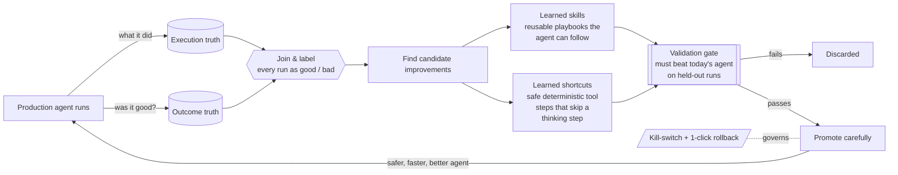
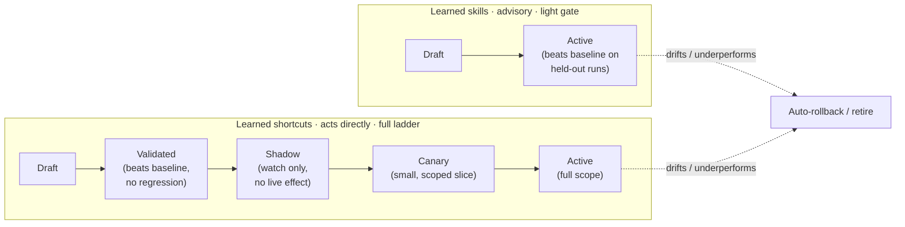
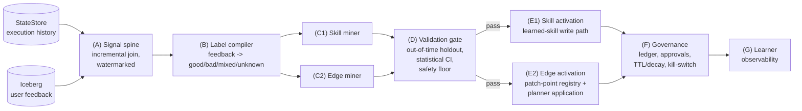

# Learning Control Plane — Overview

> Companion to the internal design RFC (Draft v0.9). It explains **what** we are
> proposing, **why** it matters, **how** the pieces fit together, **what we need
> to build**, and **how we keep it safe**. No prior knowledge of the codebase
> required.

---

## 1. The headline

We run several PenguiFlow agents in production. Today they perform the same way
every day unless an engineer ships new code. **The Learning Control Plane lets
those agents get measurably better over time — by learning from real
interactions — without a code release, and without ever running unvalidated
changes against a customer.**

It works by closing a loop we already own: we already record *what an agent did*
on every run, and *whether the user was happy with it*. The proposal connects
those two signals, finds patterns in what worked, **proves each candidate
improvement beats today's agent on held-out real runs**, and only then rolls it
out — gradually, scoped per customer, and reversibly.

The capability is delivered as a **separate, scheduled (offline) service**.
Nothing in the live request path changes except activating assets that have
already passed validation.

---

## 2. Why this is worth doing now

| We already have | Gap this fills |
|---|---|
| **Execution truth** — a step-by-step history of every agent run (StateStore). | A join between "what it did" and "was it good." |
| **Outcome truth** — user feedback, corrections, contested facts, dwell & export signals (Iceberg memory). | A way to turn that feedback into *evaluation labels* for training/validation — **without leaking the feedback signal into the pass/fail decision.** |
| An evaluation harness (trace → dataset → metric → baseline-vs-candidate sweep) already in progress. | Candidate generation with statistical gating, safe promotion machinery, and governance. |

The pieces are 70% in place. What is **net-new** is the loop that connects them:
**mine → validate → promote → govern**.

**Business value**

- *Continuous improvement* without release overhead.
- *Lower cost / faster agents:* the second asset class removes a redundant
  "thinking" step where the model would otherwise re-decide a deterministic
  transition — fewer LLM calls, lower latency, more consistency.
- *Measurable:* we instrument the learner itself (promotion precision, rollback
  rate, % of traffic served by learned assets) so we can prove it is a net win.

**v1 boundaries (read before quoting the wins)**

- Shortcuts are **single-hop** (chain-depth cap of 1) — the compounding
  multi-hop economics are deliberately post-v1.
- Only **read-only** shortcuts activate autonomously; anything write-capable
  needs human sign-off.
- Skill promotion throughput is bounded by the **human-curated gold set** that
  judges skills. Gold curation is a staffed workstream; a cycle without enough
  gold promotes nothing rather than lowering the bar.
- Shortcuts ship **before** skills (v0.9 ordering): their evidence comes from
  abundant production signals, while skills wait on gold accrual.

---

## 3. What the agents actually learn

We learn **runtime assets**, never core code, tool policy, auth scopes, or flow
topology. v1 learns exactly two things:

| | **Learned skills** | **Learned shortcuts** |
|---|---|---|
| **What it is** | A reusable playbook — "for this kind of request, these steps tend to work." | A safe, repeatable tool-to-tool step the agent can take without re-deciding each time. |
| **Effect on the agent** | Advice the agent can use *or ignore*. | Removes a thinking step → faster, cheaper, more consistent. |
| **Risk** | Low (advisory). | Higher (acts directly) → stricter checks, starts read-only, human sign-off for anything that writes. |
| **Promotion path** | Draft → Active (light gate). | Draft → Validated → Shadow → Canary → Active. |

Because the two asset classes have **very different blast radius**, they have
**different rules**: skills promote on a light gate (they're only advice); shortcuts
must traverse observe-only → small slice → full, with edge-outcome evidence first
collected only at the stage where the shortcut actually fires.

---

## 4. How an improvement earns its way in

Nothing reaches a user until it has **out-performed today's agent on real,
held-out runs.** Skills clear that light gate and go straight to active — they
are advisory, so the agent can still ignore them, and there is no shadow or
canary step. Shortcuts ship gradually even after they beat the baseline, and
either can be pulled back instantly.

---

## 5. How the system interacts (architecture at a glance)

The control plane is a **scheduled batch job** (nightly, aligned with Iceberg's
consolidation). The live request path is untouched except for activating
already-promoted assets.

**Boxes A, B, C, D, F (orchestration), G live in the control-plane service.**
The PenguiFlow **core** grows a deliberately bounded set of net-new primitives:
the contract types, a learned-skill write path, a patch-point registry + planner
edge application, a persisted scope snapshot on trajectories, and the global
kill-switch.

**The key trust mechanism — the "leakage firewall."** The user-feedback signal
is used to *mine and rank* candidate improvements, so it must **not** also be the
*gate authority* (that would be grading your own homework). Authority is
asymmetric by asset class:

- **Skills** are decided by an **outcome/goal-success** signal against a
  human-curated gold set — a skill that reaches the goal a *different, better*
  way should still pass. Trajectory-imitation metrics are demoted to regression
  tripwires: they route a behavior-changing candidate to review, they never
  block it for diverging.
- **Shortcuts (edges)** are decided by **fidelity** — reproducing a confirmed
  deterministic transition *is* the contract — plus a sample outcome check so a
  faithful but suboptimal transition isn't certified on imitation alone.
- **Independence is enforced, not assumed:** gold labels are human-adjudicated
  *blind* to the mined signal; any gold item is firewalled out of the miner for
  the cycle it validates; the judge model family differs from any candidate
  generator; and validation uses an **out-of-time holdout** (mine on window W,
  validate on strictly-later window W+1).
- **No point-score promotion:** the gate computes a **bootstrap confidence
  interval** on the candidate−baseline score delta; promotion requires the CI
  lower bound to clear a minimum detectable effect and a sample-size floor,
  plus a deterministic **safety floor** that can veto regardless of score.
- **Randomized rollout for shortcuts:** even at full rollout, a small
  randomized slice of eligible steps deliberately defers to the model. That
  slice is a permanent live control group — effect estimates and auto-rollback
  compare against concurrent reality, not a stale baseline — and it keeps
  learned skills competing on steps a shortcut would otherwise own.

---

## 6. What needs to be built

| Need | We can reuse | We must build (net-new) |
|---|---|---|
| Execution history | Existing trajectory & planner-event stores. | Window enumeration that doesn't require a session id. |
| User feedback | Iceberg feedback & preference signals. | The **label compiler** and the leakage firewall. |
| Join of the two | Iceberg already keys rows 1:1 to a run. | Startup capability check + index backfill where the join column is missing; tenancy reconciliation; a persisted, redacted **scope snapshot** on every trajectory. |
| Dataset + scoring + holdout | The in-progress evaluation harness. | Out-of-time dataset builder; dataset↔metric coupling; statistical/CI gating. |
| Skill activation | Skill *injection/formatting* into the planner prompt. | A **learned-skill write path**; a **scope-aware read/dedup** with tenant > project > global precedence; a **scoped-identity uniqueness migration** (table rebuild) so two customers can hold a same-named learned skill. |
| Shortcut activation | The auto-seq *detection scaffolding* types. | A **patch-point registry**; planner application (keyed on the source tool, with typed field remapping); a `never_auto_seq` opt-out marker; full-live-catalog ambiguity scanning; bound-field + side-effect-class pinning; a chain-depth cap; shadow/canary machinery; randomized ε-exploration with propensity logging. |
| Governance / HITL | Iceberg's existing human-review (triage) pattern. | A **PromotionLedger**; the **global kill-switch**; learner observability metrics. |

**Design principle that simplifies the operator story:** *"auto-learning implies
auto-seq."* A promoted shortcut grants model-bypass for its transition directly
— the validation gate is the earned equivalent of a developer manually flipping
the auto-seq flag, so we are not building a parallel permission system.
Crucially, this is bounded by a strict precedence ladder (see §7) and never
overrides an operator's master switches.

---

## 7. How we keep it safe to run in production

- **Agents never edit their own code.** They learn only configuration-level
  assets the platform already understands.
- **Prove-before-promote.** Every candidate is measured against the current
  agent on real held-out runs; losers are discarded automatically.
- **Gradual rollout for shortcuts.** Observe-only → small scoped slice → full,
  with human sign-off for anything that can change data — and even at full
  rollout a small randomized slice keeps running the model path, so every
  shortcut is continuously measured against live reality. Skills clear the
  light gate and activate directly because they remain advisory.
- **Scoped & private.** Learning stays within a tenant. No raw customer
  content, secrets, or literal argument values are ever stored in a learned
  asset — only abstracted playbooks (skills) or typed field-to-field bindings
  (shortcuts). A redaction/PII scrubber runs on mining input and on the
  persisted intermediate dataset, not only on the stored asset text.
- **Strict control precedence** (highest to lowest):
  1. **Global kill-switch** → all learned assets off, instantly.
  2. **Operator master switches** (`auto_seq` disabled) → no model-bypass at all.
  3. **Learned-auto-seq knob** off → learned shortcuts inert; static path unaffected.
  4. **Per-asset promotion state** (`active`, or `canary` within its cohort).
  5. **Fire-time checks**, in order: tool opt-out → blocked nodes → schema pin →
     live read-only check → full-catalog ambiguity defer → chain-depth cap.
- **Always reversible.** Per-change rollback, typed half-lives with automatic
  expiry (browser 7d, api 90d, code 180d, domain 365d), and a global kill-switch
  that disables everything at once.
- **Measured.** We track the learner itself — promotion precision, rollback
  frequency, % of traffic served by learned assets, and "never-fired" shortcut
  rate — so we can tell whether the program is a net win, and gate it on that.

---

## 8. Delivery plan (v1)

0. **Substrate.** Land the evaluation harness (PR #115); add window enumeration
   and dataset↔metric coupling (small, new work).
1. **Spine + labels — run as a feasibility experiment.** Build the join, the
   label compiler, the leakage firewall, watermarking, and tenancy
   reconciliation. Output: out-of-time, outcome-labeled datasets. **No asset
   generation.** This phase proves the join end-to-end *and runs the loop dry*,
   measuring signal density, candidate supply, and gold-adjudication throughput
   against pre-registered **go/no-go criteria** fixed before any miner is
   built. If candidate supply never clears its floor, the program stops here —
   the labeled datasets remain valuable on their own. The gold curation
   workstream starts in this phase.
2. **Shortcut track (read-only) — first, because its evidence is abundant.**
   Patch-point registry + planner application + the shadow → canary → active
   ladder, with edge-outcome evidence entering at canary against a randomized
   control slice. Read-only shortcuts reach `active` autonomously (still gated
   statistically and monitored); write-capable shortcuts require human
   sign-off.
3. **Skill track — gated on gold accrual.** Learned-skill write path +
   migration + miner → gate (with CI over the curated gold set) → activation →
   light governance + learner metrics. Low blast radius but bounded by gold:
   it starts once accrued gold clears the statistical floor for at least one
   slice — never by lowering the bar.

Each phase is independently shippable and independently valuable. Phase 1 alone
delivers labeled datasets — useful beyond this RFC — plus the feasibility read
on the whole program. Phase 2 delivers the latency/cost wins on abundant
evidence. Phase 3 adds skill self-improvement once gold can prove it.

---

## 9. Explicit non-goals (v1)

- No self-editing of core code, tool policy, auth scopes, or flow topology.
- No autonomous (no-human) activation of **write-capable** shortcuts.
- No arbitrary recipe/DAG synthesis — v1 is single-hop, typed shortcuts with a
  default chain-depth cap of 1 so the planner never runs an unvalidated
  multi-hop chain model-free.
- No online / in-request learning — the loop is a scheduled batch job.
- No new optimizer (DSPy/GEPA). v1 uses manual-sweep candidate evaluation; GEPA
  can slot in later — the metric signature is already compatible.

---

## 11. Phased rollout in summary

- **Phase 0 — Substrate.** Land the evaluation harness; add window enumeration and dataset↔metric coupling.
- **Phase 1 — Spine + labels, run as a feasibility experiment.** Incremental join, label compiler, leakage firewall, watermarking, tenancy reconciliation; the loop runs dry against pre-registered go/no-go criteria (signal density, candidate supply, gold throughput). **No asset generation.** Gold curation starts here.
- **Phase 2 — Shortcut track (read-only), first.** Patch-point registry + planner application + shadow → canary → active, with edge-outcome evidence entering at canary against a randomized control slice. Its evidence comes from abundant production signals, not scarce gold.
- **Phase 3 — Skill track, gated on gold accrual.** Learned-skill write path + migration + miner → gate (CI over curated gold) → activation → light governance + learner metrics. Starts once gold clears the statistical floor.

Each phase is independently shippable and independently valuable.
