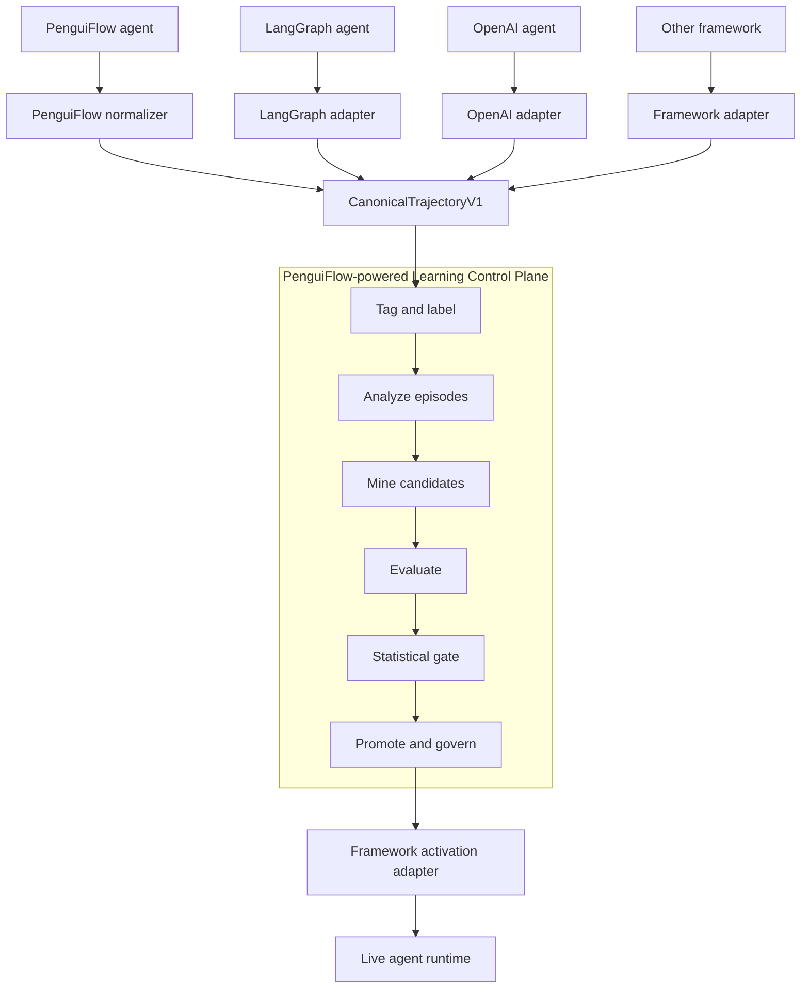
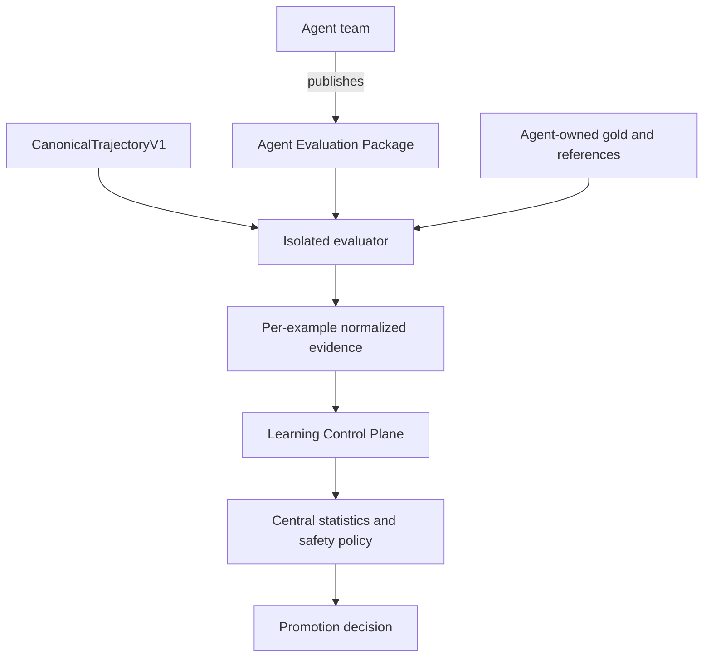
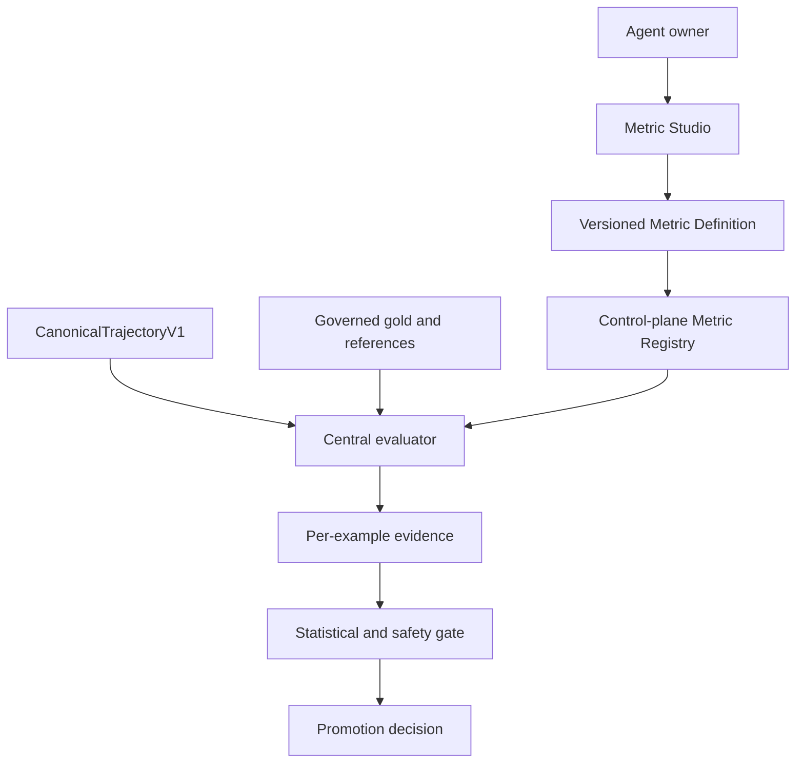
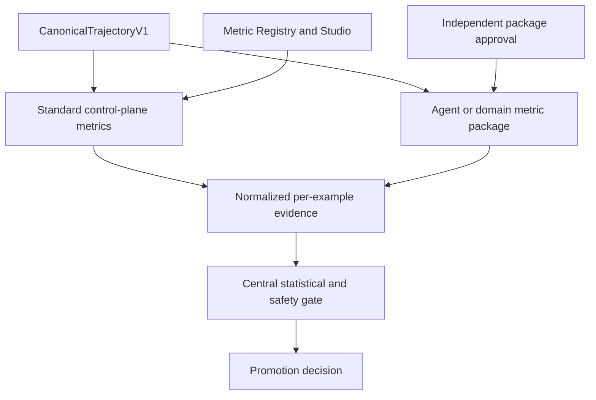

# Learning Control Plane: Executive Architecture Options

- **Status:** Decision brief
- **Date:** 2026-08-25
- **Scope:** Framework neutrality and metric ownership

## Executive position

Build a **framework-agnostic Learning Control Plane powered internally by
PenguiFlow**.

Framework neutrality applies to external contracts, not internal implementation:

- Any agent framework exports execution through a versioned canonical
  trajectory contract.
- PenguiFlow powers recurring learning workflows: ingestion, tagging, episode
  analysis, candidate mining, evaluation, promotion, and monitoring.
- Framework adapters run agents and compile approved candidates into native
  runtime assets.
- Native trajectories remain operational truth; normalized trajectories become
  learning and evaluation truth.

This merges the holistic PenguiFlow vision with a framework-neutral product
boundary.



Live traces return through the registered normalizer in the next learning cycle.

## Shared architecture

Both options use the same external contracts:

```text
normalize(native_trace) -> NormalizationResult
run(EvaluationSpec) -> CanonicalTrajectoryV1
compile(CandidateEnvelope) -> ExecutableCandidate
activate(PromotionDecision, ExecutableCandidateRef) -> ActivationReceipt
```

`PromotionDecision` pins exact candidate and compiled artifact versions.

`NormalizationResult` includes fidelity and capability declarations. Missing
semantics disable dependent optimization surfaces rather than being inferred.

```text
CanonicalTrajectoryV1
  identity and scope
  inputs and outputs
  ordered operations and causal links
  tool calls and typed references
  status, errors, retries, cost, and latency
  outcome signals and provenance
  redaction and source metadata
  framework extension references
```

OpenAI-style `inputs`, `outputs`, `reference_outputs`, and `context` provide the
portable evaluator envelope. PenguiFlow trajectory semantics provide richer
agent execution detail.

## Decision to make

Main unresolved question is not where evaluation runs. It is **who defines and
governs semantic quality metrics**.

Two viable options follow.

## Option 1: Agent-owned semantic metrics

Each agent team publishes a versioned evaluation package containing dataset
projection, references/gold, domain metrics, and required evaluation context.
Learning Control Plane runs it and retains final promotion authority.



**Control plane owns**

- Evaluation lifecycle and sealed cohorts.
- Metric package registration and version pinning.
- Standard output contract.
- Confidence intervals, sample floors, regression policy, and safety vetoes.
- Promotion, rollout, rollback, and audit.

**Agent team owns**

- Meaning of domain success.
- Dataset projection and hidden references.
- Metric implementation and calibration.
- Domain-specific fixtures and evaluation context.

**Advantages**

- Highest domain fidelity.
- Metrics evolve with agent behavior and business requirements.
- No central team bottleneck for every domain.
- Complex metrics can use agent-specific context and dependencies.

**Costs and risks**

- Every agent needs evaluation engineering maturity.
- Metric quality and consistency vary by team.
- Agent effectively produces its own evidence, requiring independent package
  approval and complete per-example audit.
- Cross-agent comparisons remain limited to shared objective contracts.

**Best fit**

Specialized agents with strong owners, complex business outcomes, and existing
gold or evaluation suites.

## Option 2: Control-plane-owned semantic metrics

Learning Control Plane owns metric definitions and evaluates normalized
trajectories centrally. Agent owners configure metrics through a governed Metric
Studio rather than shipping executable evaluation code.



**Metric Studio capabilities**

- Select canonical trajectory fields and slices.
- Define task inputs, expected outcomes, and hidden references.
- Compose standard metrics: correctness, groundedness, tool fidelity, trajectory
  match, safety, cost, and latency.
- Configure LLM-as-judge rubrics and judge models.
- Preview scores against historical examples.
- Curate and adjudicate gold cases.
- Calibrate judge-versus-human agreement.
- Version, approve, stage, and roll back metric definitions.
- Display sample sufficiency and promotion impact before activation.

Metric definitions should be declarative by default. Arbitrary metric code, when
unavoidable, runs as a separately reviewed and sandboxed extension.

**Advantages**

- Consistent governance and operator experience.
- Central visibility into metric quality, drift, and gold coverage.
- Lower onboarding burden for agent teams.
- Strong reuse of PenguiFlow filters, trajectory metrics, tagging, and analysis
  workflows.
- Easier portfolio-level comparison and policy enforcement.

**Costs and risks**

- Metric Studio becomes a significant product, not a small configuration page.
- Central team may become domain bottleneck.
- Canonical trajectory may omit context required for nuanced business success.
- Declarative metrics can become too weak; arbitrary extensions reintroduce
  dependency and security complexity.
- Central ownership can create false confidence when domain experts are not
  accountable for metric validity.

**Best fit**

Large agent portfolios with repeated task patterns, limited evaluation maturity,
and strong platform governance requirements.

## Executive comparison

| Dimension | Option 1: Agent-owned | Option 2: Control-plane-owned |
|---|---|---|
| Domain accuracy | Strongest | Depends on canonical data and UX expressiveness |
| Agent onboarding | Higher engineering effort | Lower after Metric Studio exists |
| Central product cost | Moderate | High |
| Governance consistency | Requires strict package review | Strong by default |
| Cross-agent reuse | Moderate | Strong |
| Dependency isolation | Agent evaluator carries dependencies | Central sandbox/extensions required |
| Scaling bottleneck | Agent teams | Platform/evaluation team |
| Risk | Inconsistent or self-serving metrics | Generic metrics detached from domain truth |

## Recommended model: governed hybrid

Do not force one ownership model across every metric. Use two tiers over the same
canonical trajectory and evidence contract.



**Tier 1: Control-plane metrics**

- Execution success and failures.
- Tool and trajectory fidelity.
- Cost and latency.
- Safety and policy checks.
- Generic answer quality and groundedness.
- Cross-agent learner health.

**Tier 2: Agent/domain metrics**

- Business goal completion.
- Domain correctness.
- Specialized gold/reference evaluation.
- Metrics requiring private context or custom dependencies.

**Unified governance**

- One metric registry and version model.
- One canonical evaluator result contract.
- One search versus sealed-promotion policy.
- One statistical gate.
- One promotion ledger and rollout authority.
- Independent approval for domain metrics and gold changes.

This preserves central automation without pretending all business truth can be
designed centrally.

## Product implications

Build Metric Studio incrementally:

1. Start with read-only visibility into canonical trajectories, filters, metric
   outputs, cohort composition, and gold coverage.
2. Add composition of approved standard metrics and LLM-judge rubrics.
3. Add gold curation, calibration, versioning, and approval workflows.
4. Add sandboxed custom extensions only when declarative metrics prove
   insufficient.

Avoid building a universal no-code metric designer before one real PenguiFlow
agent completes the dry learning loop.

## Delivery decision

Recommended v1:

1. Adopt `CanonicalTrajectoryV1`, derived from PenguiFlow trajectory and exposed
   as a language-neutral contract.
2. Run Learning Control Plane workflows on PenguiFlow internally.
3. Reuse PenguiFlow eval, filtering, tagging, and episode-analysis building
   blocks against canonical trajectories.
4. Ship standard control-plane metrics for execution, trajectory, cost, latency,
   and safety.
5. Support versioned agent-owned packages for domain success metrics.
6. Keep final statistical and promotion authority in Learning Control Plane.
7. Validate neutrality with one structurally different adapter before freezing
   canonical schema.
8. Delay full Metric Studio until dry-loop evidence proves repeated demand.

## Bottom line

PenguiFlow can be internal platform engine without making managed agents
PenguiFlow-dependent. Canonical trajectory and adapter contracts create the
neutral boundary.

Metric ownership should be hybrid: Learning Control Plane owns reusable
execution and safety metrics; agent teams own irreducibly domain-specific
quality metrics. Both produce the same evidence contract and remain subject to
one central promotion policy.
