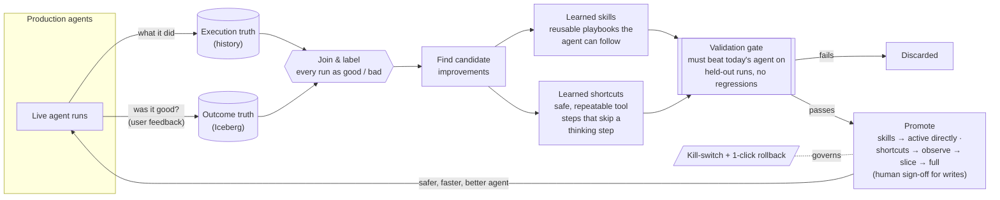
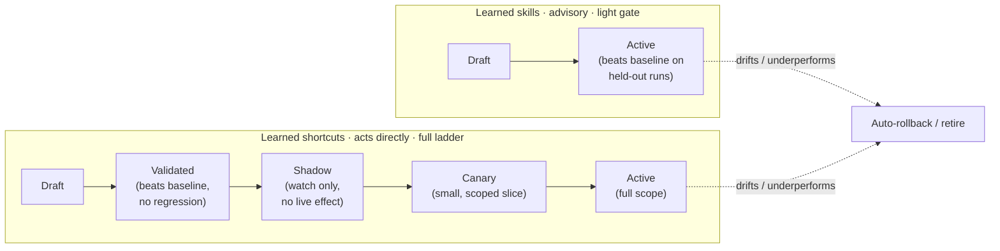

# Learning Control Plane — Overview

> Companion to the full design: [RFC_LEARNING_CONTROL_PLANE](./RFC_LEARNING_CONTROL_PLANE.md).
> This page is the one-screen picture.

## In one sentence

PenguiFlow agents already running in production **get better over time by learning from real
interactions — without shipping new code** — under guardrails that keep every change **validated,
gradual, scoped to a tenant, and instantly reversible**.

## The idea

We already capture two things about every agent run:

- **What the agent did** — its step-by-step execution history (the *StateStore*).
- **Whether it went well** — the user's reaction: corrections, thumbs up/down, follow-through,
  contested facts (the *Iceberg* memory service).

Today that information just sits there. The Learning Control Plane closes the loop: it joins the two,
finds patterns in what *worked*, proposes small improvements, **proves they help before anyone sees
them**, and rolls them out carefully. Agents improve continuously; engineers stay in control.

## The loop

## What agents learn

| | **Learned skills** | **Learned shortcuts** |
|---|---|---|
| What it is | A reusable playbook ("for this kind of request, these steps tend to work") | A safe, repeatable tool-to-tool step the agent can take without re-deciding each time |
| Effect | Advice the agent can use or ignore | Removes a thinking step → faster, cheaper, more consistent |
| Risk | Low (advisory) | Higher (acts directly) → stricter checks, starts read-only, human sign-off for anything that writes |

> **v1 scope, plainly:** shortcuts are single-hop, and only read-only ones activate without a human —
> anything that writes needs sign-off. Skills promote only as fast as the human-curated gold set that
> judges them grows; a cycle without enough gold promotes nothing. Shortcuts ship before skills. The
> compounding multi-hop wins are deliberately post-v1.

## How an improvement earns its way in

Nothing reaches a user until it has **out-performed today's agent on real, held-out runs**. Skills
clear that **light gate** and go straight to active — they are advisory, so the agent can still ignore
them, and there is no shadow or canary step. Shortcuts go further: even after they beat the baseline
they **ship gradually** — shadow, then a small scoped slice, then full — and either can be pulled back
instantly.

## Why it's safe to run in production

- **Agents never edit their own code.** They only learn *configuration-level* assets the platform
  already understands.
- **Prove-before-promote.** Every candidate is measured against the current agent on past real runs;
  losers are discarded automatically.
- **Gradual rollout for shortcuts.** Shortcuts go observe-only → small slice → full, with human
  sign-off for anything that can change data — and even at full rollout a small randomized slice
  keeps taking the ordinary path, so every shortcut is continuously measured against live reality;
  advisory skills clear the light gate and activate directly (the agent can still ignore them).
- **Scoped & private.** Learning stays within a tenant; no raw customer content or secrets are stored
  in a learned asset.
- **Always reversible.** Per-change rollback, automatic expiry, and a global kill-switch that disables
  everything at once.
- **Measured.** We track the learner itself — how often its changes stick vs. get rolled back — so we
  know it's a net win.

## What we're building on

- Production execution history and user-feedback signals we **already collect** (joined 1:1 by run).
- An evaluation/validation harness already in progress.
- Existing agent capabilities for playbooks and deterministic tool steps.

The new work is the loop that connects them — mine, validate, promote — delivered as a separate
service so the live request path is untouched.
