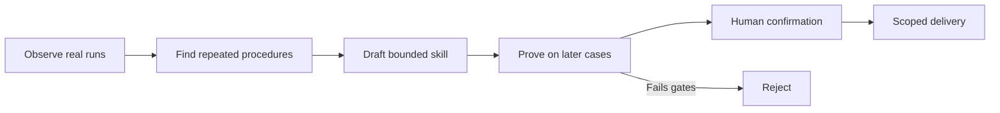
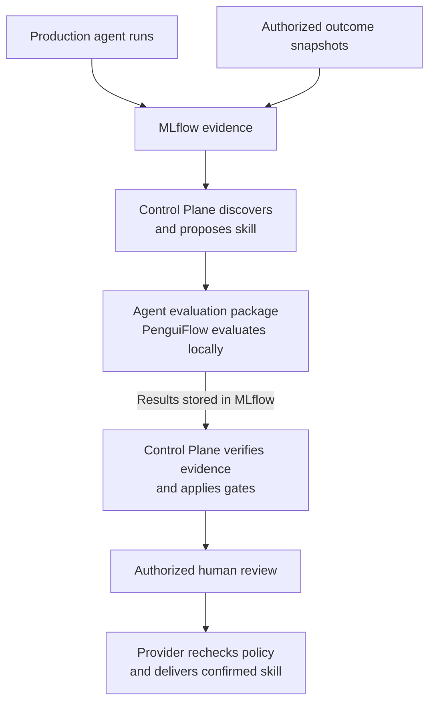
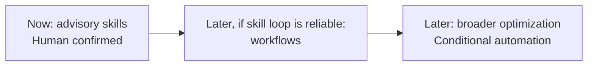
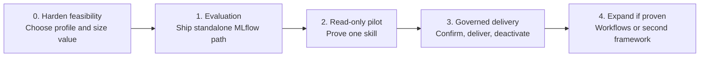

# MLflow-Backed Learning Control Plane

*Executive architecture brief — August 2026.*

**In one sentence:** after initial platform integration, the Learning Control Plane helps production agents improve from real usage through governed runtime assets, without repeated core-agent releases or exposing customers to unproven changes.

**Decision:** use MLflow for native learning evidence, and a separate Learning Control Plane for authoritative proposal, approval, and delivery records.

For a run to become learning evidence, two signals are needed:

- **What the agent did** — its trace, tool use, failures, and final result.
- **Whether it went well** — user, business, policy, quality, cost, and latency assessments.

The system connects those signals into one controlled loop:



This is not an agent that rewrites itself. It learns bounded runtime assets that remain visible, versioned, reversible, and subordinate to existing permissions.


> Start with a sizing experiment, not a full build. If evidence contains too few repeated procedures, or outcomes are too weak to judge them, the learning loop is not worth operating. Standalone MLflow evaluation remains useful either way.

# Architecture

Control-plane discovery, evaluation, approval, and delivery run outside the live request path. Local provider instrumentation records evidence during execution, but agent requests never depend synchronously on Learning Control Plane availability. If the plane is unavailable, agents continue with their last confirmed configuration.

The following logical view isolates system boundaries and authoritative handoffs:



| Owner | Responsibility | Explicit boundary |
| --- | --- | --- |
| Agent teams | Run agents and define domain quality and policy | Domain knowledge stays with the team |
| MLflow | Store traces, datasets, scores, artifacts, and lineage | Evidence store, not approval authority |
| Learning Control Plane | Select candidates, coordinate evaluation, apply policy, and authorize delivery | Does not become an agent runtime |
| Learning Plane provider | Publish portable evidence and deliver confirmed assets | Cannot bypass live permissions or scope |
| Platform operator | Operate policy, reliability, receipts, incidents, and deactivation | Does not define domain success |

Raw business outcomes remain in domain systems. Only authorized learning snapshots enter MLflow.

Customer isolation is enforced through tenant-isolated MLflow resources or authenticated service-mediated access on every read and write. Tags and search metadata help locate evidence; they never establish access rights.

# The framework boundary

Each supported framework will expose two separate integrations:

- a **standalone MLflow evaluation backend** for tracing, datasets, prediction, scoring, and evaluation runs;
- an optional **Learning Plane provider** that publishes a redacted investigation record, proves candidate use, and delivers confirmed assets.

Teams can adopt MLflow evaluation without adopting continuous learning.

Only one cross-framework payload schema is enforced: a portable investigation record, accompanied by bounded metadata used to find it. Native traces, replay behavior, evaluation packages, and domain scorers stay with the agent or framework that understands them.

Each agent also binds its trace projection, dataset shape, evaluation configuration, expectations, and scorers in one versioned evaluation package. PenguiFlow evaluation uses local library primitives; any webhook, worker, or deployment connector needed by external learning orchestration is deployment-owned and outside the library. The Learning Control Plane coordinates the package and records its version; it does not interpret agent-specific test cases or scores.

**Design principle:** the contracts carry the product, not PenguiFlow internals. After the first provider is proven, supporting another framework should require an adapter, not a central-service rewrite.

# What agents learn

The first release learns **advisory Agent Skills**: reusable playbooks that say, “for this kind of request, these steps tend to work.” The agent may use or ignore the advice.



A learned skill cannot grant tool access, change authentication, run code, force a tool call, alter core application code, or activate itself. Existing runtime permissions always win.

Deterministic **Workflows** are the next candidate surface if the skill loop proves reliable. They can remove repeated decisions and lower cost, but act more directly and require stronger replay, side-effect, rollout, and rollback controls.

# How improvement is proven

1. **Find on one cohort; judge on another.** Evidence used to discover a skill cannot also prove it works. That would grade the system's own homework.
2. **Test on the future, not the past.** Mine in one time window and validate on a later, frozen window.
3. **Change one thing.** Baseline and candidate use the same agent, model, tools, configuration, and cases. The intended difference is the exact skill.
4. **Prove the skill was used.** A candidate that was never selected, changes no case, or improves no case is rejected.
5. **Fail closed.** Missing results, scorer failures, mismatched cases, or blocking regressions stop promotion.
6. **Keep judgment with the domain.** Agent teams own business scorers. Probabilistic MLflow judges may assist but are not the sole promotion authority.
7. **Bind every decision to the exact asset.** Evaluation, confirmation, and delivery reference the same immutable skill digest. MLflow review is evidence only; the Learning Control Plane authenticates the reviewer, verifies their role, and records the authoritative decision.
8. **Verify the handoff.** Before delivery, the provider rechecks live target policy and customer scope, installs the exact confirmed version, and records a scope-bound receipt.
9. **Keep the off-switch.** Every delivered skill can be deactivated. If evidence cannot be verified, learning stops while production agents keep running.

Investigation records contain only allowlisted or redacted content. Native evaluation datasets have a separate authorization, redaction, and secret-check boundary. Trace text, tool output, feedback, generated skills, and scorer claims are treated as untrusted; blocking scorer identity and version are verified independently.

External learning orchestration may reach an agent through a deployment-owned endpoint, worker, or job. That connector must declare credentials, tool access, state-reset behavior, timeouts, and side-effect policy. Initial pilots should use simulated, isolated, or explicitly approved read-only tools.

# Benefits and limitations

| Benefits | Limitations |
| --- | --- |
| One reusable evidence and governance loop | Human confirmation slows promotion |
| Improvements without core agent code changes | Agent teams still maintain domain scorers |
| Domain knowledge remains with agent teams | Sparse or weak outcomes limit learning value |
| Framework choice remains open | Safe evaluation may require isolated or read-only tools |
| Full trail from source run to delivered skill | MLflow capabilities vary by deployment profile |
| Learning failures do not interrupt production | First release learns advisory skills only |

The design favors controlled improvement over autonomy. It does not initially optimize prompts, parameters, routing, permissions, code, or executable workflows.

# Current position

MLflow API-path feasibility has been demonstrated. An enterprise-agent experiment completed this path:

```text
Source trace → MLflow dataset → Agent evaluation → Custom scorer → Linked evidence
```

PenguiFlow is the first planned framework integration. Its native trajectory and planner-event models provide foundations, but its target Learning Plane APIs are not yet implemented.

**Important limit:** this proves the MLflow API path, not the complete learning product. Phase 0 must still prove the selected MLflow profile and version, PenguiFlow execution path, portable investigation publication, separate redaction boundaries, and failure handling.

# Roadmap



| Phase | Exit outcome |
| --- | --- |
| Harden feasibility | Supported MLflow profile, executor and cost model, redaction boundary, and preregistered go/no-go gates |
| Standalone evaluation | Complete trace-to-dataset-to-score lineage without Learning Plane dependency |
| Read-only pilot | One skill discovered and fairly evaluated, with review evidence but no delivery |
| Governed delivery | One confirmed skill delivered to one bounded scope with receipt and off-switch |
| Expand | Workflows or another framework considered only after the skill loop is reliable |

Each completed phase produces useful output; later phases depend on prior exit criteria. Even if the learning pilot stops, standalone evaluation and reusable labelled datasets retain value.

# Decisions required

Before production work begins, leadership must choose:

1. **Deployment:** OSS MLflow with SQL storage or Databricks, plus one authoritative skill-package store.
2. **Pilot:** first agent, domain, and customer scope with enough trusted outcomes.
3. **Ownership:** domain scorer and approver teams, plus platform policy, operations, and incident owners.
4. **Data policy:** retention, deletion, regional, and customer-content rules.
5. **Operating model:** evaluation compute, model-judge spend, human-review capacity, and service support.
6. **Go/no-go threshold:** preregistered numeric outcome coverage, recurrence and sample floors, minimum improvement, no-regression gates, review capacity, and stop condition.

The pilot succeeds when one recurring procedure becomes one measurably better, human-confirmed, scope-bound skill with a complete audit trail and a proven off-switch — without creating a dependency in the live customer request path.
