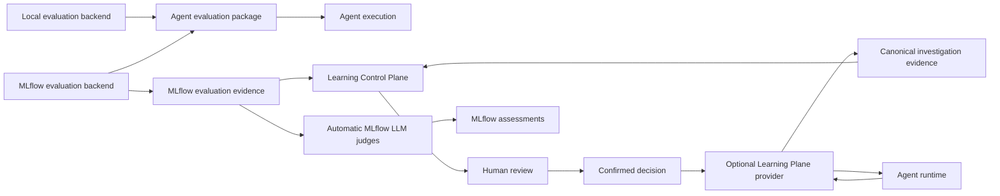

# Final Proposal: MLflow-Backed Learning Control Plane

- **Status:** Final architecture proposal
- **Date:** 2026-08-27
- **First iteration:** Advisory Agent Skills only
- **Related:**
  [Framework-Agnostic Learning Control Plane](../FRAMEWORK_AGNOSTIC_LEARNING_CONTROL_PLANE.md),
  [Learning Plane skill first](../Learning%20Plane%20skill%20first.md),
  [Dual Local and MLflow Evaluation Backends](./evaluation-backends.md),
  [Learning Plane Evidence and Reusable Lessons](./research-evidence.md)

## 1. Decision

Build a framework-agnostic **Learning Control Plane** with **MLflow as the
system of record for MLflow-native learning evidence**.

MLflow is the common downstream evidence intermediary: it stores curated
datasets, scorer assessments, evaluation runs, prediction traces, and typed
source-evidence references.
The framework MLflow evaluation backend is independently useful and does not
require the Learning Control Plane.
The Learning Control Plane remains the workflow and authorization authority. It
selects evidence, proposes advisory skills, coordinates evaluation, verifies
lineage, and governs approval and delivery. Agent-owned evaluation packages use
their deployment's execution path; Learning Plane providers publish evidence
and deliver confirmed skills.

Domain knowledge does not move into the central service. Agent teams define
domain scorers and a small declarative learning profile. Managed MLflow scorers,
agent-owned scorers, and platform scorers can participate in the same learning
run.

Each agent owns its evaluation trace projection, dataset schema, evaluation
configuration, expectations, and domain scorers as one versioned evaluation package.
The Learning Control Plane uses a separate portable episodic
`InvestigationTrajectoryV1` only for cross-agent discovery and curation.

### Executive Constraints

The Learning Control Plane must remain framework-agnostic. Native traces,
evaluation datasets, replay semantics, scorers, and metrics vary by agent and
library. Centralizing them would couple the service to every framework and force
lossy lowest-common-denominator schemas. Agent-owned evaluation packages retain
those semantics and evolve them together.

The common boundary is therefore intentionally narrow:
`InvestigationTrajectoryV1` supports episodic discovery, while the Learning
Control Plane orchestrates evidence and governance without interpreting
agent-specific evaluation data. MLflow stores the evidence but does not define
its domain meaning or authorize delivery. The first iteration learns portable
advisory skills because broader optimization surfaces require deeper framework
coupling.

`InvestigationTrajectoryV1` is the only enforced cross-framework payload
schema. Its digest-bound evidence reference and compact query index are
transport contracts. Native
traces, datasets, evaluation packages, scorers, metrics, and adapter internals remain
framework- or agent-owned.

Runtime evidence capture is deployment-selectable. MLflow-native attachment and
decoupled evidence profiles preserve the same evidence contract and converge on
MLflow-backed datasets, evaluations, assessments, and lineage. The selection
criteria are documented in [Runtime Evidence Architecture Decision](./runtime-evidence-architecture-decision.md).

## 2. Confirmed Feasibility

The enterprise-agent experiment proved this native MLflow path:

```text
MLflow source trace
  -> trace-derived MLflow Evaluation Dataset
  -> mlflow.genai.evaluate()
  -> MLflow predict_fn adapter
  -> custom scorer
  -> evaluation run and linked prediction trace
```

It also proved that effective short-term-memory context can be captured after
hydration, stored in a dataset record, and reused for a context-dependent
inference.

Reference evidence:

- Dataset: `d-1e4a724ea9e14794824ce38cdf662a2d`
- Evaluation run: `3a2b3fa8aded4a3eacb3df18f09606c2`
- `required_answer_facts/mean`: `1.0`

This is API-path feasibility. Trajectory-aware scoring, curation policy,
candidate comparison, and approval flow remain implementation work.

## 3. First-Iteration Scope

The only learned asset is a portable advisory Agent Skills package:

```text
skill-name/
  SKILL.md
  references/   optional bounded text resources
```

The skill is advisory. It cannot grant tool access, change authorization, run
code, or force tool execution.

Out of first-iteration scope:

- Prompt and parameter optimization.
- Routing changes.
- Deterministic or executable workflows.
- Scripts and code generation.
- Tool permission changes.
- Automatic activation.
- General candidate-search algorithms.

The first loop mines recurring successful procedures and drafts a bounded skill.
Broader optimization surfaces require separate designs and authorization.

## 4. Architecture and Ownership



| Concern | Owner |
|---|---|
| Evaluation datasets, assessments, runs, prediction traces, lineage | MLflow |
| Canonical raw investigation evidence | Store selected by runtime evidence profile |
| Runtime memory and operational state | Agent runtime and native StateStore |
| Raw business outcomes | Domain outcome system |
| Learning-relevant outcome snapshot | MLflow assessment |
| Native MLflow evaluation integration | Framework MLflow evaluation backend |
| Investigation trajectory projection | Learning Plane provider |
| Source cohort selection | Learning Control Plane |
| Evaluation dataset materialization | Agent evaluation package |
| Domain success semantics and custom scorer code | Agent team |
| Managed LLM judges | MLflow |
| Agent execution configuration and evaluation trace translation | Agent evaluation package |
| Skill proposal lifecycle and approval policy | Learning Control Plane |
| Candidate-use proof and skill delivery | Learning Plane provider |

MLflow does not replace runtime StateStore and does not approve or activate
skills by itself. Links beyond MLflow's native evaluation lineage, such as
baseline/candidate pairing, skill use, approval, and delivery, are maintained by
the Learning Control Plane in an evidence snapshot using MLflow object
references and content digests.

### Framework Integration Contract

Each supported framework exposes two separate integrations:

1. A standalone MLflow evaluation backend for ordinary tracing, datasets,
   prediction, scoring, and evaluation runs.
2. An opt-in Learning Plane provider that publishes
   `InvestigationTrajectoryV1`, proves candidate use, and delivers confirmed
   assets. It may reuse the evaluation backend, but the backend never depends on
   it.

Users choosing MLflow evaluation should use the standard backend. Users enable
the Learning Plane provider only when they want continuous learning. Both
implementations and extension points remain directly inspectable. Every
supported framework publishes one minimal snippet for each integration.

## 5. Evidence Contracts

### 5.1 Investigation Trajectory

`InvestigationTrajectoryV1` is the stable portable projection used by the
Learning Control Plane to find recurring procedures, failures, and successful
patterns across supported agents.

Learning Plane providers serialize every projection as canonical JSON with
content type `application/json` and publish a digest-bound evidence reference.
The selected runtime evidence profile may store those bytes as an MLflow
Attachment, as complete bounded MLflow trace output, or in an independently
operated immutable store. Trace-output storage is valid only when the selected
profile proves that sampling, truncation, and retention cannot remove required
learning evidence. Its bounded query
index records schema, agent, provider, scope, status, execution fingerprint,
intent class, step signature, and outcome/assessment presence. The Learning
Control Plane queries the index, resolves the authenticated evidence reference,
and verifies its digest; it does not scan payloads to discover candidates.

```text
InvestigationEvidenceRef
  evidence_id
  schema_version
  content_digest
  storage_kind
  object_ref
  source_trace_ref
  scope_ref
  redaction_profile
```

MLflow-native and decoupled profiles must preserve the same identity, integrity,
scope, redaction, and retrieval semantics. Profile-specific storage and
publication mechanics remain below this contract.

```text
InvestigationTrajectoryV1
  schema_version
  investigation_id
  source_trace_ref
    kind
    deployment_ref
    trace_id
    extensions
  agent_ref
  provider_ref
  scope_ref
  session_ref
  parent_investigation_ids[]
  started_at
  completed_at
  status
  execution_fingerprint

  intent_descriptor
    taxonomy
    class
    confidence

  request
  model_context
  execution_context
  input_parts[]
  artifact_refs[]
  source_refs[]
  attributes

  steps[]
    step_id
    index
    parent_ids[]
    started_at
    completed_at
    status
    action
      kind
      target
      arguments
      reasoning_summary
      side_effect_class
    observation
    model_observation
    error
    failure
    streams

  summary
  control_state
  resume_input
  interventions[]
  async_results[]
  final_output
  termination_reason

  events[]
    event_id
    index
    parent_ids[]
    type
    timestamp
    step_id
    name
    status
    latency_ms
    error
    attributes

  outcome_refs[]
  assessment_refs[]
  redaction_profile
  extensions
```

The shape deliberately follows PenguiFlow's proven `Trajectory`,
`TrajectoryStep`, `PlannerAction`, and `PlannerEvent` model with portable names.
Other framework adapters map equivalent native concepts into the same topology;
framework-only data stays under namespaced `extensions`.

Required fields are identity, typed source trace reference, agent, provider, scope,
start time, status, execution fingerprint, request, steps, and redaction profile.
`completed_at`, session, parents, intent, events, outcomes, and assessments are
optional; their arrays may be empty. One canonical evidence object represents
one native agent run. Session and parent investigation references connect
multi-turn and multi-agent runs without nesting framework-native traces. Status
uses `completed`, `paused`, `failed`, `timed_out`, `cancelled`, `interrupted`,
or `unknown`, matching the normalized evaluation result status. Steps and
events are ordered by `index`; `parent_ids` preserve
branching, joins, retries, and other non-linear causality. Action `kind` covers
model, tool, retrieval, handoff, agent, parallel, background, final, or custom
work. Side effect uses `none`, `read`, `write`, `external`, or `unknown`.

Content-bearing fields use allowlisted JSON, bounded redacted summaries, or
artifact references according to `redaction_profile`. The evidence object excludes
credentials, secrets, unrestricted customer content, and raw chain-of-thought;
`reasoning_summary` is an optional provider-generated summary, never raw hidden
reasoning.

This projection supports investigation. It is not a replay format, evaluation
dataset, scorer input contract, or replacement for the native runtime trace.

The Learning Control Plane may derive bounded, redacted episodic Markdown or
sequence diagrams from the canonical JSON for skill discovery. These derived
representations link back to the evidence digest but are not canonical
evidence or framework-provider responsibilities.

### 5.2 Agent Evaluation Package

Each agent publishes one versioned package that binds:

```text
AgentEvaluationPackage
  package_ref
  package_digest
  source_trace_projector_ref
  source_trace_projector_digest
  dataset_schema_ref
  evaluation_entrypoint_ref
  scorer_refs[]
  expectation_schema_refs[]
```

The package follows `source_trace_ref` from selected investigation trajectories
and materializes its own MLflow Evaluation Dataset. Dataset and scorer schemas
may differ across agents and frameworks. The Learning Control Plane records the
package digest and case-set snapshot but does not interpret agent-specific rows.
The same package and MLflow evaluation backend can run ordinary evaluations
without investigation attachments or a Learning Control Plane.

The package may also project authorized evidence into a candidate evaluation
case when a proposed skill's claimed behavior is not represented by existing
cases. Projection is mechanical, not admission: the agent's domain owner must
approve the expectation, scorer applicability, replayability, and privacy
classification before the case enters a versioned evaluation dataset. Generated
expectations cannot serve as blocking ground truth without trusted validation.

### 5.3 Evidence Snapshot

Before approval, the Learning Control Plane freezes one digest-bound snapshot
containing target scope, discovery and evaluation cohort manifest refs,
evaluation package digest, baseline/candidate arm and prediction trace refs,
each arm's source-mapping digest, scorer assessment refs, and candidate skill
digest. MLflow remains the canonical store for its native objects; this snapshot
is authoritative for the proposal transition.

## 6. Agent Learning Profile

Agent teams publish declarative intent and scorer references. They do not add
agent-specific code to the Learning Control Plane.

```yaml
agent_ref: support-agent:v12
framework_provider: penguiflow:v1
investigation_projection: penguiflow.investigation:v1
evaluation_package_ref: support-agent.evals:v7
evaluation_package_digest: sha256:...

scorers:
  - scorer_ref: quality.helpfulness:v3
    executor: mlflow_llm_judge
    modes: [online, offline]
    role: discovery

  - scorer_ref: support.policy-compliance:v7
    executor: external_job
    artifact_ref: oci://support-agent/evals@sha256:...
    modes: [offline]
    role: promotion_gate
    threshold: 0.98

curation:
  allowed_slices: [route, tool_namespace]
  intent_taxonomy: support-procedures:v1

optimization_surface:
  type: agent_skill
  profile: advisory-v1
```

## 7. Scorers

### MLflow LLM Judges

LLM judges defined through MLflow UI or API can score relevance, helpfulness,
coherence, groundedness, or broad safety. Offline evaluation runs them through
`mlflow.genai.evaluate()`. Automatic online evaluation is asynchronous,
LLM-judge-only, and requires a deployment profile that supports it.

### Agent-Owned Scorers

Domain scorers remain in the versioned agent evaluation package or an external
job. They cover exact policy, structured output, business constraints, and
regression gates. Package scorers run in the registered evaluation executor;
the Learning Control Plane dispatches external jobs. External dispatch, retries,
authenticated result ingestion, and result collection are Learning Control
Plane responsibilities, not native MLflow features.

### Platform Scorers

Reusable scorers cover cost, latency, token usage, failures, retries, completion,
and generic safety checks.

Every scorer declares:

- Identity and version.
- Executor and artifact reference when external.
- Online, offline, or both.
- Required evidence fields.
- Discovery, objective, diagnostic, or promotion-gate role.
- Threshold and missing-result policy when blocking.

MLflow assessment source fields are attribution, not authentication. Promotion
evidence is accepted only when the execution identity and exact scorer or judge
version are independently verified.

“Online” means asynchronous scoring of production traces, not blocking a user
request. Stochastic LLM judges are not sole automatic promotion gates unless
separately calibrated and approved. Scorer registration and review capabilities
vary between OSS MLflow and Databricks; the deployment profile must declare
which capabilities are available.

Automatic MLflow LLM judges may run independently and concurrently with other
learning logic. Offline MLflow scorers run in the evaluation executor. The
Learning Control Plane waits only for results that promotion policy marks as
blocking.

## 8. Dataset Curation

The Learning Control Plane owns generic curation mechanics:

- Time-window and scope selection.
- Joining investigation trajectories with available assessments.
- Low-score, failure, and scorer-disagreement selection.
- Deduplication and representative sampling.
- Slice balancing.
- Source-trace provenance.
- Separation of discovery and later evaluation cases.

Learning Plane providers produce `InvestigationTrajectoryV1`. Domain connectors
supply outcome links and labels. The Learning Control Plane selects source trace
references using generic windows, sampling, balancing, and completeness policy.
The agent evaluation package converts selected source traces into its MLflow
dataset. The Learning Control Plane does not interpret native trajectories or
agent-specific dataset rows.

Before skill generation and before baseline execution, the Learning Control
Plane freezes separate discovery and evaluation cohort manifests. The evaluation
manifest records dataset ID and digest, ordered record IDs, source trace refs,
and package digest. Because MLflow merges records with identical inputs, the
package must either include a stable case ID in inputs or record an explicit
many-source-to-one-case mapping.

Missing feedback is `unknown`, not success. Evidence used to discover a skill
does not by itself prove that skill is better.

Every skill proposal records an evaluation coverage disposition:

- `sufficient`: existing cases represent the claimed behavior;
- `extension_required`: the agent evaluation package must project one or more
  candidate cases and the domain owner must admit them before promotion; or
- `not_projectable`: the behavior cannot be replayed or scored reliably, so the
  first iteration does not promote the skill or claim the behavior is fixed.

An admitted case records source-evidence references, stable case identity,
projector reference and digest, expectation status, and dataset revision.
Cases derived from evidence used to generate a skill may prove reproduction and
remediation, but cannot count as independent holdout evidence. When admitted
cases change regression coverage, affected active skills invoke the selected
compatibility policy.

## 9. Skill Generation and Evaluation

### Discovery

1. Select recurring successful procedures from portable investigation
   trajectories in a discovery window.
2. Require enough positive evidence and exclude known negative or retry cases.
3. Draft a bounded Agent Skills package from the procedure evidence and declared
   capabilities.
4. Validate package format, size, scope, references, and tool-policy claims.

### Evaluation

Baseline and candidate evaluation use the same agent version, model, tools,
configuration, executor, and dataset. The only intended difference is addition
of the exact candidate skill through framework-native skill configuration.

```text
baseline = stable agent
candidate = same stable agent + exact skill version
```

This first iteration does not solve general agent-version reproducibility. It
records the execution fingerprint and fails comparison when baseline and
candidate fingerprints differ unexpectedly. The fingerprint covers agent and
package versions, model and configuration, tool contracts, runtime image, and
state-reset policy. Model configuration includes provider routing, seed when
supported, temperature, top-p, and other sampling or decoding settings.

Required evidence:

- Accepted evaluation coverage disposition and relevant case references.
- Per-case baseline and candidate results.
- Exact candidate skill digest/version.
- Per-case proof that the exact skill digest was selected or injected in the
  candidate arm using the same provider projection used for delivery.
- Preregistered sample floor, minimum effect, and repeat-run policy; stochastic
  runs repeat unless the policy records why one run is sufficient. Repeat count,
  aggregation, uncertainty handling, and decision rule are deliberately left to
  Phase 2 implementation exploration, but must be selected before evaluation.
- At least one changed case and one improved case.
- No unexpected regression under configured gates.
- Explicit result, failure, or accepted exclusion for every requested case.

A tied candidate that changes no case is rejected as `no_effect`.

## 10. Evaluation Execution

The agent evaluation package and deployment integration select execution
topology. The Learning Control Plane coordinates evaluation but does not define
the connector, and PenguiFlow's standalone evaluation library remains local:

- Local agent or project package.
- Webhook or deployed evaluation endpoint.
- Worker, job, or container.
- Isolated agent instance when required.

Each executor declares state behavior, credentials, tool access, side-effect
policy, reset behavior, timeouts, and fidelity. First-iteration skills are
advisory, but evaluation must still avoid unintended production effects.

Hidden expectations and scorer logic are passed to scorers, never to the
agent-under-test.

## 11. Approval and Skill Persistence

Passing evaluation creates a proposal; it does not activate the skill.

```text
draft -> evaluated -> proposed -> approved -> confirmed -> delivered
                    -> rejected
delivered -> deactivated
```

Human review may occur through either:

1. **Learning Service UI/API**, producing an approval receipt; or
2. **MLflow UI or assessment API**, recording a review decision.

MLflow assessments are review evidence, not authorization. The Learning Control
Plane authenticates the reviewer through its own trusted action, validates their
role, and records the authoritative approval or confirmation receipt against the
evidence snapshot and skill digest. MLflow review can inform that action but
cannot authorize delivery. Approval and confirmation may be separate actions or
one policy-authorized action. Delivery is authorized only after confirmation.
The framework adapter rechecks live target policy and records a digest-bound
delivery receipt. Candidate-use evidence and the delivery receipt bind the same
skill digest, provider target, scope, and evaluated execution fingerprint as the
evidence snapshot. Platform operators may manually deactivate a delivered skill
and record a deactivation receipt. Propagation timing and mechanism are
deliberately left to Phase 3 implementation exploration, but must be selected
and tested before Phase 3 exits.

Changes to the active agent, model, sampling configuration, tool contracts, or
evaluation package invoke a deployment-defined compatibility policy. That policy
must require revalidation, deactivation, or an explicit operator waiver; its
exact compatibility rules are deliberately left to Phase 3 implementation
exploration.

Canonical skill package storage is deployment-selectable:

- **MLflow artifacts**, linked to proposal and evaluation lineage; or
- **Learning Service artifact storage**, with MLflow storing the artifact
  reference and digest.

One deployment must select one authoritative package store. Evidence records and
evaluation lineage remain in MLflow in both options. When MLflow artifacts are
selected, the Learning Control Plane still owns package version, digest checks,
review state, and active-version semantics.

## 12. Promotion Policy

First-iteration policy is intentionally simple:

- Minimum discovery and evaluation samples.
- Accepted evaluation coverage disposition; `extension_required` and
  `not_projectable` block promotion.
- Required scorer thresholds.
- Safety and policy vetoes.
- No missing required case results.
- Candidate-use proof.
- `no_effect` rejection.
- Human approval and confirmation.
- Scope-bound delivery receipt.
- Compatibility policy and manual deactivation receipt.

Automatic activation, canary rollout, and autonomous advancement are deferred.

## 13. First-Iteration Risks and Controls

- **Deployment ambiguity:** choose one supported MLflow profile, `oss-sql` or
  `databricks`, and pin its version. Evaluation Datasets require a SQL-backed
  tracking store; FileStore is not a production option.
- **Tenant leakage:** tags aid search but are not access control. Each deployment
  must use tenant-isolated MLflow resources or mediate MLflow access through a
  service that enforces authenticated tenant and target scope on every read and
  write.
- **Sensitive evaluation data:** investigation trajectories contain only
  allowlisted or redacted episodic content.
  Agent-specific dataset projection requires explicit authorization,
  allowlisted fields, and pre-write secret/PII checks.
- **Poisoned skills:** treat trace text, tool output, and feedback as untrusted.
  Constrain generation, scan skill content, and require human confirmation.
- **Dataset drift:** bind both arms to the same frozen evaluation cohort manifest
  and reject case-set or source-mapping mismatch.
- **Coverage gaps and self-validation:** missing relevant cases are `unknown`,
  not improvement. Domain owners admit projected cases, and discovery-derived
  cases cannot serve as independent holdout proof.
- **Artifact substitution:** evaluation, approval, and delivery must reference
  the same canonical skill digest.
- **Untrusted feedback or scorers:** verify authenticated execution identity and
  exact scorer version independently of caller-supplied assessment fields.
  Feedback selects discovery material but is not promotion proof.
- **Replay side effects:** first-iteration executors use no-side-effect tools or
  explicitly approved read-only integrations.
- **Partial evidence:** missing candidate results, scorer failures, or asymmetric
  exclusions fail the comparison.
- **Service failure:** learning and delivery fail closed when evidence cannot be
  verified; deployed agents continue using their last confirmed skill set.

Retention, deletion, and backup policy must be defined before production replay
contexts or customer-derived skill references are stored in MLflow.

## 14. PenguiFlow Delta

[Dual Local and MLflow Evaluation Backends](./evaluation-backends.md)
defines the standalone evaluation work. PenguiFlow is local-first today. Two
separate product deltas are required.

Standalone `MLflowEvaluationBackend`:

1. Shared local `run_one` construction for agent discovery, execution, optional
   isolated StateStore, and prediction evidence.
2. Agent-owned source-trace-to-dataset projector with controlled replay context.
3. MLflow Dataset creation and `predict_fn` adapter.
4. Adapter from existing PenguiFlow metrics to MLflow scorers.
5. MLflow evaluation, prediction, assessment, and lineage references.

Opt-in `PenguiFlowLearningPlaneProvider`:

1. Portable `InvestigationTrajectoryV1` projector and digest-bound evidence publisher for the selected runtime profile.
2. Framework-native candidate skill overlay and exact-use proof.
3. Confirmed skill delivery and delivery receipts.

Local JSONL evaluation remains useful for CI and development. Production
MLflow evaluation also works without Learning Plane integration.

### Supported Framework Snippets

PenguiFlow is the first supported framework. These target APIs are proposed and
not yet implemented. Standalone MLflow evaluation uses:

```python
backend = MLflowEvaluationBackend()
result = await backend.evaluate(dataset, run_one, metrics)
```

Learning Plane participation is separately enabled:

```python
provider = PenguiFlowLearningPlaneProvider(
    investigation_projector=investigation_projector,
)
```

Final public module paths are fixed during Phase 0. Both implementations remain
open for inspection.

Other framework integrations follow the same small pattern. A selected runtime
profile supplies its native evidence publisher. For example, the MLflow-native
profile can retain LangChain autologging:

```python
mlflow.langchain.autolog()
```

An optional Learning Plane provider keeps that native tracing and wraps the live
root span:

```python
mlflow.langchain.autolog(run_tracer_inline=True)

async def invoke(agent, inputs, projector):
    with mlflow.start_span("learning-agent-run") as span:
        result = await agent.ainvoke(inputs)
        attach_investigation_trajectory(span, projector.project(inputs, result))
    return result
```

For this profile, `attach_investigation_trajectory()` is shared Learning Plane SDK logic. It
serializes and hashes `InvestigationTrajectoryV1`, writes the query index, and
sets the JSON `Attachment` as the span output. MLflow cannot add attachments to
an already completed trace, so publication must happen before this wrapper span
ends. Decoupled profiles publish the same canonical bytes and reference without
altering an MLflow span. These are adapter-author examples, not formal LangChain
support or a profile selection.

## 15. Learning Cycle

1. Agent and outcome connectors publish runtime evidence and authorized outcome snapshots.
2. Learning Plane provider publishes portable investigation trajectories through the selected profile.
3. Learning Control Plane selects recurring procedures and source trace refs.
4. Each proposed improvement receives a coverage disposition; when required, the
   agent evaluation package projects candidate cases and the domain owner admits them.
5. Procedure mining proposes one or more bounded advisory skills.
6. Agent evaluation package materializes later cases as an MLflow dataset.
7. Registered executor runs stable baseline and stable-agent-plus-skill variants.
8. Managed and agent-owned scorers write assessments to MLflow.
9. Learning Control Plane applies evidence and safety gates.
10. Passing skill becomes a proposal awaiting required approval and confirmation.
11. Learning Plane provider delivers the exact confirmed skill and records receipt.

## 16. Delivery Phases

### Phase 0: Harden Feasibility

- Resolve the project/runtime MLflow version mismatch and select the supported
  MLflow and runtime evidence profiles.
- Prove standalone PenguiFlow MLflow dataset, prediction, and scorer execution.
- Separately implement and validate the Learning Plane trajectory projection.
- Enforce independent investigation and agent-dataset redaction boundaries.
- Represent failure, pause, cancellation, and timeout explicitly.

### Phase 1: PenguiFlow MLflow Evaluation

- Consolidate local `run_one` semantics and scorer adapters.
- Prove complete source-trace, dataset, evaluation, prediction, and score lineage.
- Confirm the backend operates without Learning Plane configuration.

### Phase 2: Read-Only Learning Loop

- Register one agent profile.
- Curate discovery and later evaluation cases.
- Generate one advisory skill, compare it through the evaluation backend, and
  prove candidate use through the Learning Plane provider.
- Produce proposal, approval, and confirmation receipts without automatic
  delivery.

### Phase 3: Governed Skill Delivery

- Deliver one confirmed advisory skill.
- Prove scope, digest, policy recheck, and delivery receipt.
- Support and test manual deactivation, including its receipt and selected
  propagation behavior.
- Select and test compatibility handling for agent, model, configuration, tool,
  and evaluation-package changes.

### Product Roadmap

1. **Skills:** portable advisory procedures; first iteration.
2. **Workflows:** deterministic sequences of tools; next target feature.
   PenguiFlow's target builds on Auto-Seq by compiling learned sequences into
   its opted-in typed post-tool transitions.
3. Automatic rollout, generic optimization, and a second supported framework
   remain later work.

## 17. Acceptance Criteria

First iteration succeeds when:

1. MLflow links typed source-evidence references and digests, curated dataset,
   evaluation run, prediction traces, scorer results, and proposal evidence.
2. PenguiFlow source traces produce valid portable investigation trajectories
   as canonical, digest-bound evidence through the selected runtime profile.
   Telemetry sampling, truncation, and retention cannot remove required evidence.
3. Learning Control Plane selects source refs without parsing PenguiFlow-native
   trajectories or dataset rows.
4. Agent evaluation package materializes and evaluates a middle-turn case from
   a frozen evaluation cohort manifest, and can project an authorized source
   trace into a domain-admitted case with projector lineage.
5. One existing domain scorer runs through the MLflow path.
6. Baseline and candidate differ only by exact skill version.
7. Candidate-use, changed-case, improvement, and regression evidence are
   explicit, with accepted coverage disposition and preregistered sample,
   effect, and repeat-run policy. Discovery-derived cases are not holdout proof.
8. Passing evaluation creates a proposal, not automatic activation.
9. Approval and confirmation identify exact skill digest, evidence snapshot,
   scope, reviewer, and decision.
10. Delivery requires confirmation, rechecks policy, and records exact package
    digest and evaluated execution fingerprint.
11. Agent developers can add an evaluation package and profile without
    changing Learning Control Plane code.
12. Tenant access boundary, dataset projection, scorer identity, case set, and
    skill digest are verified before approval.
13. `InvestigationTrajectoryV1` is the only shared payload schema; native
    framework and agent evaluation semantics remain local.
14. PenguiFlow provides an inspectable standalone MLflow evaluation backend that
    works without Learning Plane configuration.
15. PenguiFlow provides a separate inspectable Learning Plane provider and setup
    snippet for trajectory publication, candidate-use proof, and delivery.
16. A delivered skill can be manually deactivated with a receipt, and relevant
    execution-fingerprint changes invoke the selected compatibility policy.
    Deactivation reaches its targets within the Phase 3 selected bound and
    prevents subsequent skill use.

## 18. Final Boundary

- **The selected runtime profile stores canonical raw investigation evidence.**
- **MLflow stores projected datasets, evaluations, assessments, prediction
  traces, and lineage.**
- **Learning Control Plane curates evidence, proposes skills, coordinates
  evaluation, and governs approval.**
- **Agent teams own evaluation datasets, evaluation configuration, expectations, and domain
  scorers as one package.**
- **Framework MLflow evaluation backends run independently of the Learning
  Plane.**
- **Learning Plane providers publish portable investigation trajectories, prove
  candidate use, and deliver confirmed skills.**
- **Humans confirm first-iteration activation.**

This keeps domain knowledge out of the central service without requiring each
agent team to build its own learning pipeline.
