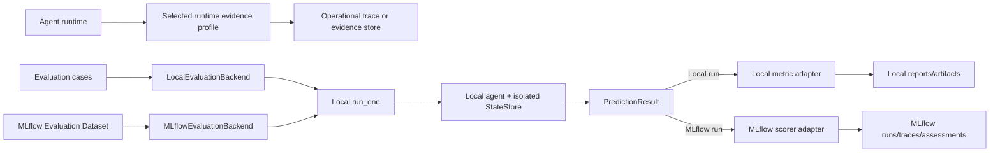

# Refactor Plan: Dual Local and MLflow Evaluation Backends

- **Status:** Proposed
- **Date:** 2026-08-31
- **Scope:** PenguiFlow evaluation execution and persistence
- **Related:**
  [Framework-Agnostic Learning Control Plane](../FRAMEWORK_AGNOSTIC_LEARNING_CONTROL_PLANE.md)

## 1. Decision

Refactor PenguiFlow evaluation around shared local execution and metric semantics with
two optional evaluation backends:

- **Local backend:** preserves current JSONL, offline/CI, StateStore, and local
  report behavior without requiring MLflow.
- **MLflow backend:** uses Evaluation Datasets, `mlflow.genai.evaluate()`,
  scorers, evaluation runs, assessments, and any evaluation-linked prediction
  traces produced by MLflow as the evidence store for standalone MLflow-backed
  evaluations.

Do not place the current local evaluation loop in front of MLflow. Do not make
MLflow understand PenguiFlow trajectories directly. Both backends use the same
local `run_one` semantics and metric logic through thin adapters.

The minimal shared surface is:

```python
class RunOne(Protocol):
    async def __call__(self, inputs: EvaluationInputs) -> PredictionResult: ...


class Metric(Protocol):
    async def score(
        self,
        case: EvaluationCase,
        prediction: PredictionResult,
    ) -> ScoreResult: ...


class EvaluationBackend(Protocol):
    async def evaluate(
        self,
        dataset: object,
        run_one: RunOne,
        metrics: Sequence[Metric],
    ) -> EvaluationResult: ...
```

Do not introduce separate dataset-provider, tracker, run-store, or orchestrator
interfaces yet. Split those concerns only when a concrete mixed-backend use
case requires it.

Runtime tracing is a separate, narrower concern. A deployment selects a runtime
evidence profile with a typed source-evidence reference; MLflow remains the
optional evaluation backend. Runtime profile selection must
not change the shared evaluation contracts, dataset schemas, metric semantics,
or backend ownership defined here. Selection trade-offs are documented in
[Runtime Evidence Architecture Decision](./runtime-evidence-architecture-decision.md).

## 2. Why This Path

### 2.1 Why not wrap the current API around MLflow

Wrapping the current API wholesale would retain two dataset models, two
evaluation engines, two result formats, and ambiguous ownership. MLflow would
become a secondary blob and metrics sink rather than the source of truth for
MLflow-backed learning jobs.

The current package already contains overlapping execution paths in
`penguiflow/evals/api.py`, `runner.py`, `sweep.py`, and `workflow.py`. New MLflow
support should not add another translation layer around all of them.

### 2.2 Why not replace all current evaluation code

Current evaluation code contains PenguiFlow-specific behavior that MLflow does
not provide:

- agent and project discovery;
- isolated StateStore injection;
- trace persistence waiting and verification;
- full trajectory retrieval;
- LLM/tool context separation;
- planner-aware trajectory helpers;
- candidate and patch integration points;
- offline and no-service execution.

These capabilities remain in PenguiFlow's local evaluation callable and shared
metrics; this proposal does not introduce remote evaluation execution.

### 2.3 Why not build Learning Plane integration here

Standalone MLflow evaluation is useful without continuous learning. A separate
`PenguiFlowLearningPlaneProvider` may reuse this backend, but trajectory
publication, cohort curation, candidate-use proof, approval, and delivery are
outside this refactor.

### 2.4 Optional OTel runtime profile

When selected, the OTel runtime integration should preserve the developer experience and useful
trace shape demonstrated by `mlflow.trace()` and `mlflow.litellm.autolog()`
without making MLflow a runtime dependency. The minimal public surface is:

```python
from penguiflow.otel import autolog

autolog(
    log_traces=True,
    log_inputs_outputs=True,
    disable=False,
    silent=False,
)
```

`autolog()` enables PenguiFlow's built-in instrumentation and uses the global
OpenTelemetry provider. It does not configure an SDK, exporter, sampler,
resource, endpoint, or credentials; the application owns those decisions. A
missing SDK leaves the OpenTelemetry API as a low-overhead no-op.

Instrumentation stays at two existing central boundaries:

1. `ReactPlanner.run()` creates the agent/root span.
2. The existing native `LLMTraceSink` seam creates one child span for every
   planner, repair, reflection, summarizer, and fallback-model inference.

Do not add a general runtime-tracer provider hierarchy until a second concrete
runtime implementation requires one. Do not monkey-patch LiteLLM. The native
LLM seam is smaller, covers PenguiFlow transports uniformly, and preserves
correct active OTel context.

For parity with MLflow autolog, the root span records the initial effective
system prompt, query/input, initial LLM context, agent/model/config identifiers,
PenguiFlow trace ID, final answer, finish reason, status, and OTel trace ID. LLM
spans record effective request messages, response, provider/model, response
mode, token use, cost, retries, streaming, latency, phase, and errors. Use OTel
GenAI semantic conventions where available.

`log_inputs_outputs=True` is the explicit-autolog compatibility default. Before
content reaches OTel, apply configured redaction and size limits. Never record
credentials or hidden reasoning. With `log_inputs_outputs=False`, retain only
content digests, character counts, prompt/config versions, token use, timing,
and other non-content metadata. Record the initial effective system prompt once
on the root span; child LLM spans may reference its digest instead of repeating
it.

## 3. Confirmed Feasibility Findings

The enterprise v2 feasibility work confirmed:

1. The original MLflow-instrumented experiment can create an MLflow root trace
   with nested LiteLLM spans; this is historical parity evidence, not the target
   runtime integration.
2. A trace can be projected into an MLflow Evaluation Dataset record.
3. Nested PenguiFlow evidence survives MLflow dataset write and readback.
4. Native short-term-memory context is available in
   `PlannerFinish.metadata["llm_context"]` after hydration, even though the root
   span input contains only pre-hydration context.
5. A middle-turn conversation snapshot can be stored and used by a fresh
   inference to recover required prior facts.
6. `mlflow.genai.evaluate()` can consume a trace-derived MLflow dataset, invoke
   an agent through `predict_fn`, execute a custom scorer, persist an evaluation
   run, and link a new inference trace.
7. The optional OTel profile can preserve one parent-
   child trace without `mlflow.trace()` or `mlflow.litellm.autolog()`.
8. The existing four-case Enterprise v2 policy suite still produces non-empty
   PenguiFlow trajectories and completes MLflow dataset/evaluation processing
   when runtime trace emission uses OTel.

The successful native feasibility run produced:

- Dataset ID: `d-1e4a724ea9e14794824ce38cdf662a2d`
- Evaluation run ID: `3a2b3fa8aded4a3eacb3df18f09606c2`
- `required_answer_facts/mean`: `1.0`
- Evaluation-linked inference traces: `1`

The feasibility scripts are:

- `examples/planner_enterprise_agent_v2/evals/mlflow_trace_dataset_feasibility.py`
- `examples/planner_enterprise_agent_v2/evals/mlflow_learning_plane_feasibility.py`

These scripts and their direct finalized-execution projections are exploratory
evidence, not target public APIs. Production work keeps current evaluation
schemas and introduces only the thin source-reference translation required to
associate an OTel runtime trace with existing evaluation evidence.

## 4. What Is Not Yet Proven

The successful run proves API-path feasibility, not production completeness.
It does not yet prove:

- prediction-side StateStore trajectory persistence in the MLflow path;
- full prediction trajectory delivery to an MLflow scorer;
- adaptation of an existing PenguiFlow trajectory metric;
- safe async execution without per-case `asyncio.run()`;
- failure, pause, cancellation, and timeout representation;
- immutable dataset revisions or content-addressed evaluation snapshots;
- enforced redaction of contexts and tool observations;
- complete source-record-run-prediction-scorer lineage;
- reproducible candidate runtime configuration;
- operation with another agent framework.
- application-configured OTLP export and inspection in a non-MLflow trace
  backend;
- complete autolog parity for repair, reflection, summarization, fallback, and
  failure paths;
- bounded/redacted initial-system-prompt and request/response capture under
  production content policies.

These are parity and hardening gates, not blockers to the selected architecture.

## 5. Ownership Boundaries

| Concern | Owner |
|---|---|
| Agent construction and execution | Local PenguiFlow evaluation callable |
| Runtime agent and LLM trace emission | Selected runtime evidence profile |
| OTel SDK, sampling, export, and operational trace storage | Deploying application when OTel profile is selected |
| StateStore isolation and trajectory persistence | Local PenguiFlow evaluation callable |
| Native trajectory interpretation | PenguiFlow metric/helper code |
| Domain success criteria | Agent evaluation package |
| Local JSONL and local reports | `LocalEvaluationBackend` |
| MLflow datasets, evaluation runs, prediction evidence, assessments | `MLflowEvaluationBackend` |
| Evaluation trace-to-case projection and redaction | Agent evaluation package |
| Investigation trajectory and learning lifecycle | Separate Learning Plane provider |
| Runtime conversation memory | Agent runtime StateStore, not MLflow |

MLflow is the evaluation-evidence store for MLflow-backed jobs. This backend does
not replace runtime StateStore or require a Learning Control Plane.

## 6. Shared Data Contracts

Keep contracts small and JSON-safe. Avoid standardizing every native trajectory
field.

### 6.1 Evaluation inputs

```python
@dataclass
class EvaluationInputs:
    query: str
    llm_context: Mapping[str, Any]
    tool_context: Mapping[str, Any]
```

Only replay-safe context belongs here. Runtime callbacks, loggers, telemetry
objects, trace IDs, status publishers, and mutable execution progress do not.

### 6.2 Evaluation case

```python
@dataclass
class EvaluationCase:
    case_id: str
    inputs: EvaluationInputs
    expectations: Mapping[str, Any]
    tags: Mapping[str, str]
    source: Mapping[str, Any]
```

`expectations` stays agent-owned. It may include required answer facts,
reference outputs, labels, or the minimal reference-trajectory evidence needed
by configured metrics.

### 6.3 Prediction result

```python
@dataclass
class PredictionResult:
    status: Literal[
        "completed", "paused", "failed", "timed_out", "cancelled",
        "interrupted", "unknown",
    ]
    answer: str | None
    route: str | None
    trajectory: Mapping[str, Any] | None
    effective_llm_context: Mapping[str, Any]
    effective_tool_context: Mapping[str, Any]
    trace_ids: Mapping[str, str]
    error: Mapping[str, Any] | None
```

An incomplete or missing trajectory must be explicit. It must not silently
become an empty successful prediction.

### 6.4 Score result

```python
@dataclass
class ScoreResult:
    score: float
    feedback: str | None = None
    checks: Mapping[str, Any] = field(default_factory=dict)
```

Preserve structured checks. Do not encode them only inside feedback strings.

### 6.5 Evaluation result

```python
@dataclass
class EvaluationResult:
    backend: Literal["local", "mlflow"]
    metrics: Mapping[str, float]
    case_results: Sequence[Mapping[str, Any]]
    backend_refs: Mapping[str, str]
```

For MLflow, `backend_refs` includes dataset, evaluation run, and trace IDs. For
local execution it includes report and artifact paths when requested.

## 7. Local PenguiFlow Evaluation Callable

Both backends call the same locally executed `run_one`. It may use PenguiFlow's
discovered planner/orchestrator path or an existing project-supplied callable.
Remote orchestration protocols are outside this library refactor.

Responsibilities:

1. Build or obtain the local planner/orchestrator.
2. Inject an isolated StateStore when supported.
3. Pass replay-safe inputs and controlled context.
4. Execute one local agent run and collect its trajectory.
5. Return a complete `PredictionResult` and execution references.
6. Preserve pause, failure, cancellation, and timeout status.

Candidate skill comparison is a separate local configuration concern. A
candidate arm may make the exact skill available through PenguiFlow's existing
`skills_provider` machinery or a small in-memory overlay only when that overlay
uses the same provider projection used for delivery; the backend does not
interpret or persist the skill. The Learning Plane provider separately binds
the candidate digest and provider projection to use proof.

Both backends use the same local callable semantics. This is the consistency
boundary: the same inputs and local execution profile must produce comparable
results regardless of evidence backend.

## 8. Shared Metrics and Backend Adapters

Metric logic remains ordinary project/Penguiflow code. Backend adapters only
translate callable and result shapes.

```text
Shared metric implementation
├── Local metric adapter
│   └── called by LocalEvaluationBackend
└── MLflow scorer adapter
    └── exposed through @mlflow.genai.scorers.scorer
```

First adapted metric should be an existing trajectory-aware enterprise policy
metric, not another answer-substring scorer. The adapter must supply:

- dataset expectations/reference evidence;
- prediction answer and route;
- serialized prediction trajectory;
- prediction status and error;
- source and prediction trace references.

Async metrics must be supported without calling `asyncio.run()` inside an
active event loop. Backend execution should own event-loop boundaries.

## 9. Local Evaluation Backend

`LocalEvaluationBackend` is the compatibility and offline implementation.

It preserves:

- current JSONL inputs;
- local/CI execution without MLflow;
- existing local agent discovery and execution behavior;
- StateStore-backed trajectory capture;
- local artifacts and reports;
- existing CLI/API entry points where practical.

The current public API becomes a facade selecting this backend by default.
Existing callers should not need to opt into a new class immediately.

Do not expand the local backend during this refactor. Consolidate overlapping
evaluation loops after local execution and metric parity exists.

## 10. MLflow Evaluation Backend

`MLflowEvaluationBackend` uses MLflow-native primitives:

```python
mlflow.genai.evaluate(
    data=dataset,
    predict_fn=predict_adapter,
    scorers=scorer_adapters,
)
```

Responsibilities:

1. Accept an MLflow Evaluation Dataset or dataset ID.
2. Convert record inputs into `EvaluationInputs`.
3. Invoke local `run_one`; `predict_fn` remains the thin MLflow callable boundary.
4. Return JSON-safe prediction evidence to MLflow.
5. Wrap shared metrics as MLflow scorers.
6. Persist evaluation run IDs, per-case assessments, and prediction traces.
7. Return normalized `EvaluationResult` with MLflow references.

The backend does not publish `InvestigationTrajectoryV1`, select learning
cohorts, prove candidate use, manage proposals, or deliver learned assets. Those
are responsibilities of the separate Learning Plane provider.

MLflow record shape:

```text
inputs
  query
  llm_context
  tool_context

expectations
  agent-owned labels/reference evidence

tags
  split/cohort/case type/schema and metric versions

source
  typed source operational trace or evidence reference
  native framework trace ID
```

Avoid embedding complete native trajectories when scorers only need a small
projection. Retain an immutable trace/artifact reference for deeper inspection.
An OTel trace ID must not be labeled or submitted as an MLflow trace ID. A thin
source-reference adapter maps backend-specific trace identity into the existing
source metadata fields without changing evaluation case or scorer schemas.

## 11. Evaluation-Case Projection and Replay Context

The source trace has two relevant context views:

- root input context before framework hydration;
- effective context after memory and runtime context preparation.

For replay, use the effective context captured in
`PlannerFinish.metadata["llm_context"]`, then remove runtime-derived fields such
as `status_history`.

This snapshot is passed as ordinary inference context during evaluation. Do not
write private STM internals into StateStore, rerun prior conversation turns, or
parse rendered LLM prompts.

Projection must use an allowlist or project-defined schema. A fixed denylist of
known callback fields is insufficient for security and reproducibility.

When projection supplies a candidate case for an evaluation coverage gap, it
also records stable case identity, source-evidence references, projector identity
and digest, intended dataset revision, and expectation status. The backend
materializes and validates the projected row; the agent's domain owner, not the
backend or Learning Control Plane, approves its expectation and admission.

## 12. Refactor Phases

### Phase 0: Preserve feasibility evidence

- Keep current feasibility scripts as throwaway executable references.
- Record known dataset/run IDs in this decision document.
- Stop extending the current trace-to-JSONL-to-MLflow round-trip path.
- Record OTel autolog findings and treat direct feasibility projectors as
  disposable evidence rather than production evaluation APIs.

Exit criterion: current native MLflow feasibility remains reproducible.

### Optional runtime profile: OTel autolog parity

- Add `penguiflow.otel.autolog()` with MLflow-like enable, disable, silent, and
  input/output controls.
- Instrument `ReactPlanner.run()` and the existing native `LLMTraceSink` seam.
- Remove direct MLflow trace emission from the recommended runtime path.
- Capture the initial effective system prompt according to content policy.
- Preserve current evaluation schemas through a thin OTel source-reference
  adapter.

Exit criterion when this profile is selected: one Enterprise v2 run produces one OTel root span with nested
native LLM spans, useful bounded debugging content, and no MLflow runtime tracing
calls; existing local and MLflow evaluation behavior remains unchanged.

### Phase 1: Consolidate local evaluation execution

- Reuse current local discovery, StateStore handling, persistence waiting, and
  trajectory retrieval behind `run_one`.
- Return explicit statuses and complete prediction evidence.
- Make both current local API and MLflow `predict_fn` use the same local callable.

Exit criterion: local evaluation behavior remains stable and MLflow prediction
returns a persisted trajectory.

### Phase 2: Normalize metric logic

- Define `ScoreResult` and preserve structured checks.
- Adapt one existing enterprise trajectory metric to the shared contract.
- Add local callable and MLflow scorer wrappers.

Exit criterion: same case and prediction produce equivalent score/checks through
both wrappers.

### Phase 3: Add MLflow backend

- Accept MLflow Dataset object or ID.
- Call `mlflow.genai.evaluate()` with local `predict_fn` and metric adapters.
- Persist and return source trace, dataset, evaluation run, prediction trace,
  metric version, model, and config references.

Exit criterion: no JSONL or current local evaluation loop participates in the
MLflow run.

### Phase 4: Make current API the local facade

- Route existing API/CLI calls to `LocalEvaluationBackend`.
- Preserve signatures where inexpensive.
- Deprecate duplicate internal evaluation loops rather than immediately deleting
  compatibility paths.

Exit criterion: local backend works without MLflow installed or reachable.

### Phase 5: Evidence hardening

- Enforce projection/redaction policy.
- Pin dataset revision/content digest.
- Capture explicit failures and exclusions for every frozen case.
- Add model, deployment, metric, scorer, and config fingerprints.

Exit criterion: standalone evaluation evidence is reproducible and exposes
stable references that an optional Learning Plane provider can consume.

## 13. Initial File Plan

Exact names may change during implementation, but keep responsibilities narrow:

```text
penguiflow/evals/
  models.py              # EvaluationInputs/Case/Prediction/Score/Result
  local_run.py           # Local run_one construction and evidence capture
  metrics.py             # Shared metric normalization/adaptation
  backends/
    local.py             # Current local loop adapter
    mlflow.py             # Optional MLflow-native backend
```

Runtime tracing remains outside `penguiflow/evals/`:

```text
penguiflow/
  otel.py                 # minimal autolog public surface
  llm/tracing.py          # existing LLMTraceSink plus OTel sink
```

MLflow imports must remain inside optional adapter code. Core planner and local
evaluation must not require MLflow.

Agent evaluation packages continue to own project-specific trace projection and
scorers:

```text
examples/planner_enterprise_agent_v2/evals/
  projector.py
  metrics.py
  mlflow_scorers.py
```

Learning Plane trajectory publication belongs in its provider package, not in
either evaluation backend.

## 14. Compatibility Strategy

- Keep existing local API behavior as default.
- Add backend selection without changing existing required arguments initially.
- Return existing summary fields plus optional normalized backend references.
- Keep JSONL import/export as local/offline compatibility, not enterprise source
  of truth.
- Keep current metric decorator working through a compatibility adapter.
- Avoid moving MLflow record shapes into generic planner modules.

No immediate deletion is required. Remove obsolete duplicate evaluation loops
only after local and MLflow parity checks pass.

## 15. Risks and Mitigations

| Risk | Mitigation |
|---|---|
| MLflow lock-in | Keep local execution, metrics, and local backend free of MLflow types |
| Runtime capture profile leaks into evaluation | Keep typed source references at the boundary and profile imports outside shared evaluation contracts |
| Prompt or response leakage | Explicit content switch, redaction, size limits, and no hidden reasoning |
| OTel ID mislabeled as MLflow ID | Translate through typed source-reference adapter |
| Context or tool-output leakage | Enforced allowlist projection before dataset publication |
| Dataset mutation | Pin revision/content digest in evaluation evidence |
| Missing prediction trajectory | Fail prediction explicitly after persistence wait/readback |
| Async event-loop conflicts | Backend owns async boundary; no per-case nested `asyncio.run()` |
| Metric divergence | One shared implementation with local and MLflow wrappers |
| Trace identity confusion | Distinguish source, native prediction, and MLflow prediction IDs |
| Candidate is not actually applied | Delivery-equivalent provider projection plus Learning Plane candidate-use proof |
| Invalid holdout evidence | Independent source IDs and non-overlapping cohort manifests |
| Over-generalization | Delay extra provider interfaces until another backend requires them |

## 16. Acceptance Criteria

Refactor is complete when:

1. Existing local evaluation runs through `LocalEvaluationBackend` without
   requiring MLflow.
2. Both backends use the same local `run_one` semantics.
3. MLflow evaluation consumes an MLflow Dataset directly.
4. MLflow prediction returns persisted PenguiFlow trajectory evidence.
5. One existing trajectory-aware metric runs through both local and MLflow
   adapters with equivalent results.
6. Middle-turn replay preserves required conversation context without hidden
   StateStore manipulation.
7. Completed, failed, paused, timed-out, cancelled, interrupted, unknown, and
   missing-trajectory cases are explicit.
8. Every MLflow case links source trace, dataset record/revision, evaluation run,
   prediction trace, scorer version, and model/config fingerprint.
9. Local JSONL and MLflow datasets are backend-native persistence formats; no
   mandatory round-trip through both exists.
10. MLflow evaluation works without Learning Plane configuration and returns
    stable references usable by an optional Learning Plane provider.
11. Selected runtime capture profile produces a typed, retrievable source-evidence
    reference without changing shared evaluation contracts, and telemetry
    sampling cannot remove evidence required for evaluation.
12. When OTel profile is selected, `penguiflow.otel.autolog()` produces an agent
    root span and nested native LLM spans without MLflow runtime tracing APIs.
13. When OTel profile is selected, content capture records bounded, redacted
    content when enabled and only digest/size/version metadata when disabled.
14. OTel, native, artifact, and MLflow trace references remain distinguishable
    from MLflow evaluation object identifiers.

## 17. Non-Goals

- Replacing runtime StateStore with MLflow.
- Making MLflow responsible for candidate promotion or activation.
- Publishing `InvestigationTrajectoryV1` or its query index.
- Learning cohort curation, candidate-use proof, approval, or skill delivery.
- Standardizing all agent-framework trajectories.
- Migrating every existing metric before one trajectory-aware metric proves the
  adapter contract.
- Building a universal dataset-provider/tracker abstraction before a concrete
  third backend exists.
- Removing local JSONL/CI support.
- Treating the current one-case feasibility result as production validation.
- Making MLflow the runtime trace exporter or requiring MLflow for inference.
- Building a general runtime tracing provider hierarchy before a second runtime
  implementation requires it.

## 18. Final Architecture



Consistency lives in local execution and metric semantics. Persistence and
evaluation tracking remain backend-native. Runtime evidence capture is
deployment-selectable and does not select or alter the evaluation backend.
