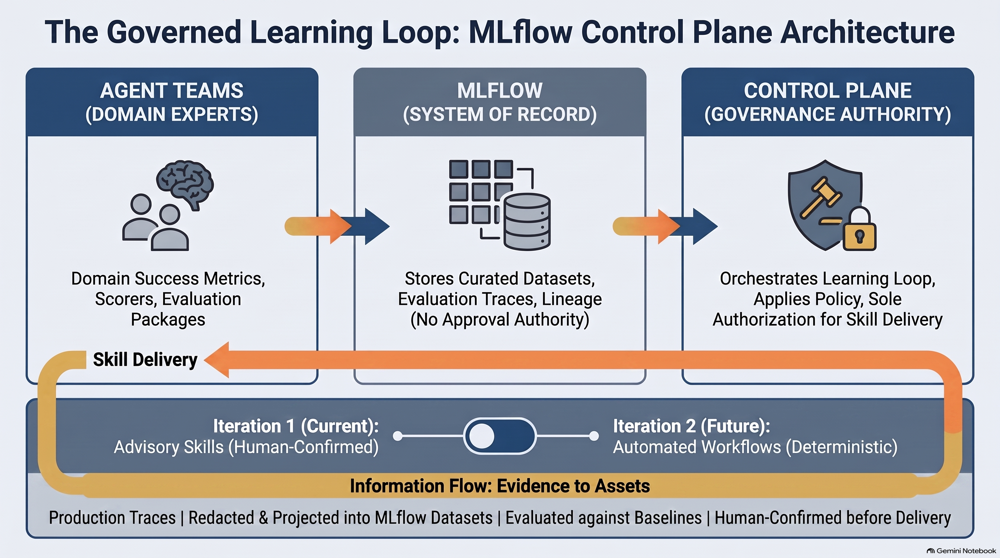

# Learning Control Plane

## Turn Production Experience Into Governed Agent Improvement

Production agents generate evidence of what works, what fails, and where users
need better outcomes. Today, much of that experience remains trapped in traces.

The Learning Control Plane turns recurring, proven procedures into **advisory
skills**: versioned guidance an agent may use without changing core code for each
learned procedure. Existing permissions, tool policy, and customer boundaries
always win.

## One Controlled Loop

Discovery is not proof. The unchanged agent and the same agent with the exact
candidate skill run against the same later cases. Missing evidence, no measured
effect, or a blocking regression stops promotion.

Passing evaluation creates a proposal, not deployment. A human confirms the
exact skill and target scope; the provider rechecks live policy before delivery.

## Three Guarantees

1. **Proven, not assumed.** Evidence used to create a skill cannot validate it.
   Missing feedback is `unknown`, never success.
2. **Bounded and reversible.** A learned skill cannot grant permissions, execute
   code, force tools, or activate itself. Governed delivery includes deactivation.
3. **Outside the live path.** Learning never blocks customer requests. If
   evidence or Control Plane services fail, agents keep their last confirmed
   configuration.

## Clear Authority

- **Agent teams** retain business success criteria, expected behavior, and
  blocking tests.
- **MLflow** stores projected evaluation data, results, scores, and lineage.
- **Learning Control Plane** verifies evidence and governs proposal,
  confirmation, delivery, and deactivation records.

The shared boundary remains narrow: portable investigation evidence and
governance are common; native replay and domain evaluation remain agent-owned.

## Product Roadmap

| Horizon | What we build |
|---|---|
| **Foundation** | Standalone trace-to-dataset evaluation, domain scorers, evidence lineage, and redaction boundaries |
| **First learning loop** | Discover advisory skills, identify and address evaluation-coverage gaps, and compare each candidate with the unchanged agent on later cases |
| **Governed delivery** | Human-confirmed activation in one bounded scope, with policy recheck, receipts, compatibility handling, and deactivation |
| **Evolution** | Consider deterministic tool workflows only after advisory skills prove reliable, with stronger replay, rollout, and rollback controls |

Initial scope is deliberately narrow: advisory skills first, measurable proof
before delivery, and no automatic activation.

Supporting design: [proposal](./README.md) | [architecture](./architecture.md) | [runtime options](./runtime-evidence-architecture-decision.md)
