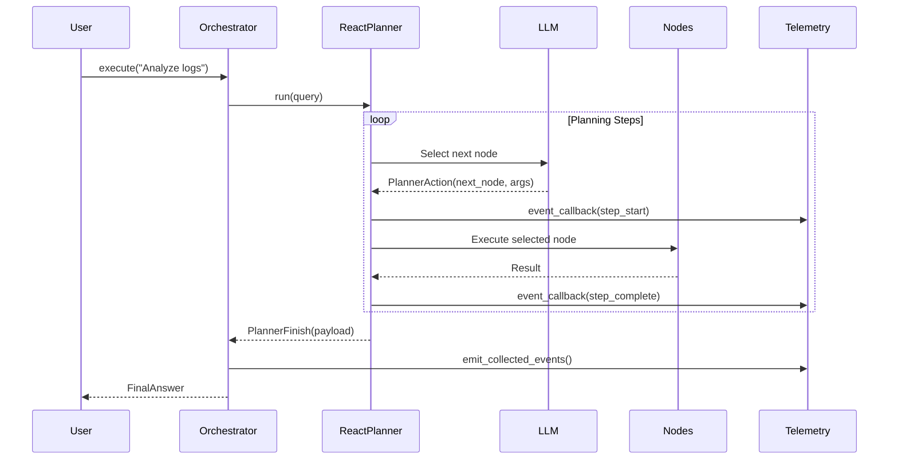

# Enterprise Agent with ReactPlanner

**Gold-standard implementation for production agent deployments using PenguiFlow's ReactPlanner.**

This example demonstrates enterprise-grade patterns for building autonomous agents:
- ✅ ReactPlanner for LLM-driven node orchestration
- ✅ Comprehensive telemetry middleware for error visibility
- ✅ Environment-based configuration
- ✅ Status update sinks for frontend integration
- ✅ Streaming support for progressive UI rendering
- ✅ Production-ready error handling
- ✅ Zero heavy dependencies (follows PenguiFlow philosophy)

## Table of Contents

- [Quick Start](#quick-start)
- [Architecture](#architecture)
- [Configuration](#configuration)
- [Running the Agent](#running-the-agent)
- [Production Deployment](#production-deployment)
- [Telemetry & Observability](#telemetry--observability)
- [Extending the Agent](#extending-the-agent)
- [Troubleshooting](#troubleshooting)

---

## Quick Start

### 1. Prerequisites

```bash
# Python 3.11+
python --version

# Install PenguiFlow with planner support
pip install -e ".[planner]"
# or with uv:
uv pip install -e ".[planner]"
```

### 2. Configure Environment

```bash
# Copy template
cp .env.example .env

# Edit .env and add your LLM API key
# REQUIRED: Set one of:
#   - OPENAI_API_KEY=sk-...
#   - ANTHROPIC_API_KEY=sk-ant-...
#   - AZURE_API_KEY=... (with AZURE_API_BASE)
```

### 3. Run Example

```bash
# Load environment and run
source .env  # or: export $(cat .env | xargs)
python -m examples.planner_enterprise_agent.main
```

Expected output:
```
===============================================================================
Query 1: Analyze the latest deployment logs and summarize findings
===============================================================================

Route: documents
Answer: Summarized 4 documents. Total size: 120000KB. Key files: README.md, CHANGELOG.md, docs/architecture.md.

Artifacts:
  sources: [4 items]
  metadata: [4 items]

Metadata:
  source_count: 4
  roadmap_complete: True

===============================================================================
Telemetry Metrics
===============================================================================
  planner_steps: 6
  planner_llm_calls: 7
  planner_cost_usd: 0.0023
  flow_node_errors: 0
  flow_node_successes: 6
```

---

## Architecture

### Component Diagram

```
┌─────────────────────────────────────────────────────────────────┐
│                   EnterpriseAgentOrchestrator                    │
│                                                                   │
│  ┌──────────────────────────────────────────────────────────┐   │
│  │                     ReactPlanner                          │   │
│  │  - Autonomous node selection                             │   │
│  │  - Adaptive re-planning on failures                      │   │
│  │  - Parallel execution support                            │   │
│  │  - Trajectory compression                                │   │
│  └──────────────────────────────────────────────────────────┘   │
│                             ↓                                     │
│  ┌──────────────────────────────────────────────────────────┐   │
│  │                   Tool Catalog                            │   │
│  │  - triage_query (router)                                 │   │
│  │  - initialize_document_workflow                          │   │
│  │  - parse_documents                                       │   │
│  │  - extract_metadata                                      │   │
│  │  - generate_document_summary                             │   │
│  │  - render_document_report                                │   │
│  │  - initialize_bug_workflow                               │   │
│  │  - collect_error_logs                                    │   │
│  │  - run_diagnostics                                       │   │
│  │  - recommend_bug_fix                                     │   │
│  │  - answer_general_query                                  │   │
│  └──────────────────────────────────────────────────────────┘   │
│                             ↓                                     │
│  ┌──────────────────────────────────────────────────────────┐   │
│  │                  AgentTelemetry                           │   │
│  │  - Planner event callback                                │   │
│  │  - Flow event middleware                                 │   │
│  │  - Cost tracking                                         │   │
│  │  - Error payload extraction                              │   │
│  │  - Metrics collection                                    │   │
│  └──────────────────────────────────────────────────────────┘   │
└─────────────────────────────────────────────────────────────────┘
```

### Request Flow



### Workflow Types

The agent automatically routes queries to three specialized workflows:

**1. Document Analysis Workflow**
```
triage_query → init_documents → parse_documents → extract_metadata
    → generate_summary → render_report
```

**2. Bug Triage Workflow**
```
triage_query → init_bug → collect_logs → run_diagnostics
    → recommend_fix
```

**3. General Query Workflow**
```
triage_query → answer_general
```

---

## Configuration

### Environment Variables

All configuration is driven by environment variables (see `.env.example`):

| Variable | Required | Default | Description |
|----------|----------|---------|-------------|
| `OPENAI_API_KEY` | ✅ | - | OpenAI API key |
| `LLM_MODEL` | ❌ | `gpt-4o-mini` | Primary LLM model |
| `LLM_TEMPERATURE` | ❌ | `0.0` | Sampling temperature |
| `LLM_MAX_RETRIES` | ❌ | `3` | Retry attempts for transient failures |
| `LLM_TIMEOUT_S` | ❌ | `60.0` | Timeout per LLM call |
| `PLANNER_MAX_ITERS` | ❌ | `12` | Max planning iterations |
| `PLANNER_TOKEN_BUDGET` | ❌ | `8000` | Token budget for compression |
| `PLANNER_DEADLINE_S` | ❌ | `None` | Wall-clock deadline |
| `PLANNER_HOP_BUDGET` | ❌ | `None` | Max tool invocations |
| `SUMMARIZER_MODEL` | ❌ | `gpt-4o-mini` | Cheaper model for summarization |
| `LOG_LEVEL` | ❌ | `INFO` | Logging verbosity |
| `ENABLE_TELEMETRY` | ❌ | `true` | Enable observability |
| `TELEMETRY_BACKEND` | ❌ | `logging` | Backend: `logging`, `mlflow`, `datadog` |
| `AGENT_ENVIRONMENT` | ❌ | `development` | Environment name |

### Configuration Object

The `AgentConfig` dataclass provides type-safe configuration:

```python
from examples.planner_enterprise_agent.config import AgentConfig

# Load from environment
config = AgentConfig.from_env()

# Or create explicitly
config = AgentConfig(
    llm_model="gpt-4o",
    llm_temperature=0.0,
    planner_max_iters=15,
    ...
)
```

---

## Running the Agent

### Basic Usage

```python
import asyncio
from examples.planner_enterprise_agent.main import EnterpriseAgentOrchestrator
from examples.planner_enterprise_agent.config import AgentConfig

async def main():
    config = AgentConfig.from_env()
    agent = EnterpriseAgentOrchestrator(config)

    result = await agent.execute(
        query="Analyze the latest deployment metrics",
        tenant_id="customer-123"
    )

    print(f"Route: {result.route}")
    print(f"Answer: {result.text}")
    print(f"Artifacts: {result.artifacts}")

asyncio.run(main())
```

### With Custom Telemetry

```python
from examples.planner_enterprise_agent.telemetry import AgentTelemetry

# Create custom telemetry (e.g., for testing)
telemetry = AgentTelemetry(config)

# Inject into orchestrator
agent = EnterpriseAgentOrchestrator(config, telemetry=telemetry)

result = await agent.execute("Query here")

# Inspect metrics
metrics = agent.get_metrics()
print(f"LLM calls: {metrics['planner_llm_calls']}")
print(f"Cost: ${metrics['planner_cost_usd']:.4f}")
```

### Command Line

```bash
# Run the example
python -m examples.planner_enterprise_agent.main

# With debug logging
LOG_LEVEL=DEBUG python -m examples.planner_enterprise_agent.main

# With different model
LLM_MODEL=gpt-4o python -m examples.planner_enterprise_agent.main
```

---

## Production Deployment

### Deployment Checklist

- [ ] **Security**
  - [ ] Store credentials in secrets manager (AWS Secrets Manager, Vault)
  - [ ] Never commit `.env` to version control
  - [ ] Rotate API keys regularly
  - [ ] Use least-privilege service accounts

- [ ] **Observability**
  - [ ] Configure structured logging
  - [ ] Set up log aggregation (ELK, Splunk, CloudWatch)
  - [ ] Enable telemetry backend (`mlflow` or `datadog`)
  - [ ] Configure alerting for error rates

- [ ] **Cost Management**
  - [ ] Set `PLANNER_TOKEN_BUDGET` to limit LLM costs
  - [ ] Use cheaper `SUMMARIZER_MODEL`
  - [ ] Monitor `PLANNER_HOP_BUDGET`
  - [ ] Track costs via telemetry metrics

- [ ] **Performance**
  - [ ] Tune `PLANNER_MAX_ITERS` for task complexity
  - [ ] Set `PLANNER_DEADLINE_S` for user-facing APIs
  - [ ] Configure `LLM_TIMEOUT_S` based on provider SLAs

- [ ] **Reliability**
  - [ ] Set `LLM_MAX_RETRIES=3`
  - [ ] Implement circuit breaker for degraded LLM service
  - [ ] Configure health checks for k8s probes

### Docker Deployment

```dockerfile
FROM python:3.11-slim

WORKDIR /app

# Install dependencies
COPY pyproject.toml .
RUN pip install -e ".[planner]"

# Copy application
COPY examples/planner_enterprise_agent ./examples/planner_enterprise_agent

# Run agent
CMD ["python", "-m", "examples.planner_enterprise_agent.main"]
```

### Kubernetes Deployment

```yaml
apiVersion: apps/v1
kind: Deployment
metadata:
  name: enterprise-agent
spec:
  replicas: 3
  template:
    spec:
      containers:
      - name: agent
        image: your-registry/enterprise-agent:latest
        env:
        - name: OPENAI_API_KEY
          valueFrom:
            secretKeyRef:
              name: llm-credentials
              key: openai-api-key
        - name: AGENT_ENVIRONMENT
          value: "production"
        - name: LOG_LEVEL
          value: "INFO"
        - name: ENABLE_TELEMETRY
          value: "true"
        - name: MLFLOW_TRACKING_URI
          value: "http://mlflow:5000"
        resources:
          requests:
            memory: "512Mi"
            cpu: "500m"
          limits:
            memory: "1Gi"
            cpu: "1000m"
        livenessProbe:
          httpGet:
            path: /health
            port: 8080
          initialDelaySeconds: 30
          periodSeconds: 10
        readinessProbe:
          httpGet:
            path: /ready
            port: 8080
          initialDelaySeconds: 5
          periodSeconds: 5
```

---

## Telemetry & Observability

### The Telemetry Pattern (From Case Study)

This implementation follows the proven pattern from successful production deployments:

**Problem**: Without telemetry, PenguiFlow errors are cryptic:
```
ERROR penguiflow.core: node_error
ERROR penguiflow.core: node_failed
```

**Solution**: Telemetry middleware extracts full error context:
```json
{
  "event_type": "node_error",
  "node": "extract_metadata",
  "trace_id": "abc123",
  "error_class": "ValidationError",
  "error_message": "Invalid document format",
  "error_traceback": "Traceback (most recent call last)...",
  "flow_error_code": "node_execution_failed"
}
```

### Middleware Integration

```python
from penguiflow import log_flow_events

# Add middleware BEFORE flow.run()
flow.add_middleware(log_flow_events(telemetry.logger))
flow.add_middleware(telemetry.record_flow_event)

flow.run(registry=registry)
```

### Planner Event Callback

```python
planner = ReactPlanner(
    ...,
    event_callback=telemetry.record_planner_event,  # CRITICAL
)
```

### Available Metrics

```python
metrics = agent.get_metrics()

# Returns:
{
    "planner_steps": 6,
    "planner_llm_calls": 7,
    "planner_cost_usd": 0.0023,
    "flow_node_errors": 0,
    "flow_node_successes": 6,
}
```

### Observability Backends

**Logging Backend (Default)**:
```bash
TELEMETRY_BACKEND=logging
```
Emits structured logs for aggregation by ELK/Splunk/CloudWatch.

**MLflow Backend**:
```bash
TELEMETRY_BACKEND=mlflow
MLFLOW_TRACKING_URI=http://localhost:5000
```
Sends metrics to MLflow tracking server.

**DataDog Backend**:
```bash
TELEMETRY_BACKEND=datadog
```
Sends events to DataDog APM.

---

## Extending the Agent

### Adding New Nodes

1. **Define Pydantic models** (in `nodes.py`):
```python
class MyInput(BaseModel):
    field: str

class MyOutput(BaseModel):
    result: str
```

2. **Create node function with `@tool` decorator**:
```python
@tool(
    desc="Short description for LLM decision-making",
    tags=["planner", "my-category"],
    side_effects="read",  # or "write", "external", "stateful"
    latency_hint="medium",  # optional: "low", "medium", "high"
)
async def my_node(args: MyInput, ctx: Any) -> MyOutput:
    """Detailed docstring for developers."""
    # Implementation here
    return MyOutput(result=f"Processed: {args.field}")
```

3. **Register in orchestrator** (`main.py`):
```python
def _build_nodes(self):
    return [
        ...,
        Node(my_node, name="my_node"),
    ]

def _build_registry(self):
    registry = ModelRegistry()
    registry.register("my_node", MyInput, MyOutput)
    return registry
```

4. **The planner will now auto-discover your node!**

### Adding Subflows

For complex multi-step operations, create subflows:

```python
def build_my_subflow() -> tuple[PenguiFlow, ModelRegistry]:
    """Create reusable subflow."""

    # Define nodes
    step1_node = Node(step1_func, name="step1")
    step2_node = Node(step2_func, name="step2")

    # Build flow
    flow = create(
        step1_node.to(step2_node),
        step2_node.to(),
    )

    # Build registry
    registry = ModelRegistry()
    registry.register("step1", Input1, Output1)
    registry.register("step2", Output1, Output2)

    return flow, registry

# Then call from a node:
async def my_node(args: Args, ctx: Any) -> Result:
    result = await ctx.call_playbook(build_my_subflow, message)
    return result
```

---

## Troubleshooting

### Common Issues

**❌ "No module named 'litellm'"**

```bash
# Install planner dependencies
pip install -e ".[planner]"
# or
uv pip install -e ".[planner]"
```

**❌ "LiteLLM returned empty content"**

- Check your API key is valid
- Verify model name (use `gpt-4o-mini` not `gpt4-mini`)
- Check rate limits on your account

**❌ "Planner returned no_path"**

The LLM couldn't find a sequence of nodes to solve the task. Check:
- Is there a node that handles this type of query?
- Are the `@tool` descriptions clear enough for the LLM?
- Try increasing `PLANNER_MAX_ITERS`

**❌ "budget_exhausted"**

Hit resource constraints. Solutions:
- Increase `PLANNER_DEADLINE_S`
- Increase `PLANNER_HOP_BUDGET`
- Increase `PLANNER_MAX_ITERS`
- Optimize slow nodes

**❌ High LLM costs**

- Set `PLANNER_TOKEN_BUDGET` to trigger compression
- Use cheaper `SUMMARIZER_MODEL`
- Reduce `PLANNER_MAX_ITERS`
- Cache intermediate results in nodes

### Debug Logging

```bash
# Enable debug logs
LOG_LEVEL=DEBUG python -m examples.planner_enterprise_agent.main

# See full LLM prompts/responses
LOG_LEVEL=DEBUG PENGUIFLOW_LOG_LEVEL=DEBUG python -m examples.planner_enterprise_agent.main
```

### Inspecting Telemetry

```python
# After execution
metrics = agent.get_metrics()
print(f"Steps: {metrics['planner_steps']}")
print(f"Errors: {metrics['flow_node_errors']}")
print(f"Cost: ${metrics['planner_cost_usd']:.4f}")

# Emit to observability backend
agent.telemetry.emit_collected_events()
```

---

## Best Practices

### 1. Node Design

✅ **DO**:
- Use clear, actionable descriptions in `@tool(desc=...)`
- Keep nodes focused on single responsibilities
- Return structured Pydantic models
- Handle errors gracefully
- Log important operations

❌ **DON'T**:
- Use vague descriptions like "Process data"
- Mix multiple concerns in one node
- Return untyped dicts
- Swallow exceptions silently

### 2. Error Handling

✅ **DO**:
```python
@tool(desc="Parse document")
async def parse_doc(args: Args, ctx: Any) -> Result:
    try:
        data = await fetch_document(args.path)
        return Result(data=data)
    except FileNotFoundError as exc:
        # Log with context
        logger.error("document_not_found", extra={"path": args.path})
        # Re-raise for planner to handle
        raise
```

❌ **DON'T**:
```python
async def parse_doc(args: Args, ctx: Any) -> Result:
    try:
        data = await fetch_document(args.path)
        return Result(data=data)
    except Exception:
        return Result(data=None)  # Silent failure!
```

### 3. Cost Optimization

- Use `gpt-4o-mini` for planning (cheaper than `gpt-4o`)
- Set `PLANNER_TOKEN_BUDGET` to enable compression
- Use even cheaper model for `SUMMARIZER_MODEL`
- Cache results in nodes when safe
- Set `PLANNER_HOP_BUDGET` to prevent runaway loops

### 4. Testing

```python
import pytest
from examples.planner_enterprise_agent.main import EnterpriseAgentOrchestrator
from examples.planner_enterprise_agent.config import AgentConfig
from examples.planner_enterprise_agent.telemetry import AgentTelemetry

@pytest.mark.asyncio
async def test_document_workflow():
    config = AgentConfig.from_env()
    telemetry = AgentTelemetry(config)
    agent = EnterpriseAgentOrchestrator(config, telemetry=telemetry)

    result = await agent.execute("Analyze README.md")

    assert result.route == "documents"
    assert "README.md" in result.artifacts.get("sources", [])

    # Check telemetry
    metrics = agent.get_metrics()
    assert metrics["flow_node_errors"] == 0
```

---

## References

- [PenguiFlow Documentation](https://github.com/penguiflow/penguiflow)
- [ReactPlanner Specification](../../plan.md)
- [Telemetry Case Study](../../docs/telemetry-patterns.md)
- [Production Deployment Guide](../../docs/production-deployment.md)

---

## License

Same as PenguiFlow main project.
