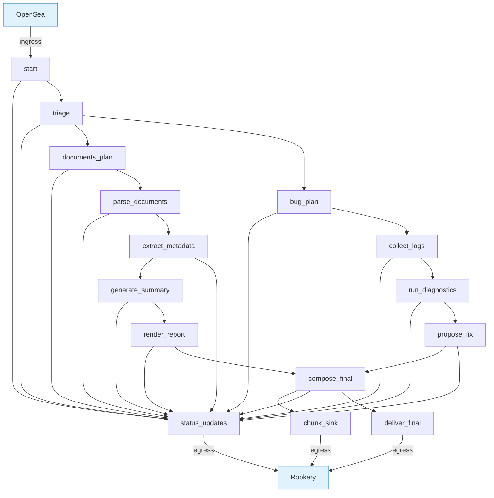

```mermaid
graph TD
    propose_fix["propose_fix"]
    compose_final["compose_final"]
    OpenSea["OpenSea"]
    start["start"]
    chunk_sink["chunk_sink"]
    Rookery["Rookery"]
    deliver_final["deliver_final"]
    triage["triage"]
    status_updates["status_updates"]
    documents_plan["documents_plan"]
    bug_plan["bug_plan"]
    parse_documents["parse_documents"]
    collect_logs["collect_logs"]
    extract_metadata["extract_metadata"]
    generate_summary["generate_summary"]
    render_report["render_report"]
    run_diagnostics["run_diagnostics"]
    classDef endpoint fill:#e0f2fe,stroke:#0369a1,stroke-width:1px
    class OpenSea endpoint
    class Rookery endpoint
    propose_fix --> compose_final
    OpenSea -->|ingress| start
    chunk_sink -->|egress| Rookery
    deliver_final -->|egress| Rookery
    triage --> status_updates
    status_updates -->|egress| Rookery
    start --> status_updates
    triage --> documents_plan
    triage --> bug_plan
    documents_plan --> status_updates
    documents_plan --> parse_documents
    bug_plan --> status_updates
    bug_plan --> collect_logs
    start --> triage
    parse_documents --> status_updates
    parse_documents --> extract_metadata
    extract_metadata --> generate_summary
    extract_metadata --> status_updates
    generate_summary --> status_updates
    generate_summary --> render_report
    render_report --> status_updates
    render_report --> compose_final
    compose_final --> chunk_sink
    compose_final --> status_updates
    compose_final --> deliver_final
    collect_logs --> status_updates
    collect_logs --> run_diagnostics
    run_diagnostics --> status_updates
    run_diagnostics --> propose_fix
    propose_fix --> status_updates
```
