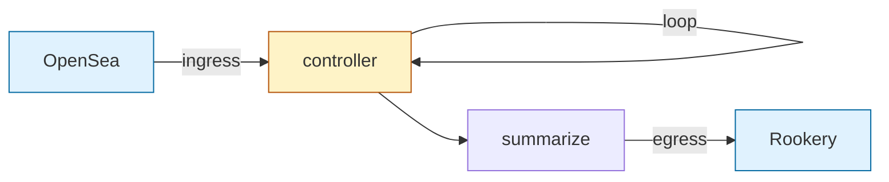

```mermaid
graph LR
    controller["controller"]
    OpenSea["OpenSea"]
    summarize["summarize"]
    Rookery["Rookery"]
    classDef controller_loop fill:#fef3c7,stroke:#b45309,stroke-width:1px
    classDef endpoint fill:#e0f2fe,stroke:#0369a1,stroke-width:1px
    class controller controller_loop
    class OpenSea endpoint
    class Rookery endpoint
    controller -->|loop| controller
    OpenSea -->|ingress| controller
    controller --> summarize
    summarize -->|egress| Rookery
```
