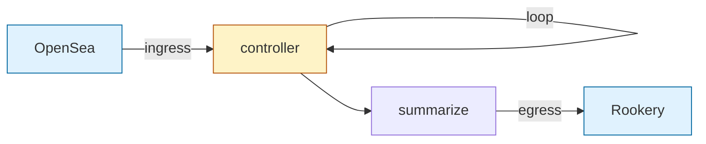
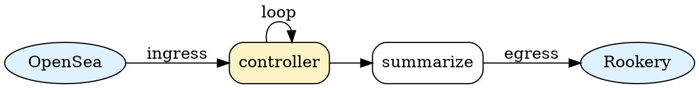

# PenguiFlow Usage Manual

## 1. Core Concepts

### 1.0 What is PenguiFlow?

PenguiFlow is a Python library for building **asynchronous data pipelines** where messages flow through a chain of processing steps (called **nodes**).

**Think of it like a factory assembly line:**
- Messages enter at **OpenSea** (the entry point)
- Each **node** processes the message (e.g., validate input, retrieve data, generate response)
- Messages flow along edges to downstream nodes
- Final results exit at **Rookery** (the collection point)

**Key use cases:**
- Multi-step LLM workflows (triage → retrieve → summarize)
- Data processing pipelines (extract → transform → load)
- Agent systems with decision points and loops

**Why PenguiFlow?**
- **Typed**: Every message is validated with Pydantic
- **Async**: Non-blocking I/O for high concurrency
- **Reliable**: Built-in retries, timeouts, and backpressure
- **Observable**: Track message flow with metrics and tracing

### 1.1 Architecture Overview

PenguiFlow manages **typed messages** flowing through a **directed graph of nodes**.

**Core components:**

1. **Message**: A Pydantic model containing:
   - `payload`: Your business data (e.g., user query, search results)
   - `headers`: Routing metadata (tenant, topic, priority)
   - `trace_id`: Unique identifier for tracking this message's journey
   - `meta`: Mutable bag for debug/cost/context info

2. **Node**: An async function that processes messages:
   - Receives: `(message, ctx)` — the incoming message and a Context object
   - Returns: Output data (automatically wrapped in a new message)
   - Behavior: Defined by NodePolicy (timeouts, retries, validation)

3. **Context (ctx)**: The runtime handle inside nodes:
   - `await ctx.emit(data)`: Send data to downstream nodes
   - `await ctx.emit_chunk(...)`: Stream partial results (e.g., LLM tokens)
   - `ctx.emit_nowait(data)`: Non-blocking emit (use sparingly)

4. **OpenSea**: The entry point where you inject messages (`flow.emit()`)

5. **Rookery**: The exit point where final results are collected (`flow.fetch()`)

**Flow guarantees:**
- **Backpressure**: Bounded queues (default 32 messages/edge) prevent memory overflow
- **Ordering**: Messages from the same source arrive in order at each node
- **Isolation**: Each message is processed independently (no shared state)

### 1.1.1 Message Envelope vs Payload

**Every message has two parts:**

1. **Envelope** (`Message` object):
   - `headers`: Routing metadata (tenant, topic, priority)
   - `trace_id`: Unique ID for this run
   - `meta`: Mutable dict for cost tracking, debug info
   - `deadline_s`: Optional wall-clock timeout

2. **Payload**: Your business data (can be any type):
   - Pydantic model (recommended): `QueryIn(text="...")`
   - Dict: `{"data": "value"}`
   - String: `"raw text"`
   - List: `[1, 2, 3]`

**Node signature:**

Your nodes receive the **payload**, not the full Message:

```python
async def my_node(msg: QueryIn, ctx):  # ✅ msg is the payload (QueryIn)
    # NOT: msg.payload.text
    # Just: msg.text
    return result
```

**When you return from a node:**
- PenguiFlow automatically wraps your result in a new `Message`
- The new message inherits `headers`, `trace_id`, and `meta` from the input
- If you need to modify the envelope, use `ctx.emit()` with a full `Message` object

**Example:**

```python
async def enrich(msg: QueryIn, ctx):
    # Auto-wrapped: return enriched payload
    return EnrichedOut(text=msg.text, sentiment="positive")

    # Manual control: return full Message
    new_msg = Message(
        payload=EnrichedOut(...),
        headers=msg.headers,  # Preserve routing info
        trace_id=msg.trace_id,  # Keep trace
        meta={**msg.meta, "cost": 0.05}  # Add cost tracking
    )
    await ctx.emit(new_msg)
```

### 1.2 Complete Example: Building Your First Flow

This example builds a simple 3-node pipeline: **triage → retrieve → pack**.

```python
import asyncio
from pydantic import BaseModel
from penguiflow import create, Node, NodePolicy, ModelRegistry, Message, Headers

# 1. Define your data models
class QueryIn(BaseModel):
    text: str

class TriageOut(BaseModel):
    text: str
    topic: str

class RetrieveOut(BaseModel):
    topic: str
    docs: list[str]

class PackOut(BaseModel):
    prompt: str

# 2. Define node functions
async def triage(msg: QueryIn, ctx) -> TriageOut:
    """Classify the query into a topic."""
    topic = "metrics" if "metric" in msg.text else "general"
    return TriageOut(text=msg.text, topic=topic)

async def retrieve(msg: TriageOut, ctx) -> RetrieveOut:
    """Fetch relevant documents for the topic."""
    docs = [f"doc_{i}_{msg.topic}" for i in range(2)]
    return RetrieveOut(topic=msg.topic, docs=docs)

async def pack(msg: RetrieveOut, ctx) -> PackOut:
    """Package documents into a prompt."""
    prompt = f"[{msg.topic}] summarize {len(msg.docs)} docs"
    return PackOut(prompt=prompt)

# 3. Wrap functions in Node objects
triage_node = Node(triage, name="triage", policy=NodePolicy(validate="both"))
retrieve_node = Node(retrieve, name="retrieve", policy=NodePolicy(validate="both"))
pack_node = Node(pack, name="pack", policy=NodePolicy(validate="both"))

# 4. Register input/output types for validation
registry = ModelRegistry()
registry.register("triage", QueryIn, TriageOut)
registry.register("retrieve", TriageOut, RetrieveOut)
registry.register("pack", RetrieveOut, PackOut)

# 5. Build the flow graph
flow = create(
    triage_node.to(retrieve_node),  # triage → retrieve
    retrieve_node.to(pack_node),    # retrieve → pack
)

# 6. Start the flow (non-blocking)
flow.run(registry=registry)

# 7. Emit a message to OpenSea
message = Message(
    payload=QueryIn(text="show marketing metrics"),
    headers=Headers(tenant="acme"),
)
await flow.emit(message)

# 8. Fetch the result from Rookery
result = await flow.fetch()  # Returns: Message(payload=PackOut(...))
print(result.payload.prompt)  # "[metrics] summarize 2 docs"

# 9. Stop the flow
await flow.stop()
```

**Key steps explained:**

| Step | What it does |
|------|-------------|
| 1-2  | Define your business logic as Pydantic models + async functions |
| 3    | Wrap functions in `Node` objects (adds retry/timeout/validation) |
| 4    | Register input/output types so PenguiFlow can validate messages |
| 5    | Connect nodes into a graph using `.to()` |
| 6    | Start all background workers (doesn't process anything yet) |
| 7    | Inject your first message into OpenSea |
| 8    | Wait for the final result to arrive at Rookery |
| 9    | Gracefully stop all workers |

**Common questions:**

- **Q: Do I always need a ModelRegistry?**
  A: No, but recommended. Without it, PenguiFlow skips type validation and uses Python's native types.

- **Q: What if I don't call `flow.fetch()`?**
  A: Results still flow to Rookery, but you won't retrieve them. Useful for fire-and-forget flows.

- **Q: Can nodes return `None`?**
  A: Yes! Returning `None` means "don't emit anything downstream" (useful for filters).

### 1.3 Flow Topology Visualization

The example above creates this graph:

```
OpenSea
   │
   ├─► [triage] ──► [retrieve] ──► [pack] ──► Rookery
```

**Key concepts:**
- **OpenSea**: Entry point (`flow.emit()`)
- **Square brackets**: Processing nodes
- **Arrows**: Message flow (via bounded queues)
- **Rookery**: Exit point (`flow.fetch()`)

For complex graphs (fan-out, loops, subflows), see Section 6 (Patterns).

---

## 2. Node Configuration

### 2.1 NodePolicy Options

```python
policy = NodePolicy(
    validate="both",        # "both"|"in"|"out"|"none"
    timeout_s=30.0,        # Per-invocation timeout
    max_retries=2,         # Number of retries (0 = no retries)
    backoff_base=0.5,      # Initial backoff delay
    backoff_mult=2.0,      # Exponential multiplier
    max_backoff=10.0       # Cap on backoff delay
)
```

### 2.2 Node Signature Requirements

Nodes MUST:
- Be declared with `async def`
- Accept exactly 2 positional parameters: `(message, ctx)`
- Return a value (or `None` to skip emission)

```python
# ✅ Payload-to-payload (most common)
async def process(data: InputModel, ctx) -> OutputModel:
    result = await transform(data)
    return result

# ✅ Message-aware
async def enrich(message: Message, ctx) -> Message:
    return message.model_copy(update={"payload": enriched_data})

# ✅ Terminal node (no downstream)
async def logger(data: LogEntry, ctx) -> None:
    await save_to_db(data)
    return None

# ✅ Explicit routing + return
async def router(data: Request, ctx) -> ProcessedRequest:
    if data.urgent:
        await ctx.emit(data, to=urgent_node)
    return ProcessedRequest(data)

# ❌ Wrong - not async
def process(data: InputModel, ctx):
    return transform(data)

# ❌ Wrong - missing ctx parameter
async def process(data: InputModel):
    return transform(data)
```

**Parameter naming:** You can name parameters anything, but `message`/`msg` and `ctx`/`context` are conventional.

### 2.3 Return Value Behavior

Nodes control downstream message flow through their return value:

**Return a value:** Creates a new message with this value as the payload and emits to all successors.

```python
async def process(data: InputModel, ctx) -> OutputModel:
    result = transform(data)
    return result  # Emits OutputModel to all downstream nodes
```

**Return None:** Consumes the message without emitting anything downstream.

```python
async def logger(data: LogEntry, ctx) -> None:
    await log_to_db(data)
    return None  # Terminal node, no downstream emission
```

**Explicit emit + return:** Both actions occur. Use `ctx.emit()` for selective routing, return for default routing.

```python
async def router(data: Request, ctx) -> ProcessedRequest:
    if data.priority == "high":
        await ctx.emit(data, to=urgent_handler)  # Explicit route
    return ProcessedRequest(data)  # Default route to all successors
```

**Key principle:** The return value determines what downstream nodes receive. Return types must match the input types of successor nodes (enforced by the registry).

### 2.4 Simple Pattern: Payload-to-Payload Nodes

**Most common pattern:** Declare your node with payload types as input/output. PenguiFlow automatically wraps/unwraps the Message envelope.

```python
from pydantic import BaseModel
from penguiflow import ModelRegistry, Node, NodePolicy

class InputData(BaseModel):
    text: str

class OutputData(BaseModel):
    text: str
    processed: bool

# Node works with payloads directly
async def process(data: InputData, ctx) -> OutputData:
    return OutputData(text=data.text.upper(), processed=True)

# Registry tells PenguiFlow the types
registry = ModelRegistry()
registry.register("process", InputData, OutputData)

node = Node(process, name="process", policy=NodePolicy(validate="both"))
```

**How it works:**
1. PenguiFlow receives a `Message` with `payload=InputData(...)`
2. Registry extracts the payload and passes `InputData` to your node
3. Your node returns `OutputData`
4. PenguiFlow wraps it back into a Message, preserving trace_id, headers, and meta
5. Downstream nodes receive the enriched Message

**When to use:** 99% of nodes should use this pattern. It's simple, type-safe, and handles metadata automatically.

**See also:**
- Section 5 for complete registry and validation details
- Section 10.6 for validation error handling

### 2.5 Advanced Pattern: Message-Aware Nodes

**Use only when you need direct control over Message fields (headers, meta, trace_id).**

When a node's signature is `Message -> Message` and registered accordingly, PenguiFlow passes the full envelope:

```python
from penguiflow import Message, ModelRegistry

# Message-aware node
async def enrich_metadata(message: Message, ctx) -> Message:
    # Access Message fields directly
    print(f"Trace: {message.trace_id}, Tenant: {message.headers.tenant}")

    # Modify payload
    enriched = await add_context(message.payload)

    # Use model_copy to update immutably
    return message.model_copy(update={"payload": enriched})

# Register as Message -> Message
registry = ModelRegistry()
registry.register("enrich", Message, Message)
```

**Updating meta safely:**
```python
async def add_cost_tracking(message: Message, ctx) -> Message:
    # Clone meta dict to avoid mutation
    new_meta = {**message.meta, "cost_usd": 0.003, "model": "gpt-4"}
    return message.model_copy(update={"meta": new_meta})
```

**Creating a new Message (rare):**
```python
async def transform_completely(message: Message, ctx) -> Message:
    new_payload = rebuild(message.payload)
    return Message(
        payload=new_payload,
        headers=message.headers,      # Preserve routing context
        trace_id=message.trace_id,    # Preserve trace for debugging
        meta={**message.meta, "transformed": True}
    )
```

**When to use:**
- Multi-tenant routing logic (inspecting headers)
- Cost tracking (updating meta)
- Debugging (accessing trace_id)
- Subflows (preserving context across boundaries)

**When NOT to use:** Regular data transformations. Use the payload-to-payload pattern (section 2.4) instead.

**Important:** Avoid mutating `message.meta` in place (e.g., `message.meta["key"] = value`). Use `model_copy` or dict cloning to ensure retries and parallel paths see consistent state.

#### Guardrails for Message-Aware Nodes

* **Runtime warning:** If a node is registered as `Message -> Message` (via `ModelRegistry`) but returns a bare payload, PenguiFlow now emits a `RuntimeWarning`. The warning names the offending node and reminds you to return a full `penguiflow.types.Message` so headers, trace IDs, and metadata are preserved.
* **Testkit helper:** `penguiflow.testkit.assert_preserves_message_envelope(...)` executes a node with a sample `Message` and asserts that the returned value is also a `Message` with the same `headers` and `trace_id`. Use it in unit tests to prevent regressions when refactoring Message-aware nodes.
* **Flow diagnostics helper:** `penguiflow.testkit.get_recorded_events(trace_id)` surfaces the immutable `FlowEvent` history collected during `run_one(...)`. Use it to assert retry sequences, inspect `node_failed` payloads, or verify observability middleware output without reaching into private caches.
* **Documentation cross-link:** This section and the LLM prompt (`llm.txt`) both call out the guardrails so runtime behaviour and guidance stay in sync.

### 2.6 Validation Modes Explained

The `validate` parameter in `NodePolicy` controls when Pydantic validation occurs:

| Mode | Input Validation | Output Validation | Use Case |
|------|------------------|-------------------|----------|
| `"both"` | Yes | Yes | **Default.** Production pipelines where type safety matters. |
| `"in"` | Yes | No | You trust your node's output type. Slight performance gain. |
| `"out"` | No | Yes | Input is pre-validated upstream (rare). |
| `"none"` | No | No | Performance-critical paths or custom validation. Use with caution. |

**Example:**
```python
# Recommended for most nodes
safe_policy = NodePolicy(validate="both")

# For high-throughput token streaming
fast_policy = NodePolicy(validate="in")  # Skip validating StreamChunks on output

# For terminal nodes that just log
terminal_policy = NodePolicy(validate="in")  # No downstream consumers
```

**Performance note:** Validation overhead is typically <1ms per message. Only use `"in"` or `"none"` if profiling shows validation as a bottleneck (e.g., streaming thousands of chunks per second).

---

## 3. Context API

Every node function receives two parameters: the incoming `message` and a `Context` object (`ctx`). The Context provides methods for routing messages to other nodes, emitting streaming chunks, and (rarely) fetching from incoming queues.

**Key Concepts:**
- **Automatic emission**: Returning a value from your node automatically emits it to all successors
- **Manual emission**: Use `ctx.emit()` when you need fine-grained control (emit to specific nodes, emit multiple times, etc.)
- **Choose return OR emit**: Most nodes should simply return their result. Use `ctx.emit()` only when you need its advanced features

**See also:**
- Section 11 for emission event tracking and observability
- Section 12 for testing flows with custom emission patterns

### 3.1 Return vs Emit

The simplest pattern is to return your result:

```python
async def my_node(message: Message, ctx):
    result = await process(message.payload)
    return result  # Automatically emits to all successors
```

Use `ctx.emit()` when you need control:

```python
async def router_node(message: Message, ctx):
    if message.payload["priority"] == "high":
        await ctx.emit(message, to=urgent_handler)
    else:
        await ctx.emit(message, to=normal_handler)
    return None  # Returning None skips automatic emission
```

### 3.2 Emitting Messages

**Basic Usage:**

```python
async def my_node(message: Message, ctx):
    result = await process(message.payload)
    # Emit to all successor nodes defined in flow graph
    await ctx.emit(result)
    return None  # Return None to prevent duplicate emission
```

**Targeted Routing:**

When you need to route to specific nodes (e.g., in a router pattern):

```python
async def priority_router(message: Message, ctx):
    priority = message.payload.get("priority", "normal")

    if priority == "urgent":
        await ctx.emit(message, to=urgent_handler)
    elif priority == "high":
        await ctx.emit(message, to=high_priority_handler)
    else:
        await ctx.emit(message, to=normal_handler)

    # No return needed - we've already emitted
```

**Multiple Destinations:**

```python
async def fanout_node(message: Message, ctx):
    # Send to multiple specific nodes
    await ctx.emit(message, to=[node_a, node_b, node_c])
```

**Non-blocking Emit (Advanced):**

```python
async def non_blocking_node(message: Message, ctx):
    # Skips queue backpressure - can cause memory issues if downstream is slow
    # Only use when you're certain queues won't fill up
    ctx.emit_nowait(message)
```

⚠️ **Warning**: `emit_nowait()` bypasses backpressure. If downstream nodes can't keep up, this can cause unbounded memory growth. Use only when you're certain the queue has space.

### 3.3 Streaming Chunks

Use streaming when you need to emit partial results progressively, such as:
- **LLM token streaming**: Send tokens as they're generated instead of waiting for completion
- **Progress updates**: Report long-running operation status
- **Incremental processing**: Emit results as soon as chunks are ready

**How it works:**
- Each chunk is wrapped in a `StreamChunk` message with sequence numbers
- Chunks share the same `stream_id` (defaults to parent's `trace_id`)
- Downstream nodes receive `StreamChunk` objects, not regular `Message` objects
- The final chunk MUST have `done=True` to signal completion

**Basic Example:**

```python
async def streaming_node(message: Message, ctx):
    # Emit multiple chunks
    for chunk_text in generate_text():
        await ctx.emit_chunk(
            parent=message,
            text=chunk_text,
            stream_id=message.trace_id,  # Auto-uses trace_id if omitted
            done=False
        )

    # Final chunk
    await ctx.emit_chunk(
        parent=message,
        text="",
        done=True
    )
```

**Important Notes:**
- Always send a final chunk with `done=True` - this signals downstream nodes that streaming is complete
- `stream_id` defaults to `message.trace_id` if omitted
- Downstream nodes must handle `StreamChunk` type (register `StreamChunk -> YourOutput` in registry)
- The `parent` parameter ensures chunks inherit the correct headers, meta, and trace_id

**Example downstream handler:**

```python
async def consume_stream(chunk: StreamChunk, ctx):
    if chunk.done:
        return {"final_text": chunk.meta.get("accumulated_text", "")}
    else:
        # Process incremental chunk
        print(f"Received: {chunk.text}")
        return None  # Don't emit until done
```

See `examples/streaming_llm/` for a complete working example.

### 3.4 Fetching from Incoming Queues (Advanced)

⚠️ **Most users won't need this.** Nodes automatically receive messages when predecessors emit. Use `ctx.fetch()` only for advanced patterns like custom join/aggregation logic or manual queue management.

**When to use:**
- Custom aggregation: Collect multiple messages before processing
- Manual synchronization: Wait for specific predecessor nodes
- Racing inputs: Process whichever predecessor responds first

```python
async def custom_join_node(message: Message, ctx):
    # Wait for messages from ALL predecessors
    msg_a = await ctx.fetch(from_=node_a)
    msg_b = await ctx.fetch(from_=node_b)

    combined = merge(msg_a, msg_b)
    return combined

async def race_node(message: Message, ctx):
    # Process whichever node responds first
    first_result = await ctx.fetch_any(from_=[node_a, node_b, node_c])
    return first_result
```

**Typical nodes don't need fetch** - they automatically receive the `message` parameter when called.

💡 **Tip**: For standard aggregation, use the built-in `join_k` pattern (see Section 6.4) instead of manual fetching.

### 3.5 Related Patterns

- **Routing patterns**: See Section 6.2-6.3 for `predicate_router` and `union_router`
- **Aggregation**: See Section 6.4 for `join_k` pattern (avoids manual fetch)
- **Streaming examples**: See `examples/streaming_llm/` for end-to-end LLM streaming
- **Controller loops**: Section 4.2 shows how streaming works with WM/FinalAnswer patterns
- **Event tracking**: See Section 11 for observability of emit/fetch operations
- **Testing**: See Section 12 for testing flows with custom emission patterns

---

## 4. Message Types

PenguiFlow uses three message types for different scenarios:

- **Message**: Standard message for all flows. Contains your data (payload), routing metadata (headers), and trace information
- **WM (Working Memory)**: Specialized payload for controller loops that need to iterate until a condition is met
- **FinalAnswer**: Terminal payload that ends a controller loop

Most flows only use `Message`. Use `WM` and `FinalAnswer` only when implementing self-looping "controller" nodes (see Section 13.2).

### 4.1 Standard Message

**Minimal Example:**
```python
from penguiflow.types import Message

# Simplest form - just your data
msg = Message(payload={"key": "value"})
# trace_id is auto-generated for tracking this message through the flow
```

**With Routing:**
```python
from penguiflow.types import Message, Headers

# Add tenant/topic for routing decisions
msg = Message(
    payload={"key": "value"},
    headers=Headers(tenant="org1", topic="sales")
)
```

**Complete Example with All Options:**
```python
import time

msg = Message(
    payload={"key": "value"},          # Your data (dict or Pydantic model)
    headers=Headers(tenant="org1"),     # Routing/filtering metadata
    trace_id="trace-123",               # Custom ID (optional, auto-generated otherwise)
    deadline_s=time.time() + 60,        # Unix timestamp - message expires in 60 seconds
    meta={"user_id": "12345"}           # Side-channel data (arbitrary key-value pairs)
)
```

**Field Reference:**
- **`payload`**: Your actual data. Can be a dict, Pydantic model, or any serializable type
- **`headers`**: Routing metadata. Used by routers and for filtering (see Section 6.2)
- **`trace_id`**: Unique identifier that follows this message through the entire flow. Auto-generated if omitted
- **`deadline_s`**: Optional Unix timestamp (from `time.time()`). Flow stops processing this message after deadline


### 4.2 Controller Loop Messages

**When to Use:** Only needed when building "controller loops" - nodes that call themselves repeatedly until reaching a goal (e.g., agentic reasoning, iterative refinement). Most flows don't need this.

Controller loops require two special payload types:

**WM (Working Memory) - Triggers Loop Iteration:**
```python
from penguiflow.types import WM

wm = WM(
    query="What is the revenue?",        # Your question/task
    facts=["fact1", "fact2"],            # Accumulated information (optional)
    budget_hops=8,                       # Maximum iterations before auto-stop
    budget_tokens=1000,                  # Maximum token usage before auto-stop (optional)
)

# The 'hops' field is automatically managed by the runtime:
# - Starts at 0
# - Incremented each time the controller node runs
# - When hops >= budget_hops, loop terminates with FinalAnswer
```

**FinalAnswer - Ends the Loop:**
```python
from penguiflow.types import FinalAnswer

final = FinalAnswer(
    text="The revenue is $1M",
    citations=["source1", "source2"]     # Optional evidence/sources
)
```

**How Controller Loops Work:**

1. Node receives `Message(payload=WM(...))`
2. Node processes and decides:
   - **Need more iterations?** Return new `WM` with updated facts → runtime increments `hops` and sends back to same node
   - **Done?** Return `FinalAnswer` → runtime emits to successors and stops loop

3. **Automatic Termination** (prevents infinite loops):
   - `budget_hops` exceeded → `FinalAnswer("Hop budget exhausted")`
   - `budget_tokens` exceeded → `FinalAnswer("Token budget exhausted")`
   - `deadline_s` expired → `FinalAnswer("Deadline exceeded")`

**Example Controller Node:**
```python
async def controller(message: Message, ctx):
    wm = message.payload  # WM object

    if wm.hops >= 5 or is_answer_good_enough(wm.facts):
        return FinalAnswer(text=f"Answer: {synthesize(wm.facts)}")

    # Need more information
    new_fact = await query_llm(wm.query, wm.facts)
    return WM(
        query=wm.query,
        facts=wm.facts + [new_fact],
        budget_hops=wm.budget_hops,
        # hops will be auto-incremented to wm.hops + 1
    )

# Node must allow self-cycles
controller_node = Node(controller, name="controller", allow_cycle=True)
```

**See Also:**
- Section 13.2 for cycle detection configuration
- Examples in `examples/controller_multihop/`
- Section 9 for full budget and deadline enforcement details
- Section 10.8 for critical distinction: budget exhaustion produces FinalAnswer, not FlowError
- Section 11.2 for event tracking in controller loops
- Section 12.3 for testing controller flows with simulate_error

---

## 5. Type Safety with ModelRegistry

The **ModelRegistry** provides runtime type validation for your flows by checking:
- **Input**: Message payloads before they reach your node functions
- **Output**: Node return values before they're sent downstream

This catches type mismatches early with detailed Pydantic validation errors instead of silent failures.

### 5.1 When to Use Validation

**Use ModelRegistry when:**
- You want type safety guarantees across async boundaries
- You need to validate external or untrusted inputs
- You want field-level error messages for debugging

**Skip validation when:**
- Performance is critical (hot token-processing paths)
- Types are guaranteed by construction (internal nodes)
- Prototyping simple examples

### 5.2 Basic Example

```python
from penguiflow import ModelRegistry, Node, NodePolicy, create, Message, Headers
from pydantic import BaseModel

# 1. Define your models
class QueryInput(BaseModel):
    query: str
    filters: dict

class SearchOutput(BaseModel):
    results: list[str]
    count: int

# 2. Define typed node function
async def search(msg: QueryInput, ctx) -> SearchOutput:
    # Your logic here - msg is already validated QueryInput
    results = [f"result_{i}" for i in range(3)]
    return SearchOutput(results=results, count=len(results))

# 3. Create registry and register node types
registry = ModelRegistry()
registry.register("search", QueryInput, SearchOutput)

# 4. Create node with validation policy
search_node = Node(
    search,
    name="search",
    policy=NodePolicy(validate="both")  # Validate input AND output
)

# 5. Build and run flow
flow = create(
    # your edges here
)
flow.run(registry=registry)  # Pass registry to runtime

# 6. Emit typed message
msg = Message(payload=QueryInput(query="penguins", filters={}))
await flow.emit(msg)
result = await flow.fetch()  # result is validated SearchOutput

print(f"Found {result.count} results")  # Type-safe access
```

### 5.3 Validation Modes

Control validation behavior with `NodePolicy.validate`:

| Mode | Behavior | Use Case |
|------|----------|----------|
| `"both"` | Validate input AND output | Maximum safety (default) |
| `"in"` | Only validate incoming messages | Trust your node logic |
| `"out"` | Only validate return values | Input pre-validated upstream |
| `"none"` | Skip validation entirely | Performance-critical paths |

### 5.4 How Validation Works

1. **Registration**: Define input/output models per node
   ```python
   registry = ModelRegistry()
   registry.register("my_node", InputModel, OutputModel)
   ```

2. **Runtime**: Pass registry to flow
   ```python
   flow.run(registry=registry)
   ```

3. **Execution**: Automatic validation at configured points
   - **Before** node execution: `message.payload` → `InputModel`
   - **After** node execution: `return_value` → `OutputModel`

4. **On Failure**: Raises `pydantic.ValidationError` with field details

### 5.5 Handling Validation Errors

```python
from pydantic import ValidationError

# What happens on validation failure:
try:
    await flow.emit(Message(payload={"invalid": "data"}))
    result = await flow.fetch()
except ValidationError as e:
    # Pydantic ValidationError with field-level details
    print(e.errors())  # [{'loc': ('query',), 'msg': 'field required', ...}]
```

### 5.6 Performance Notes

- Validation uses cached Pydantic `TypeAdapter`s (fast)
- For high-throughput nodes, use `validate="in"` or `"none"`
- Validation overhead: ~microseconds per message for typical models

---

## 6. Patterns

Patterns are pre-built node factories and utilities that solve common orchestration challenges. PenguiFlow provides three categories:

1. **Utility Patterns**: Helpers for concurrent processing within nodes
2. **Routing Patterns**: Conditional message routing to different branches
3. **Aggregation Patterns**: Coordinating multiple messages (fan-in)

All patterns are designed to work seamlessly with the core flow primitives from Section 1.

### Choosing the Right Pattern

| Pattern | Use When | Example |
|---------|----------|---------|
| `map_concurrent` | Processing items in a list in parallel | Score multiple documents, call multiple APIs |
| `predicate_router` | Route based on content/fields with custom logic | Priority routing, multi-field conditions |
| `union_router` | Route based on message type (type safety) | Different task types (SearchWeb vs SearchDB) |
| `join_k` | Aggregate results from fan-out | Collect all worker results before proceeding |
| `policy` (with routers) | Need runtime-configurable routing | Multi-tenant routing, A/B tests, feature flags |

**See also:**
- Section 12.3 for testing recipes for routers and branching flows
- Section 11 for observability of pattern execution

### 6.1 map_concurrent - Parallel Processing Inside Nodes

Process collections concurrently with bounded parallelism. This is a **utility function** (not a Node) used inside your node implementations.

**When to use:**
- You have a list/collection that needs the same async operation applied to each item
- Operations are independent and can run in parallel
- You want to limit concurrent executions to avoid overwhelming resources

```python
from penguiflow.patterns import map_concurrent

async def score_documents(message, ctx):
    doc_ids = message.payload["documents"]

    async def score_one_doc(doc_id):
        # Simulate expensive scoring operation
        await asyncio.sleep(0.1)
        return {"id": doc_id, "score": random.random()}

    # Process up to 4 documents concurrently
    results = await map_concurrent(
        doc_ids,
        score_one_doc,
        max_concurrency=4  # Limits parallel executions
    )

    # Return updated message with results
    return message.model_copy(update={"payload": {"scores": results}})
```

**Key points:**
- `max_concurrency` controls how many items process simultaneously
- Results maintain input order (doc_ids[0] → results[0])
- Uses semaphore internally for safe backpressure
- See `/examples/map_concurrent/` for complete example

### 6.2 predicate_router - Conditional Routing

Route messages to different nodes based on custom logic. The predicate function inspects the message and returns which node(s) should receive it.

**When to use:**
- Routing depends on message content (not just type)
- Logic is simple enough to express as a function
- You need dynamic routing that can return multiple targets

```python
from penguiflow.patterns import predicate_router

def priority_logic(message):
    """Examine message and return target node(s)."""
    priority = message.payload.get("priority")

    if priority == "urgent":
        return [high_priority_node, audit_node]  # Send to both
    elif priority == "normal":
        return [standard_node]  # Send to one
    else:
        return None  # Drop message (skip routing)

router = predicate_router("priority_router", priority_logic)

flow = create(
    ingress_node.to(router),
    router.to(high_priority_node, standard_node, audit_node),
    # ...
)
```

**Return value options:**
- `[node1, node2]` - Route to multiple nodes (fan-out)
- `[node1]` or `node1` - Route to single node
- `["node_name"]` - Route by node name (string)
- `None` - Skip routing (message is dropped)

**Advanced: Config-Driven Routing**
```python
# Optionally combine with routing policy for runtime config
from penguiflow import DictRoutingPolicy

policy = DictRoutingPolicy.from_json_file("routing.json", ...)
router = predicate_router("router", logic_fn, policy=policy)
# Policy can override predicate's proposed targets dynamically
# See Section 6.5 and /examples/routing_policy/
```

### 6.3 union_router - Type-Based Routing (Discriminated Unions)

Route messages based on their Pydantic type using a discriminator field. This is type-safe routing where the discriminator value automatically maps to node names.

**When to use:**
- You have different message types that need different handlers
- Want compile-time type safety (Pydantic validates types)
- Prefer declarative routing over imperative predicate logic

```python
from penguiflow.patterns import union_router
from pydantic import BaseModel, Field
from typing import Literal, Annotated

# Define message types with discriminator
class WebSearch(BaseModel):
    kind: Literal["web"]  # Discriminator value
    query: str

class DatabaseSearch(BaseModel):
    kind: Literal["database"]  # Different discriminator
    table: str

# Union type with discriminator field
SearchTask = Annotated[
    WebSearch | DatabaseSearch,
    Field(discriminator="kind")
]

# Create router - automatically routes based on 'kind' field
router = union_router("search_router", SearchTask)

# IMPORTANT: Node names MUST match discriminator values
web_handler = Node(handle_web, name="web")        # matches kind="web"
db_handler = Node(handle_db, name="database")    # matches kind="database"

flow = create(
    router.to(web_handler, db_handler),
    web_handler.to(...),
    db_handler.to(...),
)
```

**How it works:**
1. Router validates message against `SearchTask` union
2. Extracts discriminator value from `kind` field
3. Routes to node with matching name ("web" → web_handler)
4. Raises `KeyError` if no node matches discriminator value

**Discriminator field:**
- Default: Uses `kind` attribute if present, otherwise class name
- Can be any literal field that distinguishes union variants
- See `/examples/routing_union/` for complete example

### 6.4 join_k - Fan-In Aggregation

Collect exactly `k` messages with the same `trace_id` and emit them as a batch. This is the counterpart to fan-out routing.

**When to use:**
- You fan out work to multiple parallel nodes
- Need to wait for all results before proceeding
- Want to aggregate results by trace (not globally)

```python
from penguiflow.patterns import join_k

# Wait for exactly 3 messages per trace_id, then emit batch
aggregator = join_k("collect_results", k=3)

flow = create(
    # Fan out to 3 workers
    splitter.to(worker_a, worker_b, worker_c),

    # All workers feed into aggregator
    worker_a.to(aggregator),
    worker_b.to(aggregator),
    worker_c.to(aggregator),

    # Aggregator emits batch when k=3 received
    aggregator.to(final_processor)
)
```

**How it works:**
1. Maintains separate buffer for each `trace_id`
2. Collects messages until count reaches `k`
3. Emits aggregated batch, then clears that trace's buffer
4. Next message with same trace_id starts new buffer

**Output format:**
- If inputs are `Message` objects: Returns `Message` with `payload=[msg1.payload, msg2.payload, ...]`
- Otherwise: Returns list `[msg1, msg2, msg3, ...]`

**Important notes:**
- **Requires trace_id**: Messages without `trace_id` will raise `ValueError`
- **Exactly k messages**: If fewer than k arrive, messages remain buffered (potential memory leak)
- **Order not guaranteed**: Buffer collects first k messages regardless of arrival order
- Consider adding timeout logic in upstream nodes for incomplete traces
- See `/examples/fanout_join/` for complete example

### 6.5 Routing Policies - Config-Driven Decisions

Override router behavior at runtime using pluggable policies. Both `predicate_router` and `union_router` support optional policies for dynamic control.

**When to use:**
- Want to change routing without code changes
- Multi-tenant systems with per-tenant routing rules
- A/B testing different routing strategies
- Runtime configuration from JSON/YAML/database

```python
from penguiflow import predicate_router, DictRoutingPolicy, RoutingRequest

# Define key extractor (how to look up policy)
def tenant_key(request: RoutingRequest) -> str:
    return request.message.headers.tenant

# Load policy from JSON config
policy = DictRoutingPolicy.from_json_file(
    "routing_config.json",
    default="standard_handler",     # Fallback target
    key_getter=tenant_key            # How to extract routing key
)

# Predicate proposes targets, policy makes final decision
router = predicate_router(
    "tenant_router",
    lambda msg: ["premium_handler", "standard_handler"],  # Proposes both
    policy=policy  # Policy selects one based on tenant
)
```

**Policy JSON example:**
```json
{
    "tenant_a": "premium_handler",
    "tenant_b": "standard_handler",
    "vip_tenant": "premium_handler"
}
```

**Runtime updates:**
```python
# Update policy without restarting flow
policy.update_mapping({
    "tenant_a": "standard_handler",  # Downgrade
    "new_tenant": "premium_handler"  # Add new
})
```

**How it works:**
1. Predicate runs first, proposes target nodes
2. Policy evaluates `RoutingRequest` (contains message, context, proposed targets)
3. Policy returns final decision (subset of proposed, or None to drop)
4. Router emits to policy's selected targets

**Key benefits:**
- Separate routing logic from configuration
- Update mappings without code deployment
- Per-request context in routing decisions
- See `/examples/routing_policy/` for complete example and Phase 7 in CLAUDE.md

### Common Pattern Mistakes

**join_k without trace_id**
```python
# ❌ Wrong - will raise ValueError
await flow.emit({"data": "value"})  # No trace_id

# ✅ Correct
await flow.emit(Message(payload={"data": "value"}, trace_id="trace-123", ...))
```

**union_router node name mismatch**
```python
# ❌ Wrong - discriminator "web" won't find "web_search_handler"
web_node = Node(handle_web, name="web_search_handler")

# ✅ Correct - name matches discriminator value exactly
web_node = Node(handle_web, name="web")
```

### Performance Considerations

- **map_concurrent**: Start with `max_concurrency=4-8`, tune based on I/O vs CPU workload
- **join_k**: Buffers grow per trace_id; ensure upstream implements timeouts for incomplete traces
- **Routers**: Zero overhead when no policy attached; minimal overhead with policy

**Tip**: Use `penguiflow.viz.to_mermaid(flow)` to visualize your pattern usage (see Section 15)

---

## 7. Playbooks (Subflows)

### 7.1 What Are Playbooks?

A **playbook** is a reusable subflow that runs as a self-contained unit within a parent flow. Think of it as a "function for flows"—it encapsulates logic into a composable module that can be called from any node.

**Conceptual model:**
```
Parent Flow:    A → B (calls playbook) → C
                    ↓
Subflow:        X → Y → Z → [returns to B]
```

**Why use playbooks?**

1. **Reusability:** Define once, call from multiple flows
2. **Isolation:** Subflow failures don't crash parent (if handled)
3. **Composition:** Build complex flows from simple, testable pieces
4. **Modularity:** Different teams can own different playbooks

**When to use playbooks:**

| Use Case | Example |
|----------|---------|
| Reusable domain logic | "Retrieval pipeline" used in 5 different agents |
| Isolate risky operations | "External API call" with independent timeout |
| Compose workflows | "Search" + "Rank" + "Generate" as separate playbooks |
| Independent testing | Test playbook in isolation before integration |

**When NOT to use playbooks:**
- Simple linear chains (just add more nodes)
- One-off logic specific to a single flow
- Shared utilities (use regular Python functions)

---

### 7.2 Creating a Playbook

#### The PlaybookFactory Pattern

A playbook is created by a **factory function** that returns a tuple of `(PenguiFlow, ModelRegistry | None)`.

**Factory signature:**
```python
from penguiflow import PenguiFlow, ModelRegistry

def my_playbook_factory() -> tuple[PenguiFlow, ModelRegistry | None]:
    """Factory takes NO arguments, returns (flow, registry)."""
    # Build flow...
    # Build registry...
    return flow, registry
```

**Why a factory?** Each call to `call_playbook()` needs a fresh flow instance with independent state. The factory creates a new instance each time.

#### Simple Example: Text Processing Playbook

```python
from pydantic import BaseModel
from penguiflow import Node, create, ModelRegistry, Message, Context

# Define models for the subflow
class TextInput(BaseModel):
    text: str

class TextOutput(BaseModel):
    result: str

# Subflow node function
async def uppercase_node(data: TextInput, ctx: Context) -> TextOutput:
    """Simple transformation in the subflow."""
    return TextOutput(result=data.text.upper())

# Playbook factory
def uppercase_playbook() -> tuple[PenguiFlow, ModelRegistry]:
    """Factory that creates a fresh subflow each time."""
    node = Node(uppercase_node, name="uppercase")
    flow = create(node.to())  # Single node → Rookery

    registry = ModelRegistry()
    registry.register("uppercase", TextInput, TextOutput)

    return flow, registry

# Parent node that calls the playbook
async def parent_node(message: Message, ctx: Context) -> dict:
    """Calls the uppercase playbook and uses the result."""
    result = await ctx.call_playbook(
        uppercase_playbook,
        Message(payload=TextInput(text="hello world"), headers=message.headers),
        timeout=5.0
    )
    # result is the payload: TextOutput(result="HELLO WORLD")
    return {"transformed": result.result}
```

**Key points:**
- Factory takes **no arguments** (receives no data)
- Each call creates a **new flow instance**
- Parent passes data via the `parent_msg` parameter
- Returns the **payload** (not full Message)

---

### 7.3 Calling Playbooks from Nodes

**Signature:**
```python
async def call_playbook(
    self,
    playbook: PlaybookFactory,
    parent_msg: Message,
    *,
    timeout: float | None = None,
) -> Any:
    """Launch a subflow playbook using the current runtime for propagation."""
```

**Parameters:**
- `playbook`: Factory function that creates the subflow
- `parent_msg`: Message to send to subflow (trace_id and headers inherited)
- `timeout`: Optional timeout in seconds for the subflow execution

**Returns:** The **payload** of the first message emitted to the subflow's Rookery. If the result is a `Message`, the payload is automatically extracted.

**Basic usage:**
```python
async def controller(message: Message, ctx: Context):
    # Call playbook
    result = await ctx.call_playbook(
        my_playbook_factory,
        message,  # Subflow inherits trace_id, headers, deadline_s
        timeout=10.0
    )
    # Use result
    return process_result(result)
```

**Timeout behavior:**
The timeout applies to waiting for the subflow's result (the `fetch()` operation), not the launch:
```python
# Timeout starts when waiting for subflow to emit to Rookery
result = await ctx.call_playbook(factory, msg, timeout=10.0)
# If subflow doesn't emit within 10s → asyncio.TimeoutError
```

---

### 7.4 Propagation and Isolation

#### What Gets Propagated

When you call a playbook, the subflow automatically inherits:

| Property | Propagated? | How |
|----------|-------------|-----|
| `trace_id` | ✅ YES | Via `parent_msg` (automatic) |
| `headers` | ✅ YES | Via `parent_msg` (automatic) |
| `deadline_s` | ✅ YES | Via `parent_msg` (automatic) |
| `meta` | ✅ YES | Via `parent_msg` (automatic) |
| Cancellation | ✅ YES | Background watcher monitors parent |
| Parent's Rookery | ❌ NO | Subflow has its own Rookery |
| Parent's middleware | ❌ NO | Subflow uses its own middleware |

#### Cancellation Mirroring

When a parent trace is cancelled, PenguiFlow **automatically** cancels the subflow:

**How it works:**
1. **Background watcher:** A background task monitors the parent's cancellation event
2. **Automatic propagation:** When parent cancellation detected, calls `subflow.cancel(trace_id)`
3. **Pre-cancelled check:** If parent already cancelled before `call_playbook()`, raises `TraceCancelled` immediately (no subflow launched)

This happens **automatically**—you don't need to write cancellation logic.

```python
# Parent flow cancellation propagates to subflow
await parent_flow.cancel(trace_id)
# Automatically cancels any subflows running for that trace
```

#### Subflow Lifecycle

1. **Launch:** Factory creates fresh `PenguiFlow` with independent runtime
2. **Execution:** Subflow runs until first message emitted to its Rookery
3. **Return:** First Rookery payload extracted and returned to caller
4. **Shutdown:** Subflow **always** stopped via `asyncio.shield()` (even on timeout/error)

**Key guarantee:** Subflow cleanup always runs, preventing resource leaks.

---

### 7.5 Error Handling

#### Timeout Errors

If the subflow doesn't emit within the timeout, `asyncio.TimeoutError` is raised:

```python
from asyncio import TimeoutError

async def caller_node(message: Message, ctx: Context):
    try:
        result = await ctx.call_playbook(
            slow_playbook,
            message,
            timeout=5.0
        )
    except TimeoutError:
        # Subflow didn't return in time
        logger.warning("Playbook timeout, using fallback")
        return {"result": "fallback_value"}
```

**Note:** The subflow is still stopped cleanly even on timeout.

#### Subflow Node Failures

If a node inside the subflow raises an exception, it propagates to the caller:

```python
async def caller_node(message: Message, ctx: Context):
    try:
        result = await ctx.call_playbook(factory, message)
    except ValueError as e:
        # Node in subflow raised ValueError
        logger.error(f"Subflow failed: {e}")
        return {"error": str(e)}
```

**Best practice:** Catch specific exceptions you expect from the subflow.

#### Pre-Cancelled Traces

If the parent trace is already cancelled when you call `call_playbook()`, `TraceCancelled` is raised immediately:

```python
from penguiflow.core import TraceCancelled

async def caller_node(message: Message, ctx: Context):
    try:
        result = await ctx.call_playbook(factory, message)
    except TraceCancelled:
        # Parent was cancelled before playbook launched
        logger.info("Skipping playbook for cancelled trace")
        return None
```

This prevents wasted work—no subflow is launched for already-cancelled traces.

---

### 7.6 Realistic Example: Document Retrieval Pipeline

This example shows a multi-node playbook that encapsulates a complete retrieval workflow: embed query → search vector DB → rerank results.

```python
from pydantic import BaseModel
from penguiflow import Node, create, ModelRegistry, Message, Context

# === Subflow Models ===

class QueryInput(BaseModel):
    query: str
    top_k: int = 10

class EmbeddedQuery(BaseModel):
    query: str
    embedding: list[float]
    top_k: int

class SearchResults(BaseModel):
    query: str
    docs: list[dict]  # [{"id": str, "score": float, "text": str}, ...]

class RankedResults(BaseModel):
    docs: list[dict]

# === Subflow Nodes ===

async def embed_query(data: QueryInput, ctx: Context) -> EmbeddedQuery:
    """Embed the query using a model."""
    # Mock embedding (replace with real model)
    embedding = [0.1] * 768
    return EmbeddedQuery(
        query=data.query,
        embedding=embedding,
        top_k=data.top_k
    )

async def vector_search(data: EmbeddedQuery, ctx: Context) -> SearchResults:
    """Search vector database."""
    # Mock search (replace with real FAISS/Pinecone)
    docs = [
        {"id": "doc1", "score": 0.95, "text": "Relevant result 1"},
        {"id": "doc2", "score": 0.87, "text": "Relevant result 2"},
    ]
    return SearchResults(query=data.query, docs=docs)

async def rerank(data: SearchResults, ctx: Context) -> RankedResults:
    """Rerank results using cross-encoder."""
    # Mock reranking (replace with real reranker)
    docs = sorted(data.docs, key=lambda d: d["score"], reverse=True)
    return RankedResults(docs=docs[:5])

# === Playbook Factory ===

def retrieval_playbook() -> tuple[PenguiFlow, ModelRegistry]:
    """Reusable retrieval pipeline: embed → search → rerank."""
    n1 = Node(embed_query, name="embed")
    n2 = Node(vector_search, name="search")
    n3 = Node(rerank, name="rerank")

    flow = create(
        n1.to(n2),
        n2.to(n3),
        n3.to()  # Egress to Rookery
    )

    registry = ModelRegistry()
    registry.register("embed", QueryInput, EmbeddedQuery)
    registry.register("search", EmbeddedQuery, SearchResults)
    registry.register("rerank", SearchResults, RankedResults)

    return flow, registry

# === Parent Flow Usage ===

async def agent_node(message: Message, ctx: Context):
    """Agent that uses retrieval playbook."""
    user_query = message.payload["user_input"]

    # Call retrieval playbook
    results = await ctx.call_playbook(
        retrieval_playbook,
        Message(
            payload=QueryInput(query=user_query, top_k=10),
            headers=message.headers,
            trace_id=message.trace_id
        ),
        timeout=15.0
    )

    # results is RankedResults(docs=[...])
    context_docs = "\n".join(d["text"] for d in results.docs)

    # Generate response with retrieved context
    return {"response": f"Based on: {context_docs}"}
```

**Why this is a good playbook:**
- **Reusable:** Any agent can call this retrieval logic
- **Isolated:** If search times out, only the playbook call fails
- **Testable:** Can test retrieval independently
- **Composable:** Can swap different retrieval strategies by switching factories

---

### 7.7 Advanced Patterns

#### Nested Playbooks

Playbooks can call other playbooks (subflow within subflow):

```python
def inner_playbook() -> tuple[PenguiFlow, ModelRegistry]:
    # Simple transform
    node = Node(lambda msg, ctx: {"data": msg.payload.upper()}, name="upper")
    return create(node.to()), None

def outer_playbook() -> tuple[PenguiFlow, ModelRegistry]:
    async def node_that_calls_inner(message: Message, ctx: Context):
        result = await ctx.call_playbook(inner_playbook, message)
        return {"processed": result}

    node = Node(node_that_calls_inner, name="outer")
    return create(node.to()), None
```

**Use case:** Compose complex workflows from smaller building blocks.

#### Dynamic Playbook Selection

Choose which playbook to run based on runtime data:

```python
async def dynamic_caller(message: Message, ctx: Context):
    """Select playbook based on message content."""
    mode = message.payload.get("mode", "default")

    factory = {
        "fast": fast_playbook,
        "accurate": accurate_playbook,
        "default": standard_playbook,
    }[mode]

    result = await ctx.call_playbook(factory, message)
    return result
```

**Use case:** A/B testing, feature flags, tenant-specific logic.

---

### 7.8 Common Mistakes

#### ❌ Forgetting the ModelRegistry

```python
# WRONG: No registry
def bad_playbook():
    node = Node(my_func, name="node")
    return create(node.to()), None  # None registry with typed nodes
```

**Fix:** Always provide a registry if nodes expect typed payloads:

```python
# CORRECT
def good_playbook():
    node = Node(my_func, name="node")
    registry = ModelRegistry()
    registry.register("node", InputModel, OutputModel)
    return create(node.to()), registry
```

#### ❌ Not Handling Timeout Errors

```python
# WRONG: Timeout crashes the node
async def bad_caller(message: Message, ctx: Context):
    result = await ctx.call_playbook(slow_factory, message, timeout=1.0)
    return result  # TimeoutError propagates
```

**Fix:** Catch and handle timeouts:

```python
# CORRECT
async def good_caller(message: Message, ctx: Context):
    try:
        result = await ctx.call_playbook(slow_factory, message, timeout=1.0)
    except TimeoutError:
        result = {"status": "timeout", "data": None}
    return result
```

#### ❌ Mutating Shared State in Subflow

```python
# WRONG: Subflow modifies global state
shared_cache = {}

def bad_playbook():
    async def node(msg, ctx):
        shared_cache[msg.trace_id] = "data"  # Race condition!
        return msg
    # ...
```

**Fix:** Subflows should be pure (return data, don't mutate globals).

---

**See also:**
- **Section 8:** Cancellation (how parent cancellation propagates to subflows)
- **Section 3.4:** Context API (`ctx.call_playbook()` reference)
- **Section 12:** Testing (testing playbooks with FlowTestKit)
- **examples/playbook_retrieval/flow.py:** Complete working example

---

## 8. Cancellation

### 8.1 What Is Trace Cancellation?

Trace cancellation allows you to **stop in-flight work** for a specific `trace_id` without affecting other concurrent runs or stopping the flow itself. Each trace runs independently; cancelling one trace leaves others running.

**Common scenarios:**
- **User cancellation:** User clicks "Cancel" in UI during long search
- **Timeout enforcement:** Request exceeds SLA deadline
- **Resource limits:** Rate limit exceeded; abort expensive operations
- **Graceful shutdown:** Clean up active traces before stopping flow

**What cancellation does:**
1. Drops pending messages from queues (and finalizes them)
2. Cancels running node invocations via `asyncio.Task.cancel()`
3. Raises `TraceCancelled` exception inside affected nodes
4. Propagates automatically to all subflows
5. Leaves other traces running normally

**What it does NOT do:**
- Stop the flow itself (use `await flow.stop()` for that)
- Cancel work in external systems (you must handle cleanup in nodes)
- Guarantee immediate termination (nodes must have `await` points)

---

### 8.2 Basic Usage

**Signature:**
```python
async def cancel(self, trace_id: str) -> bool:
    """Cancel a trace. Returns True if trace was active, False otherwise."""
```

**Return value:**

| Value | Meaning |
|-------|---------|
| `True` | Trace was active; cancellation initiated |
| `False` | Trace unknown or already completed (no-op) |

**Example: Cancel a long-running request**
```python
async def handle_user_request(request_id: str):
    trace_id = f"req-{request_id}"
    msg = Message(
        trace_id=trace_id,
        payload={"query": "expensive search"},
        headers=Headers(tenant="demo")
    )

    flow.emit_nowait(msg)

    # User clicks cancel after 2 seconds
    await asyncio.sleep(2)
    cancelled = await flow.cancel(trace_id)

    if cancelled:
        logger.info(f"Cancelled request {request_id}")
    else:
        logger.info(f"Request {request_id} already completed")
```

**Error conditions:**
```python
# RuntimeError if flow not running
await flow.cancel("trace-123")  # ❌ Raises RuntimeError

# Must be within flow's lifecycle
flow.run(registry=registry)
await flow.cancel("trace-123")  # ✅ OK
```

**Idempotency:**
```python
result1 = await flow.cancel("trace-123")  # True
result2 = await flow.cancel("trace-123")  # False (already cancelling)
```
Safe to call multiple times; subsequent calls return `False`.

**See also:**
- Section 10.4 for TRACE_CANCELLED error code handling
- Section 11 for trace_cancel_* event types and observability

---

### 8.3 How Cancellation Works

When you call `cancel(trace_id)`, the runtime executes these steps:

**1. Set cancellation event**
```python
self._trace_events[trace_id].set()  # Signals workers to stop
```

**2. Drain message queues (non-blocking)**
For each floe, the runtime:
- Drains the queue without blocking other traces
- Checks each message's `trace_id`
- Drops matching messages and calls finalization hooks
- Emits `trace_cancel_drop` metric for each

**3. Cancel running tasks**
```python
for task in self._trace_invocations[trace_id]:
    task.cancel()  # asyncio.Task.cancel()
```

**4. Worker pre-check**
Before processing a fetched message, workers check:
```python
if self._is_trace_cancelled(trace_id):
    # Drop message, emit "trace_cancel_drop", skip processing
    continue
```

**5. Finalization**
When the last message for `trace_id` is finalized, runtime emits `trace_cancel_finish` metric.

**Key guarantees:**
- All messages for `trace_id` are finalized (cleanup hooks run)
- No resource leaks (tasks cleaned up via asyncio)
- Other traces unaffected (per-trace isolation)

---

### 8.4 Handling Cancellation in Nodes

Nodes can catch `TraceCancelled` to clean up resources before the exception propagates:

**Basic pattern:**
```python
from penguiflow.core import TraceCancelled

async def fetch_results(message: Message, ctx: Context):
    try:
        async with database.connect() as conn:
            results = []
            async for row in conn.stream_query(message.payload["sql"]):
                results.append(row)
                await asyncio.sleep(0)  # Yield control for cancellation
            return {"results": results}

    except TraceCancelled:
        # Clean up before propagating
        logger.info(f"Query cancelled for trace {message.trace_id}")
        await conn.rollback()  # Clean up transaction
        raise  # MUST re-raise to complete cancellation
```

**Key points:**
1. **Always re-raise** `TraceCancelled` after cleanup
2. **Keep cleanup fast** (< 1 second) — avoid nested async calls
3. **Use await points** (`await asyncio.sleep(0)`) in long loops to allow cancellation checks
4. **Don't emit messages** after catching `TraceCancelled`

**Example: HTTP client cleanup**
```python
async def call_api(message: Message, ctx: Context):
    try:
        async with httpx.AsyncClient() as client:
            resp = await client.post(
                message.payload["url"],
                json=message.payload["body"],
                timeout=30.0
            )
            return {"data": resp.json()}

    except TraceCancelled:
        # HTTP request already sent; log for monitoring
        logger.warning(f"API call cancelled mid-flight: {message.payload['url']}")
        raise
```

**Protecting critical sections:**
Use `asyncio.shield()` for operations that must complete:
```python
try:
    # Payment must complete even if trace cancelled
    payment_result = await asyncio.shield(process_payment(amount))
except TraceCancelled:
    # Payment completed, but trace cancelled
    await issue_refund(payment_result.transaction_id)
    raise
```

---

### 8.5 Subflow Propagation

Cancellation **automatically cascades** to subflows called via `call_playbook`:

**How it works:**
1. Parent calls `ctx.call_playbook(child_flow, msg)`
2. Runtime spawns a background **mirror task** that watches parent's cancellation event
3. When parent trace cancelled, mirror task calls `subflow.cancel(trace_id)`
4. Cascades recursively to all descendant subflows

**Example: Parent-child cancellation**
```python
# Parent flow
async def orchestrator(message: Message, ctx: Context):
    # Calls child flow
    result = await ctx.call_playbook(
        child_playbook,
        message,
        timeout=30.0
    )
    return {"result": result}

# Child flow node
async def expensive_work(message: Message, ctx: Context):
    try:
        for i in range(100):
            await asyncio.sleep(0.1)  # Simulate work
        return {"value": 42}
    except TraceCancelled:
        logger.info(f"Child work cancelled for {message.trace_id}")
        raise

# Cancel parent → child automatically receives cancellation
await parent_flow.cancel(trace_id)
```

**Pre-cancelled subflows:**
If a subflow is launched for a trace that's already cancelled:
```python
await parent_flow.cancel("trace-X")
# Later, node tries to call subflow
result = await ctx.call_playbook(child_playbook, msg)  # Raises TraceCancelled immediately
```

---

### 8.6 Metrics & Observability

Cancellation emits four metric event types:

| Event | When | Data Fields |
|-------|------|-------------|
| `trace_cancel_start` | `cancel()` called | `pending` (messages in queues) |
| `trace_cancel_drop` | Worker drops queued message | `node_name` |
| `node_trace_cancelled` | Node catches `TraceCancelled` | `node_name`, `latency_ms` |
| `trace_cancel_finish` | Last message finalized | Total duration |

**Example: Log cancellation events**
```python
from penguiflow.metrics import FlowEvent

async def on_event(evt: FlowEvent):
    if evt.event_type == "trace_cancel_start":
        logger.info(
            f"Cancelling trace {evt.trace_id}: "
            f"{evt.extra.get('pending', 0)} messages pending"
        )
    elif evt.event_type == "trace_cancel_finish":
        logger.info(f"Cancelled trace {evt.trace_id}")

flow.add_middleware(on_event)
```

---

### 8.7 Edge Cases & FAQs

**Q: What if I cancel the same trace twice?**
```python
result1 = await flow.cancel("trace-123")  # True (active)
result2 = await flow.cancel("trace-123")  # False (already cancelling)
```
Idempotent; second call is a no-op.

**Q: Can I cancel a trace that hasn't started yet?**
```python
await flow.cancel("future-trace")  # Returns False if not queued/running
```
Only affects traces with queued or running work.

**Q: What happens to other concurrent traces?**
Unaffected. Cancellation is per-trace:
```python
await flow.emit(Message(trace_id="trace-A", ...))  # Running
await flow.emit(Message(trace_id="trace-B", ...))  # Running
await flow.cancel("trace-A")  # Only trace-A stops; trace-B continues
```

**Q: What if a node is in the middle of a non-cancellable operation?**
Use `asyncio.shield()` for critical sections:
```python
try:
    # Must complete payment even if trace cancelled
    result = await asyncio.shield(charge_credit_card(amount))
except TraceCancelled:
    # Payment succeeded, but trace cancelled
    await issue_refund(result.transaction_id)
    raise
```

---

### 8.8 Complete Examples

#### Example 1: Web Request Timeout

```python
from penguiflow import PenguiFlow, Message, Context, Node, create, Headers
from penguiflow.core import TraceCancelled
import asyncio

async def search_database(message: Message, ctx: Context):
    try:
        # Simulate slow search
        results = []
        for i in range(10):
            await asyncio.sleep(1)  # 1s per batch
            results.append(f"result-{i}")
        return {"items": results}

    except TraceCancelled:
        logger.info(f"Search cancelled for query: {message.payload['query']}")
        raise

search_node = Node(search_database, name="search")
flow = create(search_node.to())

async def handle_request(request_id: str, timeout_s: float = 3.0):
    trace_id = f"req-{request_id}"
    msg = Message(
        trace_id=trace_id,
        payload={"query": "expensive query"},
        headers=Headers(tenant="demo")
    )

    flow.run()
    emit_task = asyncio.create_task(flow.emit(msg))

    try:
        # Wait for timeout
        await asyncio.wait_for(emit_task, timeout=timeout_s)
    except asyncio.TimeoutError:
        # Cancel the trace
        cancelled = await flow.cancel(trace_id)
        if cancelled:
            logger.info(f"Request {request_id} timed out and cancelled")
        await emit_task  # Wait for cleanup

# Run
await handle_request("abc123", timeout_s=3.0)  # Cancels after 3s
```

#### Example 2: Graceful Shutdown

```python
import signal
from typing import Set

active_traces: Set[str] = set()

async def on_event(evt):
    if evt.event_type == "node_start" and evt.trace_id:
        active_traces.add(evt.trace_id)
    elif evt.event_type in ("node_success", "trace_cancel_finish", "node_failed"):
        active_traces.discard(evt.trace_id)

flow.add_middleware(on_event)

async def graceful_shutdown():
    logger.info(f"Shutting down; cancelling {len(active_traces)} active traces")

    # Cancel all
    traces_snapshot = list(active_traces)
    cancel_tasks = [flow.cancel(tid) for tid in traces_snapshot]
    results = await asyncio.gather(*cancel_tasks)

    cancelled_count = sum(results)
    logger.info(f"Cancelled {cancelled_count}/{len(traces_snapshot)} traces")

    # Wait for cleanup
    await asyncio.sleep(0.5)

    # Stop flow
    await flow.stop()

# Hook signal
signal.signal(signal.SIGTERM, lambda s, f: asyncio.create_task(graceful_shutdown()))
```

---

**See also:**
- **Section 7:** Playbooks (automatic cancellation mirroring via `call_playbook`)
- **Section 11:** Observability (full list of metrics events)
- **Section 4:** Messages (message finalization during queue draining)
- **examples/trace_cancel/flow.py:** Complete working example
- **tests/test_cancel.py:** Comprehensive test suite

---

## 9. Deadlines and Budgets

Runtime limits prevent runaway traces, enforce SLOs, and control costs. PenguiFlow provides three enforcement mechanisms:

1. **`Message.deadline_s`** — Wall-clock limit (auto-checked by runtime)
2. **`WM.budget_hops`** — Iteration limit for controller loops (auto-incremented)
3. **`WM.budget_tokens`** — Usage limit (**manual tracking required**)

---

### 9.1 Conceptual Overview

**What problems do budgets solve?**

**Without budgets:**
- Controller loops run forever (infinite tool calls)
- Slow nodes block indefinitely (no end-to-end timeout)
- LLM costs spiral unbounded (no usage cap)

**With budgets:**
- Deterministic bounds on execution (hops)
- Guaranteed response time (deadline)
- Cost predictability (tokens)

**Decision matrix:**

| Requirement | Budget Type | Example | Auto-Tracked? |
|-------------|-------------|---------|---------------|
| "API must respond in 5s" | `deadline_s` | User-facing timeout | ✅ Yes (runtime checks `time.time()`) |
| "Agent max 10 tool calls" | `budget_hops` | Loop iteration limit | ✅ Yes (runtime increments) |
| "Query costs max $0.50" | `budget_tokens` | Cost cap (50k tokens @ $0.01/1k) | ❌ **NO** (you must track) |
| "Prevent infinite loops" | `budget_hops` | Safety net | ✅ Yes |
| "Free tier usage cap" | `budget_tokens` | Quota enforcement | ❌ **NO** (you must track) |

**Default values:**

| Field | Default | Meaning |
|-------|---------|---------|
| `Message.deadline_s` | `None` | No deadline (unbounded) |
| `WM.budget_hops` | `8` | Max 8 controller iterations |
| `WM.budget_tokens` | `None` | No token budget (unbounded) |

---

### 9.2 Deadlines (Wall-Clock Limits)

**Field:** `Message.deadline_s: float | None` (Unix timestamp in seconds)

**How it works:**
1. **Pre-execution check** (before node invocation): If `time.time() > deadline_s`, skip node entirely
2. **Post-execution check** (after node completes): If deadline expired during execution, wrap result in `FinalAnswer`

**Comparison operator:** Uses `>` (strict comparison)

**Basic example:**
```python
import time
from penguiflow import Message, Headers

# Set deadline for 60 seconds from now
msg = Message(
    payload={"query": "search"},
    headers=Headers(tenant="demo"),
    deadline_s=time.time() + 60  # Unix timestamp (NOT duration)
)

# Runtime checks before each node:
# - At t=0s: 0 > 60? No → execute node
# - At t=70s: 70 > 60? Yes → skip node, return FinalAnswer("Deadline exceeded")
```

**Key detail:** Must use `time.time() + duration`, not just `duration`. The value is a **Unix timestamp**, not a duration.

**What happens on expiration:**
- **Pre-execution:** Node skipped, emits `deadline_skip` metric
- **Post-execution:** Result wrapped in `FinalAnswer(text="Deadline exceeded")`
- Message sent to Rookery (visible to client)

#### Deadline vs Node Timeout

| Feature | Scope | Clock | Retries | Use Case |
|---------|-------|-------|---------|----------|
| **`deadline_s`** | Entire trace (all nodes) | Wall-clock (Unix timestamp) | No retries if deadline passed | End-to-end SLO |
| **`NodePolicy.timeout_s`** | Single node invocation | Execution time (`asyncio.wait_for`) | Respects `max_retries` | Slow node protection |

**Example:**
```python
# Deadline: "API must respond in 5s total"
msg = Message(payload=..., deadline_s=time.time() + 5)

# Node timeout: "LLM call max 2s per attempt, retry 3x"
node = Node(..., policy=NodePolicy(timeout_s=2, max_retries=3))

# If LLM takes 2.1s → timeout, retry
# If trace hits 5s deadline during retry → deadline exceeded, stop
```

**See also:**
- Section 2.6 for `NodePolicy.timeout_s` details
- Section 10.2 for NODE_TIMEOUT error code and retry behavior
- Section 10.8 for critical warning: deadline exhaustion produces FinalAnswer, not FlowError

---

### 9.3 Hop Budgets (Iteration Limits)

**Field:** `WM.budget_hops: int | None` (default: `8`)

**How it works:**
1. **Auto-increment:** Runtime increments `WM.hops` after each controller iteration
2. **Check:** If `next_hops >= budget_hops`, exhausted
3. **Result:** Returns `FinalAnswer(text="Hop budget exhausted")` to Rookery

**Comparison operator:** Uses `>=` (so `budget=8` means "8 iterations maximum")

**User responsibility:** None (fully automatic)

**Edge case semantics:**
```python
# budget_hops=8 → valid hops: 0, 1, 2, 3, 4, 5, 6, 7 (8 iterations)
# budget_hops=1 → valid hops: 0 (1 iteration)
# budget_hops=0 → immediate exhaustion (no iterations)
```

**Complete example:**
```python
from penguiflow import WM, Node, create, Message, Headers

# Controller loop that increments hops automatically
async def controller(message: Message, ctx):
    wm = message.payload
    # Process iteration
    return message.model_copy(update={
        "payload": wm.model_copy(update={
            "query": wm.query + f" (iteration {wm.hops})"
        })
    })

controller_node = Node(controller, name="controller", allow_cycle=True)
flow = create(controller_node.to(controller_node))  # Self-loop

# Set hop budget
wm = WM(
    query="start",
    budget_hops=3  # Allow exactly 3 iterations
)

# Runtime auto-increments hops:
# Iteration 0: hops=0 → 1, continue
# Iteration 1: hops=1 → 2, continue
# Iteration 2: hops=2 → 3, continue
# Iteration 3: next_hops=3 >= budget_hops=3 → STOP
#   Returns FinalAnswer("Hop budget exhausted") to Rookery

# Total iterations: 3 (hops 0, 1, 2 execute; hop 3 exhausted)
```

---

### 9.4 Token Budgets (Cost Control)

⚠️ **CRITICAL:** Token budgets require **manual tracking**. Runtime does NOT auto-increment `WM.tokens_used`.

**Fields:**
- `WM.budget_tokens: int | None` (default: `None` = unbounded)
- `WM.tokens_used: int` (default: `0`)

**How it works:**
1. **Check:** If `tokens_used >= budget_tokens`, exhausted
2. **Result:** Returns `FinalAnswer(text="Token budget exhausted")` to Rookery

**Comparison operator:** Uses `>=` (so `budget=5000` means "5000 tokens maximum")

**User responsibility:** **You MUST update `WM.tokens_used` in every node that consumes tokens.**

**Why manual tracking?**
- PenguiFlow is model-agnostic (no built-in LLM integration)
- Token counting varies by provider (OpenAI, Anthropic, local models)
- Some nodes may estimate tokens (no API usage field)

#### Common Mistake

```python
# ❌ WRONG - budget set but never enforced
wm = WM(query="...", budget_tokens=5000)
# Node doesn't update tokens_used → stays 0 → budget never hit
# Result: No limit enforced, potential cost overrun
```

#### Correct Pattern

```python
from penguiflow import WM, Node, Message, Context

async def llm_node(message: Message, ctx: Context):
    wm = message.payload

    # Call LLM
    response = await openai.ChatCompletion.create(
        messages=[{"role": "user", "content": wm.query}]
    )

    # ✅ CRITICAL: Manually update tokens_used
    # Runtime does NOT auto-track this!
    updated_wm = wm.model_copy(update={
        "query": response.choices[0].message.content,
        "tokens_used": wm.tokens_used + response.usage.total_tokens
    })

    return message.model_copy(update={"payload": updated_wm})

# Set token budget
wm = WM(
    query="Explain quantum computing",
    budget_tokens=1000  # Max 1000 tokens total
)

# Runtime checks after each node:
# Node 1: tokens_used=0 → 300, continue
# Node 2: tokens_used=300 → 750, continue
# Node 3: tokens_used=750 → 1050, check fails (1050 >= 1000)
#   Returns FinalAnswer("Token budget exhausted") to Rookery
```

**Reference:** See `examples/controller_multihop/flow.py` for token tracking pattern.

**See also:**
- Section 10.8 for budget exhaustion behavior (produces FinalAnswer, not FlowError)
- Section 11.2 for observability of budget checks
- Section 12.3 for testing budget exhaustion scenarios

---

### 9.5 Budget Interaction and Priority

**Check order:**

When a controller node completes, runtime enforces budgets in this priority order:

1. **Deadline** (most urgent) — `time.time() > message.deadline_s`
2. **Token budget** — `tokens_used >= budget_tokens`
3. **Hop increment** — `next_hops = max(incoming_hops, current_hops) + 1`
4. **Hop budget** — `next_hops >= budget_hops`

**Why order matters:**
- Deadline failures are time-critical (SLO breach)
- Token exhaustion is cost-critical (overspend prevention)
- Hop exhaustion is logic-critical (loop prevention)

**Result:** First failed check wins—only one `FinalAnswer` emitted.

**Multiple budgets example:**
```python
import time
from penguiflow import WM, Message

# Realistic scenario: chatbot with multiple limits
msg = Message(
    payload=WM(
        query="Complex research question",
        budget_hops=5,       # Max 5 tool calls
        budget_tokens=10000  # Max 10k tokens
    ),
    deadline_s=time.time() + 30  # Must respond in 30s
)

# Possible outcomes:
# - Hop 3, 8s elapsed, 7k tokens → success (all within limits)
# - Hop 5, 12s elapsed, 6k tokens → hop exhausted
# - Hop 3, 31s elapsed, 4k tokens → deadline exceeded
# - Hop 4, 20s elapsed, 10.5k tokens → token budget exhausted
```

---

### 9.6 FinalAnswer Messages

When a budget is exhausted, runtime automatically sends a `FinalAnswer` to Rookery:

| Budget Type | FinalAnswer Text |
|-------------|------------------|
| Deadline | `"Deadline exceeded"` |
| Hop budget | `"Hop budget exhausted"` |
| Token budget | `"Token budget exhausted"` |

**See also:** Section 4.4 for `FinalAnswer` structure.

---

### 9.7 Common Patterns

#### Pattern 1: User-Facing Timeout

```python
import time
from penguiflow import Message, Headers, WM

# API endpoint with 5s SLO
async def query_endpoint(request):
    msg = Message(
        payload=WM(query=request.text, budget_hops=10),
        headers=Headers(tenant=request.tenant),
        deadline_s=time.time() + 5  # 5s SLO
    )
    result = await flow.emit(msg)
    result_msg = await flow.fetch()

    if isinstance(result_msg.payload, FinalAnswer):
        if result_msg.payload.text == "Deadline exceeded":
            raise HTTPException(status_code=504, detail="Timeout")

    return result_msg.payload
```

#### Pattern 2: Cost-Capped Agent

```python
from penguiflow import WM

# Free tier: 5k tokens max
async def free_tier_agent(message: Message, ctx: Context):
    wm = message.payload

    # Call LLM with tracking
    response = await llm.complete(wm.query)

    # Track tokens (REQUIRED for enforcement)
    return message.model_copy(update={
        "payload": wm.model_copy(update={
            "query": response.text,
            "tokens_used": wm.tokens_used + response.usage.total_tokens
        })
    })

# Initialize with budget
wm = WM(query="...", budget_tokens=5000)
```

#### Pattern 3: Safe Controller Loop

```python
from penguiflow import Node

# Prevent infinite loops with hop budget
async def controller(message: Message, ctx: Context):
    # Logic here
    return message

controller_node = Node(controller, name="controller", allow_cycle=True)
flow = create(controller_node.to(controller_node))  # Self-loop

wm = WM(
    query="recursive task",
    budget_hops=20  # Safety net (max 20 iterations)
)
```

---

### 9.8 Troubleshooting

**"My token budget is never enforced"**

**Cause:** Node doesn't update `WM.tokens_used`

**Fix:** Add manual tracking in every LLM node:
```python
return message.model_copy(update={
    "payload": wm.model_copy(update={
        "tokens_used": wm.tokens_used + actual_tokens
    })
})
```

**"Hop budget exhausts at wrong iteration"**

**Cause:** Misunderstanding `>=` comparison

**Fix:** `budget_hops=N` means "N iterations max" (hops 0 to N-1 execute, hop N exhausted)

**"Deadline doesn't stop slow nodes"**

**Cause:** Deadline only checked before/after execution, not during

**Fix:** Use `NodePolicy.timeout_s` for per-node execution timeouts

**"FinalAnswer sent but I expected success"**

**Cause:** Budget reached exactly at limit (`>=` not `>`)

**Fix:** Set budget +1 higher, or check for exact budget values in tests

---

### 9.9 Best Practices

✅ **DO:**
- Set explicit budgets in production (don't rely on defaults)
- Track tokens in every LLM node (increment `WM.tokens_used`)
- Use `deadline_s` for user-facing SLOs
- Use `budget_hops` for controller loop safety nets
- Test budget exhaustion scenarios (`FinalAnswer` assertions)
- Combine multiple budgets for defense-in-depth

❌ **DON'T:**
- Confuse `deadline_s` (Unix timestamp) with duration (seconds)
- Confuse `deadline_s` with `NodePolicy.timeout_s` (different scopes)
- Set `budget_tokens` without tracking `tokens_used`
- Assume `budget=N` allows N+1 iterations (uses `>=`, not `>`)
- Rely on deadline to interrupt slow node execution (use `timeout_s`)

---

**See also:**
- **Section 2.6:** `NodePolicy.timeout_s` (per-node timeouts)
- **Section 4.2:** WM fields (`hops`, `budget_hops`, `tokens_used`, `budget_tokens`)
- **Section 4.4:** FinalAnswer structure (exhaustion messages)
- **Section 10.8:** CRITICAL - Budget exhaustion produces FinalAnswer, not FlowError
- **Section 11:** Observability (`deadline_skip` event)
- **Section 12.3:** Testing budget exhaustion scenarios
- **examples/controller_multihop/flow.py:** Token tracking example
- **tests/test_budgets.py:** Budget enforcement tests

---

## 10. Error Handling

### What is Error Handling in PenguiFlow?

PenguiFlow provides **three layers of error resilience** to handle failures gracefully:

1. **Automatic retries** with exponential backoff (node-level resilience)
2. **FlowError wrapping** for traceable exceptions (context preservation)
3. **Per-trace cancellation** for user-initiated abort (clean shutdown)

**When do errors occur?**
- **Node timeout**: Node execution exceeds `NodePolicy.timeout_s`
- **Node exception**: Node raises any `Exception` subclass
- **User cancellation**: Explicit call to `flow.cancel(trace_id)`
- **Budget exhaustion**: Deadline, hop limit, or token limit reached

**Key insight:** Not all failures create `FlowError` objects. Budget exhaustion produces `FinalAnswer` messages, while node failures (after retries) create `FlowError`.

---

### 10.1 Understanding Retries

#### How Retries Work

When a node fails (timeout or exception), PenguiFlow **automatically retries** with exponential backoff:

1. **Node fails**: Raises `TimeoutError` or any `Exception`
2. **Runtime checks**: `attempt >= max_retries`?
   - **No**: Sleep for backoff delay, then retry
   - **Yes**: Create `FlowError` and stop retrying
3. **Backoff calculation**: Delay increases exponentially each retry
4. **Success or exhaustion**: Either node succeeds or retries exhaust

**Critical detail:** `max_retries` is the number of **retry attempts after initial failure**, not total attempts.

**Formula:**
```
total_attempts = 1 + max_retries
```

| `max_retries` | Total Attempts | Execution Flow |
|---------------|----------------|----------------|
| 0 | 1 | Initial attempt only, no retries |
| 1 | 2 | Initial + 1 retry |
| 3 | 4 | Initial + 3 retries |

#### Backoff Calculation Formula

**Algorithm:**
```python
delay = backoff_base * (backoff_mult ^ (attempt - 1))
if max_backoff is not None:
    delay = min(delay, max_backoff)
```

**Example progression:**

Given: `backoff_base=0.5`, `backoff_mult=2.0`, `max_backoff=5.0`

| Attempt | Formula | Calculated Delay | Actual Delay |
|---------|---------|------------------|--------------|
| 1 (first retry) | 0.5 × (2.0 ^ 0) | 0.5s | 0.5s |
| 2 | 0.5 × (2.0 ^ 1) | 1.0s | 1.0s |
| 3 | 0.5 × (2.0 ^ 2) | 2.0s | 2.0s |
| 4 | 0.5 × (2.0 ^ 3) | 4.0s | 4.0s |
| 5 | 0.5 × (2.0 ^ 4) | 8.0s | 5.0s (capped) |

**Complete example:**

```python
from penguiflow import Node, NodePolicy

policy = NodePolicy(
    max_retries=3,       # Allow 3 retries (4 total attempts)
    backoff_base=0.5,    # Start with 0.5s delay
    backoff_mult=2.0,    # Double each retry
    max_backoff=5.0,     # Never wait more than 5s
    timeout_s=1.0        # Per-attempt timeout
)

async def flaky_service(message, ctx):
    response = await external_api.call()  # May timeout or fail
    return response

flaky_node = Node(flaky_service, name="flaky", policy=policy)

# Execution timeline (if all attempts fail):
# t=0s:    Attempt 0 starts → fails after 1s timeout
# t=1s:    node_timeout event, sleep 0.5s
# t=1.5s:  Attempt 1 starts → fails after 1s timeout
# t=2.5s:  node_timeout event, sleep 1.0s
# t=3.5s:  Attempt 2 starts → fails after 1s timeout
# t=4.5s:  node_timeout event, sleep 2.0s
# t=6.5s:  Attempt 3 starts → fails after 1s timeout
# t=7.5s:  Max retries exhausted → FlowError created
```

#### What Triggers Retries vs. Immediate Failure?

| Exception Type | Retry Behavior | Notes |
|----------------|----------------|-------|
| `TimeoutError` | **Retries** up to `max_retries` | Raised when `NodePolicy.timeout_s` exceeded |
| `Exception` (any subclass) | **Retries** up to `max_retries` | Catches `ValueError`, `RuntimeError`, `HTTPError`, etc. |
| `asyncio.CancelledError` | **Never retries** | Propagates immediately (flow shutdown) |
| `TraceCancelled` | **Never retries** | Propagates immediately (user-initiated cancel) |

**Key insight:** Almost all failures are retryable. Only cancellation exceptions bypass retries.

---

### 10.2 FlowError - Traceable Exception Wrapper

When a node **exhausts all retries**, PenguiFlow wraps the failure in a `FlowError` object that preserves full context.

#### FlowError Structure

**Location:** `penguiflow/errors.py`

**Constructor:**
```python
FlowError(
    trace_id: str | None,        # Trace identifier for correlation
    node_name: str | None,       # Human-readable node name
    code: FlowErrorCode | str,   # Error code (see table below)
    message: str,                # Human-readable error description
    original_exc: BaseException | None = None,  # Wrapped exception
    node_id: str | None = None,  # Unique node identifier (UUID)
    metadata: Mapping[str, Any] | None = None,  # Additional context
)
```

**Instance Fields:**
- `trace_id`: Links error to specific flow run
- `node_name`: Which node failed (e.g., "search", "llm_call")
- `node_id`: Unique node instance ID (UUID hex)
- `code`: Stable error code string (e.g., "NODE_TIMEOUT")
- `message`: Human-readable description
- `original_exc`: Wrapped underlying exception (if any)
- `exception_type`: Original exception class name (e.g., "ValueError")
- `metadata`: Dict with `attempt`, `latency_ms`, and custom fields

#### FlowError Methods

**`unwrap() -> BaseException | None`**

Returns the wrapped original exception, or `None` if error wasn't caused by an exception.

```python
result = await flow.fetch()
if isinstance(result, FlowError):
    original_exc = result.unwrap()
    if isinstance(original_exc, ValueError):
        # Handle specific exception type
        print(f"Validation error: {original_exc}")
    elif isinstance(original_exc, TimeoutError):
        # Handle timeout
        print(f"Node timed out after {result.metadata['timeout_s']}s")
```

**`to_payload() -> dict[str, Any]`**

Returns a JSON-serializable representation suitable for logging, API responses, or persistence.

**Structure:**
```python
{
    "code": str,                    # Always present
    "message": str,                 # Always present
    "trace_id": str,                # If not None
    "node_name": str,               # If not None
    "node_id": str,                 # If not None
    "exception_type": str,          # If original_exc is not None
    "metadata": dict[str, Any],     # If non-empty
}
```

**Example:**
```python
if isinstance(result, FlowError):
    # Serialize for API response
    error_payload = result.to_payload()
    # {
    #   "code": "NODE_TIMEOUT",
    #   "message": "Node 'search' timed out after 5.00s",
    #   "trace_id": "abc-123",
    #   "node_name": "search",
    #   "node_id": "a1b2c3d4",
    #   "exception_type": "TimeoutError",
    #   "metadata": {
    #     "attempt": 3,
    #     "latency_ms": 5042.3,
    #     "timeout_s": 5.0
    #   }
    # }

    return JSONResponse(status_code=500, content=error_payload)
```

---

### 10.3 FlowErrorCode Reference

**Location:** `penguiflow/errors.py`

#### Complete Error Code Catalog

| Code | Trigger Condition | Retries? | Creates FlowError? | Result |
|------|------------------|----------|-------------------|--------|
| `NODE_TIMEOUT` | `NodePolicy.timeout_s` exceeded after all retries | ✅ Yes | ✅ Yes | FlowError to Rookery |
| `NODE_EXCEPTION` | Node raises `Exception` after all retries | ✅ Yes | ✅ Yes | FlowError to Rookery |
| `TRACE_CANCELLED` | User calls `flow.cancel(trace_id)` | ❌ No | ❌ No | Immediate propagation |
| `DEADLINE_EXCEEDED` | Wall-clock time exceeds `Message.deadline_s` | ❌ No | ❌ No | FinalAnswer instead |
| `HOP_BUDGET_EXHAUSTED` | Working memory hop count reaches `WM.budget_hops` | ❌ No | ❌ No | FinalAnswer instead |
| `TOKEN_BUDGET_EXHAUSTED` | Token usage exceeds `WM.budget_tokens` | ❌ No | ❌ No | FinalAnswer instead |

⚠️ **CRITICAL DISTINCTION:** Budget exhaustion (deadline, hops, tokens) produces `FinalAnswer` messages, **NOT** `FlowError` objects.

**Why?** Budgets are graceful limits (expected behavior), not exceptional failures (unexpected errors).

**Error codes defined but unused:** `DEADLINE_EXCEEDED`, `HOP_BUDGET_EXHAUSTED`, `TOKEN_BUDGET_EXHAUSTED` exist in the enum but are **never created as FlowError objects** in current implementation. Budget exhaustion is handled via `FinalAnswer` payloads in controller postprocess logic.

**Import:**
```python
from penguiflow.errors import FlowError, FlowErrorCode

# Use in code
if isinstance(result, FlowError) and result.code == FlowErrorCode.NODE_TIMEOUT.value:
    # Handle timeout specifically
    pass
```

---

### 10.4 emit_errors_to_rookery Configuration

By default, `FlowError` objects are **logged but not emitted** to Rookery. Enable `emit_errors_to_rookery` to make errors visible to consumers.

**Configuration:**
```python
flow = create(
    node_a.to(node_b),
    emit_errors_to_rookery=True  # Emit FlowError to Rookery on final failure
)
```

**Behavior comparison:**

| Scenario | `emit_errors_to_rookery` | `trace_id` | FlowError Sent to Rookery? | Event Emitted? |
|----------|--------------------------|------------|----------------------------|----------------|
| Node fails with trace | `True` | Set | ✅ Yes | ✅ Yes (`node_failed`) |
| Node fails without trace | `True` | `None` | ❌ No | ✅ Yes (`node_failed`) |
| Node fails with trace | `False` (default) | Set | ❌ No | ✅ Yes (`node_failed`) |

**Important:** The `node_failed` event is **always emitted** with full `FlowError` payload in `extra`, regardless of `emit_errors_to_rookery`. Middleware can always intercept errors.

**Consumer pattern:**
```python
from penguiflow import create
from penguiflow.errors import FlowError

flow = create(
    node_a.to(node_b).to(node_c),
    emit_errors_to_rookery=True
)

flow.run()
await flow.emit(message)

result = await flow.fetch()

if isinstance(result, FlowError):
    # Handle structured error
    print(f"[{result.code}] Node {result.node_name} failed: {result.message}")
    print(f"Trace: {result.trace_id}")
    print(f"Attempt: {result.metadata['attempt']}")
    print(f"Latency: {result.metadata['latency_ms']:.2f}ms")

    # Access original exception
    original = result.unwrap()
    if original:
        print(f"Original exception: {type(original).__name__}: {original}")
else:
    # Success - process result
    process_success(result)
```

---

### 10.5 Error Propagation Flow

#### Successful Retry Flow

```
1. node_start (attempt=0, latency_ms=0.0)
   ↓ [node executes]
   ↓ [exception raised: ValueError("boom")]
2. node_error (attempt=0, latency_ms=45.2, extra={"exception": "ValueError('boom')"})
   ↓ [check: attempt (0) >= max_retries (2)? NO]
3. node_retry (attempt=1, latency_ms=None, extra={"sleep_s": 0.5, "exception": "..."})
   ↓ [sleep 0.5 seconds]
4. node_start (attempt=1, latency_ms=0.0)
   ↓ [node executes]
   ↓ [success!]
5. node_success (attempt=1, latency_ms=52.7)
```

**Total timeline:** 2 attempts, 1 retry, ~98ms of execution time + 500ms backoff = ~598ms total.

#### Exhausted Retries Flow

```
1. node_start (attempt=0)
   ↓ [node executes]
   ↓ [TimeoutError after 1.0s]
2. node_timeout (attempt=0, latency_ms=1003.2, extra={"exception": "TimeoutError()"})
   ↓ [check: attempt (0) >= max_retries (1)? NO]
3. node_retry (attempt=1, extra={"sleep_s": 0.5})
   ↓ [sleep 0.5s]
4. node_start (attempt=1)
   ↓ [node executes]
   ↓ [TimeoutError after 1.0s]
5. node_timeout (attempt=1, latency_ms=1004.8, extra={"exception": "TimeoutError()"})
   ↓ [check: attempt (1) >= max_retries (1)? YES]
6. _create_flow_error() → FlowError(
     code=NODE_TIMEOUT,
     trace_id="abc-123",
     node_name="slow_service",
     message="Node 'slow_service' timed out after 1.00s",
     original_exc=TimeoutError(),
     metadata={"attempt": 1, "latency_ms": 1004.8, "timeout_s": 1.0}
   )
7. node_failed (attempt=1, latency_ms=1004.8, extra={"flow_error": {...}})
8. IF emit_errors_to_rookery=True:
     → Send FlowError to Rookery
9. Return (no further processing)
```

**Total timeline:** 2 attempts, 1 retry, ~2008ms execution + 500ms backoff = ~2.5s total.

---

### 10.6 Per-Trace Cancellation

Users can cancel specific in-flight runs without stopping the entire flow.

**API:**
```python
cancelled = await flow.cancel(trace_id: str) -> bool
```

**Returns:** `True` if trace was active and cancelled, `False` if trace not found.

**Behavior:**
1. Sets cancellation event for `trace_id`
2. Cancels all in-flight invocations for that trace
3. Drops pending messages with matching `trace_id` from queues
4. Propagates `TraceCancelled` exception through affected tasks
5. **Does not affect other traces** (isolated cancellation)

**Example:**
```python
import asyncio
from penguiflow import create, Message, Headers

flow = create(slow_node.to(process_node))
flow.run()

# Start long-running trace
message = Message(payload="data", headers=Headers(tenant="user-123"))
await flow.emit(message)

# User cancels after 2 seconds
await asyncio.sleep(2)
cancelled = await flow.cancel(message.trace_id)

if cancelled:
    print(f"Cancelled trace {message.trace_id}")
    # Trace cleanup happens automatically:
    # - In-flight tasks receive TraceCancelled
    # - Queued messages dropped
    # - trace_cancel_finish event emitted when done
else:
    print("Trace already completed or not found")
```

**Events emitted:**
1. `trace_cancel_start` (when `cancel()` called)
2. `trace_cancel_drop` (for each dropped message)
3. `node_trace_cancelled` (for each cancelled node invocation)
4. `trace_cancel_finish` (when all cleanup complete)

**Cancellation guarantees:**
- ✅ No new work scheduled for cancelled trace
- ✅ In-flight invocations cancelled (via `asyncio.Task.cancel()`)
- ✅ Queued messages dropped
- ✅ Other traces unaffected
- ⚠️ Already-executing node code may complete (cancellation is cooperative)

---

### 10.7 Metadata Enrichment

`FlowError.metadata` always includes:

| Field | Type | Description | Example |
|-------|------|-------------|---------|
| `attempt` | `int` | Final attempt number when error occurred | `2` |
| `latency_ms` | `float` | Duration of final failed attempt | `5042.3` |

**For `NODE_TIMEOUT` errors, also includes:**
- `timeout_s`: The `NodePolicy.timeout_s` value that was exceeded

**Custom metadata** can be passed during error creation (advanced usage in custom error handling):

```python
# Internal runtime code (for reference):
flow_error = FlowError.from_exception(
    trace_id=trace_id,
    node_name=node.name,
    node_id=node.node_id,
    exc=original_exception,
    code=FlowErrorCode.NODE_EXCEPTION,
    metadata={
        "custom_field": "value",
        "request_id": "req-123"
    }
)
```

**Access in consumer code:**
```python
if isinstance(result, FlowError):
    attempt = result.metadata["attempt"]
    latency = result.metadata["latency_ms"]

    if result.code == FlowErrorCode.NODE_TIMEOUT.value:
        timeout = result.metadata["timeout_s"]
        print(f"Timed out after {timeout}s (attempt {attempt})")
```

---

### 10.8 Budget Exhaustion vs. FlowError

⚠️ **CRITICAL DISTINCTION:** Budget exhaustion does **NOT** create `FlowError` objects.

**Why this matters:**
- Error codes `DEADLINE_EXCEEDED`, `HOP_BUDGET_EXHAUSTED`, `TOKEN_BUDGET_EXHAUSTED` exist in the enum
- **But they are never used** in current implementation
- Budget exhaustion is handled in controller postprocess logic as `FinalAnswer`

**Actual behavior:**

| Budget Type | Check Location | Result | Error Code Used? |
|-------------|----------------|--------|------------------|
| Deadline | `core.py:1224-1227` | `FinalAnswer(text="Deadline exceeded")` | ❌ No FlowError |
| Hop budget | `core.py:1250-1256` | `FinalAnswer(text="Hop budget exhausted")` | ❌ No FlowError |
| Token budget | `core.py:1229-1235` | `FinalAnswer(text="Token budget exhausted")` | ❌ No FlowError |

**Consumer pattern for budgets:**
```python
result = await flow.fetch()

if isinstance(result, Message):
    payload = result.payload

    if isinstance(payload, FinalAnswer):
        # Check for budget exhaustion
        if payload.text == "Deadline exceeded":
            print("Hit deadline limit")
        elif payload.text == "Hop budget exhausted":
            print("Hit iteration limit")
        elif payload.text == "Token budget exhausted":
            print("Hit cost limit")
        else:
            # Normal FinalAnswer
            print(f"Success: {payload.text}")

elif isinstance(result, FlowError):
    # Node failure (timeout, exception)
    print(f"Node error: {result.code}")
```

**Design rationale:** Budgets are **graceful limits** (expected, controlled termination), while `FlowError` represents **unexpected failures** (timeouts, exceptions). They have different semantics and handling patterns.

---

### 10.9 Error Handling Patterns

#### Pattern 1: Retry with Custom Recovery

```python
from penguiflow import Node, NodePolicy, create
from penguiflow.errors import FlowError

async def resilient_api_call(message, ctx):
    """Call external API with automatic retries."""
    try:
        response = await external_api.fetch(message.payload)
        return response
    except Exception as exc:
        # Log but let retry system handle it
        logger.warning(f"API call failed (will retry): {exc}")
        raise  # Re-raise to trigger retry

node = Node(
    resilient_api_call,
    name="api_call",
    policy=NodePolicy(
        max_retries=5,        # 6 total attempts
        backoff_base=1.0,     # Start with 1s
        backoff_mult=2.0,     # Double each time
        max_backoff=30.0,     # Cap at 30s
        timeout_s=10.0        # 10s per attempt
    )
)

flow = create(node.to(), emit_errors_to_rookery=True)
flow.run()

await flow.emit(message)
result = await flow.fetch()

if isinstance(result, FlowError):
    # All 6 attempts failed
    if result.code == "NODE_TIMEOUT":
        # API too slow even with retries
        notify_ops("API timeout after retries")
    elif result.code == "NODE_EXCEPTION":
        # Persistent API error
        fallback_response = get_cached_response()
```

#### Pattern 2: Middleware-Based Error Handling

```python
from penguiflow.metrics import FlowEvent

async def error_alerting_middleware(event: FlowEvent):
    """Alert on node failures."""
    if event.event_type == "node_failed":
        flow_error_payload = event.extra.get("flow_error", {})

        # Extract error details
        code = flow_error_payload.get("code")
        node_name = flow_error_payload.get("node_name")
        trace_id = event.trace_id

        # Alert based on error type
        if code == "NODE_TIMEOUT":
            await send_alert(
                severity="high",
                message=f"Node {node_name} timeout in trace {trace_id}",
                payload=flow_error_payload
            )
        elif code == "NODE_EXCEPTION":
            exception_type = flow_error_payload.get("exception_type")
            if exception_type == "ValueError":
                # Validation errors are less urgent
                await log_validation_error(flow_error_payload)
            else:
                # Other exceptions need attention
                await send_alert(
                    severity="critical",
                    message=f"Node {node_name} exception: {exception_type}",
                    payload=flow_error_payload
                )

flow.add_middleware(error_alerting_middleware)
```

#### Pattern 3: Graceful Degradation

```python
from penguiflow import create
from penguiflow.errors import FlowError

# Primary flow with fallback
primary_flow = create(
    expensive_node.to(final_node),
    emit_errors_to_rookery=True
)

cheap_flow = create(
    cheap_node.to(final_node),
    emit_errors_to_rookery=True
)

async def robust_query(message):
    """Try expensive path, fall back to cheap path on error."""
    primary_flow.run()
    try:
        await primary_flow.emit(message)
        result = await asyncio.wait_for(primary_flow.fetch(), timeout=5.0)

        if isinstance(result, FlowError):
            # Primary failed - try fallback
            logger.info(f"Primary failed ({result.code}), using fallback")
            cheap_flow.run()
            await cheap_flow.emit(message)
            result = await cheap_flow.fetch()
            await cheap_flow.stop()

        return result
    finally:
        await primary_flow.stop()
```

---

### 10.10 Common Mistakes

**Mistake 1: Confusing max_retries with total attempts**

```python
# ❌ WRONG - expect 3 total attempts
policy = NodePolicy(max_retries=3)
# Actually: 4 total attempts (1 initial + 3 retries)

# ✅ CORRECT - understand semantics
policy = NodePolicy(max_retries=2)  # 3 total attempts
```

**Mistake 2: Expecting FlowError for budget exhaustion**

```python
# ❌ WRONG - budget exhaustion doesn't create FlowError
result = await flow.fetch()
if isinstance(result, FlowError) and result.code == "HOP_BUDGET_EXHAUSTED":
    # This never happens!
    pass

# ✅ CORRECT - check FinalAnswer text
if isinstance(result, Message) and isinstance(result.payload, FinalAnswer):
    if result.payload.text == "Hop budget exhausted":
        # This is correct
        handle_budget_exhaustion()
```

**Mistake 3: Not handling FlowError when emit_errors_to_rookery=True**

```python
# ❌ WRONG - assume success
flow = create(node.to(), emit_errors_to_rookery=True)
flow.run()
await flow.emit(message)
result = await flow.fetch()
process_result(result)  # Crashes if result is FlowError!

# ✅ CORRECT - check type
result = await flow.fetch()
if isinstance(result, FlowError):
    handle_error(result)
else:
    process_result(result)
```

**Mistake 4: Forgetting timeout_s for retryable operations**

```python
# ❌ WRONG - no timeout, hung nodes never retry
policy = NodePolicy(max_retries=3)  # Retries only for exceptions, not hangs

# ✅ CORRECT - add timeout
policy = NodePolicy(
    max_retries=3,
    timeout_s=5.0  # Force timeout after 5s
)
```

---

### 10.11 Troubleshooting

**"My node retries forever"**

**Cause:** Likely no `max_retries` or `timeout_s` set.

**Fix:**
```python
policy = NodePolicy(
    max_retries=3,      # Limit retry attempts
    timeout_s=10.0,     # Force timeout
    max_backoff=30.0    # Cap backoff delay
)
```

**"Retries happen but error still occurs"**

**Cause:** Node exhausted all retries.

**Check:** Look at `attempt` in `FlowError.metadata`:
```python
if isinstance(result, FlowError):
    print(f"Failed after {result.metadata['attempt'] + 1} attempts")
```

**"FlowError not appearing in Rookery"**

**Cause 1:** `emit_errors_to_rookery=False` (default)

**Fix:**
```python
flow = create(*adjacencies, emit_errors_to_rookery=True)
```

**Cause 2:** Message has no `trace_id`

**Check:** FlowError requires `trace_id` to be sent to Rookery.

**"Budget exhaustion not creating FlowError"**

**This is correct behavior!** Budget exhaustion creates `FinalAnswer`, not `FlowError`.

**Fix:** Check for `FinalAnswer` with specific text:
```python
if isinstance(result.payload, FinalAnswer):
    if result.payload.text == "Deadline exceeded":
        # Handle deadline
```

**"Backoff delays not matching expectation"**

**Check formula:** `delay = backoff_base * (backoff_mult ^ (attempt - 1))`

**Remember:** First retry (`attempt=1`) uses `backoff_mult ^ 0 = 1`, so delay equals `backoff_base`.

---

### 10.12 Best Practices

✅ **DO:**
- Set explicit `max_retries` for external API calls (default is 0)
- Use `timeout_s` for operations that might hang
- Set `max_backoff` to prevent excessive delays
- Check for both `FlowError` and `FinalAnswer` in consumers
- Use `emit_errors_to_rookery=True` for production flows
- Access `original_exc` via `unwrap()` for specific exception handling
- Use middleware for centralized error alerting
- Log `FlowError.to_payload()` for structured error tracking

❌ **DON'T:**
- Confuse `max_retries` with total attempts
- Expect `FlowError` for budget exhaustion (it's `FinalAnswer`)
- Retry non-idempotent operations without safeguards
- Set very high `max_retries` without `max_backoff` (can delay for hours)
- Ignore `exception_type` field (useful for pattern matching)
- Assume `unwrap()` always returns an exception (may be None)

---

**See also:**
- **Section 2.6:** `NodePolicy` detailed reference (timeout, retries, backoff)
- **Section 4.4:** `FinalAnswer` structure (budget exhaustion messages)
- **Section 8:** Cancellation (TRACE_CANCELLED error code and handling)
- **Section 9:** Deadlines and budgets (budget exhaustion behavior)
- **Section 11:** Observability (error events: `node_error`, `node_retry`, `node_failed`)
- **Section 12.3:** Testing error scenarios with simulate_error()
- **penguiflow/errors.py:** Source code for `FlowError` and `FlowErrorCode`
- **tests/test_errors.py:** Error handling test examples

---

## 11. Observability

### What is Observability in PenguiFlow?

PenguiFlow observability is built on **FlowEvent** objects emitted throughout the runtime lifecycle:

**Three integration points:**
1. **Structured logging** (automatic, JSON-compatible, via Python logging)
2. **State store persistence** (automatic if configured, for audit trails)
3. **Middleware hooks** (custom async callbacks for metrics, alerting, tracing)

**Coverage:** **22 event types** span node execution, retries, errors, cancellation, and remote transport.

**When to use each:**
- **Logging**: Always active; use for debugging and incident investigation
- **State store**: Enable for compliance, audit trails, or replay scenarios
- **Middleware**: Add for custom metrics (Prometheus, MLflow), alerting, or distributed tracing

---

### 11.1 FlowEvent - Structured Runtime Event

Every significant runtime action creates a `FlowEvent` object with rich metadata.

#### Complete Field Reference

| Field | Type | Description | Example |
|-------|------|-------------|---------|
| `event_type` | `str` | Type of event (see section 11.2) | `"node_success"` |
| `ts` | `float` | Unix timestamp (seconds since epoch) | `1700000000.123` |
| `node_name` | `str \| None` | Human-readable node name | `"search"` |
| `node_id` | `str \| None` | Unique node identifier (UUID hex) | `"a1b2c3d4"` |
| `trace_id` | `str \| None` | Trace identifier for correlation | `"abc-123"` |
| `attempt` | `int` | Retry attempt number (0-indexed) | `2` |
| `latency_ms` | `float \| None` | Operation duration in milliseconds | `45.2` |
| `queue_depth_in` | `int` | Messages in incoming queues | `3` |
| `queue_depth_out` | `int` | Messages in outgoing queues | `1` |
| `outgoing_edges` | `int` | Number of outgoing edges | `2` |
| `queue_maxsize` | `int` | Configured max queue size | `64` |
| `trace_pending` | `int \| None` | Pending messages for this trace | `5` |
| `trace_inflight` | `int` | In-flight invocations for this trace | `2` |
| `trace_cancelled` | `bool` | Whether trace was cancelled | `False` |
| `extra` | `Mapping[str, Any]` | Event-specific metadata (immutable) | `{"exception": "..."}` |

**Computed property:**
- `queue_depth: int` = `queue_depth_in + queue_depth_out`

**Design notes:**
- **Frozen dataclass** (`frozen=True, slots=True`) for immutability and memory efficiency
- **`extra` is immutable** (converted to `MappingProxyType` in `__post_init__`)
- All fields captured at emission time (snapshot semantics)

#### FlowEvent Methods

**`to_payload() -> dict[str, Any]`**

Generate structured logging payload (JSON-compatible).

**Returns:**
```python
{
    "ts": float,
    "event": str,
    "node_name": str | None,
    "node_id": str | None,
    "trace_id": str | None,
    "latency_ms": float | None,
    "q_depth_in": int,
    "q_depth_out": int,
    "q_depth_total": int,  # computed: in + out
    "outgoing": int,
    "queue_maxsize": int,
    "attempt": int,
    "trace_inflight": int,
    "trace_cancelled": bool,
    "trace_pending": int | None,  # omitted if None
    **extra  # merged at top level
}
```

**Usage:**
```python
async def logging_middleware(event: FlowEvent):
    payload = event.to_payload()
    logger.info(f"Runtime event", extra=payload)
```

Need a turnkey option? Import the built-in middleware:

```python
from penguiflow import log_flow_events

flow = create(
    pipeline,
    middlewares=[
        log_flow_events(),  # Logs node_start/node_success/node_error with latency
    ],
)
```

Pass a custom logger or attach histogram timers via the optional callback:

```python
import logging

latencies: list[tuple[str, float]] = []

middleware = log_flow_events(
    logging.getLogger("service.runtime"),
    latency_callback=lambda kind, latency, event: latencies.append((kind, latency)),
)

flow.add_middleware(middleware)
```

`latency_callback` is invoked for `node_success` and `node_error` events. Exceptions
raised inside the callback are captured and logged as
`log_flow_events_latency_callback_error` without disrupting the flow.

**`metric_samples() -> dict[str, float]`**

Extract numeric metrics for time-series databases (MLflow, Prometheus, CloudWatch).

**Returns:**
```python
{
    "queue_depth_in": float,
    "queue_depth_out": float,
    "queue_depth_total": float,
    "attempt": float,
    "trace_inflight": float,
    "trace_cancelled": float,  # 1.0 or 0.0
    "trace_pending": float,    # if not None
    "latency_ms": float,       # if not None or from extra
}
```

**Special behavior:** If `extra["latency_ms"]` exists, it overrides the field value (for retry latency tracking).

**Usage:**
```python
from prometheus_client import Histogram

latency_histogram = Histogram("node_latency_seconds", "Node execution time")

async def prometheus_middleware(event: FlowEvent):
    metrics = event.metric_samples()
    if "latency_ms" in metrics:
        latency_histogram.observe(metrics["latency_ms"] / 1000)
```

**`tag_values() -> dict[str, str]`**

Generate string tags/labels for metric systems (tags in Prometheus, dimensions in CloudWatch).

**Returns:**
```python
{
    "event_type": str,
    "node_name": str,      # if not None
    "node_id": str,        # if not None
    "trace_id": str,       # if not None
    # + any extra keys with scalar values (str/int/float/bool)
}
```

**Usage:**
```python
import mlflow

async def mlflow_middleware(event: FlowEvent):
    tags = event.tag_values()
    mlflow.set_tags(tags)

    for key, value in event.metric_samples().items():
        mlflow.log_metric(key, value, step=int(event.ts * 1000))
```

---

### 11.2 Event Type Catalog

#### Core Node Events

| Event | When Emitted | Level | Key Fields in `extra` |
|-------|--------------|-------|----------------------|
| `node_start` | Before node invocation begins | `DEBUG` | None |
| `node_success` | After successful execution | `INFO` | None |
| `node_error` | Exception raised (before retry check) | `ERROR` | `exception` (repr) |
| `node_timeout` | Timeout exceeded (before retry check) | `WARNING` | `exception` (repr) |
| `node_retry` | Before sleeping for backoff | `INFO` | `sleep_s`, `exception` |
| `node_failed` | Max retries exhausted | `ERROR` | `exception`, `flow_error` (dict) |

**Lifecycle diagram (successful retry):**
```
node_start (attempt=0)
  → [node fails]
  → node_error (attempt=0, extra={"exception": "..."})
  → node_retry (attempt=1, extra={"sleep_s": 0.5})
  → [sleep 0.5s]
  → node_start (attempt=1)
  → [node succeeds]
  → node_success (attempt=1, latency_ms=52.7)
```

**Lifecycle diagram (exhausted retries):**
```
node_start (attempt=2)
  → [node fails]
  → node_timeout (attempt=2, extra={"exception": "TimeoutError()"})
  → [check: attempt >= max_retries? YES]
  → node_failed (attempt=2, extra={"flow_error": {...}, "exception": "..."})
```

#### Trace Lifecycle Events

| Event | When Emitted | Level | Key Fields in `extra` |
|-------|--------------|-------|----------------------|
| `deadline_skip` | Message skipped (deadline expired) | `INFO` | `deadline_s` (float) |
| `trace_cancel_start` | Cancellation initiated via `flow.cancel()` | `INFO` | `pending` (int, message count) |
| `trace_cancel_drop` | Message dropped during cancellation | `INFO` | None |
| `node_trace_cancelled` | Node invocation cancelled mid-flight | `INFO` | None |
| `trace_cancel_finish` | Cancellation cleanup complete | `INFO` | None |
| `node_cancelled` | Node worker cancelled during shutdown | `DEBUG` | None |

**Cancellation lifecycle:**
```
flow.cancel(trace_id) called
  → trace_cancel_start (extra={"pending": 5})
  → trace_cancel_drop (for each queued message)
  → node_trace_cancelled (for each in-flight invocation)
  → trace_cancel_finish (when cleanup done)
```

#### Remote Transport Events

**Note:** These events are emitted by `RemoteNode` for cross-agent communication.

| Event | When Emitted | Level | Key Fields in `extra` |
|-------|--------------|-------|----------------------|
| `remote_call_start` | Before remote transport call | `INFO` | `remote_skill`, `remote_agent_url`, `remote_request_bytes` |
| `remote_call_success` | Remote call succeeded | `INFO` | `remote_status`, `remote_context_id`, `remote_task_id`, `remote_response_bytes`, `remote_stream_events` |
| `remote_call_error` | Remote call failed | `ERROR` | `remote_status`, `remote_error` |
| `remote_stream_event` | Streaming chunk received | `DEBUG` | `remote_stream_seq`, `remote_chunk_bytes`, `remote_chunk_meta_keys` |
| `remote_call_cancelled` | Remote call cancelled | `WARNING` | `remote_cancel_reason`, `remote_task_id` |
| `remote_cancel_error` | Remote cancellation failed | `ERROR` | `remote_cancel_error` |

**Remote call lifecycle (successful):**
```
remote_call_start
  → remote_stream_event (for each chunk)
  → remote_call_success
```

**Remote call lifecycle (failed):**
```
remote_call_start
  → remote_call_error
```

---

### 11.3 Middleware System

#### Middleware Protocol

**Location:** `penguiflow/middlewares.py`

```python
from typing import Protocol
from penguiflow.metrics import FlowEvent

class Middleware(Protocol):
    async def __call__(self, event: FlowEvent) -> None: ...
```

**Key characteristics:**
- **Async only**: Must be async function or callable
- **Single parameter**: Receives `FlowEvent` instance
- **No return value**: Return is ignored
- **Exception handling**: Exceptions are caught and logged but don't crash the flow

#### How to Add Middleware

**Option 1: Constructor (recommended)**
```python
from penguiflow import PenguiFlow

flow = PenguiFlow(
    *adjacencies,
    middlewares=[middleware1, middleware2]  # List in order
)
```

**Option 2: add_middleware() (before run())**
```python
flow = create(*adjacencies)
flow.add_middleware(middleware1)  # Called first
flow.add_middleware(middleware2)  # Called second
flow.run()
```

⚠️ **CRITICAL:** Middleware must be added **before** `flow.run()`. Adding after `run()` has undefined behavior.

#### Execution Order

**Sequential execution in registration order:**
```python
flow.add_middleware(first)   # Executes first
flow.add_middleware(second)  # Executes second (waits for first)
flow.add_middleware(third)   # Executes third (waits for second)
```

**Pipeline:**
```
Event created
  → Structured log written (logger.log)
  → State store persistence (if configured)
  → Middleware 1 (await)
  → Middleware 2 (await)
  → Middleware 3 (await)
  → Continue runtime
```

**Performance implication:** Slow middleware blocks event processing for **that node worker only**. Other nodes (different workers) are unaffected.

**Example:**
```python
async def slow_middleware(event: FlowEvent):
    await asyncio.sleep(0.1)  # Adds 100ms to event processing
    # Only blocks THIS node's worker
    # Other nodes continue independently
```

#### Exception Handling

Middleware exceptions are **caught and logged** but don't crash the flow:

```python
async def buggy_middleware(event: FlowEvent):
    raise ValueError("whoops")  # Logged but doesn't stop flow

# Runtime behavior:
# 1. Exception caught
# 2. logger.exception("middleware_error", extra={...})
# 3. Execution continues with next middleware
```

**See logs:**
```python
# Automatic log entry:
{
    "event": "middleware_error",
    "node_name": "search",
    "node_id": "a1b2c3d4",
    "exception": "ValueError('whoops')"
}
```

---

### 11.4 Built-in Integrations

#### Structured Logging (Always Active)

**Logger:** `logging.getLogger("penguiflow.core")`

**Every FlowEvent is automatically logged:**
```python
logger.log(level, event_type, extra=event.to_payload())
```

**Log levels by event:**
- `DEBUG`: `node_start`, `node_cancelled`, `remote_stream_event`
- `INFO`: `node_success`, `node_retry`, `deadline_skip`, `trace_cancel_*`, `remote_call_*`
- `WARNING`: `node_timeout`, `remote_call_cancelled`
- `ERROR`: `node_error`, `node_failed`, `remote_call_error`, `remote_cancel_error`

**Example log output (JSON formatter):**
```json
{
    "message": "node_success",
    "ts": 1700000000.123,
    "event": "node_success",
    "node_name": "search",
    "node_id": "a1b2c3d4",
    "trace_id": "abc-123",
    "latency_ms": 45.2,
    "attempt": 0,
    "q_depth_in": 3,
    "q_depth_out": 1,
    "q_depth_total": 4,
    "outgoing": 2,
    "queue_maxsize": 64,
    "trace_pending": 5,
    "trace_inflight": 2,
    "trace_cancelled": false
}
```

**Configure logging:**
```python
import logging
import json

# JSON formatter for structured logging
class JSONFormatter(logging.Formatter):
    def format(self, record):
        log_data = {
            "timestamp": record.created,
            "level": record.levelname,
            "message": record.getMessage(),
            **record.__dict__.get("extra", {})
        }
        return json.dumps(log_data)

handler = logging.StreamHandler()
handler.setFormatter(JSONFormatter())

logger = logging.getLogger("penguiflow.core")
logger.addHandler(handler)
logger.setLevel(logging.INFO)
```

#### State Store Persistence (Automatic if Configured)

**Location:** `penguiflow/state.py`

**Enables:**
- Audit trails (who did what when)
- Event replay (reconstruct trace history)
- Debugging (inspect full event timeline)

**Configuration:**
```python
from penguiflow import PenguiFlow

flow = PenguiFlow(
    *adjacencies,
    state_store=my_state_store  # Must implement StateStore protocol
)
```

**StoredEvent structure:**
```python
@dataclass
class StoredEvent:
    trace_id: str | None
    ts: float
    kind: str          # Maps to event.event_type
    node_name: str | None
    node_id: str | None
    payload: Mapping[str, Any]  # Full event.to_payload()
```

**StateStore protocol:**
```python
from typing import Protocol

class StateStore(Protocol):
    async def save_event(self, event: StoredEvent) -> None:
        """Persist event (must be idempotent)."""
        ...

    async def load_history(self, trace_id: str) -> Sequence[StoredEvent]:
        """Return ordered history for trace."""
        ...

    async def save_remote_binding(self, binding: RemoteBinding) -> None:
        """Persist trace → remote worker mapping."""
        ...
```

**Automatic conversion:**
```python
# Runtime code (happens automatically):
if self._state_store is not None:
    stored_event = StoredEvent.from_flow_event(event)
    try:
        await self._state_store.save_event(stored_event)
    except Exception as exc:
        logger.exception("state_store_save_failed", extra={...})
        # Error logged but doesn't crash flow
```

**Load history (manual):**
```python
flow = PenguiFlow(*adjacencies, state_store=my_store)
flow.run()

# After trace completes
history = await flow.load_history(trace_id="abc-123")

for event in history:
    print(f"{event.kind} @ {event.ts}: {event.node_name}")
```

#### Message Bus Integration (Automatic if Configured)

**Location:** `penguiflow/bus.py`

**Use case:** Publish messages to external systems (Kafka, Redis, webhooks) for downstream consumption.

**Configuration:**
```python
flow = PenguiFlow(
    *adjacencies,
    message_bus=my_message_bus  # Must implement MessageBus protocol
)
```

**BusEnvelope structure:**
```python
@dataclass
class BusEnvelope:
    edge: str               # "source->target"
    source: str | None      # Source node name
    target: str | None      # Target node name
    trace_id: str | None
    payload: Any            # The actual message
    headers: Mapping[str, Any] | None
    meta: Mapping[str, Any] | None
```

**MessageBus protocol:**
```python
from typing import Protocol

class MessageBus(Protocol):
    async def publish(self, envelope: BusEnvelope) -> None:
        """Publish envelope for downstream workers."""
        ...
```

**Automatic publishing:**
```python
# Every message emit triggers bus publication:
async def _send_to_floe(self, floe: Floe, message: Any) -> None:
    self._on_message_enqueued(message)
    if self._message_bus is not None:
        await self._publish_to_bus(floe.source, floe.target, message)
    await floe.queue.put(message)
```

**Edge naming:**
- Format: `"source->target"`
- OpenSea: `"*->node_a"` (ingress)
- Rookery: `"node_z->*"` (egress)
- Internal: `"node_a->node_b"`

---

### 11.5 Custom Middleware Patterns

#### Pattern 1: Selective Event Processing

```python
async def error_only_middleware(event: FlowEvent):
    """Only process error events."""
    if event.event_type not in {"node_error", "node_failed", "node_timeout"}:
        return  # Skip non-error events

    # Send to alerting system
    await send_to_pagerduty({
        "severity": "high",
        "message": f"Node {event.node_name} failed",
        "trace_id": event.trace_id,
        "payload": event.to_payload()
    })
```

#### Pattern 2: Prometheus Metrics

```python
from prometheus_client import Counter, Histogram
from penguiflow.metrics import FlowEvent

# Define metrics
node_executions = Counter(
    "penguiflow_node_executions_total",
    "Total node executions",
    ["node_name", "event_type"]
)

node_latency = Histogram(
    "penguiflow_node_latency_seconds",
    "Node execution latency",
    ["node_name"]
)

async def prometheus_middleware(event: FlowEvent):
    """Export metrics to Prometheus."""
    tags = event.tag_values()

    # Count all events
    node_executions.labels(
        node_name=tags.get("node_name", "unknown"),
        event_type=tags.get("event_type")
    ).inc()

    # Track latency for successful executions
    if event.event_type == "node_success" and event.latency_ms is not None:
        node_latency.labels(
            node_name=tags.get("node_name", "unknown")
        ).observe(event.latency_ms / 1000)

flow.add_middleware(prometheus_middleware)
```

#### Pattern 3: Cost Tracking

```python
from collections import defaultdict

class CostTracker:
    def __init__(self):
        self.costs = defaultdict(float)

    async def __call__(self, event: FlowEvent):
        """Track LLM costs per trace."""
        if event.event_type != "node_success":
            return

        # Extract custom cost from metadata
        cost = event.extra.get("llm_cost", 0.0)
        if cost > 0:
            trace_id = event.trace_id or "unknown"
            self.costs[trace_id] += cost

    def get_cost(self, trace_id: str) -> float:
        return self.costs.get(trace_id, 0.0)

cost_tracker = CostTracker()
flow.add_middleware(cost_tracker)

# After trace completes
total_cost = cost_tracker.get_cost(trace_id="abc-123")
print(f"Total cost: ${total_cost:.4f}")
```

#### Pattern 4: Distributed Tracing (OpenTelemetry)

```python
from opentelemetry import trace

tracer = trace.get_tracer(__name__)

async def opentelemetry_middleware(event: FlowEvent):
    """Export spans to OpenTelemetry."""
    if event.event_type == "node_start":
        # Start span
        with tracer.start_as_current_span(
            f"node:{event.node_name}",
            attributes={
                "trace_id": event.trace_id,
                "node_id": event.node_id,
                "attempt": event.attempt
            }
        ) as span:
            # Store span in context for node_success lookup
            pass

    elif event.event_type == "node_success":
        # End span with latency
        # (requires span storage/lookup mechanism)
        pass

flow.add_middleware(opentelemetry_middleware)
```

#### Pattern 5: Trace Correlation and Timeline

```python
from collections import defaultdict

class TraceTimeline:
    def __init__(self):
        self.timelines = defaultdict(list)

    async def __call__(self, event: FlowEvent):
        """Build execution timeline per trace."""
        if event.trace_id is None:
            return

        self.timelines[event.trace_id].append({
            "ts": event.ts,
            "node": event.node_name,
            "type": event.event_type,
            "latency_ms": event.latency_ms,
            "attempt": event.attempt
        })

    def get_timeline(self, trace_id: str):
        return sorted(self.timelines.get(trace_id, []), key=lambda e: e["ts"])

timeline = TraceTimeline()
flow.add_middleware(timeline)

# After trace completes
events = timeline.get_timeline("abc-123")
for event in events:
    print(f"{event['ts']:.3f} {event['node']:15s} {event['type']:20s} {event['latency_ms']}ms")
```

---

### 11.6 Built-in Middleware Examples

#### Example 1: MlflowMiddleware (from examples/)

**Location:** `examples/mlflow_metrics/flow.py:20-67`

```python
class MlflowMiddleware:
    """Export FlowEvent metrics to MLflow."""

    def __init__(self, tracking_uri: str | None = None):
        try:
            import mlflow
            self.mlflow = mlflow
            if tracking_uri:
                mlflow.set_tracking_uri(tracking_uri)
        except ImportError:
            self.mlflow = None

        self.events: list[FlowEvent] = []

    async def __call__(self, event: FlowEvent):
        self.events.append(event)

        if self.mlflow is None:
            return  # Graceful fallback

        # Set tags
        tags = event.tag_values()
        self.mlflow.set_tags(tags)

        # Log metrics
        for key, value in event.metric_samples().items():
            self.mlflow.log_metric(
                key,
                value,
                step=int(event.ts * 1000)
            )

# Usage
middleware = MlflowMiddleware(tracking_uri="./mlruns")
flow.add_middleware(middleware)
```

#### Example 2: Simple Print Middleware

**Location:** `examples/reliability_middleware/flow.py:45-48`

```python
async def print_middleware(event: FlowEvent):
    """Print events for debugging."""
    attempt = event.attempt
    latency = event.latency_ms
    print(f"[{event.event_type}] {event.node_name} attempt={attempt} latency={latency}ms")

flow.add_middleware(print_middleware)
```

#### Example 3: Error Alerting Middleware

```python
async def error_alerting_middleware(event: FlowEvent):
    """Alert on node failures."""
    if event.event_type == "node_failed":
        flow_error_payload = event.extra.get("flow_error", {})

        # Extract error details
        code = flow_error_payload.get("code")
        node_name = flow_error_payload.get("node_name")
        trace_id = event.trace_id

        # Alert based on error type
        if code == "NODE_TIMEOUT":
            await send_alert(
                severity="high",
                message=f"Node {node_name} timeout in trace {trace_id}",
                payload=flow_error_payload
            )
        elif code == "NODE_EXCEPTION":
            exception_type = flow_error_payload.get("exception_type")
            if exception_type != "ValueError":
                # Non-validation errors need attention
                await send_alert(
                    severity="critical",
                    message=f"Node {node_name} exception: {exception_type}",
                    payload=flow_error_payload
                )

flow.add_middleware(error_alerting_middleware)
```

**Note:** `node_failed` event always includes full `FlowError` payload in `extra["flow_error"]`, regardless of `emit_errors_to_rookery` setting.

---

### 11.7 Performance Considerations

#### Middleware Execution Model

**Key facts:**
- Middleware executes **asynchronously** but **sequentially** (not parallel)
- Each event waits for all middleware to complete before continuing
- Slow middleware adds latency to event processing **for that node worker only**
- Other nodes (different workers) continue independently

**Latency example:**
```python
async def slow_middleware_1(event: FlowEvent):
    await asyncio.sleep(0.05)  # 50ms

async def slow_middleware_2(event: FlowEvent):
    await asyncio.sleep(0.03)  # 30ms

# Total added latency per event: ~80ms
# Only affects the node worker emitting the event
# Other nodes are unaffected
```

#### Best Practices

✅ **DO:**
- Keep middleware fast (< 10ms per event)
- Use async I/O for external calls (don't block)
- Filter events early (return quickly for irrelevant events)
- Batch metrics (buffer events, flush periodically)
- Use connection pools for external systems
- Handle exceptions gracefully (middleware crashes are logged but don't stop flow)

❌ **DON'T:**
- Make synchronous blocking calls (use async clients)
- Process every event if you only need specific types
- Wait for slow external systems synchronously
- Raise exceptions for expected conditions
- Accumulate unbounded state (use LRU caches, expiration)

**Async I/O example:**
```python
import httpx

async_client = httpx.AsyncClient()

async def webhook_middleware(event: FlowEvent):
    """Send events to webhook (async)."""
    if event.event_type == "node_failed":
        await async_client.post(
            "https://webhook.site/...",
            json=event.to_payload()
        )  # Non-blocking async HTTP call
```

---

### 11.8 Testing Middleware

#### Pattern 1: Event Accumulation

```python
class TrackingMiddleware:
    def __init__(self):
        self.events: list[FlowEvent] = []
        self.call_count = 0

    async def __call__(self, event: FlowEvent):
        self.call_count += 1
        self.events.append(event)

# In test
tracker = TrackingMiddleware()
flow.add_middleware(tracker)

# ... run test ...

assert tracker.call_count > 0
assert "node_success" in {e.event_type for e in tracker.events}
```

#### Pattern 2: Error Simulation

```python
class ErrorMiddleware:
    def __init__(self, error_on_event: str | None = None):
        self.error_on_event = error_on_event

    async def __call__(self, event: FlowEvent):
        if self.error_on_event and event.event_type == self.error_on_event:
            raise RuntimeError(f"Intentional error on {event.event_type}")

# In test - verify middleware errors don't crash flow
error_mw = ErrorMiddleware(error_on_event="node_success")
flow.add_middleware(error_mw)

# Flow should continue despite middleware error
result = await run_one(flow, message)
assert result is not None  # Flow completed
```

---

### 11.9 Common Mistakes

**Mistake 1: Adding middleware after run()**

```python
# ❌ WRONG - undefined behavior
flow.run()
flow.add_middleware(my_middleware)  # Too late!

# ✅ CORRECT - add before run
flow.add_middleware(my_middleware)
flow.run()
```

**Mistake 2: Blocking synchronous calls in middleware**

```python
# ❌ WRONG - blocks event loop
async def bad_middleware(event: FlowEvent):
    response = requests.get("https://api.example.com")  # Blocking!
    log_to_external(response)

# ✅ CORRECT - use async client
import httpx
async_client = httpx.AsyncClient()

async def good_middleware(event: FlowEvent):
    response = await async_client.get("https://api.example.com")
    log_to_external(response)
```

**Mistake 3: Expecting parallel execution**

```python
# ❌ WRONG assumption - middleware execute sequentially
flow.add_middleware(slow_middleware_1)  # Blocks for 100ms
flow.add_middleware(slow_middleware_2)  # Waits for first to finish

# Total latency: 100ms + 50ms = 150ms per event

# ✅ CORRECT understanding - accept sequential execution
# Or: combine logic into single middleware
async def combined_middleware(event: FlowEvent):
    # Process in single middleware
    await process_metrics(event)
    await process_alerts(event)
```

**Mistake 4: Not filtering events**

```python
# ❌ WRONG - processes every event
async def expensive_middleware(event: FlowEvent):
    await expensive_operation(event)  # Called for ALL events

# ✅ CORRECT - filter early
async def efficient_middleware(event: FlowEvent):
    if event.event_type != "node_success":
        return  # Skip irrelevant events

    await expensive_operation(event)
```

**Mistake 5: Ignoring extra dict immutability**

```python
# ❌ WRONG - extra is immutable
async def bad_middleware(event: FlowEvent):
    event.extra["custom_field"] = "value"  # TypeError!

# ✅ CORRECT - extra is read-only
async def good_middleware(event: FlowEvent):
    custom_value = event.extra.get("flow_error", {})
    # Read only, don't modify
```

---

### 11.10 Troubleshooting

**"Middleware not being called"**

**Cause 1:** Added after `flow.run()`

**Fix:**
```python
flow.add_middleware(my_middleware)  # BEFORE run()
flow.run()
```

**Cause 2:** Middleware is sync function (not async)

**Fix:**
```python
# ❌ WRONG
def my_middleware(event: FlowEvent):
    pass

# ✅ CORRECT
async def my_middleware(event: FlowEvent):
    pass
```

**"Events missing in middleware"**

**Cause:** Middleware filtering too aggressively

**Check:** Ensure filter condition is correct:
```python
async def my_middleware(event: FlowEvent):
    if event.event_type == "node_sucess":  # Typo! Should be "node_success"
        process(event)
```

**"Middleware slowing down flow"**

**Cause:** Synchronous blocking calls or slow external API

**Fix:** Use async clients and connection pooling:
```python
import httpx

async_client = httpx.AsyncClient(timeout=1.0)  # Fast timeout

async def fast_middleware(event: FlowEvent):
    try:
        await async_client.post(webhook_url, json=event.to_payload())
    except httpx.TimeoutException:
        logger.warning("Webhook timeout")  # Don't block flow
```

**"State store save failures"**

**Check logs:** Failures are logged but don't crash flow:
```json
{
    "event": "state_store_save_failed",
    "trace_id": "abc-123",
    "kind": "node_success",
    "exception": "..."
}
```

**Fix:** Ensure state store implements retry logic and handles concurrency.

---

### 11.11 Best Practices

✅ **DO:**
- Add middleware before `flow.run()`
- Filter events early (return quickly for irrelevant types)
- Use async I/O for external calls
- Handle exceptions gracefully (don't crash)
- Use connection pools for external systems
- Buffer/batch metrics for efficiency
- Test middleware in isolation
- Document what events your middleware consumes
- Use `event.to_payload()` for consistent logging

❌ **DON'T:**
- Add middleware after `flow.run()`
- Make synchronous blocking calls
- Process every event without filtering
- Raise exceptions for expected conditions
- Accumulate unbounded state (use LRU caches)
- Assume parallel execution
- Modify `event.extra` (it's immutable)
- Ignore middleware performance impact
- Couple business logic with observability logic

---

**See also:**
- **Section 2.6:** NodePolicy fields mapped to event metrics
- **Section 8:** Cancellation events (trace_cancel_*)
- **Section 9:** Budget exhaustion events (deadline_skip)
- **Section 10:** Error Handling (`node_error`, `node_retry`, `node_failed` events)
- **Section 12:** Testing (TrackingMiddleware pattern for tests)
- **penguiflow/metrics.py:** Source code for `FlowEvent` and methods
- **penguiflow/middlewares.py:** Middleware protocol definition
- **examples/mlflow_metrics/flow.py:** MlflowMiddleware implementation
- **examples/reliability_middleware/flow.py:** Simple middleware example
- **tests/test_middlewares.py:** Middleware testing patterns

---

## 12. Testing

### What is FlowTestKit?

The testkit (`penguiflow.testkit`) provides utilities for **concise flow unit tests** without manual lifecycle management:

**Core helpers:**
1. **`run_one()`**: Execute single trace end-to-end with automatic start/stop
2. **`assert_node_sequence()`**: Validate node execution order
3. **`get_recorded_events()`**: Inspect immutable `FlowEvent` history for a trace
4. **`simulate_error()`**: Create controllable failures for retry testing
5. **`assert_preserves_message_envelope()`**: Guard Message-aware nodes from envelope drift

**When to use testkit:**
- Testing single-output flows (linear, branching with single result)
- Need sequence validation (execution order assertions)
- Testing retry behavior with controllable failures
- Want concise tests (<10 lines)

**When to use manual setup:**
- Flow produces multiple outputs (fan-out to Rookery)
- Need to track internal state (counters, buffers, events)
- Require mid-execution actions (cancel, inject messages)
- Testing streaming with chunk collection
- Need custom middleware for event introspection

---

### 12.1 run_one() - Single Trace Test Runner

**Purpose:** Run a message through a flow and return the first Rookery output, with automatic lifecycle management.

#### Complete API Reference

**Signature:**
```python
async def run_one(
    flow: PenguiFlow,
    message: Message,
    *,
    registry: Any | None = None,
    timeout_s: float | None = 1.0,
) -> Any
```

**Parameters:**
- `flow` (PenguiFlow): The flow instance to test
- `message` (Message): Input message (**must** be Message instance, not raw payload)
- `registry` (Any | None): Optional ModelRegistry for validation (default: None)
- `timeout_s` (float | None): Timeout in seconds (default: 1.0, None = unbounded)

**Returns:**
- `Any`: The first object fetched from Rookery (commonly a `Message`, `FlowError`, or bare payload depending on downstream nodes)

⚠️ **CRITICAL:** `run_one()` does not coerce the result; if you need the Message envelope ensure your terminal node returns a `Message`.

#### How run_one() Works

**Internal behavior:**
1. **Validates message** is `Message` instance (raises `TypeError` otherwise)
2. **Registers trace tracking** for `message.trace_id`
3. **Starts flow** with `flow.run(registry=registry)`
4. **Emits message** to the flow
5. **Fetches first output** from Rookery with timeout
6. **Always stops flow** in `finally` block (even on error)

**Timeline example:**
```
t=0ms:   run_one() called
t=1ms:   flow.run(registry=registry)
t=2ms:   flow.emit(message)
t=3ms:   [flow executes nodes...]
  t=150ms: flow.fetch() returns result
  t=151ms: flow.stop() (cleanup)
  t=152ms: run_one() returns result
```

#### Basic Usage

```python
import pytest
from penguiflow import create, Node, NodePolicy, Message, Headers
from penguiflow.testkit import run_one
from penguiflow.types import FinalAnswer

@pytest.mark.asyncio
async def test_linear_flow():
    # Define nodes
    async def process(message: Message, ctx):
        data = message.payload.upper()
        return message.model_copy(update={"payload": data})

    async def finalize(message: Message, ctx):
        answer = FinalAnswer(text=message.payload)
        return message.model_copy(update={"payload": answer})

    # Create flow
    process_node = Node(process, name="process", policy=NodePolicy(validate="none"))
    final_node = Node(finalize, name="final", policy=NodePolicy(validate="none"))
    flow = create(process_node.to(final_node), final_node.to())

    # Test
    message = Message(payload="hello", headers=Headers(tenant="test"))
    result = await run_one(flow, message)

    # Assertions
    assert isinstance(result, Message)
    assert isinstance(result.payload, FinalAnswer)
    assert result.payload.text == "HELLO"
```

#### With ModelRegistry

```python
from pydantic import BaseModel
from penguiflow.registry import ModelRegistry

class Input(BaseModel):
    value: int

class Output(BaseModel):
    result: str

async def process(msg: Input, ctx):
    return Output(result=str(msg.value))

# Create registry
registry = ModelRegistry()
registry.register("process", Input, Output)

# Create node with validation
process_node = Node(
    process,
    name="process",
    policy=NodePolicy(validate="both")  # Validate input and output
)
flow = create(process_node.to())

# Test with registry
message = Message(payload=Input(value=42), headers=Headers(tenant="test"))
result = await run_one(flow, message, registry=registry)

assert isinstance(result, Output)
assert result.result == "42"
```

#### Timeout Behavior

**Default timeout:** 1.0 seconds

**Adjust timeout:**
```python
# Short timeout for fast tests
result = await run_one(flow, message, timeout_s=0.5)

# Long timeout for slow flows
result = await run_one(flow, message, timeout_s=10.0)

# No timeout (risky - may hang)
result = await run_one(flow, message, timeout_s=None)
```

**Timeout exception:**
```python
import asyncio

try:
    result = await run_one(flow, message, timeout_s=0.1)
except asyncio.TimeoutError:
    print("Flow took too long")
    # Flow is still stopped automatically in finally block
```

#### Inspect FlowEvent Diagnostics with get_recorded_events()

`run_one()` wires in the FlowTestKit recorder so you can introspect
runtime telemetry after the trace completes. Call
`penguiflow.testkit.get_recorded_events(trace_id)` to retrieve an immutable
list of `FlowEvent` objects for assertions about retries, middleware logs,
or embedded `FlowError` payloads.

```python
import logging
import pytest

from penguiflow import (
    FlowError,
    FlowErrorCode,
    Headers,
    Message,
    Node,
    NodePolicy,
    create,
    log_flow_events,
    testkit,
)


@pytest.mark.asyncio
async def test_logs_and_error_payload() -> None:
    # Middleware captures structured node lifecycle logs
    logger = logging.getLogger("tests.testkit.log_flow_events")
    logger.setLevel(logging.INFO)

    latency_events: list[tuple[str, float]] = []

    def capture_latency(event_type: str, latency_ms: float, event) -> None:
        latency_events.append((event_type, latency_ms))

    async def always_fails(message: Message, _ctx) -> Message:
        raise ValueError("boom")

    node = Node(
        always_fails,
        name="flaky",
        policy=NodePolicy(validate="none", max_retries=0),
    )
    flow = create(
        node.to(),
        middlewares=[log_flow_events(logger, latency_callback=capture_latency)],
        emit_errors_to_rookery=True,
    )

    message = Message(payload="hello", headers=Headers(tenant="acme"))

    # run_one returns the FlowError produced by the runtime
    result = await testkit.run_one(flow, message)
    assert isinstance(result, FlowError)
    assert result.code == FlowErrorCode.NODE_EXCEPTION.value

    events = testkit.get_recorded_events(message.trace_id)
    error_events = [evt for evt in events if evt.event_type == "node_error"]
    failed_events = [evt for evt in events if evt.event_type == "node_failed"]
    assert error_events and failed_events

    payload = failed_events[0].error_payload
    assert payload is not None
    assert payload["node_name"] == "flaky"
    assert payload["code"] == FlowErrorCode.NODE_EXCEPTION.value

    # Latency callback observes the node_error timing for metrics integration
    assert latency_events and latency_events[0][0] == "node_error"
```

---

### 12.2 assert_node_sequence() - Execution Order Validation

**Purpose:** Assert that node execution order matches expectations.

#### Complete API Reference

**Signature:**
```python
def assert_node_sequence(trace_id: str, expected: Sequence[str]) -> None
```

**Parameters:**
- `trace_id` (str): The trace_id from the test message
- `expected` (Sequence[str]): Ordered list of expected node names

**Returns:** None (raises `AssertionError` on mismatch)

⚠️ **CRITICAL:** Consecutive duplicate node names are **automatically deduplicated**.

**Why?** Controller loops execute multiple times but should appear once in assertions.

#### Deduplication Behavior

**Internal implementation:** Uses `itertools.groupby` to collapse consecutive duplicates.

**Example:**
```python
# Actual execution (controller loops 3 times):
# ["controller", "controller", "controller", "final"]

# After deduplication (groupby):
# ["controller", "final"]

# ✅ CORRECT assertion:
assert_node_sequence(trace_id, ["controller", "final"])

# ❌ WRONG assertion (will fail):
assert_node_sequence(trace_id, ["controller", "controller", "controller", "final"])
```

**Non-consecutive duplicates are NOT deduplicated:**
```python
# Execution: ["node_a", "node_b", "node_a", "node_c"]
# After deduplication: ["node_a", "node_b", "node_a", "node_c"]
# (node_a appears twice because not consecutive)

assert_node_sequence(trace_id, ["node_a", "node_b", "node_a", "node_c"])  # ✅ Correct
```

#### Anonymous Node Handling

Nodes without names show as `"<anonymous>"` in sequences.

**Fallback order:** `node_name` → `node_id` → `"<anonymous>"`

```python
# ❌ BAD - anonymous nodes make tests fragile
node = Node(process)  # No name
assert_node_sequence(trace_id, ["<anonymous>"])

# ✅ GOOD - named nodes make tests readable
node = Node(process, name="process")
assert_node_sequence(trace_id, ["process"])
```

#### Error Messages

**No events found:**
```
AssertionError: No recorded events for trace_id='abc-123'; run a flow with run_one first.
```

**Sequence mismatch:**
```
AssertionError: Node sequence mismatch:
  expected: ['node_a', 'node_b', 'node_c']
  actual:   ['node_a', 'node_c']
```

#### Usage Examples

**Linear flow:**
```python
async def test_linear_flow():
    flow = create(node_a.to(node_b).to(node_c))
    message = Message(payload="data", headers=Headers(tenant="test"))

    result = await run_one(flow, message)

    assert_node_sequence(message.trace_id, ["node_a", "node_b", "node_c"])
```

**Branching flow:**
```python
async def test_router():
    router = predicate_router(
        "router",
        lambda msg: ["left"] if msg.payload == "L" else ["right"]
    )
    left_node = Node(left_handler, name="left", policy=NodePolicy(validate="none"))
    right_node = Node(right_handler, name="right", policy=NodePolicy(validate="none"))

    flow = create(router.to(left_node, right_node))

    # Test left branch
    msg_left = Message(payload="L", headers=Headers(tenant="test"))
    result_left = await run_one(flow, msg_left)
    assert_node_sequence(msg_left.trace_id, ["router", "left"])

    # Test right branch
    msg_right = Message(payload="R", headers=Headers(tenant="test"))
    result_right = await run_one(flow, msg_right)
    assert_node_sequence(msg_right.trace_id, ["router", "right"])
```

**Controller loop (deduplication):**
```python
async def test_controller_loop():
    controller = Node(controller_fn, name="controller", allow_cycle=True)
    flow = create(controller.to(controller))

    wm = WM(query="start", budget_hops=5)
    message = Message(payload=wm, headers=Headers(tenant="test"))

    result = await run_one(flow, message)

    # Controller loops multiple times but appears once due to deduplication
    assert_node_sequence(message.trace_id, ["controller"])
```

---

### 12.3 simulate_error() - Controllable Failure Injection

**Purpose:** Create async callables that fail a specific number of times before succeeding, for testing retry logic.

#### Complete API Reference

**Signature:**
```python
def simulate_error(
    node_name: str,
    code: FlowErrorCode | str,
    *,
    fail_times: int = 1,
    result: Any | None = None,
    result_factory: Callable[[Any], Awaitable[Any] | Any] | None = None,
    exception_type: type[Exception] = RuntimeError,
) -> Callable[[Any, Any], Awaitable[Any]]
```

**Parameters:**
- `node_name` (str): Name for error messages (for debugging)
- `code` (FlowErrorCode | str): Error code to include in exception message
- `fail_times` (int): Number of times to fail before succeeding (default: 1, min: 1)
- `result` (Any | None): Fixed return value after failures exhausted (default: None = echo input)
- `result_factory` (Callable | None): Dynamic result generator (cannot use with `result`)
- `exception_type` (type[Exception]): Exception class to raise (default: RuntimeError)

**Returns:** Async callable with signature `(message: Any, ctx: Any) -> Any`

⚠️ **CRITICAL:** Cannot specify both `result` and `result_factory` (raises `ValueError`).

#### Introspection API

The returned callable has a `.simulation` attribute for test verification:

**`.simulation.attempts`**: Total number of invocations (int)
**`.simulation.failures`**: Number of failures so far (int, min(attempts, fail_times))

**Access pattern:**
```python
simulated_func = simulate_error("retry_node", FlowErrorCode.NODE_EXCEPTION, fail_times=2)

# After test execution
assert simulated_func.simulation.attempts == 3  # 1 initial + 2 retries
assert simulated_func.simulation.failures == 2   # First 2 attempts failed
```

#### Basic Usage

```python
from penguiflow.testkit import simulate_error
from penguiflow.errors import FlowErrorCode

async def test_retry_succeeds_after_failures():
    # Simulate node that fails twice then succeeds
    flaky_func = simulate_error(
        "flaky_node",
        FlowErrorCode.NODE_EXCEPTION,
        fail_times=2,
        result="success_after_retries"
    )

    # Wrap in node with retry policy
    flaky_node = Node(
        flaky_func,
        name="flaky",
        policy=NodePolicy(
            validate="none",
            max_retries=2,      # Allow 2 retries (3 total attempts)
            backoff_base=0.001, # Fast backoff for tests
            backoff_mult=1.0
        )
    )

    flow = create(flaky_node.to())

    message = Message(payload="input", headers=Headers(tenant="test"))
    result = await run_one(flow, message)

    # Assertions
    assert result == "success_after_retries"
    assert flaky_func.simulation.attempts == 3
    assert flaky_func.simulation.failures == 2
```

#### With result_factory

**Use case:** Dynamic results based on input message.

```python
async def test_retry_with_transformation():
    # Transform message after failures
    flaky_func = simulate_error(
        "transform",
        FlowErrorCode.NODE_EXCEPTION,
        fail_times=1,
        result_factory=lambda msg: msg.model_copy(
            update={"payload": f"{msg.payload}!"}
        )
    )

    node = Node(flaky_func, name="transform", policy=NodePolicy(validate="none", max_retries=1))
    flow = create(node.to())

    message = Message(payload="hello", headers=Headers(tenant="test"))
    result = await run_one(flow, message)

    assert result.payload == "hello!"
    assert flaky_func.simulation.attempts == 2  # 1 initial + 1 retry
```

**Async result_factory:**
```python
async def async_result_factory(msg):
    # Simulate async processing
    await asyncio.sleep(0.01)
    return msg.model_copy(update={"payload": msg.payload.upper()})

flaky_func = simulate_error(
    "async_node",
    FlowErrorCode.NODE_EXCEPTION,
    fail_times=1,
    result_factory=async_result_factory  # Async function supported
)
```

#### Custom Exception Types

```python
# Simulate specific exception types
validation_error = simulate_error(
    "validator",
    FlowErrorCode.NODE_EXCEPTION,
    fail_times=1,
    exception_type=ValueError,  # Raise ValueError instead of RuntimeError
    result="validated"
)

timeout_error = simulate_error(
    "slow_service",
    FlowErrorCode.NODE_TIMEOUT,
    fail_times=2,
    exception_type=TimeoutError,
    result="completed"
)
```

#### Test Exhausted Retries

```python
async def test_retries_exhausted():
    # Fail more times than retries allow
    always_fails = simulate_error(
        "broken",
        FlowErrorCode.NODE_EXCEPTION,
        fail_times=10,  # More than max_retries
        result="unreachable"
    )

    node = Node(
        always_fails,
        name="broken",
        policy=NodePolicy(validate="none", max_retries=2)
    )

    flow = create(node.to(), emit_errors_to_rookery=True)

    message = Message(payload="data", headers=Headers(tenant="test"))
    result = await run_one(flow, message)

    # Result is FlowError, not "unreachable"
    assert isinstance(result, FlowError)
    assert result.code == "NODE_EXCEPTION"
    assert always_fails.simulation.attempts == 3  # 1 initial + 2 retries
    assert always_fails.simulation.failures == 3  # All attempts failed
```

---

### 12.4 Testing Recipes

#### Recipe 1: Linear Flow

```python
@pytest.mark.asyncio
async def test_linear_flow():
    """Test simple A -> B -> C flow."""
    async def node_a(msg: Message, ctx): return msg
    async def node_b(msg: Message, ctx): return msg
    async def node_c(msg: Message, ctx):
        return FinalAnswer(text=msg.payload)

    a = Node(node_a, name="a", policy=NodePolicy(validate="none"))
    b = Node(node_b, name="b", policy=NodePolicy(validate="none"))
    c = Node(node_c, name="c", policy=NodePolicy(validate="none"))

    flow = create(a.to(b), b.to(c), c.to())

    message = Message(payload="test", headers=Headers(tenant="test"))
    result = await run_one(flow, message)

    assert isinstance(result, FinalAnswer)
    assert result.text == "test"
    assert_node_sequence(message.trace_id, ["a", "b", "c"])
```

#### Recipe 2: Branching with Router

```python
@pytest.mark.asyncio
async def test_predicate_router():
    """Test router that splits based on payload."""
    from penguiflow.patterns import predicate_router

    async def left(msg: Message, ctx):
        return f"left:{msg.payload}"

    async def right(msg: Message, ctx):
        return f"right:{msg.payload}"

    router = predicate_router(
        "router",
        lambda msg: ["left"] if msg.payload.startswith("L") else ["right"]
    )
    left_node = Node(left, name="left", policy=NodePolicy(validate="none"))
    right_node = Node(right, name="right", policy=NodePolicy(validate="none"))

    flow = create(
        router.to(left_node, right_node),
        left_node.to(),
        right_node.to()
    )

    # Test left branch
    msg_left = Message(payload="L-input", headers=Headers(tenant="test"))
    result_left = await run_one(flow, msg_left)
    assert result_left == "left:L-input"
    assert_node_sequence(msg_left.trace_id, ["router", "left"])

    # Test right branch
    msg_right = Message(payload="R-input", headers=Headers(tenant="test"))
    result_right = await run_one(flow, msg_right)
    assert result_right == "right:R-input"
    assert_node_sequence(msg_right.trace_id, ["router", "right"])
```

#### Recipe 3: Retry Testing

```python
@pytest.mark.asyncio
async def test_retry_policy():
    """Test that retries work correctly."""
    flaky_func = simulate_error(
        "flaky",
        FlowErrorCode.NODE_EXCEPTION,
        fail_times=2,
        result="success"
    )

    flaky_node = Node(
        flaky_func,
        name="flaky",
        policy=NodePolicy(
            validate="none",
            max_retries=3,      # Allow 3 retries
            backoff_base=0.001, # Fast backoff for tests
            backoff_mult=1.0
        )
    )

    flow = create(flaky_node.to())

    message = Message(payload="data", headers=Headers(tenant="test"))
    result = await run_one(flow, message)

    assert result == "success"
    assert flaky_func.simulation.attempts == 3  # 1 initial + 2 retries
    assert flaky_func.simulation.failures == 2
```

#### Recipe 4: Controller Loop (Manual Setup)

**Note:** Controller tests often need manual setup to inspect hop counters.

```python
@pytest.mark.asyncio
async def test_controller_loop():
    """Test controller loop with hop budget."""
    hop_count = 0

    async def controller(message: Message, ctx):
        nonlocal hop_count
        hop_count += 1

        wm = message.payload
        if hop_count >= 3:
            # Terminate after 3 iterations
            final = FinalAnswer(text=f"done@{hop_count}")
            return message.model_copy(update={"payload": final})
        return message

    controller_node = Node(
        controller,
        name="controller",
        allow_cycle=True,
        policy=NodePolicy(validate="none")
    )

    flow = create(controller_node.to(controller_node))
    flow.run()

    wm = WM(query="test", budget_hops=10)
    message = Message(payload=wm, headers=Headers(tenant="test"))

    await flow.emit(message)
    result = await flow.fetch()
    await flow.stop()

    assert isinstance(result, Message)
    assert isinstance(result.payload, FinalAnswer)
    assert result.payload.text == "done@3"
    assert hop_count == 3
```

#### Recipe 5: Testing with Validation

```python
from pydantic import BaseModel

class QueryInput(BaseModel):
    query: str
    max_results: int = 10

class QueryOutput(BaseModel):
    results: list[str]

@pytest.mark.asyncio
async def test_with_validation():
    """Test flow with Pydantic validation."""
    async def search(msg: QueryInput, ctx):
        # Mock search
        results = [f"result_{i}" for i in range(msg.max_results)]
        return QueryOutput(results=results)

    registry = ModelRegistry()
    registry.register("search", QueryInput, QueryOutput)

    search_node = Node(
        search,
        name="search",
        policy=NodePolicy(validate="both")
    )

    flow = create(search_node.to())

    message = Message(
        payload=QueryInput(query="test", max_results=3),
        headers=Headers(tenant="test")
    )

    result = await run_one(flow, message, registry=registry)

    assert isinstance(result, QueryOutput)
    assert len(result.results) == 3
```

---

### 12.5 Limitations and Workarounds

#### Limitation 1: Single Output Only

`run_one()` only fetches **first** result from Rookery.

**Workaround for fan-out flows:**
```python
@pytest.mark.asyncio
async def test_fan_out_multiple_outputs():
    """Test flow with multiple outputs."""
    # Manual setup needed
    flow = create(router.to(left, right), left.to(), right.to())
    flow.run()

    message = Message(payload="data", headers=Headers(tenant="test"))
    await flow.emit(message)

    # Fetch multiple results
    results = {await flow.fetch(), await flow.fetch()}
    assert results == {"left:data", "right:data"}

    await flow.stop()
```

#### Limitation 2: Trace History Size

Only **64 most recent traces** kept in global cache.

**Impact:** Old traces may be evicted in long test suites.

**Workaround:** Tests are usually fast and don't accumulate 64+ traces.

#### Limitation 3: Timeout Default

Default timeout is **1.0 second** (not None).

**Workaround:**
```python
# Slow flows need explicit timeout
result = await run_one(flow, message, timeout_s=10.0)
```

#### Limitation 4: No Streaming Support

`run_one()` doesn't collect streaming chunks.

**Workaround for streaming tests:**
```python
@pytest.mark.asyncio
async def test_streaming():
    """Test streaming flow."""
    chunks = []

    async def sink(message: Message, ctx):
        chunk = message.payload
        chunks.append(chunk)
        if chunk.done:
            return " ".join([c.text for c in chunks])
        return None

    # Manual setup with custom sink
    flow = create(producer.to(sink_node))
    flow.run()
    # ... test streaming behavior
    await flow.stop()
```

#### Limitation 5: No Mid-Execution Actions

`run_one()` doesn't support cancellation or message injection during execution.

**Workaround for cancellation tests:**
```python
@pytest.mark.asyncio
async def test_cancellation():
    """Test trace cancellation."""
    flow = create(slow_node.to(process_node))
    flow.run()

    message = Message(payload="data", headers=Headers(tenant="test"))
    await flow.emit(message)

    # Cancel mid-execution
    await asyncio.sleep(0.1)
    cancelled = await flow.cancel(message.trace_id)

    assert cancelled is True
    await flow.stop()
```

---

### 12.6 Common Pitfalls

**Pitfall 1: Forgetting NodePolicy validation mode**

```python
# ❌ WRONG - default validation may fail with raw payloads
node = Node(process, name="process")

# ✅ CORRECT - explicitly disable for tests
node = Node(process, name="process", policy=NodePolicy(validate="none"))
```

**Pitfall 2: Anonymous nodes**

```python
# ❌ WRONG - anonymous nodes make tests fragile
node = Node(process)  # No name
assert_node_sequence(trace_id, ["<anonymous>"])

# ✅ CORRECT - named nodes are readable
node = Node(process, name="process")
assert_node_sequence(trace_id, ["process"])
```

**Pitfall 3: Controller loop expectations**

```python
# ❌ WRONG - expecting duplicates
assert_node_sequence(trace_id, ["controller", "controller", "controller"])

# ✅ CORRECT - deduplication aware
assert_node_sequence(trace_id, ["controller"])
```

**Pitfall 4: Missing trace_id**

```python
# ❌ WRONG - no Message wrapper
await flow.emit("raw_string")

# ✅ CORRECT - always use Message
message = Message(payload="raw_string", headers=Headers(tenant="test"))
result = await run_one(flow, message)
```

**Pitfall 5: Expecting Message wrapper from run_one()**

```python
# ❌ WRONG - run_one returns payload, not Message
result = await run_one(flow, message)
assert result.payload == "expected"  # AttributeError!

# ✅ CORRECT - result is payload
result = await run_one(flow, message)
assert result == "expected"  # Direct comparison
```

**Pitfall 6: Using both result and result_factory**

```python
# ❌ WRONG - cannot specify both
simulated = simulate_error(
    "node",
    FlowErrorCode.NODE_EXCEPTION,
    fail_times=1,
    result="fixed",
    result_factory=lambda msg: msg  # ValueError!
)

# ✅ CORRECT - use one or the other
simulated = simulate_error(
    "node",
    FlowErrorCode.NODE_EXCEPTION,
    fail_times=1,
    result="fixed"  # OR result_factory, not both
)
```

---

### 12.7 Best Practices

✅ **DO:**
- Use `run_one()` for simple linear/branching flows
- Always name nodes for readable assertions
- Set `validate="none"` in tests to avoid validation overhead
- Use `simulate_error()` for retry testing
- Verify introspection attributes (`.simulation.attempts`)
- Keep test timeouts short (0.5-2.0 seconds)
- Test both success and failure paths
- Use `assert_node_sequence()` to verify execution order
- Provide descriptive node names in tests

❌ **DON'T:**
- Use `run_one()` for multi-output flows (use manual setup)
- Forget to check `simulate_error` introspection after tests
- Rely on default timeout for slow flows
- Create anonymous nodes in tests
- Expect controller loops to appear multiple times in sequence
- Assume `run_one()` returns Message (it returns payload)
- Test streaming flows with `run_one()` (use manual setup)
- Use `run_one()` for cancellation tests (use manual setup)

---

### 12.8 Advanced Testing Patterns

#### Pattern 1: Custom Middleware for Assertions

```python
class AssertionMiddleware:
    def __init__(self):
        self.events: list[FlowEvent] = []

    async def __call__(self, event: FlowEvent):
        self.events.append(event)

@pytest.mark.asyncio
async def test_with_middleware_assertions():
    """Verify events emitted during flow execution."""
    middleware = AssertionMiddleware()
    flow = create(node_a.to(node_b))
    flow.add_middleware(middleware)

    message = Message(payload="data", headers=Headers(tenant="test"))
    result = await run_one(flow, message)

    # Assert on events
    event_types = [e.event_type for e in middleware.events]
    assert "node_start" in event_types
    assert "node_success" in event_types
```

#### Pattern 2: Testing Error Recovery

```python
@pytest.mark.asyncio
async def test_error_recovery_with_fallback():
    """Test graceful degradation."""
    primary_fails = simulate_error(
        "primary",
        FlowErrorCode.NODE_EXCEPTION,
        fail_times=10,  # Always fails
        result="unreachable"
    )

    async def fallback(msg: Message, ctx):
        return "fallback_result"

    primary = Node(primary_fails, name="primary", policy=NodePolicy(validate="none", max_retries=0))
    fallback_node = Node(fallback, name="fallback", policy=NodePolicy(validate="none"))

    # Router that tries primary, falls back on error
    # (requires custom router logic - simplified here)
    flow = create(primary.to(), emit_errors_to_rookery=True)

    message = Message(payload="data", headers=Headers(tenant="test"))
    result = await run_one(flow, message)

    if isinstance(result, FlowError):
        # Use fallback
        fallback_flow = create(fallback_node.to())
        result = await run_one(fallback_flow, message)

    assert result == "fallback_result"
```

#### Pattern 3: Parametrized Tests

```python
@pytest.mark.parametrize("input_data,expected_output", [
    ("hello", "HELLO"),
    ("world", "WORLD"),
    ("test", "TEST"),
])
@pytest.mark.asyncio
async def test_transform_parametrized(input_data, expected_output):
    """Test multiple inputs with parametrization."""
    async def transform(msg: Message, ctx):
        return msg.model_copy(update={"payload": msg.payload.upper()})

    node = Node(transform, name="transform", policy=NodePolicy(validate="none"))
    flow = create(node.to())

    message = Message(payload=input_data, headers=Headers(tenant="test"))
    result = await run_one(flow, message)

    assert result.payload == expected_output
```

---

### 12.9 Troubleshooting

**"TypeError: run_one expects a penguiflow.types.Message instance"**

**Cause:** Passing raw payload instead of Message.

**Fix:**
```python
# ❌ WRONG
result = await run_one(flow, "raw_string")

# ✅ CORRECT
message = Message(payload="raw_string", headers=Headers(tenant="test"))
result = await run_one(flow, message)
```

**"AssertionError: No recorded events for trace_id='...'"**

**Cause:** Calling `assert_node_sequence()` before running flow, or trace_id mismatch.

**Fix:**
```python
# ✅ CORRECT - use same message.trace_id
message = Message(payload="data", headers=Headers(tenant="test"))
result = await run_one(flow, message)
assert_node_sequence(message.trace_id, [...])  # Use message.trace_id
```

**"Node sequence mismatch" with controller loops**

**Cause:** Not accounting for deduplication.

**Fix:**
```python
# ❌ WRONG
assert_node_sequence(trace_id, ["controller", "controller", "controller"])

# ✅ CORRECT - deduplication collapses consecutive duplicates
assert_node_sequence(trace_id, ["controller"])
```

**"Test timeout after 1 second"**

**Cause:** Flow takes longer than default 1.0s timeout.

**Fix:**
```python
# Increase timeout
result = await run_one(flow, message, timeout_s=5.0)
```

**"simulate_error always succeeds in test"**

**Cause:** `max_retries` too low or `fail_times` too high.

**Check:**
```python
simulated = simulate_error("node", FlowErrorCode.NODE_EXCEPTION, fail_times=2)
node = Node(simulated, name="node", policy=NodePolicy(validate="none", max_retries=2))
# Need: 1 initial + 2 retries = 3 attempts >= 2 fail_times ✅

# ❌ WRONG - not enough retries
node = Node(simulated, name="node", policy=NodePolicy(validate="none", max_retries=1))
# Only 2 total attempts < 2 fail_times → still fails
```

---

### 12.10 Best Practices Summary

✅ **DO:**
- Use `run_one()` for most tests (simple, concise)
- Name all nodes for readable sequence assertions
- Disable validation in tests (`validate="none"`)
- Verify `simulate_error` introspection attributes
- Test both success and error paths
- Use parametrized tests for multiple inputs
- Keep test timeouts short (0.5-2s)
- Use manual setup for complex scenarios (streaming, multi-output, cancellation)

❌ **DON'T:**
- Pass raw payloads to `run_one()` (use Message)
- Create anonymous nodes in tests
- Expect controller loops to appear multiple times in sequence
- Use default timeout for slow flows
- Assume `run_one()` returns Message (it returns payload)
- Specify both `result` and `result_factory` in `simulate_error()`
- Test streaming or multi-output flows with `run_one()`

---

**See also:**
- **Section 2:** Node basics (how to create nodes) and NodePolicy for test configuration
- **Section 4:** Message structure (trace_id is required for testkit)
- **Section 6:** Patterns (router, join, map_concurrent testing recipes)
- **Section 9:** Deadlines and budgets (testing budget exhaustion)
- **Section 10:** Error Handling (FlowError, retries, simulate_error introspection)
- **Section 11:** Observability (custom middleware for test assertions)
- **penguiflow/testkit.py:** Source code for testing utilities
- **tests/test_testkit.py:** Testkit usage examples
- **examples/testkit_demo/flow.py:** Complete testkit demonstration

---

## 13. Advanced Features

### 13.1 Routing Policies

Config-driven routing decisions allow runtime control over message routing without code changes. See **Section 6.5** for complete documentation including:

- When to use policies vs hardcoded routing logic
- Loading policies from JSON files or environment variables
- Runtime policy updates with `update_mapping()`
- Integration with `predicate_router` and `union_router`
- Complete working examples with `key_getter` customization

Also see `examples/routing_policy/` for a runnable demonstration.

---

### 13.2 Cycle Detection

#### What is Cycle Detection?

PenguiFlow automatically detects cycles in your flow graph during initialization to prevent unintended infinite loops. A **cycle** occurs when messages can circulate endlessly through nodes without reaching a terminal state (Rookery).

**Example of problematic cycle:**
```python
# ❌ This raises CycleError - messages loop forever between A and B
node_a = Node(process_a, name="a")
node_b = Node(process_b, name="b")

flow = create(
    node_a.to(node_b),
    node_b.to(node_a)  # Cycle: a → b → a → b → ...
)
# Raises: CycleError: Flow contains a cycle; enable allow_cycles to bypass
```

**Why it matters:** Unchecked cycles cause:
- Memory exhaustion (unbounded message accumulation in queues)
- CPU saturation (infinite processing with no progress)
- Trace budget violations
- Difficult-to-debug deadlocks in complex topologies

---

#### Default Behavior

By default, PenguiFlow **rejects** cycles at flow creation time using topological sort:

```python
# Default: allow_cycles=False, allow_cycle=False (both parameters)
flow = create(*adjacencies)  # Raises CycleError if cycle detected
```

**Exception raised:**
```python
from penguiflow import CycleError

try:
    flow = create(node_a.to(node_b), node_b.to(node_a))
except CycleError as exc:
    print(exc)  # "Flow contains a cycle; enable allow_cycles to bypass"
    # Solution: Use allow_cycles=True (if intentional) or refactor flow
```

**Algorithm:** PenguiFlow uses Kahn's topological sort to detect cycles:
1. Build adjacency graph from node edges
2. For nodes with `allow_cycle=True`, skip self-loops (controller pattern)
3. Attempt topological ordering via indegree calculation
4. If ordering fails → cycle exists → raise `CycleError` (unless `allow_cycles=True`)

**Performance:** O(nodes + edges) - runs once at flow creation, zero runtime cost.

---

#### Global Bypass: allow_cycles

To disable **all** cycle detection (use with extreme caution):

```python
# Bypass cycle detection entirely - all cycles allowed
flow = create(
    node_a.to(node_b),
    node_b.to(node_a),  # Now allowed
    allow_cycles=True    # Global bypass
)
```

**When to use:**
- Complex multi-loop topologies where you've manually verified termination
- Dynamic flows where cycles are intentional and bounded by deadlines
- Testing/debugging cycle-handling logic

**Risks:**
- No safety net - infinite loops possible if budgets not set correctly
- Must rely on `deadline_s` or manual `cancel()` to prevent runaway traces
- Hard to debug when things go wrong (no clear error message)

**Recommendation:** Avoid unless absolutely necessary. Use per-node `allow_cycle` instead (see below).

---

#### Per-Node Self-Loops: allow_cycle

For **controller loops** (nodes that call themselves), mark the specific node with `allow_cycle=True`:

```python
# Controller pattern - intentional self-loop
async def controller(message: Message, ctx):
    wm = message.payload  # Working Memory object

    # Termination condition
    if wm.hops >= 5 or is_done(wm.facts):
        return FinalAnswer(text="Complete after analysis")

    # Continue loop - return WM to trigger another iteration
    new_facts = wm.facts + [analyze_step(wm.query)]
    return WM(query=wm.query, facts=new_facts, budget_hops=8)

# Mark this node as allowing self-loops
controller_node = Node(
    controller,
    name="controller",
    allow_cycle=True  # Per-node permission for self-loops only
)

# Flow topology: controller → controller (self-loop) + controller → summarize
flow = create(
    controller_node.to(controller_node, summarize_node)
)  # No CycleError - self-loop explicitly allowed
```

**How it works:**
- Node can have an edge to itself (`node.to(node, ...)`)
- Cycle detection algorithm skips this self-loop during topological sort
- Other cycles (e.g., A → B → A) still raise `CycleError`
- Budget enforcement prevents infinite loops (`budget_hops`, `deadline_s`)

**When to use:**
- Controller loops (see Section 4.2 for Working Memory patterns)
- Iterative refinement patterns (improve-until-good-enough)
- Agentic reasoning with multi-hop planning
- Any "retry with state accumulation" pattern

**Safety guarantees:**
- `budget_hops` enforces maximum iterations (from WM payload)
- `deadline_s` enforces wall-clock timeout (from Message headers)
- Budget exhaustion produces `FinalAnswer("Hop budget exhausted")` (Section 10.8)
- Other inter-node cycles still detected and rejected

---

#### Decision Matrix

| Scenario | Use | Rationale |
|----------|-----|-----------|
| Linear pipeline (A → B → C) | Neither (defaults fine) | No cycles possible, detection succeeds |
| Controller loop (A → A → sink) | `allow_cycle=True` on node A | Intentional self-loop, bounded by budgets |
| Complex multi-loop topology | `allow_cycles=True` (carefully) | All cycles intentional and manually verified |
| A → B → A inter-node cycle | Refactor or `allow_cycles=True` | Usually design smell - consider decomposition |
| Testing cycle detection | Try without flags first | Validates flow has no unintended cycles |

---

#### Complete Examples

**Correct Controller Pattern:**
```python
from penguiflow import Node, create, Message, WM, FinalAnswer

async def controller(message: Message, ctx):
    wm = message.payload

    # Budget check (automatic termination)
    if wm.hops >= wm.budget_hops:
        return FinalAnswer(text=f"Max hops ({wm.budget_hops}) reached")

    # Iterative logic
    new_fact = f"discovered-fact-{wm.hops}"
    updated_wm = WM(
        query=wm.query,
        facts=wm.facts + [new_fact],
        budget_hops=8  # Enforces maximum iterations
    )

    return updated_wm  # Routes back to self via allow_cycle

async def summarize(message: Message, ctx):
    final = message.payload  # FinalAnswer
    return {"summary": final.text, "completed": True}

# Build flow with self-loop
controller_node = Node(controller, name="controller", allow_cycle=True)
summarize_node = Node(summarize, name="summarize")

flow = create(
    controller_node.to(controller_node, summarize_node),  # Self-loop + exit
    summarize_node.to()
)
```

**Error Case - Cycle Detected:**
```python
from penguiflow import CycleError

async def node_a(msg: str, ctx):
    return msg

async def node_b(msg: str, ctx):
    return msg

a = Node(node_a, name="a")
b = Node(node_b, name="b")

# ❌ This raises CycleError (inter-node cycle without allow_cycles)
try:
    flow = create(a.to(b), b.to(a))
except CycleError:
    print("Cycle detected: a → b → a")
    # Solutions:
    # 1. Refactor to remove cycle (preferred)
    # 2. Use allow_cycles=True if cycle is intentional and bounded
    # 3. Convert to controller pattern if one node should loop
```

**See Also:**
- **Section 4.2:** Controller loop message types (WM, FinalAnswer)
- **Section 9:** Budget and deadline enforcement preventing infinite loops
- **Section 10.8:** Budget exhaustion produces FinalAnswer, not FlowError
- **Examples:** `examples/controller_multihop/` for complete controller demonstrations
- **Tests:** `tests/test_core.py::test_cycle_detection_without_allow_cycles`

---

### 13.3 Advanced Runtime Parameters

Beyond the core patterns, `PenguiFlow.__init__()` and `create()` accept additional parameters for advanced scenarios:

#### emit_errors_to_rookery

By default, when retries are exhausted or timeouts fire, PenguiFlow logs the error and the trace terminates silently. Set `emit_errors_to_rookery=True` to push `FlowError` objects to Rookery for centralized error handling:

```python
flow = create(
    *adjacencies,
    emit_errors_to_rookery=True  # Send FlowError to Rookery on terminal failures
)
flow.run()

# Emit message that will fail
await flow.emit(message)
result = await flow.fetch()

# Inspect errors
if isinstance(result, FlowError):
    print(f"Node {result.node_name} failed: {result.code}")
    print(f"Original exception: {result.original_exception}")

    # Access metadata for context
    user_id = result.metadata.get("user_id")
    print(f"Failed for user: {user_id}")
```

**When to use:**
- Production systems needing centralized error handling
- Observability dashboards tracking failure rates by node/error code
- Testing error propagation behavior
- Compensating transactions or cleanup logic after failures

**See Section 10** for complete `FlowError` documentation and error handling patterns.

---

#### state_store and message_bus

For distributed or remote execution scenarios, provide adapters implementing the `StateStore` and `MessageBus` protocols:

```python
from penguiflow.state import StateStore
from penguiflow.bus import MessageBus

flow = create(
    *adjacencies,
    state_store=my_postgres_store,    # Persist trace events to database
    message_bus=my_kafka_adapter,     # Publish envelopes to message broker
)
```

**StateStore capabilities:**
- Persist `FlowEvent` objects for trace history replay
- Load historical events via `flow.load_history(trace_id)`
- Track remote bindings (trace ↔ remote agent associations)
- Enable audit logs and debugging across restarts

**MessageBus capabilities:**
- Publish `BusEnvelope` for each message emission (edge-based routing)
- Enable cross-process queue integration (remote workers subscribe to edges)
- Fan out work to distributed compute nodes
- Monitor message flow in real-time via external consumers

**Performance note:** `message_bus` adds async publish latency to every `emit()` call. Best for distributed deployments, not needed for single-process flows.

**See Sections 21-22** for complete distributed hooks documentation, including:
- Adapter protocols and lifecycle management
- Event persistence and replay mechanisms
- Remote transport integration patterns
- A2A (agent-to-agent) server setup

---

#### middlewares

Pluggable middleware for observability, metrics, and cross-cutting concerns:

```python
async def logging_middleware(event: FlowEvent):
    logger.info(f"{event.event_type} at {event.node_name}: {event.latency_ms}ms")

flow = create(
    *adjacencies,
    middlewares=[logging_middleware, metrics_middleware]
)
```

**See Section 11** for complete middleware documentation, examples, and best practices.

---

## 14. Performance Tuning

### 14.1 Overview

Performance tuning in PenguiFlow involves configuring queues, validation, timeouts, and monitoring to match your workload characteristics. **Profile first, optimize later** - use the built-in benchmark tools and metrics to identify bottlenecks before making changes.

**Key performance levers:**
1. **Queue configuration** - Controls backpressure and memory usage (Section 14.2)
2. **Validation modes** - Reduces overhead on hot paths (Section 14.3)
3. **Timeout & retry settings** - Balances resilience with latency (Section 14.4)
4. **Monitoring** - Identifies bottlenecks via FlowEvent metrics (Section 14.5)
5. **Benchmarking** - Measures impact of changes (Section 14.6)

**Recommended workflow:**
```python
# 1. Start with defaults and add observability
flow = create(*adjacencies)
flow.add_middleware(lambda evt: print(f"{evt.node_name}: {evt.metric_samples()}"))

# 2. Run your workload and observe metrics
flow.run()
await flow.emit(test_message)
# Watch for: high latency_ms, queue_depth saturation, retry rates

# 3. Apply targeted optimizations based on bottlenecks
# See subsections below for specific tuning strategies

# 4. Measure again to verify improvement
```

**See also:**
- **Section 2.6:** NodePolicy validation modes (referenced in 14.3)
- **Section 7.2:** Timeout and retry configuration (expanded in 14.4)
- **Section 9:** FlowEvent structure (used for monitoring in 14.5)
- **benchmarks/:** Performance testing tools (documented in 14.6)

---

### 14.2 Queue Configuration & Backpressure

PenguiFlow uses bounded `asyncio.Queue` instances to connect nodes, providing automatic backpressure when consumers can't keep up with producers.

#### How Backpressure Works

```python
# Queue creation (internal, one per edge)
floe.queue = asyncio.Queue(maxsize=queue_maxsize)

# emit() - BLOCKS when queue is full
await ctx.emit(message)
# → await queue.put(message)  # Suspends until space available

# emit_nowait() - RAISES exception when queue is full
ctx.emit_nowait(message)
# → queue.put_nowait(message)  # Raises asyncio.QueueFull immediately
```

**Backpressure mechanism:**
- When a queue reaches `maxsize`, `emit()` suspends the producer task
- Consumer drains queue → space becomes available → producer resumes
- This prevents unbounded memory growth from fast producers overwhelming slow consumers

**Per-trace capacity limiting:** PenguiFlow also tracks pending messages per `trace_id` to prevent a single trace from monopolizing queue capacity (internal: `_await_trace_capacity()`).

---

#### Queue Size Configuration

```python
from penguiflow import create

# DEFAULT (balanced for most workloads)
flow = create(*adjacencies, queue_maxsize=64)

# HIGH THROUGHPUT (streaming tokens, fan-out patterns)
flow = create(*adjacencies, queue_maxsize=256)

# MEMORY CONSTRAINED (embedded devices, low-RAM environments)
flow = create(*adjacencies, queue_maxsize=16)

# UNBOUNDED (testing only - no backpressure, dangerous in production)
flow = create(*adjacencies, queue_maxsize=0)
```

**Parameter: `queue_maxsize`**

| Value | Backpressure | Memory Usage | Latency | Use Case |
|-------|--------------|--------------|---------|----------|
| 0 (unbounded) | None ⚠️ | Unbounded ⚠️ | Lowest | Testing only - memory leak risk |
| 16-32 | Aggressive | Low | Higher | Memory-constrained environments |
| 64 (default) | Balanced | Moderate | Moderate | General purpose, most workloads |
| 128-256 | Relaxed | Higher | Lower | High throughput, streaming, fan-out |

**Default:** `DEFAULT_QUEUE_MAXSIZE = 64` (defined in `core.py`)

---

#### Tuning Guidance

**Symptom: High latency, slow throughput**
- **Diagnosis:** Queue saturation - `queue_depth_out` near `queue_maxsize`
- **Solution:** Increase `queue_maxsize` (64 → 128 → 256)
- **Tradeoff:** More memory usage, but reduced blocking

**Symptom: Memory growth, OOM errors**
- **Diagnosis:** Unbounded queues or runaway traces
- **Solution:** Decrease `queue_maxsize` or add per-trace limits
- **Tradeoff:** More backpressure, potentially higher latency

**Symptom: Bursty workload (idle → spike → idle)**
- **Diagnosis:** Queue drains during idle, fills during spike
- **Solution:** Moderate `queue_maxsize` (64-128) + monitor queue depths
- **Tradeoff:** Balance between burst absorption and memory ceiling

---

#### Monitoring Queue Depths

```python
from penguiflow import FlowEvent

async def watch_queues(event: FlowEvent):
    if event.event_type == "node_start":
        depth_in = event.queue_depth_in
        depth_out = event.queue_depth_out
        total_depth = depth_in + depth_out

        # Calculate utilization (percentage of capacity used)
        capacity = event.queue_maxsize * event.outgoing_edges
        utilization = total_depth / capacity if capacity > 0 else 0

        if utilization > 0.8:  # >80% full = saturation
            logger.warning(
                f"{event.node_name}: queue {utilization:.0%} full "
                f"(in={depth_in}, out={depth_out}, max={event.queue_maxsize})"
            )

flow.add_middleware(watch_queues)
```

**Queue depth interpretation:**
- `queue_depth_in` high → This node is slow, upstream producers are blocked
- `queue_depth_out` high → Downstream consumers are slow, this node may block soon
- Both high → System-wide bottleneck, consider scaling or parallelization

---

### 14.3 Validation Mode Optimization

PenguiFlow validates messages using Pydantic `TypeAdapter` instances (cached in `ModelRegistry`). The `NodePolicy.validate` parameter controls when validation occurs, with significant performance implications.

#### Validation Modes & Performance

| Mode | Input Validation | Output Validation | Pydantic Overhead | Throughput Impact | Safety |
|------|------------------|-------------------|-------------------|-------------------|--------|
| `"both"` (default) | ✅ Yes | ✅ Yes | 2× | Baseline (100%) | Highest - full type safety |
| `"in"` | ✅ Yes | ❌ No | 1× | +30-50% faster | High - output trusted |
| `"out"` | ❌ No | ✅ Yes | 1× | +30-50% faster | Medium - input trusted |
| `"none"` | ❌ No | ❌ No | 0× | +60-100% faster | None - manual validation |

**Validation overhead:** ~0.5-2ms per message (depends on schema complexity). For 1000 messages/sec, `"both"` mode adds ~1-2 seconds of validation time.

**TypeAdapter caching:** Adapters are created once per node at registration and reused for all invocations (zero overhead after initialization).

---

#### When to Use Each Mode

**`"both"` (default) - Production Safety**
```python
# Use for all nodes unless profiling shows validation bottleneck
node = Node(process_data, policy=NodePolicy(validate="both"))
```
- Data transformation pipelines
- External API integrations
- Any node where type errors could propagate silently

**`"in"` - Streaming & Terminal Nodes**
```python
# Streaming nodes - output is StreamChunk (trusted type)
streamer = Node(
    stream_tokens,
    policy=NodePolicy(validate="in")  # Skip validating StreamChunks on output
)

# Terminal nodes - no downstream consumers to poison
logger = Node(
    log_results,
    policy=NodePolicy(validate="in")  # Output goes to Rookery, no further routing
)
```
- Hot paths with trusted output types (StreamChunk, FinalAnswer)
- Terminal nodes (output goes to Rookery, not other nodes)
- Performance-critical loops where output schema is guaranteed

**`"out"` - Pre-Validated Input (rare)**
```python
# Controller loop with schema-checked WM
controller = Node(
    controller_fn,
    policy=NodePolicy(validate="out", allow_cycle=True)
)
```
- Controller loops where WM is pre-validated before emit
- Internal nodes processing trusted data structures

**`"none"` - Extreme Optimization (use sparingly)**
```python
# Benchmarks, tests, custom validation
benchmark_node = Node(
    compute_intensive_fn,
    policy=NodePolicy(validate="none")  # Zero validation overhead
)
```
- Benchmarks and tests (eliminate validation noise)
- Nodes with custom validation logic
- Extreme optimization (<1% of nodes, only after profiling confirms bottleneck)

---

#### Before/After Example: Streaming Optimization

**BEFORE (default validation, slower):**
```python
async def stream_tokens(message: Message, ctx) -> None:
    for token in generate_tokens(message.payload.query):
        await ctx.emit_chunk(
            parent=message,
            text=token,
            done=(token == "[DONE]")
        )  # Each chunk validated on output (~1ms overhead per token)

streamer = Node(stream_tokens, name="streamer")
# 1000 tokens × 2 validations (in+out) = 2000ms validation overhead
```

**AFTER (optimized for streaming, 50% faster):**
```python
async def stream_tokens(message: Message, ctx) -> None:
    for token in generate_tokens(message.payload.query):
        await ctx.emit_chunk(
            parent=message,
            text=token,
            done=(token == "[DONE]")
        )  # StreamChunk output NOT validated

streamer = Node(
    stream_tokens,
    name="streamer",
    policy=NodePolicy(validate="in")  # Skip output validation
)
# 1000 tokens × 1 validation (in only) = 1000ms overhead
# Result: 50% validation overhead reduction
```

---

### 14.4 Timeout & Retry Configuration

Node timeouts and retries are controlled via `NodePolicy` parameters. Proper configuration balances resilience (handle transient failures) with latency (don't wait forever).

#### Performance Formula

```
Total execution time = timeout_s × (1 + max_retries) + total_backoff_delays
Backoff delay (per retry) = backoff_base × (backoff_mult ^ (attempt - 1))
Total backoff = Σ backoff_delay for all retries
```

**IMPORTANT:** `max_retries` is the number of retry attempts **after the initial attempt** fails.
- `max_retries=0` → 1 total attempt (no retries)
- `max_retries=2` → 3 total attempts (1 initial + 2 retries)
- `max_retries=3` → 4 total attempts (1 initial + 3 retries)

---

#### NodePolicy Parameters

```python
from penguiflow import NodePolicy

policy = NodePolicy(
    timeout_s=10.0,         # Per-attempt timeout (None = unbounded)
    max_retries=3,          # Retry attempts after initial failure (default: 0)
    backoff_base=0.5,       # Initial backoff delay in seconds (default: 0.5)
    backoff_mult=2.0,       # Exponential backoff multiplier (default: 2.0)
    max_backoff=30.0        # Cap on backoff delay (None = uncapped)
)
```

**Parameter Reference:**

| Parameter | Default | Range | Impact | Use Case |
|-----------|---------|-------|--------|----------|
| `timeout_s` | `None` (unbounded) | 0.5-60s | Per-attempt limit | Set to 2-3× expected latency |
| `max_retries` | 0 (no retries) | 0-5 | Total attempts = 1 + N | Start with 2-3 for network calls |
| `backoff_base` | 0.5s | 0.1-5s | Initial delay | 0.5s (fast), 2s (slow services) |
| `backoff_mult` | 2.0 | 1.5-3.0 | Growth rate | 2.0 standard, 1.5 for aggressive |
| `max_backoff` | `None` (uncapped) | 5-60s | Delay ceiling | 30s for network, 5s for compute |

---

#### Backoff Calculation Examples

**Example 1: Default backoff (base=0.5, mult=2.0, no cap)**

| Attempt | Calculation | Delay |
|---------|-------------|-------|
| 1 (initial) | - | (no delay) |
| 2 (retry 1) | 0.5 × 2^0 | 0.5s |
| 3 (retry 2) | 0.5 × 2^1 | 1.0s |
| 4 (retry 3) | 0.5 × 2^2 | 2.0s |
| 5 (retry 4) | 0.5 × 2^3 | 4.0s |

Total backoff for 4 retries: 0.5 + 1.0 + 2.0 + 4.0 = **7.5 seconds**

**Example 2: Capped backoff (base=1.0, mult=2.0, max=5.0)**

| Attempt | Unbounded | Capped (max=5.0) |
|---------|-----------|------------------|
| 1 (initial) | - | - |
| 2 (retry 1) | 1.0s | 1.0s |
| 3 (retry 2) | 2.0s | 2.0s |
| 4 (retry 3) | 4.0s | 4.0s |
| 5 (retry 4) | 8.0s | **5.0s** (capped) |

Total backoff: 1.0 + 2.0 + 4.0 + 5.0 = **12 seconds**

---

#### Configuration Examples

**Network API Call (timeouts + retries):**
```python
retriever = Node(
    call_external_api,
    name="retriever",
    policy=NodePolicy(
        timeout_s=10.0,        # 10s per attempt
        max_retries=3,         # 4 total attempts (1 + 3 retries)
        backoff_base=1.0,      # 1s initial delay
        backoff_mult=2.0,      # Double each retry
        max_backoff=5.0        # Cap at 5s
    )
)
# Worst case: 10s×4 + (1+2+4+5)s = 52s total
```

**Fast Compute (timeout only, no retries):**
```python
transformer = Node(
    transform_data,
    name="transformer",
    policy=NodePolicy(
        timeout_s=2.0,         # Fail fast
        max_retries=0          # No retries (data errors don't heal)
    )
)
# Worst case: 2s total (single attempt)
```

**Database Query (moderate timeout + limited retries):**
```python
db_node = Node(
    query_database,
    name="db_query",
    policy=NodePolicy(
        timeout_s=5.0,         # 5s per query
        max_retries=2,         # 3 total attempts
        backoff_base=0.5,
        max_backoff=2.0        # Quick retries for DB
    )
)
# Worst case: 5s×3 + (0.5+1.0)s = 16.5s total
```

---

#### Monitoring Retry Rates

```python
async def track_retries(event: FlowEvent):
    if event.event_type == "node_retry":
        logger.warning(
            f"{event.node_name} retry {event.attempt} "
            f"(sleep={event.extra.get('sleep_s')}s, "
            f"exception={event.extra.get('exception')})"
        )

flow.add_middleware(track_retries)
```

**High retry rates indicate:**
- Transient failures (network blips) - retries working as designed
- Persistent issues (bad config, service down) - retries wasting time
- Timeout too aggressive - increase `timeout_s`

**See Section 7.2** for detailed retry/timeout behavior and error handling.

---

### 14.5 Monitoring for Performance

PenguiFlow emits `FlowEvent` objects for every node execution, providing rich metrics for performance diagnosis and optimization.

#### Key Performance Metrics (FlowEvent fields)

```python
@dataclass(frozen=True)
class FlowEvent:
    # Performance metrics
    latency_ms: float | None          # Node execution time (milliseconds)
    queue_depth_in: int                # Messages waiting in incoming queues
    queue_depth_out: int               # Messages waiting in outgoing queues
    trace_pending: int | None          # Total messages queued for this trace
    trace_inflight: int                # Active tasks for this trace

    # Context
    node_name: str | None
    event_type: str                    # "node_start", "node_success", "node_error", etc.
    attempt: int                       # Retry attempt number

    # Configuration
    queue_maxsize: int                 # Configured queue size
    outgoing_edges: int                # Number of outgoing connections
```

**Metric interpretation:**

| Metric | What It Means | Action When High |
|--------|---------------|------------------|
| `latency_ms` | Node execution time | Profile node code, optimize algorithm |
| `queue_depth_in` | Backpressure upstream | This node is slow - optimize or scale |
| `queue_depth_out` | Backpressure downstream | Downstream nodes are slow - check consumers |
| `trace_pending` | Messages queued for trace | High concurrency or slow processing |
| `trace_inflight` | Active tasks for trace | High parallelism or long-running tasks |
| `attempt > 0` | Retry in progress | Check retry rates (transient vs persistent failures) |

#### Surfacing FlowError payloads in telemetry

`FlowEvent.extra` always includes a `flow_error` key when a node emits a terminal
`FlowError`. Rather than unpacking the mapping manually, use the
`FlowEvent.error_payload` convenience property to obtain a read-only view of the
structured error payload:

```python
async def capture_errors(event: FlowEvent):
    error = event.error_payload
    if error is None:
        return

    logger.error(
        "node failed",
        extra={
            "trace_id": error.get("trace_id"),
            "node_name": error.get("node_name"),
            "code": error["code"],
            "message": error["message"],
        },
    )
```

For turnkey structured logging, the runtime now ships
`penguiflow.debug.format_flow_event(event)`, which mirrors
`event.to_payload()` and flattens the embedded FlowError payload into
`flow_error_*` fields that log aggregators can index directly.

---

#### Prometheus Integration Example

```python
from prometheus_client import Histogram, Gauge, Counter

# Define metrics
node_latency = Histogram(
    "penguiflow_node_latency_seconds",
    "Node execution time",
    ["node_name"]
)
queue_depth = Gauge(
    "penguiflow_queue_depth",
    "Queue utilization",
    ["node_name", "direction"]
)
retry_counter = Counter(
    "penguiflow_retries_total",
    "Retry attempts",
    ["node_name"]
)

async def export_metrics(event: FlowEvent):
    metrics = event.metric_samples()  # Dict of numeric metrics

    # Latency histogram
    if "latency_ms" in metrics and event.node_name:
        node_latency.labels(node_name=event.node_name).observe(
            metrics["latency_ms"] / 1000  # Convert to seconds
        )

    # Queue depth gauges
    if event.event_type == "node_start":
        queue_depth.labels(
            node_name=event.node_name,
            direction="in"
        ).set(metrics["queue_depth_in"])

        queue_depth.labels(
            node_name=event.node_name,
            direction="out"
        ).set(metrics["queue_depth_out"])

    # Retry counter
    if event.event_type == "node_retry":
        retry_counter.labels(node_name=event.node_name).inc()

flow.add_middleware(export_metrics)
```

---

#### Queue Depth Monitoring (Backpressure Diagnosis)

```python
async def diagnose_backpressure(event: FlowEvent):
    if event.event_type != "node_start":
        return

    depth_in = event.queue_depth_in
    depth_out = event.queue_depth_out
    capacity = event.queue_maxsize * event.outgoing_edges

    # Calculate utilization
    total_depth = depth_in + depth_out
    utilization = total_depth / capacity if capacity > 0 else 0

    # Alert on saturation
    if utilization > 0.8:
        logger.warning(
            f"BACKPRESSURE: {event.node_name} at {utilization:.0%} capacity "
            f"(in={depth_in}, out={depth_out}, max={event.queue_maxsize}×{event.outgoing_edges})"
        )
        logger.info(
            f"  → Recommendation: Increase queue_maxsize from {event.queue_maxsize} to "
            f"{event.queue_maxsize * 2} or optimize {event.node_name} performance"
        )

flow.add_middleware(diagnose_backpressure)
```

**See Section 9** for complete `FlowEvent` schema and middleware integration patterns.

---

### 14.6 Benchmark Tools

PenguiFlow includes a benchmark suite for measuring latency, throughput, and memory usage under various workload patterns.

#### Available Benchmarks

**Location:** `benchmarks/` directory in the repository

1. **`hops.py`** - Latency and streaming throughput with memory profiling
   - Measures per-hop latency in linear chains
   - Uses `tracemalloc` to track memory growth
   - Configurable depth and message count

2. **`fanout_join.py`** - Fan-out/fan-in concurrency and backpressure
   - Tests parallel worker execution
   - Measures join latency and queue saturation
   - Configurable fanout degree and message volume

3. **`retry_timeout.py`** - Retry/timeout behavior under failure
   - Tests exponential backoff timing
   - Measures total latency with retries
   - Validates timeout enforcement

4. **`controller_playbook.py`** - Controller loop and subflow performance
   - Tests multi-hop controller patterns
   - Measures playbook invocation overhead
   - Validates budget enforcement

---

#### Running Benchmarks

```bash
# Latency benchmark (10-node chain, 1000 messages, "in" validation)
uv run python benchmarks/hops.py --depth=10 --count=1000 --validate=in

# Throughput benchmark (5-way fanout, 100 messages)
uv run python benchmarks/fanout_join.py --fanout=5 --messages=100

# Memory profiling (50-hop chain, streaming, track memory growth)
uv run python benchmarks/hops.py --depth=50 --count=100 --stream
```

**Example output (hops.py):**
```
Benchmark: 10 hops, 1000 messages, validate=in
Average latency: 3.2ms
p50: 2.8ms, p90: 5.1ms, p95: 6.7ms, p99: 12.3ms
Throughput: 312 messages/second
Memory: current=45MB, peak=52MB
```

---

#### Custom Benchmarking

```python
import time
import tracemalloc
from penguiflow import create, Node, Message, NodePolicy

# Start memory profiling
tracemalloc.start()

# Build flow with specific configuration
flow = create(
    node_a.to(node_b),
    node_b.to(node_c),
    queue_maxsize=128  # Test configuration
)
flow.run()

# Measure latency over N iterations
latencies = []
start_wall = time.perf_counter()

for i in range(1000):
    message = Message(payload=f"msg-{i}")

    start = time.perf_counter()
    await flow.emit(message)
    result = await flow.fetch()
    elapsed_ms = (time.perf_counter() - start) * 1000

    latencies.append(elapsed_ms)

wall_time = time.perf_counter() - start_wall

# Calculate statistics
import statistics
print(f"Average latency: {statistics.mean(latencies):.2f}ms")
print(f"p50: {statistics.median(latencies):.2f}ms")
print(f"p90: {sorted(latencies)[int(len(latencies)*0.9)]:.2f}ms")
print(f"Throughput: {1000/wall_time:.1f} messages/second")

# Memory usage
current, peak = tracemalloc.get_traced_memory()
print(f"Memory: current={current/1024/1024:.1f}MB, peak={peak/1024/1024:.1f}MB")

tracemalloc.stop()
```

---

#### Benchmark-Driven Tuning Workflow

1. **Baseline measurement** (default configuration):
   ```bash
   uv run python benchmarks/hops.py --depth=10 --count=1000
   # Output: avg=5.2ms, p95=12.1ms, mem=45MB
   ```

2. **Apply optimization** (e.g., `queue_maxsize=128`, `validate="in"`):
   ```python
   # Modify benchmark or create custom test
   flow = create(*adjacencies, queue_maxsize=128)
   nodes_with_optimized_validation = [
       Node(fn, policy=NodePolicy(validate="in")) for fn in functions
   ]
   ```

3. **Re-measure**:
   ```bash
   uv run python benchmarks/hops.py --depth=10 --count=1000 --validate=in
   # Output: avg=3.1ms, p95=7.8ms, mem=48MB
   # Result: 40% latency improvement, +7% memory
   ```

4. **Validate in production** (with monitoring):
   ```python
   flow.add_middleware(lambda evt: track_metrics(evt))
   # Watch for regressions in queue_depth, latency_ms, retry rates
   ```

---

### 14.7 Advanced: Message Bus Performance

The `message_bus` parameter enables distributed worker coordination by publishing `BusEnvelope` objects for every message emission.

#### Performance Impact

```python
from penguiflow.bus import MessageBus

class RedisMessageBus(MessageBus):
    async def publish(self, envelope: BusEnvelope) -> None:
        # Async publish to Redis/Kafka on EVERY emit()
        await self.redis.publish(
            f"edge:{envelope.edge}",
            json.dumps(envelope.to_dict())
        )

flow = create(
    *adjacencies,
    message_bus=RedisMessageBus()  # Adds latency to every emit()
)
```

**Performance characteristics:**
- **Latency overhead:** Adds async publish time to every `emit()` call (~1-10ms depending on broker)
- **Fire-and-forget:** Publish failures are logged but don't block flow execution
- **No overhead without parameter:** If `message_bus=None` (default), zero overhead

---

#### When to Use

**Best for:**
- Multi-process deployments (distribute work across machines)
- Remote worker coordination (workers subscribe to specific edges)
- Real-time monitoring dashboards (consume envelopes for visualization)

**Avoid for:**
- Single-process flows (unnecessary overhead)
- Latency-sensitive hot paths (adds publish time to critical path)

---

#### Monitoring Message Bus

```python
async def watch_bus_failures(event: FlowEvent):
    if "message_bus_publish_failed" in event.extra:
        logger.error(
            f"Bus publish failed: edge={event.extra.get('edge')}, "
            f"exception={event.extra.get('exception')}"
        )

flow.add_middleware(watch_bus_failures)
```

**See Section 17** for complete `MessageBus` protocol, integration patterns, and distributed hooks documentation.

---

## 15. Visualization

### 15.1 Introduction

PenguiFlow provides visualization utilities to generate flow topology diagrams for documentation, debugging, and architecture review. Diagrams automatically show:

- **Flow topology:** Nodes and edges (message routing paths)
- **Control flow cycles:** Controller loops (self-cycles) with special highlighting
- **System boundaries:** OpenSea (ingress) and Rookery (egress) endpoints
- **Edge semantics:** Loop, ingress, and egress labels

**Two output formats supported:**

1. **Mermaid** - Markdown-embeddable diagrams for GitHub/GitLab docs, rendered in browser
2. **DOT** - Graphviz format for high-quality publication graphics (PNG/SVG/PDF)

**Automatic styling:**
- **Endpoints** (OpenSea/Rookery): Light blue ovals - clearly mark flow boundaries
- **Controller loops** (allow_cycle=True or self-edge): Amber/yellow boxes - highlight iterative patterns
- **Regular nodes:** Default white rounded boxes

**Use cases:**
- Generate architecture diagrams for documentation
- Debug complex flow topologies visually
- Review flow design before implementation
- Onboard new developers with visual flow maps

---

### 15.2 Mermaid Diagrams

Mermaid diagrams are text-based and render automatically in Markdown environments (GitHub, GitLab, VS Code, documentation sites).

#### API

```python
from penguiflow import flow_to_mermaid  # or: from penguiflow.viz import flow_to_mermaid

mermaid_str = flow_to_mermaid(flow, direction="LR")
```

**Parameters:**
- `flow: PenguiFlow` (required) - The flow instance to visualize
- `direction: str` (optional, default `"TD"`) - Graph orientation

**Direction options:**

| Direction | Meaning | Best For |
|-----------|---------|----------|
| `"TD"` (default) | Top-Down | Hierarchical flows, deep controller loops |
| `"LR"` | Left-Right | Wide pipelines, fan-out patterns |
| `"RL"` | Right-Left | Reverse flow presentation (rare) |
| `"BT"` | Bottom-Top | Inverted hierarchy (rare) |

**Returns:** `str` - Complete Mermaid diagram string

---

#### Saving for Documentation

```python
# Generate diagram
mermaid_str = flow_to_mermaid(flow, direction="LR")

# Save to Markdown file (renders in GitHub/GitLab)
with open("docs/flow_diagram.md", "w") as f:
    f.write(f"# Flow Architecture\n\n```mermaid\n{mermaid_str}\n```\n")
```

**Viewing options:**
- **GitHub/GitLab:** Automatic rendering in Markdown preview
- **VS Code:** Install "Markdown Preview Mermaid Support" extension
- **Mermaid Live Editor:** Paste at https://mermaid.live for interactive editing
- **Documentation sites:** MkDocs, Docusaurus, Sphinx (with mermaid plugins)

---

#### Example Output

For this flow:
```python
controller_node = Node(controller, name="controller", allow_cycle=True)
summarize_node = Node(summarize, name="summarize")

flow = create(
    controller_node.to(controller_node, summarize_node),
    summarize_node.to()
)
```

**Generated Mermaid:**


**Visual interpretation:**
- `controller` has amber background (controller_loop class) - indicates allow_cycle=True
- Loop edge from `controller` to itself labeled "loop" - self-cycle
- `OpenSea` → `controller` labeled "ingress" - flow entry point
- `summarize` → `Rookery` labeled "egress" - flow exit point
- Endpoints (OpenSea, Rookery) are light blue - distinguish system boundaries

---

### 15.3 Graphviz DOT Diagrams

DOT diagrams generate high-quality graphics via Graphviz tools, suitable for publications, presentations, and detailed architecture documentation.

#### API

```python
from penguiflow import flow_to_dot  # or: from penguiflow.viz import flow_to_dot

dot_str = flow_to_dot(flow, rankdir="TB")
```

**Parameters:**
- `flow: PenguiFlow` (required) - The flow instance to visualize
- `rankdir: str` (optional, default `"TB"`) - Graph orientation

**Rankdir options:**

| Rankdir | Meaning | Best For |
|---------|---------|----------|
| `"TB"` (default) | Top-to-Bottom | Vertical flows, top-down processing |
| `"LR"` | Left-to-Right | Horizontal pipelines, sequential stages |
| `"RL"` | Right-to-Left | Reverse flow (rare) |
| `"BT"` | Bottom-to-Top | Bottom-up presentation (rare) |

**Returns:** `str` - Complete Graphviz DOT diagram string

---

#### Rendering to Images

```python
# Generate DOT string
dot_str = flow_to_dot(flow, rankdir="LR")

# Save to file
with open("docs/flow.dot", "w") as f:
    f.write(dot_str)
```

**Render with Graphviz command-line tools:**

```bash
# Install Graphviz (if not already installed)
# macOS:    brew install graphviz
# Linux:    apt install graphviz  or  yum install graphviz
# Windows:  choco install graphviz

# Generate PNG image
dot -Tpng docs/flow.dot -o docs/flow.png

# Generate SVG (recommended for web/docs - scalable)
dot -Tsvg docs/flow.dot -o docs/flow.svg

# Generate PDF (for print/presentations)
dot -Tpdf docs/flow.dot -o docs/flow.pdf
```

**Rendering options:**

| Format | Command | Use Case |
|--------|---------|----------|
| PNG | `dot -Tpng` | Screenshots, raster images |
| SVG | `dot -Tsvg` | Web documentation (scalable, sharp) |
| PDF | `dot -Tpdf` | Publications, presentations |
| PS | `dot -Tps` | PostScript printing |

---

#### Example Output

For the same controller flow as above:

**Generated DOT:**


**Visual interpretation:**
- `controller` has amber fill (`#fef3c7`) - controller loop styling
- `OpenSea` and `Rookery` are ovals with light blue fill - endpoint styling
- Edge labels show semantic information (loop, ingress, egress)
- Regular edges (controller → summarize) have no label

---

### 15.4 Styling Reference

Visualizations apply automatic styling based on node characteristics to improve clarity.

#### Node Styling

| Node Type | Detection | Mermaid Style | DOT Style | Color |
|-----------|-----------|---------------|-----------|-------|
| **Endpoint** (OpenSea/Rookery) | `isinstance(entity, Endpoint)` | Rectangular box + `classDef endpoint` | `shape=oval, fillcolor="#e0f2fe"` | Light blue (#e0f2fe) |
| **Controller loop** | `allow_cycle=True` OR self-loop detected | Rectangular box + `classDef controller_loop` | `style="rounded,filled", fillcolor="#fef3c7"` | Amber/yellow (#fef3c7) |
| **Regular node** | Default | Rectangular box (default style) | `shape=box, style=rounded` | White (default) |

**Mermaid CSS classes:**
```css
classDef endpoint fill:#e0f2fe,stroke:#0369a1,stroke-width:1px
classDef controller_loop fill:#fef3c7,stroke:#b45309,stroke-width:1px
```

---

#### Edge Labeling

| Edge Type | Label | Condition | Purpose |
|-----------|-------|-----------|---------|
| **Self-loop** | `"loop"` | `source is target` | Highlight controller self-cycles |
| **Ingress** | `"ingress"` | `OpenSea → Node` | Mark flow entry points |
| **Egress** | `"egress"` | `Node → Rookery` | Mark flow exit points |
| **Regular** | (no label) | `Node → Node` | Standard routing edges |

**Mermaid format:** `source -->|label| target`
**DOT format:** `source -> target [label="label"]`

---

#### Automatic Features

1. **Endpoint always shown:** OpenSea and Rookery are displayed even if implicit in flow construction, providing clear visual boundaries.

2. **Controller loop detection:** Nodes are marked as controller loops via:
   - Explicit `allow_cycle=True` attribute
   - OR detected self-edge (source is target)

   Both conditions apply amber/yellow highlighting.

3. **Color consistency:** Same colors used across Mermaid and DOT for cross-format consistency:
   - Light blue (#e0f2fe) - endpoints
   - Amber (#fef3c7) - controller loops

---

### 15.5 Complete Workflow Example

**Reference:** See `examples/visualizer/flow.py` for complete working example.

```python
from pathlib import Path
from penguiflow import Node, create, Message, WM, FinalAnswer
from penguiflow import flow_to_mermaid, flow_to_dot

# Define controller function
async def controller(message: Message, ctx):
    wm = message.payload
    if wm.hops >= 3:
        return FinalAnswer(text="Analysis complete")
    new_facts = wm.facts + [f"fact-{wm.hops}"]
    return WM(query=wm.query, facts=new_facts, budget_hops=5)

# Define summarize function
async def summarize(message: Message, ctx):
    final = message.payload
    return {"summary": final.text}

# Build flow
controller_node = Node(controller, name="controller", allow_cycle=True)
summarize_node = Node(summarize, name="summarize")

flow = create(
    controller_node.to(controller_node, summarize_node),
    summarize_node.to()
)

# Generate diagrams
mermaid = flow_to_mermaid(flow, direction="LR")  # Horizontal layout
dot = flow_to_dot(flow, rankdir="LR")            # Horizontal layout

# Create docs directory
docs_dir = Path("docs")
docs_dir.mkdir(exist_ok=True)

# Save Mermaid for GitHub docs
(docs_dir / "flow_diagram.md").write_text(
    f"# Flow Architecture\n\n```mermaid\n{mermaid}\n```\n",
    encoding="utf-8"
)

# Save DOT for rendering
(docs_dir / "flow_diagram.dot").write_text(dot, encoding="utf-8")

# Render DOT to PNG (requires Graphviz installed)
import subprocess
subprocess.run([
    "dot", "-Tpng",
    "docs/flow_diagram.dot",
    "-o", "docs/flow_diagram.png"
])

print("✅ Diagrams generated:")
print("  - docs/flow_diagram.md (Mermaid for GitHub)")
print("  - docs/flow_diagram.dot (Graphviz source)")
print("  - docs/flow_diagram.png (Rendered image)")
```

**Run the example:**
```bash
uv run python examples/visualizer/flow.py
```

**Output files:**
- `docs/flow_diagram.md` - Markdown with embedded Mermaid (renders on GitHub)
- `docs/flow_diagram.dot` - Graphviz source
- `docs/flow_diagram.png` - Rendered PNG image

---

### 15.6 Limitations

While powerful for standard flows, PenguiFlow visualization has some constraints:

1. **Single flow only:** Visualizes one `PenguiFlow` instance at a time. Subflows invoked via `call_playbook()` are not rendered in parent diagrams.

2. **No JSON export:** Only Mermaid and DOT text formats are supported. No structured JSON topology export for programmatic analysis.

3. **Static styling:** Colors and shapes are hardcoded based on node type. No customization API for:
   - Custom color schemes
   - Node shape overrides
   - Font/label styling
   - Custom annotations or metadata display

4. **No graph analysis tools:** Visualization is purely rendering. No built-in utilities for:
   - Cycle counting
   - Critical path analysis
   - Complexity metrics
   - Topology validation

5. **No manual positioning:** Layout relies entirely on Mermaid/Graphviz algorithms. Cannot specify:
   - Node coordinates
   - Edge routing paths
   - Cluster/subgraph boundaries

6. **Large flows:** Diagrams with >50 nodes may become cluttered. Consider:
   - Breaking into smaller subflows
   - Using `rankdir="LR"` for wider layouts
   - Post-processing DOT with manual layout tools

**Workarounds:**
- For subflow visualization, generate separate diagrams per playbook
- For JSON topology, introspect `flow._floes` (internal API)
- For custom styling, post-process generated DOT/Mermaid strings
- For complex flows, combine multiple diagrams or use external graph tools

---

**See Also:**
- **Section 4.2:** Controller loop patterns (visualized with amber highlighting)
- **Section 13.2:** Cycle detection (relationship to loop visualization)
- **examples/visualizer/:** Complete working example with all output formats
- **Mermaid docs:** https://mermaid.js.org/
- **Graphviz docs:** https://graphviz.org/documentation/


## 16. Quick Reference & Cheat Sheet

This section provides condensed tables and decision trees for quick lookup after you've read the comprehensive guide (Sections 1-15).

**Use this section to:**
- Quickly find the right pattern for your use case
- Look up NodePolicy parameters and their defaults
- Troubleshoot common issues
- Copy essential imports

**Don't start here:** If you're new to PenguiFlow, begin with **Section 1 (Getting Started)**.

---

### 16.1 Essential Imports

#### Core Flow Building

```python
from penguiflow import create, Node, NodePolicy, ModelRegistry
from penguiflow.types import Message, Headers
```

#### Streaming (Section 7)

```python
from penguiflow.types import StreamChunk
```

#### Patterns (Section 6)

```python
from penguiflow.patterns import (
    map_concurrent,      # Parallel processing
    predicate_router,    # Runtime conditional routing
    union_router,        # Static type-based routing
    join_k               # Wait for k results
)
```

#### Controller Loops (Section 5)

```python
from penguiflow.controller import ControllerLoop, call_playbook
from penguiflow.types import WM, FinalAnswer
```

#### Error Handling (Section 10)

```python
from penguiflow.errors import FlowError, FlowErrorCode
```

#### Testing (Section 12)

```python
from penguiflow.testkit import run_one, assert_node_sequence, simulate_error
```

#### Observability (Section 11)

```python
from penguiflow.metrics import FlowEvent
from penguiflow.middlewares import Middleware
```

#### Distributed Hooks (Section 17)

```python
from penguiflow.state import StateStore, StoredEvent, RemoteBinding
from penguiflow.bus import MessageBus, BusEnvelope
```

#### Remote Transports (Section 18)

```python
from penguiflow.remote import (
    RemoteNode,
    RemoteTransport,
    RemoteCallRequest,
    RemoteCallResult,
    RemoteStreamEvent,
)
```

---

### 16.2 NodePolicy Quick Reference

| Parameter | Type | Default | Use When | Reference |
|-----------|------|---------|----------|-----------|
| `validate` | `"in"\|"out"\|"both"\|"none"` | `"both"` | Skip validation in hot paths | Section 2.6 |
| `max_retries` | `int` | `0` | Network/API calls that may fail | Section 10.1 |
| `timeout_s` | `float\|None` | `None` | External calls that may hang | Section 10.1 |
| `backoff_base` | `float` | `1.0` | Control retry timing | Section 10.1 |
| `backoff_mult` | `float` | `2.0` | Exponential backoff multiplier | Section 10.1 |
| `max_backoff` | `float` | `60.0` | Cap exponential backoff | Section 10.1 |
| `allow_cycle` | `bool` | `False` | Self-loops (e.g., controller loops) | Section 5 |

**Example:**
```python
policy = NodePolicy(
    validate="in",       # Validate input only
    max_retries=3,       # Retry up to 3 times
    timeout_s=30.0,      # Timeout after 30 seconds
    backoff_base=0.5,    # Start with 0.5s delay
    max_backoff=10.0,    # Cap at 10s delay
)
```

---

### 16.3 Pattern Selection Guide

```
Need to route based on conditions?
├─ YES: Conditions known at runtime?
│   ├─ YES: Use predicate_router() → Section 6.2
│   └─ NO: Use union_router() → Section 6.3
└─ NO: Need to process items in parallel?
    ├─ YES: Use map_concurrent() → Section 6.1
    └─ NO: Need to wait for multiple paths?
        ├─ YES: Use join_k() → Section 6.4
        └─ NO: Use simple .to() chaining → Section 1
```

**Quick Examples:**

```python
# Runtime routing based on content
router = predicate_router([
    (lambda msg: msg.payload.priority == "high", urgent_node),
    (lambda msg: msg.payload.priority == "low", standard_node),
])

# Type-based routing (static)
router = union_router([
    (SearchQuery, search_node),
    (UpdateCommand, update_node),
])

# Parallel processing
parallel = map_concurrent(worker_node, max_workers=5)

# Wait for 2 of 3 results
join = join_k([path_a, path_b, path_c], k=2)
```

---

### 16.4 Validation Modes Comparison

| Mode | Input Validated? | Output Validated? | Performance | Use When |
|------|------------------|-------------------|-------------|----------|
| `"both"` | ✅ | ✅ | Slowest | Development, debugging |
| `"in"` | ✅ | ❌ | Medium | Trust your node logic |
| `"out"` | ❌ | ✅ | Medium | Validate only results |
| `"none"` | ❌ | ❌ | Fastest | Hot paths, benchmarked code |

**For detailed explanation, see Section 2.6 (Validation Modes).**

---

### 16.5 Common FlowEvent Types

| Event Type | When Fired | Key Fields | Reference |
|------------|------------|------------|-----------|
| `node_start` | Node begins processing | `trace_id`, `node_name`, `ts` | Section 11.2 |
| `node_success` | Node completes | `latency_ms`, `queue_depth_in` | Section 11.2 |
| `node_error` | Node raises exception | `exception`, `attempt` | Section 11.2 |
| `node_timeout` | Node exceeds timeout | `exception`, `timeout_s` | Section 11.2 |
| `node_retry` | Retry attempt begins | `attempt`, `sleep_s` | Section 11.2 |
| `node_failed` | Max retries exhausted | `flow_error`, `exception` | Section 11.2 |
| `trace_cancel_start` | Cancellation initiated | `pending` (message count) | Section 11.2 |
| `remote_call_start` | Remote call begins | `remote_skill`, `remote_agent_url` | Section 18.4 |
| `remote_call_success` | Remote call succeeds | `latency_ms`, `remote_response_bytes` | Section 18.4 |

**For complete event catalog, see Section 11.2.**

---

### 16.6 Troubleshooting Checklist

| Symptom | Likely Cause | Solution | Reference |
|---------|--------------|----------|-----------|
| `ValidationError` | Input/output model mismatch | Check `registry.register()` types | Section 2.2 |
| `TimeoutError` | Node exceeds `timeout_s` | Increase `NodePolicy.timeout_s` | Section 10.1 |
| `asyncio.QueueFull` | Producer faster than consumer | Increase `queue_maxsize` or add backpressure | Section 1.4 |
| Flow hangs | Missing `.to()` connection | Check topology with `to_mermaid()` | Section 13 |
| High memory usage | Unbounded queues | Set `queue_maxsize` parameter | Section 1.4 |
| Retry exhausted | `max_retries` too low | Increase `max_retries` or fix root cause | Section 10.1 |
| Budget exceeded | Hop/token limit reached | Check `WM.budget_hops`/`budget_tokens` | Section 9 |
| Missing results | No egress to Rookery | Ensure leaf nodes have path to Rookery | Section 1.3 |

---

### 16.7 Minimal Working Example

```python
from penguiflow import create, Node, Message, Headers, ModelRegistry
from pydantic import BaseModel

# Define models
class Input(BaseModel):
    name: str

class Output(BaseModel):
    greeting: str

# Define node
async def greet(input: Input, ctx) -> Output:
    return Output(greeting=f"Hello, {input.name}!")

# Create flow
node = Node(greet, name="greet")
flow = create(node.to())

# Register types
registry = ModelRegistry()
registry.register("greet", Input, Output)

# Run
flow.run(registry=registry)
await flow.emit(Message(payload={"name": "World"}, headers=Headers(tenant="default")))
result = await flow.fetch()
print(result.payload)  # {"greeting": "Hello, World!"}
await flow.stop()
```

**For complete walkthrough with middleware, policies, and patterns, see Section 1 (Getting Started).**

---

## 17. Distributed Hooks (State & Bus)

### 17.0 Overview

**What:** Optional adapters that enable PenguiFlow to persist runtime events and publish messages to external systems (databases, message brokers, observability platforms) without coupling the core runtime to specific backends.

**Why:** In distributed or multi-process deployments, you need:
- **Durable state** to replay or audit traces after crashes
- **Cross-process coordination** to trigger remote workers or federate flows
- **Observability integration** to export events to your monitoring stack

**When to use:**
- Multi-instance deployments (horizontal scaling)
- Remote agent orchestration (see Section 18)
- Audit/compliance requirements for trace reconstruction
- Integration with existing event buses (Kafka, RabbitMQ, Redis Streams)

**Key guarantee:** Adapter failures **never** crash your flow. All errors are logged and swallowed, ensuring in-process execution remains reliable even if persistence/publishing fails.

---

### 17.1 StateStore Protocol

The `StateStore` protocol defines three async methods for durable trace persistence:

```python
from penguiflow.state import StateStore, StoredEvent, RemoteBinding
from collections.abc import Sequence

class StateStore(Protocol):
    async def save_event(self, event: StoredEvent) -> None:
        """Persist a runtime event.

        Called for every FlowEvent (node_start, node_end, emit, fetch, etc.).
        Must be idempotent since retries can emit duplicate events.
        Exceptions are logged but never propagated to user code.
        """
        ...

    async def load_history(self, trace_id: str) -> Sequence[StoredEvent]:
        """Return ordered history for a trace.

        Used for replay, debugging, or audit trails.
        Returns empty sequence if trace not found.
        """
        ...

    async def save_remote_binding(self, binding: RemoteBinding) -> None:
        """Persist correlation between trace and remote worker.

        Called when RemoteNode yields context_id/task_id (see Section 18).
        Enables dashboards to link PenguiFlow traces to external agent tasks.
        """
        ...
```

**Enabling StateStore:**

```python
from penguiflow import create, Node

flow = create(
    my_node.to(),
    state_store=my_state_store,  # implements StateStore protocol
)
flow.run()
```

If `state_store=None` (default), no persistence occurs—runtime behaves exactly like v2.0.

---

### 17.2 Data Structures

#### StoredEvent

Representation of a runtime event persisted by a state store:

```python
from dataclasses import dataclass
from typing import Any
from collections.abc import Mapping

@dataclass(slots=True)
class StoredEvent:
    trace_id: str | None        # Trace identifier (None for flow-level events)
    ts: float                   # Unix timestamp (seconds since epoch)
    kind: str                   # Event type (e.g., "node_start", "emit", "error")
    node_name: str | None       # Node name (None for flow-level events)
    node_id: str | None         # Node ID (None for flow-level events)
    payload: Mapping[str, Any]  # Structured event data (varies by kind)

    @classmethod
    def from_flow_event(cls, event: FlowEvent) -> StoredEvent:
        """Create StoredEvent from FlowEvent (see Section 11)."""
        ...
```

**Common event kinds:** `node_start`, `node_end`, `node_error`, `retry`, `emit`, `fetch`, `stream_chunk`, `cancel_begin`, `cancel_end`, `remote_call_start`, `remote_call_success`, `remote_call_error` (see Section 16.5 for complete table).

#### RemoteBinding

Association between a trace and a remote worker/agent:

```python
@dataclass(slots=True)
class RemoteBinding:
    trace_id: str      # PenguiFlow trace identifier
    context_id: str    # Remote agent's context identifier
    task_id: str       # Remote agent's task identifier
    agent_url: str     # Remote agent URL for correlation
```

**Usage:** When a `RemoteNode` invokes a remote agent (Section 18), the runtime calls `save_remote_binding` to persist the correlation. Dashboards can query this to link PenguiFlow traces to external task IDs.

---

### 17.3 MessageBus Protocol

The `MessageBus` protocol defines a single async method for publishing flow events to external systems:

```python
from penguiflow.bus import MessageBus, BusEnvelope

class MessageBus(Protocol):
    async def publish(self, envelope: BusEnvelope) -> None:
        """Publish message envelope to external bus.

        Called for every emit() and emit_nowait() in the flow.
        Exceptions are logged but never propagated to user code.
        """
        ...
```

**Enabling MessageBus:**

```python
flow = create(
    my_node.to(),
    message_bus=my_message_bus,  # implements MessageBus protocol
)
flow.run()
```

#### BusEnvelope

Data structure for published messages:

```python
from dataclasses import dataclass
from typing import Any
from collections.abc import Mapping

@dataclass(slots=True)
class BusEnvelope:
    target: str                 # Target node name (e.g., "Rookery", "worker")
    source: str | None          # Source node name (None for OpenSea → ingress)
    trace_id: str               # Trace identifier
    message: Message            # Original message with payload/headers
    meta: Mapping[str, Any]     # Metadata (request_id, tenant, etc.)
```

**Use cases:**
- **Cross-process routing:** Publish to Redis/Kafka topic; remote worker consumes and invokes flow
- **Event sourcing:** Persist all envelopes for replay/audit
- **Monitoring:** Forward to observability platform (Datadog, Honeycomb, etc.)

**Publish points:** Envelopes are published for:
- `emit()` and `emit_nowait()` calls
- OpenSea → ingress transitions (source=None, target=first_node)
- Node → Rookery transitions (final results)

---

### 17.4 Production Adapter Examples

#### PostgreSQL StateStore

```python
import asyncpg
from penguiflow.state import StateStore, StoredEvent, RemoteBinding
from collections.abc import Sequence

class PostgresStateStore(StateStore):
    def __init__(self, pool: asyncpg.Pool) -> None:
        self.pool = pool

    async def save_event(self, event: StoredEvent) -> None:
        """Insert event into events table."""
        async with self.pool.acquire() as conn:
            await conn.execute(
                """
                INSERT INTO flow_events (trace_id, ts, kind, node_name, node_id, payload)
                VALUES ($1, $2, $3, $4, $5, $6)
                ON CONFLICT (trace_id, ts, node_id) DO NOTHING  -- idempotency
                """,
                event.trace_id,
                event.ts,
                event.kind,
                event.node_name,
                event.node_id,
                event.payload,
            )

    async def load_history(self, trace_id: str) -> Sequence[StoredEvent]:
        """Load events ordered by timestamp."""
        async with self.pool.acquire() as conn:
            rows = await conn.fetch(
                """
                SELECT trace_id, ts, kind, node_name, node_id, payload
                FROM flow_events
                WHERE trace_id = $1
                ORDER BY ts ASC
                """,
                trace_id,
            )
            return [
                StoredEvent(
                    trace_id=row["trace_id"],
                    ts=row["ts"],
                    kind=row["kind"],
                    node_name=row["node_name"],
                    node_id=row["node_id"],
                    payload=row["payload"],
                )
                for row in rows
            ]

    async def save_remote_binding(self, binding: RemoteBinding) -> None:
        """Insert binding into remote_bindings table."""
        async with self.pool.acquire() as conn:
            await conn.execute(
                """
                INSERT INTO remote_bindings (trace_id, context_id, task_id, agent_url)
                VALUES ($1, $2, $3, $4)
                ON CONFLICT (trace_id, task_id) DO NOTHING  -- idempotency
                """,
                binding.trace_id,
                binding.context_id,
                binding.task_id,
                binding.agent_url,
            )

# Schema example (PostgreSQL)
# CREATE TABLE flow_events (
#     id BIGSERIAL PRIMARY KEY,
#     trace_id TEXT NOT NULL,
#     ts DOUBLE PRECISION NOT NULL,
#     kind TEXT NOT NULL,
#     node_name TEXT,
#     node_id TEXT,
#     payload JSONB NOT NULL,
#     UNIQUE (trace_id, ts, node_id)
# );
# CREATE INDEX idx_flow_events_trace_id ON flow_events(trace_id);
#
# CREATE TABLE remote_bindings (
#     id BIGSERIAL PRIMARY KEY,
#     trace_id TEXT NOT NULL,
#     context_id TEXT NOT NULL,
#     task_id TEXT NOT NULL,
#     agent_url TEXT NOT NULL,
#     created_at TIMESTAMP DEFAULT NOW(),
#     UNIQUE (trace_id, task_id)
# );
# CREATE INDEX idx_remote_bindings_trace_id ON remote_bindings(trace_id);
```

#### Redis MessageBus

```python
import redis.asyncio as redis
from penguiflow.bus import MessageBus, BusEnvelope
import json

class RedisMessageBus(MessageBus):
    def __init__(self, redis_client: redis.Redis, stream_key: str = "penguiflow:events") -> None:
        self.redis = redis_client
        self.stream_key = stream_key

    async def publish(self, envelope: BusEnvelope) -> None:
        """Publish envelope to Redis Stream."""
        payload = {
            "target": envelope.target,
            "source": envelope.source,
            "trace_id": envelope.trace_id,
            "message": {
                "payload": envelope.message.payload,
                "headers": envelope.message.headers.model_dump(),
                "trace_id": envelope.message.trace_id,
            },
            "meta": envelope.meta,
        }
        await self.redis.xadd(
            self.stream_key,
            {"data": json.dumps(payload)},
            maxlen=10000,  # Trim stream to last 10k messages
        )

# Usage
redis_client = await redis.from_url("redis://localhost")
bus = RedisMessageBus(redis_client)
flow = create(my_node.to(), message_bus=bus)
```

---

### 17.5 Production Patterns

#### Batching for Performance

High-throughput flows can batch events to reduce database round-trips:

```python
import asyncio
from collections.abc import Sequence

class BatchedStateStore(StateStore):
    def __init__(self, backend: StateStore, batch_size: int = 100, flush_interval: float = 1.0):
        self.backend = backend
        self.batch_size = batch_size
        self.flush_interval = flush_interval
        self._events: list[StoredEvent] = []
        self._lock = asyncio.Lock()
        self._flush_task: asyncio.Task | None = None

    async def save_event(self, event: StoredEvent) -> None:
        async with self._lock:
            self._events.append(event)
            if len(self._events) >= self.batch_size:
                await self._flush()
            elif self._flush_task is None or self._flush_task.done():
                self._flush_task = asyncio.create_task(self._periodic_flush())

    async def _flush(self) -> None:
        if not self._events:
            return
        batch = self._events[:]
        self._events.clear()
        for event in batch:
            await self.backend.save_event(event)  # Or bulk insert

    async def _periodic_flush(self) -> None:
        await asyncio.sleep(self.flush_interval)
        async with self._lock:
            await self._flush()

    async def load_history(self, trace_id: str) -> Sequence[StoredEvent]:
        return await self.backend.load_history(trace_id)

    async def save_remote_binding(self, binding: RemoteBinding) -> None:
        await self.backend.save_remote_binding(binding)
```

#### Circuit Breaker for Resilience

Prevent cascading failures when persistence backend is degraded:

```python
from enum import Enum
import time

class CircuitState(Enum):
    CLOSED = "closed"      # Normal operation
    OPEN = "open"          # Too many failures, stop trying
    HALF_OPEN = "half_open"  # Testing if backend recovered

class CircuitBreakerStateStore(StateStore):
    def __init__(
        self,
        backend: StateStore,
        failure_threshold: int = 5,
        recovery_timeout: float = 60.0,
    ):
        self.backend = backend
        self.failure_threshold = failure_threshold
        self.recovery_timeout = recovery_timeout
        self._state = CircuitState.CLOSED
        self._failures = 0
        self._last_failure_time = 0.0

    async def save_event(self, event: StoredEvent) -> None:
        if self._state == CircuitState.OPEN:
            if time.time() - self._last_failure_time > self.recovery_timeout:
                self._state = CircuitState.HALF_OPEN
                self._failures = 0
            else:
                return  # Skip save, circuit open

        try:
            await self.backend.save_event(event)
            if self._state == CircuitState.HALF_OPEN:
                self._state = CircuitState.CLOSED
            self._failures = 0
        except Exception:
            self._failures += 1
            self._last_failure_time = time.time()
            if self._failures >= self.failure_threshold:
                self._state = CircuitState.OPEN
            raise  # Let core log the error

    async def load_history(self, trace_id: str) -> Sequence[StoredEvent]:
        return await self.backend.load_history(trace_id)

    async def save_remote_binding(self, binding: RemoteBinding) -> None:
        await self.backend.save_remote_binding(binding)
```

---

### 17.6 Security & Performance Considerations

#### Security

- **PII in payloads:** `StoredEvent.payload` contains raw message data. Sanitize or encrypt sensitive fields before persistence
- **Tenant isolation:** Index by `tenant` (from headers) to enforce row-level security in shared databases
- **Credentials:** Never log `state_store` connection strings or tokens in plaintext; use secret managers

#### Performance

- **Indexing:** Always index `trace_id` and `ts` for fast `load_history()` queries
- **Partitioning:** Partition `flow_events` by date or tenant for large-scale deployments
- **Retention:** Prune old events (e.g., >30 days) to prevent unbounded growth
- **Async I/O:** Use connection pooling (`asyncpg.Pool`, `redis.ConnectionPool`) to avoid blocking

#### Error Handling

- **Idempotency:** `save_event` and `save_remote_binding` must tolerate duplicate calls (use `ON CONFLICT DO NOTHING` or equivalent)
- **Non-blocking:** Adapter failures are logged as `state_store_save_failed` or `message_bus_publish_failed` but **never** crash the flow
- **Backpressure:** If persistence is slow, consider batching (Section 17.5) or async queues to avoid blocking node execution

---

### 17.7 Testing & Reference

#### Example: In-Memory StateStore for Tests

```python
from penguiflow.state import StateStore, StoredEvent, RemoteBinding
from collections.abc import Sequence

class InMemoryStateStore(StateStore):
    def __init__(self) -> None:
        self.events: list[StoredEvent] = []
        self.bindings: list[RemoteBinding] = []

    async def save_event(self, event: StoredEvent) -> None:
        self.events.append(event)

    async def load_history(self, trace_id: str) -> Sequence[StoredEvent]:
        return [e for e in self.events if e.trace_id == trace_id]

    async def save_remote_binding(self, binding: RemoteBinding) -> None:
        self.bindings.append(binding)

# Usage in tests
store = InMemoryStateStore()
flow = create(my_node.to(), state_store=store)
flow.run()
await flow.emit(Message(payload={"test": 1}, headers=Headers(tenant="test")))
result = await flow.fetch()
await flow.stop()

# Verify events were recorded
assert len(store.events) > 0
assert any(e.kind == "node_start" for e in store.events)
```

#### Reference Tests

- **`tests/test_distribution_hooks.py`:** Reference adapters (`RecordingStateStore`, `RecordingBus`) that record events/envelopes. Use as templates for new backends
- **`tests/test_remote.py`:** Integration with `RemoteNode` and `save_remote_binding`
- **`tests/test_a2a_server.py`:** A2A server adapter using StateStore for trace correlation

---

### 17.8 Lifecycle & Integration

**Startup:**

```python
flow = create(my_node.to(), state_store=store, message_bus=bus)
flow.run()  # StateStore/MessageBus activated immediately
```

**Shutdown:**

```python
await flow.stop()  # Runtime stops calling save_event/publish
# Manually close backend connections:
await store.close()  # If your adapter needs cleanup
await bus.close()
```

**Loading History (Post-Execution):**

```python
history = await flow.load_history(trace_id)
for event in history:
    print(f"{event.ts} {event.kind} {event.node_name} {event.payload}")
```

**Cross-Reference:**
- Section 11 (Observability): FlowEvent structure and on_event hooks
- Section 16.5 (Quick Reference): Common FlowEvent types table
- Section 18 (Remote Transports): How `save_remote_binding` is used with RemoteNode

---

## 18. Remote Transports & Agent-to-Agent Calls

### 18.0 Overview

**What:** Protocol-based interfaces for invoking remote agents (microservices, A2A agents, external LLMs) as regular nodes in your PenguiFlow graph, plus server-side adapters to expose PenguiFlow itself as an A2A agent.

**Why:** Multi-agent orchestration requires:
- **Transparent remote calls** — invoke distributed agents without special-casing your flow logic
- **Streaming support** — forward partial results (LLM tokens, intermediate outputs) to downstream nodes
- **Cancellation propagation** — stop remote tasks when local traces are cancelled
- **Trace correlation** — link PenguiFlow traces to external agent task IDs for end-to-end observability

**When to use:**
- Multi-agent systems (orchestrator + specialist agents)
- Microservice integration (wrap REST/gRPC services as nodes)
- LLM streaming (forward tokens as they arrive)
- Agent marketplaces (discover and invoke remote capabilities)

**Key guarantee:** Remote calls integrate seamlessly with local flows—retries, timeouts, validation, observability, and cancellation all work as expected.

---

### 18.1 RemoteTransport Protocol

The `RemoteTransport` protocol defines three async methods for remote agent communication:

```python
from penguiflow.remote import (
    RemoteTransport,
    RemoteCallRequest,
    RemoteCallResult,
    RemoteStreamEvent,
)
from collections.abc import AsyncIterator

class RemoteTransport(Protocol):
    async def send(self, request: RemoteCallRequest) -> RemoteCallResult:
        """Unary RPC call (request/response).

        Returns final result with optional context_id/task_id/agent_url for correlation.
        Raises exception on failure (retries handled by NodePolicy).
        """
        ...

    async def stream(self, request: RemoteCallRequest) -> AsyncIterator[RemoteStreamEvent]:
        """Streaming RPC call (request/stream of events).

        Yields partial results (text, meta) and final result (done=True).
        Must yield at least one event (can be empty text with done=True).
        """
        ...

    async def cancel(self, *, agent_url: str, task_id: str) -> None:
        """Cancel remote task.

        Called when PenguiFlow cancels a trace mid-flight.
        Failures are logged but not raised (best-effort cleanup).
        """
        ...
```

#### Data Structures

**RemoteCallRequest** — Packages request for remote agent:

```python
from dataclasses import dataclass
from penguiflow import Message

@dataclass(slots=True)
class RemoteCallRequest:
    message: Message         # Original message with payload/headers/trace_id
    skill: str              # Remote skill identifier (e.g., "SearchAgent.find")
    agent_url: str          # Target agent URL (e.g., "https://search-agent.example")
    agent_card: dict | None  # Optional agent metadata (capabilities, version)
```

**RemoteCallResult** — Response from unary call:

```python
@dataclass(slots=True)
class RemoteCallResult:
    result: dict            # Final payload (becomes node's return value)
    context_id: str | None  # Remote context ID (for correlation)
    task_id: str | None     # Remote task ID (for cancellation)
    agent_url: str | None   # Remote agent URL (for correlation)
```

**RemoteStreamEvent** — Event from streaming call:

```python
@dataclass(slots=True)
class RemoteStreamEvent:
    text: str | None = None       # Partial text (e.g., LLM token)
    meta: dict | None = None      # Metadata (step, confidence, etc.)
    result: dict | None = None    # Final payload (only when done=True)
    done: bool = False            # True for final event
    context_id: str | None = None # Remote context ID
    task_id: str | None = None    # Remote task ID
    agent_url: str | None = None  # Remote agent URL
```

---

### 18.2 RemoteNode Factory

`RemoteNode(...)` wraps a remote agent as a regular node:

```python
from penguiflow import RemoteNode, create, Message, Headers
from penguiflow.remote import RemoteTransport

# Define transport (example: HTTP A2A client)
class HttpA2ATransport(RemoteTransport):
    def __init__(self, base_url: str) -> None:
        self.base_url = base_url

    async def send(self, request: RemoteCallRequest) -> RemoteCallResult:
        # POST {base_url}/message/send
        # Serialize request.message to JSON
        # Parse response {"status": "succeeded", "output": {...}, "taskId": "..."}
        ...

    async def stream(self, request: RemoteCallRequest):
        # POST {base_url}/message/stream (SSE)
        # Parse SSE events: chunk, artifact, done
        ...

    async def cancel(self, *, agent_url: str, task_id: str) -> None:
        # POST {base_url}/tasks/cancel
        ...

# Create RemoteNode
search_node = RemoteNode(
    transport=HttpA2ATransport(base_url="https://search-agent.example"),
    skill="SearchAgent.find",
    agent_url="https://search-agent.example",
    name="remote-search",
    streaming=False,  # Set True for streaming responses
    policy=NodePolicy(max_retries=3, timeout_s=30.0),  # Standard node policies apply
)

# Use in flow like any local node
flow = create(search_node.to(), state_store=postgres_store)
flow.run()
await flow.emit(Message(payload={"query": "penguins"}, headers=Headers(tenant="acme")))
result = await flow.fetch()
# result = {"results": [...], "count": 42}
```

**RemoteNode Parameters:**

| Parameter | Type | Required | Description |
|-----------|------|----------|-------------|
| `transport` | `RemoteTransport` | Yes | Protocol implementation (HTTP, gRPC, etc.) |
| `skill` | `str` | Yes | Remote skill identifier |
| `agent_url` | `str` | Yes | Target agent URL |
| `name` | `str` | Yes | Node name (for observability) |
| `agent_card` | `dict \| None` | No | Agent metadata (discovered or static) |
| `policy` | `NodePolicy \| None` | No | Retry/timeout/validation policies (Section 10) |
| `streaming` | `bool` | No | Use `stream()` instead of `send()` (default: `False`) |
| `record_binding` | `bool` | No | Persist RemoteBinding via StateStore (default: `True`) |

---

### 18.3 Streaming & Cancellation

#### Streaming

When `streaming=True`, `RemoteNode` calls `transport.stream()` and forwards partial results:

```python
# Streaming LLM agent
llm_node = RemoteNode(
    transport=HttpA2ATransport(base_url="https://llm-agent.example"),
    skill="LLM.generate",
    agent_url="https://llm-agent.example",
    name="remote-llm",
    streaming=True,
)

async def consumer(message: Message, ctx):
    if isinstance(message.payload, StreamChunk):
        print(f"Chunk: {message.payload.text}")  # Partial token
    else:
        print(f"Final: {message.payload}")  # Complete response
    return message.payload

consumer_node = Node(consumer, name="consumer")
flow = create(llm_node.to(consumer_node))
flow.run()
await flow.emit(Message(payload={"prompt": "What is PenguiFlow?"}, headers=Headers(tenant="demo")))
# Output:
# Chunk: Pengui
# Chunk: Flow
# Chunk:  is
# Chunk:  a
# Chunk:  Python
# Chunk:  library
# ...
# Final: {"text": "PenguiFlow is a Python library for building async agent workflows."}
```

**How it works:**
1. `RemoteNode` calls `transport.stream(request)`
2. For each `RemoteStreamEvent` with `text`:
   - Creates `StreamChunk(text=event.text, meta=event.meta, done=event.done)`
   - Calls `ctx.emit_chunk(parent=message, text=event.text, meta=event.meta)`
3. When `event.done=True`:
   - Returns `event.result` as node's final output
   - Downstream nodes receive final result (not StreamChunk)

#### Cancellation

When `PenguiFlow.cancel(trace_id)` is called, the runtime:
1. Looks up `RemoteBinding` for the trace (via `StateStore`)
2. Calls `RemoteTransport.cancel(agent_url=..., task_id=...)`
3. Emits `remote_call_cancelled` event (Section 18.6)

**Example:**

```python
flow = create(llm_node.to(), state_store=postgres_store)
flow.run()

# Start long-running remote task
await flow.emit(Message(payload={"prompt": "Write a novel..."}, headers=Headers(tenant="demo")))
trace_id = message.trace_id

# Cancel mid-flight
await flow.cancel(trace_id)
# → RemoteTransport.cancel() called
# → Remote agent stops processing
# → Flow emits remote_call_cancelled event
```

**Pre-cancelled traces:** If a trace is already cancelled when `RemoteNode` starts, it raises `TraceCancelled` immediately without calling the transport.

---

### 18.4 Production Transport Examples

#### HTTP A2A Transport (Complete)

```python
import httpx
from penguiflow.remote import (
    RemoteTransport,
    RemoteCallRequest,
    RemoteCallResult,
    RemoteStreamEvent,
)
import json

class HttpA2ATransport(RemoteTransport):
    def __init__(self, base_url: str, timeout: float = 60.0) -> None:
        self.base_url = base_url.rstrip("/")
        self.timeout = timeout
        self.client = httpx.AsyncClient(timeout=timeout)

    async def send(self, request: RemoteCallRequest) -> RemoteCallResult:
        """Unary call via POST /message/send."""
        response = await self.client.post(
            f"{self.base_url}/message/send",
            json={
                "payload": request.message.payload,
                "headers": request.message.headers.model_dump(),
                "meta": getattr(request.message, "meta", {}),
            },
        )
        response.raise_for_status()
        data = response.json()

        if data.get("status") != "succeeded":
            raise RuntimeError(f"Remote call failed: {data}")

        return RemoteCallResult(
            result=data["output"],
            task_id=data.get("taskId"),
            context_id=data.get("contextId"),
            agent_url=request.agent_url,
        )

    async def stream(self, request: RemoteCallRequest):
        """Streaming call via POST /message/stream (SSE)."""
        async with self.client.stream(
            "POST",
            f"{self.base_url}/message/stream",
            json={
                "payload": request.message.payload,
                "headers": request.message.headers.model_dump(),
                "meta": getattr(request.message, "meta", {}),
            },
        ) as response:
            response.raise_for_status()
            async for line in response.aiter_lines():
                if not line.startswith("data:"):
                    continue
                data = json.loads(line[5:].strip())

                if "text" in data:  # Chunk event
                    yield RemoteStreamEvent(
                        text=data["text"],
                        meta=data.get("meta"),
                        task_id=data.get("taskId"),
                        agent_url=request.agent_url,
                    )
                elif "output" in data:  # Artifact event
                    yield RemoteStreamEvent(
                        result=data["output"],
                        done=True,
                        task_id=data.get("taskId"),
                        context_id=data.get("contextId"),
                        agent_url=request.agent_url,
                    )

    async def cancel(self, *, agent_url: str, task_id: str) -> None:
        """Cancel via POST /tasks/cancel."""
        await self.client.post(
            f"{self.base_url}/tasks/cancel",
            json={"taskId": task_id},
        )

    async def close(self) -> None:
        """Cleanup HTTP client."""
        await self.client.aclose()
```

#### gRPC Transport (Sketch)

```python
from penguiflow.remote import RemoteTransport, RemoteCallRequest, RemoteCallResult, RemoteStreamEvent
import grpc
# from your_proto import agent_pb2, agent_pb2_grpc

class GrpcTransport(RemoteTransport):
    def __init__(self, channel: grpc.aio.Channel) -> None:
        self.channel = channel
        self.stub = agent_pb2_grpc.AgentServiceStub(channel)

    async def send(self, request: RemoteCallRequest) -> RemoteCallResult:
        grpc_request = agent_pb2.CallRequest(
            skill=request.skill,
            payload=json.dumps(request.message.payload),
        )
        response = await self.stub.Call(grpc_request)
        return RemoteCallResult(
            result=json.loads(response.payload),
            task_id=response.task_id,
            agent_url=request.agent_url,
        )

    async def stream(self, request: RemoteCallRequest):
        grpc_request = agent_pb2.StreamRequest(
            skill=request.skill,
            payload=json.dumps(request.message.payload),
        )
        async for event in self.stub.Stream(grpc_request):
            if event.HasField("chunk"):
                yield RemoteStreamEvent(text=event.chunk.text, meta={})
            elif event.HasField("result"):
                yield RemoteStreamEvent(result=json.loads(event.result.payload), done=True)

    async def cancel(self, *, agent_url: str, task_id: str) -> None:
        await self.stub.Cancel(agent_pb2.CancelRequest(task_id=task_id))
```

---

### 18.5 A2A Server Adapter

Sometimes PenguiFlow itself must behave as an A2A agent. The optional `penguiflow_a2a` package provides a FastAPI adapter that exposes any flow as an A2A-compliant HTTP service.

**Installation:**

```bash
pip install "penguiflow[a2a-server]"
```

**Example:**

```python
from penguiflow import Message, Node, create, Headers
from penguiflow_a2a import (
    A2AAgentCard,
    A2AServerAdapter,
    A2ASkill,
    create_a2a_app,
)

# Define your flow
async def orchestrate(message: Message, ctx):
    """Primary orchestration logic."""
    await ctx.emit_chunk(parent=message, text="thinking...", meta={"step": 0})
    # ... do work ...
    return {"result": "ok", "confidence": 0.95}

node = Node(orchestrate, name="main")
flow = create(node.to(), state_store=postgres_store)

# Define agent card (advertised capabilities)
card = A2AAgentCard(
    name="Main Agent",
    description="Primary orchestration entrypoint",
    version="2.5.0",
    skills=[
        A2ASkill(
            name="orchestrate",
            description="Route and execute complex tasks",
            mode="both",  # Supports unary and streaming
        )
    ],
)

# Create adapter
adapter = A2AServerAdapter(
    flow,
    agent_card=card,
    agent_url="https://main-agent.example",
)

# Create FastAPI app
app = create_a2a_app(adapter, include_docs=True)  # OpenAPI docs at /docs

# Run with uvicorn
# uvicorn my_module:app --host 0.0.0.0 --port 8000
```

**Endpoints:**

| Method | Path | Description |
|--------|------|-------------|
| `GET` | `/agent` | Agent card discovery (returns `A2AAgentCard` JSON) |
| `POST` | `/message/send` | Unary call (returns `{status, output, taskId, contextId}`) |
| `POST` | `/message/stream` | Streaming call (SSE stream: handshake, chunks, artifact, done) |
| `POST` | `/tasks/cancel` | Cancel task (returns `{cancelled: bool}`) |
| `GET` | `/docs` | OpenAPI docs (if `include_docs=True`) |

**Request/Response Examples:**

**Unary call:**

```bash
curl -X POST https://main-agent.example/message/send \
  -H "Content-Type: application/json" \
  -d '{
    "payload": {"task": "search"},
    "headers": {"tenant": "acme"},
    "meta": {"request_id": "req-123"}
  }'

# Response:
# {
#   "status": "succeeded",
#   "output": {"result": "ok", "confidence": 0.95},
#   "taskId": "trace-abc123",
#   "contextId": "trace-abc123",
#   "traceId": "trace-abc123"
# }
```

**Streaming call:**

```bash
curl -X POST https://main-agent.example/message/stream \
  -H "Content-Type: application/json" \
  -d '{"payload": {"prompt": "hello"}, "headers": {"tenant": "acme"}}'

# Response (SSE stream):
# event: handshake
# data: {"status": "accepted", "taskId": "trace-xyz", "contextId": "trace-xyz"}
#
# event: chunk
# data: thinking...
# data: {"taskId": "trace-xyz", "contextId": "trace-xyz", "meta": {"step": 0}}
#
# event: artifact
# data: {"output": {"result": "ok", "confidence": 0.95}, "taskId": "trace-xyz", "contextId": "trace-xyz"}
#
# event: done
# data: {"taskId": "trace-xyz"}
```

**Cancellation:**

```bash
curl -X POST https://main-agent.example/tasks/cancel \
  -H "Content-Type: application/json" \
  -d '{"taskId": "trace-abc123"}'

# Response:
# {"cancelled": true}
```

---

### 18.6 Observability & Telemetry

Every `RemoteNode` invocation emits detailed observability events (see Section 11 for `FlowEvent` structure):

| Event Type | When Fired | Key Fields |
|------------|------------|------------|
| `remote_call_start` | Before calling transport | `skill`, `agent_url`, `message_bytes`, `transport_type` |
| `remote_stream_event` | Per streaming chunk | `text_len`, `meta_keys`, `sequence` |
| `remote_call_success` | After successful call | `latency_ms`, `response_bytes`, `task_id`, `context_id` |
| `remote_call_error` | On transport failure | `error_type`, `error_message`, `traceback` |
| `remote_call_cancelled` | On trace cancellation | `cancel_reason` (`trace_cancel` or `pre_cancelled`), `cancel_latency_ms` |
| `remote_cancel_error` | On cancel failure | `error_type`, `error_message` |

**All events are automatically persisted via `StateStore` (if configured), enabling:**
- End-to-end trace correlation (PenguiFlow trace_id ↔ remote task_id)
- Performance analysis (remote call latencies, payload sizes)
- Debugging (which remote calls failed, why, when)

**CLI for Trace Inspection:**

```bash
# View full trace history (including remote calls)
penguiflow-admin history <trace-id> --state-store my_module:create_store

# Replay trace with timing (for debugging)
penguiflow-admin replay <trace-id> --state-store my_module:create_store --delay 0.1
```

**Example output:**

```json
{"ts": 1234567890.1, "kind": "remote_call_start", "node_name": "remote-search", "payload": {"skill": "SearchAgent.find", "agent_url": "https://search-agent.example", "message_bytes": 245}}
{"ts": 1234567890.3, "kind": "remote_call_success", "node_name": "remote-search", "payload": {"latency_ms": 200, "task_id": "task-xyz", "context_id": "ctx-xyz"}}
```

---

### 18.7 Security & Performance

#### Security

- **Authentication:** Implement auth in your `RemoteTransport` (e.g., Bearer tokens, mTLS, API keys)
- **Authorization:** Validate agent capabilities against declared `agent_card` before invoking
- **Data sanitization:** Redact PII from `message.payload` before sending to remote agents
- **HTTPS only:** Always use TLS for production remote calls
- **Rate limiting:** Implement transport-level rate limiting to prevent abuse

**Example (Bearer token auth):**

```python
class AuthenticatedTransport(HttpA2ATransport):
    def __init__(self, base_url: str, token: str) -> None:
        super().__init__(base_url)
        self.token = token
        self.client = httpx.AsyncClient(
            timeout=60.0,
            headers={"Authorization": f"Bearer {token}"},
        )
```

#### Performance

- **Connection pooling:** Reuse HTTP/gRPC connections (see `httpx.AsyncClient`, `grpc.aio.insecure_channel`)
- **Timeouts:** Set aggressive `timeout_s` in `NodePolicy` to prevent hung remote calls
- **Retries:** Use `max_retries` in `NodePolicy` for transient failures (5xx, network errors)
- **Streaming:** Prefer `streaming=True` for large responses to reduce memory footprint
- **Caching:** Cache `agent_card` lookups to avoid repeated discovery calls

**Example (connection pooling):**

```python
# Shared client across all RemoteNodes
shared_client = httpx.AsyncClient(timeout=60.0, limits=httpx.Limits(max_connections=100))

transport1 = HttpA2ATransport(base_url="https://agent1.example")
transport1.client = shared_client

transport2 = HttpA2ATransport(base_url="https://agent2.example")
transport2.client = shared_client
```

---

### 18.8 Testing & Reference

#### In-Memory Transport for Tests

```python
from penguiflow.remote import RemoteTransport, RemoteCallRequest, RemoteCallResult

class MockTransport(RemoteTransport):
    def __init__(self, mock_result: dict) -> None:
        self.mock_result = mock_result
        self.calls: list[RemoteCallRequest] = []

    async def send(self, request: RemoteCallRequest) -> RemoteCallResult:
        self.calls.append(request)
        return RemoteCallResult(
            result=self.mock_result,
            task_id="mock-task-123",
            agent_url=request.agent_url,
        )

    async def stream(self, request: RemoteCallRequest):
        self.calls.append(request)
        yield RemoteStreamEvent(text="chunk1", meta={"step": 0})
        yield RemoteStreamEvent(result=self.mock_result, done=True, task_id="mock-task-123")

    async def cancel(self, *, agent_url: str, task_id: str) -> None:
        pass  # No-op in tests

# Usage
transport = MockTransport(mock_result={"answer": 42})
node = RemoteNode(transport=transport, skill="test", agent_url="mock", name="test")
flow = create(node.to())
flow.run()
await flow.emit(Message(payload={"query": "test"}, headers=Headers(tenant="test")))
result = await flow.fetch()
assert result == {"answer": 42}
assert len(transport.calls) == 1
```

#### Reference Tests

- **`tests/test_remote.py`:** Unary/streaming/cancellation scenarios with in-memory transports
- **`tests/test_a2a_server.py`:** A2A server adapter (unary, streaming, cancellation, concurrency)
- **`tests/observability_ops/test_remote_observability.py`:** Observability event validation
- **`tests/observability_ops/test_admin_cli.py`:** CLI history/replay commands

---

### 18.9 Complete Example: Multi-Agent Orchestration

```python
from penguiflow import create, Node, Message, Headers, RemoteNode
from penguiflow.remote import RemoteTransport
from my_transports import HttpA2ATransport  # Your implementation

# Define remote agents
search_agent = RemoteNode(
    transport=HttpA2ATransport(base_url="https://search-agent.example"),
    skill="SearchAgent.find",
    agent_url="https://search-agent.example",
    name="search",
    policy=NodePolicy(max_retries=3, timeout_s=10.0),
)

summarize_agent = RemoteNode(
    transport=HttpA2ATransport(base_url="https://summarize-agent.example"),
    skill="Summarizer.summarize",
    agent_url="https://summarize-agent.example",
    name="summarize",
    streaming=True,  # Stream summary tokens
    policy=NodePolicy(timeout_s=30.0),
)

# Define local orchestrator
async def orchestrator(message: Message, ctx):
    """Coordinate search + summarization."""
    query = message.payload["query"]

    # Step 1: Search
    search_msg = Message(
        payload={"query": query, "limit": 10},
        headers=message.headers,
    )
    await ctx.emit(search_msg, target="search")
    search_results = await ctx.fetch()

    # Step 2: Summarize
    summarize_msg = Message(
        payload={"documents": search_results["results"]},
        headers=message.headers,
    )
    await ctx.emit(summarize_msg, target="summarize")

    # Collect streaming summary
    summary_chunks = []
    async for chunk_msg in ctx.stream():
        if isinstance(chunk_msg.payload, StreamChunk):
            summary_chunks.append(chunk_msg.payload.text)
        else:
            final_summary = chunk_msg.payload
            break

    return {
        "query": query,
        "results_count": search_results["count"],
        "summary": final_summary["text"],
    }

orch_node = Node(orchestrator, name="orchestrator")

# Build flow
flow = create(
    orch_node.to([search_agent, summarize_agent]),
    state_store=postgres_store,
)
flow.run()

# Execute
message = Message(
    payload={"query": "penguins in Antarctica"},
    headers=Headers(tenant="research"),
)
await flow.emit(message)
result = await flow.fetch()
print(result)
# {
#   "query": "penguins in Antarctica",
#   "results_count": 10,
#   "summary": "Emperor penguins thrive in harsh Antarctic conditions..."
# }
await flow.stop()
```

---

### 18.10 Cross-References

- **Section 10 (Resilience):** NodePolicy applies to RemoteNode (retries, timeouts, backoff)
- **Section 11 (Observability):** FlowEvent structure for remote_call_* events
- **Section 17 (Distributed Hooks):** StateStore.save_remote_binding for trace correlation
- **Section 16.1 (Quick Reference):** Import paths for RemoteNode and protocols

---

# Section 19: React Planner

## 19. React Planner

### 19.1 What is React Planner?

**React Planner** is PenguiFlow's implementation of the **ReAct (Reasoning + Acting)** pattern, where an LLM orchestrates multi-step workflows by iteratively deciding which tool to call next, executing it, observing results, and repeating until task completion.

**Think of it as an autonomous agent:**
- **Planner** (LLM): Decides which tool to use based on current state
- **Tools** (PenguiFlow nodes): Execute specific tasks (search, retrieve, transform)
- **Trajectory**: Execution history tracking decisions and observations
- **Constraints**: Budgets and hints to keep execution bounded and safe

**Key use cases:**
- Multi-step reasoning requiring tool selection (research assistants, data analysis)
- Dynamic workflows where next step depends on previous results (adaptive retrieval)
- Tasks requiring parallel tool execution (multi-shard queries, concurrent API calls)
- Long-running processes with checkpoints (approval workflows, pause/resume)

**Why React Planner?**
- **JSON-Only**: Structured LLM outputs (no free-form text parsing)
- **Type-Safe**: Pydantic validation for all tool inputs/outputs
- **Autonomous**: LLM drives execution without manual orchestration
- **Bounded**: Enforces iteration limits, deadlines, and token budgets
- **Recoverable**: Handles failures with structured error feedback for adaptive replanning

#### Comparison to Controller Loops

| Feature | React Planner | Controller Loops (Section 4.2) |
|---------|---------------|-------------------------------|
| **Orchestration Level** | Multi-tool selection across nodes | Single-node iteration logic |
| **Decision Maker** | LLM (dynamic reasoning) | Developer (fixed logic) |
| **Tool Flexibility** | Selects from catalog at runtime | Calls fixed tools/functions |
| **State Management** | Trajectory history | WM.facts accumulation |
| **Termination** | PlannerFinish / PlannerPause | FinalAnswer |
| **Budget Types** | Hop limit, deadline, token budget | budget_hops in WM |
| **Parallel Execution** | Built-in parallel fan-out with join | Manual via Context.emit() |
| **Cost** | LLM call per planning step | No LLM overhead |
| **Best For** | Dynamic multi-step reasoning | Known iteration patterns |

**Example comparison:**

```python
# Controller Loop (Section 4.2) - Fixed logic, single tool
async def controller(message: Message, ctx):
    wm = message.payload
    if len(wm.facts) >= 5:
        return FinalAnswer(text=synthesize(wm.facts))
    new_fact = await query_tool(wm.query)  # Always calls same tool
    return WM(query=wm.query, facts=wm.facts + [new_fact])

# React Planner - LLM decides which tool
# Step 1: LLM chooses "triage" tool
# Step 2: LLM chooses "retrieve" based on triage output
# Step 3: LLM chooses "summarize" based on retrieval results
planner = ReactPlanner(llm="gpt-4", catalog=[triage, retrieve, summarize])
result = await planner.run("Explain PenguiFlow")
```

**When to use React Planner over Controller Loops:**
- Need adaptive tool selection (not fixed sequence)
- Routing logic is complex or changes frequently
- Acceptable to pay LLM cost for flexibility
- Want structured error recovery with re-planning

#### Architecture Diagram

```
┌─────────────────────────────────────────┐
│       ReactPlanner (Orchestrator)        │
│  • Calls LLM → PlannerAction             │
│  • Executes tools (sequential/parallel)  │
│  • Manages trajectory history            │
│  • Enforces budgets & constraints        │
└──────────────┬──────────────────────────┘
               │
               │ selects from
               ↓
┌─────────────────────────────────────────┐
│      NodeSpec Catalog (Tool Registry)    │
│  • JSON schemas per tool                 │
│  • Metadata (side effects, cost)         │
│  • Built from Nodes + ModelRegistry      │
└──────────────┬──────────────────────────┘
               │
               │ wraps
               ↓
┌─────────────────────────────────────────┐
│     PenguiFlow Nodes (Tools)             │
│  • Standard async functions              │
│  • Can be simple transforms              │
│  • Can be controller loops (WM)          │
│  • Can be playbooks (subflows)           │
└─────────────────────────────────────────┘
```

**Key insight**: React Planner sits **above** the PenguiFlow flow graph level. It orchestrates which nodes to call and in what order, but each tool is a standard PenguiFlow node.

---

### 19.2 Core Concepts

#### PlannerAction - The LLM's Decision

Every planning step produces a `PlannerAction` from the LLM:

```python
from penguiflow.planner import PlannerAction

class PlannerAction(BaseModel):
    thought: str                               # LLM's reasoning
    next_node: str | None = None               # Tool to execute (None = finish)
    args: dict[str, Any] | None = None         # Tool arguments
    plan: list[ParallelCall] | None = None     # Parallel execution plan
    join: ParallelJoin | None = None           # Join node after parallel
```

**Sequential execution:**
```python
{
    "thought": "Need to classify the user's question first",
    "next_node": "triage",
    "args": {"text": "Explain PenguiFlow"}
}
```

**Parallel execution:**
```python
{
    "thought": "Fan out to multiple shards concurrently",
    "plan": [
        {"node": "fetch_primary", "args": {"topic": "penguins", "shard": 0}},
        {"node": "fetch_secondary", "args": {"topic": "penguins", "shard": 1}}
    ],
    "join": {"node": "merge_results"}
}
```

**Finish execution:**
```python
{
    "thought": "I have gathered enough information to answer",
    "next_node": null,  # null signals completion
    "args": {"answer": "PenguiFlow is a lightweight async pipeline library..."}
}
```

#### Trajectory - Execution History

The `Trajectory` records the planner's journey from query to answer:

```python
from penguiflow.planner import Trajectory, TrajectoryStep

@dataclass
class TrajectoryStep:
    action: PlannerAction                      # What LLM decided
    observation: Any | None = None             # Tool output
    error: str | None = None                   # Error message if failed
    failure: Mapping[str, Any] | None = None   # Structured failure info

@dataclass
class Trajectory:
    query: str                                  # User's question
    context_meta: Mapping[str, Any] | None      # Additional context
    steps: list[TrajectoryStep]                 # Execution history
    summary: TrajectorySummary | None           # Compressed history
    hint_state: dict[str, Any]                  # Planning hints state
    resume_user_input: str | None               # Input after pause
```

**Example trajectory:**
```python
Trajectory(
    query="Explain PenguiFlow",
    context_meta={"tenant": "demo"},
    steps=[
        TrajectoryStep(
            action=PlannerAction(thought="...", next_node="triage", args={...}),
            observation={"intent": "documentation"}
        ),
        TrajectoryStep(
            action=PlannerAction(thought="...", next_node="retrieve", args={...}),
            observation={"documents": ["doc1", "doc2"]}
        ),
        TrajectoryStep(
            action=PlannerAction(thought="...", next_node=None, args={"answer": "..."}),
            observation=None
        )
    ]
)
```

#### NodeSpec - Tool Metadata for LLM

Tools are registered in a catalog with rich metadata:

```python
from penguiflow.catalog import NodeSpec

class NodeSpec(BaseModel):
    name: str                                   # Tool name
    desc: str                                   # Human description
    args_schema: dict[str, Any]                 # Input JSON schema
    out_schema: dict[str, Any]                  # Output JSON schema
    side_effects: Literal["pure", "read", "write", "external", "stateful"]
    tags: list[str]                             # Categories
    auth_scopes: list[str]                      # Permissions
    cost_hint: Literal["low", "medium", "high"]
    latency_hint_ms: int | None
    safety_notes: str | None
    custom_meta: dict[str, Any]
```

The LLM receives all NodeSpec details in the system prompt to make informed tool selection decisions.

#### Terminal States

React Planner execution ends in one of two states:

**PlannerFinish** - Successful completion or budget exhaustion:
```python
from penguiflow.planner import PlannerFinish

class PlannerFinish(BaseModel):
    reason: Literal["answer_complete", "no_path", "budget_exhausted"]
    payload: Any                                # Final result
    metadata: dict[str, Any]                    # Execution metadata
```

**PlannerPause** - Human intervention required:
```python
from penguiflow.planner import PlannerPause

class PlannerPause(BaseModel):
    reason: Literal["approval_required", "await_input", "external_event", "constraints_conflict"]
    payload: dict[str, Any]
    resume_token: str                           # Token for resuming
```

---

### 19.3 Basic Usage

#### Minimal Working Example

```python
from penguiflow.catalog import build_catalog, tool
from penguiflow.node import Node
from penguiflow.planner import ReactPlanner
from penguiflow.registry import ModelRegistry
from pydantic import BaseModel

# 1. Define data models
class Question(BaseModel):
    text: str

class Intent(BaseModel):
    intent: str

class Documents(BaseModel):
    documents: list[str]

# 2. Define tools with @tool decorator
@tool(desc="Detect the caller intent", tags=["triage"])
async def triage(args: Question, ctx: object) -> Intent:
    intent = "docs" if "explain" in args.text.lower() else "general"
    return Intent(intent=intent)

@tool(desc="Retrieve supporting documents", side_effects="read")
async def retrieve(args: Intent, ctx: object) -> Documents:
    docs = [f"Content about {args.intent}"]
    return Documents(documents=docs)

# 3. Setup registry
registry = ModelRegistry()
registry.register("triage", Question, Intent)
registry.register("retrieve", Intent, Documents)

# 4. Create nodes
nodes = [
    Node(triage, name="triage"),
    Node(retrieve, name="retrieve"),
]

# 5. Initialize planner
planner = ReactPlanner(
    llm="gpt-4",  # or any LiteLLM-compatible model
    catalog=build_catalog(nodes, registry),
    max_iters=8,
    temperature=0.0,
)

# 6. Run
result = await planner.run("Explain PenguiFlow")

# 7. Handle result
if result.reason == "answer_complete":
    print(result.payload)
elif result.reason == "budget_exhausted":
    print("Hit iteration limit")
```

#### Step-by-Step Explanation

| Step | What it does |
|------|-------------|
| 1-2 | Define your business logic as Pydantic models + async functions |
| 3 | Register input/output types for validation |
| 4 | Wrap functions in Node objects (standard PenguiFlow pattern) |
| 5 | Initialize planner with LLM and catalog |
| 6 | Run planner with user query |
| 7 | Handle terminal state (success or budget exhausted) |

**Common Imports Checklist:**

```python
# Core planner
from penguiflow.planner import (
    ReactPlanner,
    PlannerAction,
    PlannerFinish,
    PlannerPause,
    Trajectory,
    TrajectoryStep,
)

# Tool definition
from penguiflow.catalog import build_catalog, tool, NodeSpec

# Standard PenguiFlow
from penguiflow import Node, ModelRegistry
from pydantic import BaseModel
```

---

### 19.4 Tool Definition and Registration

#### The @tool Decorator

The `@tool` decorator adds metadata to async functions for LLM consumption:

```python
from penguiflow.catalog import tool

@tool(
    desc="Human-readable description for LLM",
    side_effects="pure|read|write|external|stateful",
    tags=["category1", "category2"],
    auth_scopes=["scope1"],
    cost_hint="low|medium|high",
    latency_hint_ms=100,
    safety_notes="Special considerations"
)
async def my_tool(args: InputModel, ctx: object) -> OutputModel:
    ...
```

**Decorator parameters:**

| Parameter | Type | Default | Description |
|-----------|------|---------|-------------|
| `desc` | `str` | **Required** | Human-readable description for LLM |
| `side_effects` | `str` | `"pure"` | Effect type: pure, read, write, external, stateful |
| `tags` | `list[str]` | `[]` | Categories for filtering |
| `auth_scopes` | `list[str]` | `[]` | Required permissions |
| `cost_hint` | `str` | `"low"` | Cost estimate: low, medium, high |
| `latency_hint_ms` | `int \| None` | `None` | Expected latency in milliseconds |
| `safety_notes` | `str \| None` | `None` | Safety warnings for LLM |

**Side effects explained:**

| Value | Meaning | Example |
|-------|---------|---------|
| `"pure"` | No side effects, deterministic | String transform, math calculation |
| `"read"` | Reads state but doesn't modify | Database SELECT, file read |
| `"write"` | Modifies state | Database INSERT, file write |
| `"external"` | Calls external systems | API request, webhook |
| `"stateful"` | Complex state interactions | Multi-step transaction |

#### Building the Catalog

**Option 1: From nodes + registry (recommended):**

```python
from penguiflow.catalog import build_catalog

registry = ModelRegistry()
registry.register("triage", Question, Intent)
registry.register("retrieve", Intent, Documents)

nodes = [
    Node(triage, name="triage"),
    Node(retrieve, name="retrieve"),
]

catalog = build_catalog(nodes, registry)
# Returns list[NodeSpec] with auto-derived JSON schemas
```

**Option 2: Pass nodes directly to planner:**

```python
planner = ReactPlanner(
    llm="gpt-4",
    nodes=nodes,
    registry=registry,  # Planner calls build_catalog internally
)
```

**Option 3: Pre-built catalog:**

```python
# For custom catalog construction or caching
catalog = build_catalog(nodes, registry)
planner = ReactPlanner(llm="gpt-4", catalog=catalog)
```

#### Tool Signature Requirements

Tools **MUST**:
- Be declared with `async def`
- Accept exactly 2 positional parameters: `(args, ctx)`
- Return a value (not None)
- Have Pydantic models for `args` type hint

```python
# ✅ CORRECT
@tool(desc="Valid tool")
async def my_tool(args: InputModel, ctx: object) -> OutputModel:
    return OutputModel(result="success")

# ❌ WRONG - not async
@tool(desc="Invalid")
def my_tool(args: InputModel, ctx: object):
    return result

# ❌ WRONG - missing ctx parameter
@tool(desc="Invalid")
async def my_tool(args: InputModel) -> OutputModel:
    return result

# ❌ WRONG - no type hint for args
@tool(desc="Invalid")
async def my_tool(args, ctx: object):
    return result
```

#### Context Object in Tools

Tools receive a `_PlannerContext` object with limited API:

```python
from typing import Protocol

class _PlannerContext(Protocol):
    meta: dict[str, Any]  # Shared metadata across trajectory

    async def pause(
        self,
        reason: Literal["approval_required", "await_input", "external_event", "constraints_conflict"],
        payload: Mapping[str, Any] | None = None,
    ) -> PlannerPause: ...
```

**Example usage:**

```python
@tool(desc="Approval checkpoint")
async def approval_gate(args: Intent, ctx) -> Intent:
    # Check if high-risk action
    if args.intent in ["delete", "transfer"]:
        # Pause for human approval
        await ctx.pause(
            "approval_required",
            {"intent": args.intent, "risk": "high"}
        )
    return args
```

**Shared metadata:**

```python
@tool(desc="Track cost")
async def llm_call(args: Query, ctx) -> Response:
    response = await llm.complete(args.text)

    # Update shared metadata (visible to all subsequent tools)
    ctx.meta["total_tokens"] = ctx.meta.get("total_tokens", 0) + response.usage.total_tokens

    return Response(text=response.text)
```

---

### 19.5 JSON Schema Generation (Deep Dive)

React Planner uses Pydantic models to auto-generate JSON schemas that the LLM uses for tool validation.

#### How Schema Generation Works

**Process:**
1. Extract type hints from tool signature (`args: InputModel`)
2. Generate JSON Schema from Pydantic model using `model_json_schema()`
3. Include schema in NodeSpec (`args_schema` and `out_schema`)
4. Embed schemas in system prompt sent to LLM
5. LLM generates JSON matching schema
6. Runtime validates LLM output against schema using Pydantic

**Example:**

```python
from pydantic import BaseModel, Field

class SearchQuery(BaseModel):
    """Search the knowledge base."""
    topic: str = Field(..., description="Topic to search for")
    max_results: int = Field(10, ge=1, le=100, description="Max results to return")
    filters: dict[str, str] = Field(default_factory=dict, description="Optional filters")

# Generated JSON Schema (simplified):
{
    "type": "object",
    "properties": {
        "topic": {
            "type": "string",
            "description": "Topic to search for"
        },
        "max_results": {
            "type": "integer",
            "minimum": 1,
            "maximum": 100,
            "default": 10,
            "description": "Max results to return"
        },
        "filters": {
            "type": "object",
            "additionalProperties": {"type": "string"},
            "description": "Optional filters"
        }
    },
    "required": ["topic"]
}
```

**What the LLM sees in system prompt:**

```
Tool: search
Description: Search the knowledge base
Arguments Schema:
  - topic (string, required): Topic to search for
  - max_results (integer, 1-100, default 10): Max results to return
  - filters (object, optional): Optional filters
```

#### Best Practices for Schema Design

**✅ DO:**

1. **Use Field() with descriptions:**
```python
class ToolArgs(BaseModel):
    query: str = Field(..., description="User's search query")  # Clear description for LLM
    limit: int = Field(10, ge=1, le=100, description="Max results")
```

2. **Add validation constraints:**
```python
class Args(BaseModel):
    email: str = Field(..., pattern=r'^[\w\.-]+@[\w\.-]+\.\w+$')
    priority: Literal["low", "medium", "high"]
    count: int = Field(ge=1, le=1000)  # ge = greater-equal, le = less-equal
```

3. **Use Optional for optional fields:**
```python
class Args(BaseModel):
    required_field: str
    optional_field: str | None = None  # LLM knows it's optional
```

4. **Provide defaults where appropriate:**
```python
class Args(BaseModel):
    mode: str = "auto"  # LLM will use "auto" if not specified
    verbose: bool = False
```

5. **Use nested models for structure:**
```python
class Filter(BaseModel):
    field: str
    operator: Literal["eq", "gt", "lt"]
    value: str

class SearchArgs(BaseModel):
    query: str
    filters: list[Filter] = []  # LLM can generate structured filters
```

**❌ DON'T:**

1. **Don't use overly complex schemas:**
```python
# ❌ Too complex for LLM
class Args(BaseModel):
    config: dict[str, dict[str, list[tuple[str, int]]]]  # Hard to generate correctly

# ✅ Better: flatten or use explicit models
class ConfigEntry(BaseModel):
    key: str
    values: list[int]

class Args(BaseModel):
    configs: list[ConfigEntry]
```

2. **Don't use ambiguous field names:**
```python
# ❌ Ambiguous
class Args(BaseModel):
    data: str  # What kind of data?

# ✅ Clear
class Args(BaseModel):
    search_query: str  # Explicit purpose
```

3. **Don't omit descriptions for complex types:**
```python
# ❌ Missing description
class Args(BaseModel):
    filters: dict[str, Any]

# ✅ With description
class Args(BaseModel):
    filters: dict[str, Any] = Field(
        default_factory=dict,
        description="Key-value filters (e.g., {'status': 'active', 'type': 'user'})"
    )
```

#### Schema Validation Flow

```
┌─────────────────────────────────────────┐
│  LLM generates JSON                      │
│  {"next_node": "search",                 │
│   "args": {"topic": "penguins"}}         │
└──────────────┬──────────────────────────┘
               │
               ↓
┌─────────────────────────────────────────┐
│  Pydantic validates PlannerAction        │
│  PlannerAction.model_validate_json(raw)  │
└──────────────┬──────────────────────────┘
               │
               ↓ (extracts args)
┌─────────────────────────────────────────┐
│  Pydantic validates tool args            │
│  SearchQuery.model_validate(args)        │
└──────────────┬──────────────────────────┘
               │
               ↓ (validation passes)
┌─────────────────────────────────────────┐
│  Execute tool with validated args        │
│  await search(validated_args, ctx)       │
└──────────────┬──────────────────────────┘
               │
               ↓ (tool returns)
┌─────────────────────────────────────────┐
│  Pydantic validates tool output          │
│  SearchResult.model_validate(output)     │
└──────────────┬──────────────────────────┘
               │
               ↓
┌─────────────────────────────────────────┐
│  Add to trajectory as observation        │
│  TrajectoryStep(action=...,              │
│                 observation=output)       │
└─────────────────────────────────────────┘
```

#### Handling Validation Errors

**Input validation failure:**
```python
# LLM generates:
{"next_node": "search", "args": {"topic": 123}}  # Wrong type

# Runtime catches:
# pydantic.ValidationError: topic: Input should be a valid string

# Planner records error in trajectory:
TrajectoryStep(
    action=PlannerAction(...),
    observation=None,
    error="tool 'search' did not validate: topic: Input should be a valid string"
)

# LLM sees error in next iteration and can correct
```

**Output validation failure:**
```python
@tool(desc="Search")
async def search(args: Query, ctx) -> SearchResult:
    # Tool returns wrong type
    return {"results": ["item1"]}  # dict instead of SearchResult

# Runtime catches:
# pydantic.ValidationError: SearchResult expected, got dict

# Recorded as error in trajectory
```

---

### 19.6 LiteLLM Integration

React Planner uses [LiteLLM](https://docs.litellm.ai/) for model-agnostic LLM access.

#### Supported Providers

LiteLLM supports 100+ models across providers:
- **OpenAI**: gpt-4, gpt-3.5-turbo, gpt-4-turbo
- **Anthropic**: claude-3-opus, claude-3-sonnet, claude-3-haiku
- **Google**: gemini-pro, gemini-ultra
- **Azure OpenAI**: Custom deployments
- **Open-source**: Llama, Mistral, etc.

**See**: [LiteLLM Providers](https://docs.litellm.ai/docs/providers)

#### Model Configuration

**Simple string (most common):**

```python
planner = ReactPlanner(
    llm="gpt-4",  # Uses OPENAI_API_KEY env var
    catalog=catalog,
)
```

**With model parameters:**

```python
planner = ReactPlanner(
    llm={
        "model": "gpt-4-turbo",
        "temperature": 0.0,
        "max_tokens": 1000,
        "api_key": "sk-...",  # Optional, uses env var otherwise
    },
    catalog=catalog,
)
```

**Azure OpenAI:**

```python
planner = ReactPlanner(
    llm={
        "model": "azure/gpt-4-deployment",
        "api_base": "https://your-endpoint.openai.azure.com",
        "api_key": os.getenv("AZURE_API_KEY"),
        "api_version": "2023-05-15",
    },
    catalog=catalog,
)
```

**Anthropic Claude:**

```python
planner = ReactPlanner(
    llm={
        "model": "claude-3-sonnet-20240229",
        "api_key": os.getenv("ANTHROPIC_API_KEY"),
    },
    catalog=catalog,
)
```

#### Environment Variables

LiteLLM automatically reads API keys from environment:

```bash
# OpenAI
export OPENAI_API_KEY="sk-..."

# Anthropic
export ANTHROPIC_API_KEY="sk-ant-..."

# Google
export GOOGLE_API_KEY="..."

# Azure
export AZURE_API_KEY="..."
export AZURE_API_BASE="https://..."
```

#### Custom LLM Client

For non-LiteLLM providers or testing, implement the `JSONLLMClient` protocol:

```python
from typing import Protocol, Mapping, Any, Sequence

class JSONLLMClient(Protocol):
    async def complete(
        self,
        *,
        messages: Sequence[Mapping[str, Any]],
        response_format: Mapping[str, Any] | None = None,
    ) -> str:
        """Return raw JSON string."""
        ...

# Example: Stub client for testing
class StubClient:
    def __init__(self, responses: list[dict]):
        self._responses = [json.dumps(r) for r in responses]
        self._index = 0

    async def complete(self, *, messages, response_format=None) -> str:
        response = self._responses[self._index]
        self._index += 1
        return response

# Use custom client
stub = StubClient([
    {"thought": "Step 1", "next_node": "triage", "args": {...}},
    {"thought": "Step 2", "next_node": "retrieve", "args": {...}},
    {"thought": "Done", "next_node": None, "args": {"answer": "..."}}
])

planner = ReactPlanner(llm_client=stub, catalog=catalog)
```

#### JSON Schema Mode

**Structured outputs** (recommended for supported models):

```python
planner = ReactPlanner(
    llm="gpt-4-turbo",
    catalog=catalog,
    json_schema_mode=True,  # Default: True
)
```

**When enabled:**
- Uses `response_format={"type": "json_schema", "json_schema": {...}}`
- LLM guaranteed to return valid JSON matching PlannerAction schema
- Reduces JSON repair retries

**When disabled (fallback):**
```python
planner = ReactPlanner(
    llm="claude-3-opus",
    catalog=catalog,
    json_schema_mode=False,  # For models without schema support
)
```

- Uses system prompt only
- Relies on JSON repair loop (see Section 19.9)

---

### 19.7 Parallel Execution

React Planner supports concurrent tool execution with automatic result merging.

#### How Parallel Execution Works

**LLM returns parallel plan:**

```python
{
    "thought": "Fan out to multiple shards concurrently",
    "plan": [
        {"node": "fetch_primary", "args": {"topic": "penguins", "shard": 0}},
        {"node": "fetch_secondary", "args": {"topic": "penguins", "shard": 1}}
    ],
    "join": {"node": "merge_results"}  # Optional join node
}
```

**Runtime execution:**
1. Validate all branch specifications
2. Execute branches concurrently using `asyncio.gather()`
3. Collect results (successes and failures)
4. Optionally call join node with aggregated results
5. Record observation in trajectory

#### Defining Parallel-Compatible Tools

**Branch tools:**

```python
from pydantic import BaseModel

class ShardRequest(BaseModel):
    topic: str
    shard: int

class ShardResult(BaseModel):
    shard: int
    documents: list[str]

@tool(desc="Fetch from primary shard", tags=["parallel"])
async def fetch_primary(args: ShardRequest, ctx) -> ShardResult:
    # Simulate shard query
    await asyncio.sleep(0.1)
    docs = [f"primary-doc-{i}" for i in range(3)]
    return ShardResult(shard=args.shard, documents=docs)

@tool(desc="Fetch from secondary shard", tags=["parallel"])
async def fetch_secondary(args: ShardRequest, ctx) -> ShardResult:
    # Simulate shard query
    await asyncio.sleep(0.1)
    docs = [f"secondary-doc-{i}" for i in range(3)]
    return ShardResult(shard=args.shard, documents=docs)
```

**Join node (optional):**

```python
class MergeArgs(BaseModel):
    expect: int                            # Expected branch count
    results: list[ShardResult]             # Successful results
    # Auto-populated fields available in ctx.meta:
    # - parallel_branches: list[dict]
    # - parallel_success_count: int
    # - parallel_failure_count: int

class MergedResult(BaseModel):
    total_documents: int
    documents: list[str]

@tool(desc="Merge shard results")
async def merge_results(args: MergeArgs, ctx) -> MergedResult:
    # Access auto-populated metadata
    assert ctx.meta["parallel_success_count"] == args.expect

    # Merge documents from all successful shards
    all_docs = []
    for result in args.results:
        all_docs.extend(result.documents)

    return MergedResult(
        total_documents=len(all_docs),
        documents=all_docs
    )
```

#### Auto-Populated Join Arguments

When a join node is specified, the runtime auto-populates these fields in `args`:

| Field | Type | Description |
|-------|------|-------------|
| `expect` | `int` | Number of branches in plan |
| `results` | `list[Any]` | Successful tool outputs (in plan order) |

**And in `ctx.meta`:**

| Field | Type | Description |
|-------|------|-------------|
| `parallel_branches` | `list[dict]` | Full branch specs from plan |
| `parallel_success_count` | `int` | Number of successful branches |
| `parallel_failure_count` | `int` | Number of failed branches |
| `parallel_failures` | `list[dict]` | Failure details per failed branch |

**Example join args:**

```python
{
    "expect": 2,
    "results": [
        ShardResult(shard=0, documents=["doc1", "doc2"]),
        ShardResult(shard=1, documents=["doc3", "doc4"])
    ]
}

# ctx.meta contains:
{
    "parallel_branches": [
        {"node": "fetch_primary", "args": {"topic": "...", "shard": 0}},
        {"node": "fetch_secondary", "args": {"topic": "...", "shard": 1}}
    ],
    "parallel_success_count": 2,
    "parallel_failure_count": 0,
    "parallel_failures": []
}
```

#### Handling Partial Failures

**Scenario: One branch fails, one succeeds:**

```python
# LLM plan:
{
    "plan": [
        {"node": "fetch_primary", "args": {...}},
        {"node": "fetch_secondary", "args": {...}}  # This one fails
    ],
    "join": {"node": "merge_results"}
}

# Runtime execution:
# - fetch_primary succeeds → ShardResult(...)
# - fetch_secondary raises exception

# Join args:
{
    "expect": 2,
    "results": [ShardResult(...)]  # Only successful result
}

# ctx.meta:
{
    "parallel_success_count": 1,
    "parallel_failure_count": 1,
    "parallel_failures": [
        {
            "node": "fetch_secondary",
            "args": {...},
            "error_code": "RuntimeError",
            "message": "...",
            "suggestion": None  # or error.suggestion if available
        }
    ]
}
```

**Join node can handle partial success:**

```python
@tool(desc="Merge with fallback")
async def robust_merge(args: MergeArgs, ctx) -> MergedResult:
    success_count = ctx.meta["parallel_success_count"]
    failure_count = ctx.meta["parallel_failure_count"]

    if failure_count > 0:
        logger.warning(f"{failure_count} branches failed, using partial results")

    # Merge successful results only
    all_docs = []
    for result in args.results:
        all_docs.extend(result.documents)

    return MergedResult(
        total_documents=len(all_docs),
        documents=all_docs
    )
```

#### Parallel Execution Guarantees

**✅ Guaranteed:**
- All branches execute concurrently (`asyncio.gather`)
- Each branch counts as one hop toward budget
- Results maintain plan order (results[0] = plan[0])
- Join node receives accurate success/failure counts
- Failures don't crash planner (recorded in trajectory)

**⚠️ Not guaranteed:**
- Completion order (branch 2 may finish before branch 1)
- Resource limits (no max concurrency cap within planner)

#### Planning Hints for Parallel Execution

Control parallel behavior with `planning_hints`:

```python
planner = ReactPlanner(
    llm="gpt-4",
    catalog=catalog,
    planning_hints={
        "parallel_groups": [
            ["fetch_primary", "fetch_secondary", "fetch_tertiary"]
        ],  # Allowed parallel combinations
        "sequential_only": ["approval_gate", "write_database"],  # Never parallelize
        "max_parallel": 4,  # Max concurrent branches
    }
)
```

**Enforcement:**
- `parallel_groups`: Soft hint (LLM can deviate, warning logged)
- `sequential_only`: Hard constraint (plan rejected if violated)
- `max_parallel`: Hard constraint (plan rejected if exceeded)

---

### 19.8 Pause and Resume

React Planner supports pausing execution for human approval or external input.

#### When to Use Pause/Resume

**Use cases:**
- Approval workflows (manager approval before action)
- Human-in-the-loop (user provides clarification)
- External event waiting (webhook callback)
- Constraint violations (requires manual override)

#### How to Pause

Tools request pause by calling `ctx.pause()`:

```python
@tool(desc="Approval checkpoint", side_effects="external")
async def approval_gate(args: Intent, ctx) -> Intent:
    # Check if high-risk
    if args.intent in ["delete_data", "transfer_funds"]:
        # Pause and wait for approval
        await ctx.pause(
            "approval_required",
            {"intent": args.intent, "risk": "high"}
        )
    return args  # Execution continues after resume
```

**`ctx.pause()` signature:**

```python
async def pause(
    self,
    reason: Literal["approval_required", "await_input", "external_event", "constraints_conflict"],
    payload: Mapping[str, Any] | None = None,
) -> PlannerPause
```

**Raises:** `_PlannerPauseSignal` exception (internal, caught by runtime)

**Effect:**
1. Execution halts immediately
2. Trajectory serialized with all state
3. Unique resume token generated
4. `PlannerPause` returned to caller
5. If `state_store` configured, pause state persisted

#### Resume Token Structure

```python
# Auto-generated format:
f"pause_{trace_id}_{timestamp}_{random_hex}"

# Example:
"pause_abc-123_1700000000_a1b2c3d4"
```

**Security note:** Token is NOT signed. For production, validate trace ownership before resuming.

#### How to Resume

**Basic resume:**

```python
result = await planner.run("Process sensitive operation")

if isinstance(result, PlannerPause):
    print(f"Paused: {result.reason}")
    print(f"Payload: {result.payload}")

    # Store token for later
    resume_token = result.resume_token

    # ... wait for approval ...

    # Resume execution
    final = await planner.resume(resume_token)

    if isinstance(final, PlannerFinish):
        print(f"Completed: {final.payload}")
```

**Resume with user input:**

```python
@tool(desc="Ask user for clarification")
async def ask_user(args: Query, ctx) -> Query:
    await ctx.pause(
        "await_input",
        {"question": "Which database? (prod/staging)"}
    )
    # After resume, user_input is available in trajectory
    return args

# Resume with input
final = await planner.resume(
    resume_token,
    user_input="prod"  # Injected into trajectory
)

# Tool can access via trajectory.resume_user_input
```

#### State Persistence

**Without StateStore (in-memory):**

```python
planner = ReactPlanner(llm="gpt-4", catalog=catalog, pause_enabled=True)

# Pause state stored in planner._pause_store (dict)
# Lost if process restarts
```

**With StateStore (durable):**

```python
from penguiflow.state import StateStore

class RedisStateStore:
    """Example StateStore implementation."""
    def __init__(self, redis_client):
        self.redis = redis_client

    async def save_pause_state(self, token: str, state: dict) -> None:
        # Serialize trajectory
        await self.redis.set(f"pause:{token}", json.dumps(state))

    async def load_pause_state(self, token: str) -> dict:
        data = await self.redis.get(f"pause:{token}")
        return json.loads(data) if data else None

state_store = RedisStateStore(redis_client)

planner = ReactPlanner(
    llm="gpt-4",
    catalog=catalog,
    pause_enabled=True,
    state_store=state_store
)

# Pause state survives process restarts
```

**Stored state includes:**
- Full trajectory (query, steps, observations)
- Constraint state (hop budget, deadline, hints)
- Context metadata (ctx.meta)

#### Disabling Pause

```python
planner = ReactPlanner(
    llm="gpt-4",
    catalog=catalog,
    pause_enabled=False  # ctx.pause() raises RuntimeError
)
```

**Use when:** Pause not needed and want to prevent accidental pauses.

#### Complete Example: Approval Workflow

```python
from penguiflow.planner import ReactPlanner, PlannerPause, PlannerFinish

# Define tools
@tool(desc="Triage request")
async def triage(args: Request, ctx) -> Intent:
    return Intent(intent=args.type)

@tool(desc="Approval gate")
async def approval(args: Intent, ctx) -> Intent:
    if args.intent == "delete":
        await ctx.pause("approval_required", {"intent": "delete", "requires": "manager"})
    return args

@tool(desc="Execute action")
async def execute(args: Intent, ctx) -> Result:
    return Result(status="completed")

# Setup planner
planner = ReactPlanner(
    llm="gpt-4",
    catalog=build_catalog([triage, approval, execute], registry),
    pause_enabled=True
)

# First run - pauses at approval
result = await planner.run("Delete user data")

if isinstance(result, PlannerPause):
    # Show approval UI
    print(f"Approval needed: {result.payload}")

    # Simulate approval
    manager_approved = True

    if manager_approved:
        # Resume execution
        final = await planner.resume(result.resume_token)

        if isinstance(final, PlannerFinish):
            print(f"Action completed: {final.payload}")
```

---

### 19.9 Constraint Enforcement

React Planner enforces three types of constraints to prevent runaway execution.

#### Hop Budget (Iteration Limit)

**Purpose:** Limit number of tool calls to prevent infinite loops.

**Configuration:**

```python
planner = ReactPlanner(
    llm="gpt-4",
    catalog=catalog,
    hop_budget=10,  # Max 10 tool calls
)
```

**Behavior:**
- Each sequential tool call increments hop counter
- Each parallel branch counts as one hop total (not per branch)
- When `hops >= hop_budget`, planner terminates with `PlannerFinish(reason="budget_exhausted")`

**Example:**

```python
# Sequential execution:
# Hop 0: triage
# Hop 1: retrieve
# Hop 2: summarize
# Total: 3 hops

# Parallel execution:
# Hop 0: fan-out (fetch_primary + fetch_secondary) → counts as 1 hop
# Hop 1: merge_results
# Total: 2 hops
```

#### Deadline (Wall-Clock Limit)

**Purpose:** Enforce time limits for user-facing responses.

**Configuration:**

```python
import time

planner = ReactPlanner(
    llm="gpt-4",
    catalog=catalog,
    deadline_s=time.time() + 30,  # 30 seconds from now
)
```

**Behavior:**
- Checked before each LLM call and tool execution
- When `time.time() > deadline_s`, terminates with `PlannerFinish(reason="budget_exhausted")`

**Note:** Uses same time source as Section 9.2 deadlines.

#### Token Budget (Context Window Limit)

**Purpose:** Trigger trajectory summarization when context grows too large.

**Configuration:**

```python
planner = ReactPlanner(
    llm="gpt-4",
    catalog=catalog,
    token_budget=1000,  # Trigger summarization at 1000 tokens
)
```

**Behavior:**
- Runtime estimates message size (crude character count)
- When estimated tokens > token_budget:
  - Triggers trajectory summarization
  - Replaces full history with compact summary
  - LLM sees summary + last step instead of full history

**Summarization modes:**

**Rule-based (default, free):**
```python
planner = ReactPlanner(
    llm="gpt-4",
    catalog=catalog,
    token_budget=500,  # No summarizer_llm
)
# Uses rule-based compression (extracts last observation, lists failed steps)
```

**LLM-based (optional, costs extra):**
```python
planner = ReactPlanner(
    llm="gpt-4",
    catalog=catalog,
    token_budget=500,
    summarizer_llm="gpt-3.5-turbo",  # Cheaper model for summarization
)
# Calls summarizer LLM to generate TrajectorySummary
```

#### Combining Constraints

```python
import time

planner = ReactPlanner(
    llm="gpt-4",
    catalog=catalog,
    hop_budget=15,                     # Max 15 tool calls
    deadline_s=time.time() + 60,       # 60 second limit
    token_budget=2000,                 # Summarize at 2k tokens
    summarizer_llm="gpt-3.5-turbo",   # Use cheap model for summary
)

# First constraint hit terminates execution
```

**Check order (same as Section 9.5):**
1. Deadline (most urgent)
2. Token budget → summarization (not termination)
3. Hop budget

---

### 19.10 Error Handling and Adaptive Replanning

React Planner handles tool failures gracefully with structured error feedback.

#### How Error Feedback Works

**When a tool fails:**
1. Exception caught by runtime
2. Error details extracted (message, type, suggestion)
3. Recorded in trajectory as failed step
4. LLM sees error in next iteration
5. LLM can replan based on error details

**Error observation structure:**

```python
# Tool raises exception
raise ValueError("Invalid shard ID: must be 0-9")

# Recorded in trajectory:
TrajectoryStep(
    action=PlannerAction(thought="...", next_node="fetch_shard", args={...}),
    observation=None,
    error="tool 'fetch_shard' did not validate: Invalid shard ID: must be 0-9",
    failure=None
)

# LLM receives in next step:
{
    "observation": {
        "error": "tool 'fetch_shard' did not validate: Invalid shard ID: must be 0-9"
    }
}
```

#### Exception with Suggestions

Tools can provide replanning hints via `.suggestion` attribute:

```python
class RemoteTimeout(RuntimeError):
    """Exception with suggestion for replanning."""
    def __init__(self, message: str, suggestion: str):
        super().__init__(message)
        self.suggestion = suggestion  # or .remedy

@tool(desc="Call remote API", side_effects="external")
async def remote_api(args: Query, ctx) -> Documents:
    try:
        return await http_client.get(f"/search?q={args.text}", timeout=5.0)
    except TimeoutError:
        raise RemoteTimeout(
            "Remote search timed out",
            suggestion="use_cached_index"  # Hint for LLM
        )

@tool(desc="Fallback to cached index", side_effects="read")
async def cached_api(args: Query, ctx) -> Documents:
    return Documents(documents=cached_db.search(args.text))
```

**Failure observation with suggestion:**

```python
# Recorded in trajectory:
TrajectoryStep(
    action=PlannerAction(..., next_node="remote_api", args={...}),
    observation=None,
    error="Remote search timed out",
    failure={
        "node": "remote_api",
        "args": {...},
        "error_code": "RemoteTimeout",
        "message": "Remote search timed out",
        "suggestion": "use_cached_index"  # LLM sees this
    }
)

# LLM receives:
{
    "error": "Remote search timed out",
    "failure": {
        "node": "remote_api",
        "suggestion": "use_cached_index"
    }
}

# LLM can adapt:
{
    "thought": "Remote API timed out, suggestion says use cached index",
    "next_node": "cached_api",  # Switches to fallback
    "args": {...}
}
```

#### JSON Repair Loop

**Problem:** LLMs sometimes generate malformed JSON.

**Solution:** React Planner includes automatic repair:

```python
planner = ReactPlanner(
    llm="gpt-4",
    catalog=catalog,
    repair_attempts=3,  # Max repair retries (default: 3)
)
```

**Repair process:**
1. LLM returns raw JSON
2. Pydantic validation fails (e.g., missing field, wrong type)
3. Runtime appends repair prompt with error details
4. LLM tries again with error feedback
5. Repeat up to `repair_attempts` times
6. If still invalid, raise `ValidationError`

**Example repair:**

```
# LLM first attempt:
{
    "thought": "Search for docs",
    "next_node": "search"
    // Missing "args" field
}

# Pydantic error:
ValidationError: 1 validation error for PlannerAction
args
  Field required [type=missing, input_value=...]

# Runtime injects repair prompt:
{
    "role": "system",
    "content": "Previous response invalid: args field required. Please return valid JSON matching PlannerAction schema."
}

# LLM second attempt:
{
    "thought": "Search for docs",
    "next_node": "search",
    "args": {"query": "PenguiFlow"}  # Fixed
}
```

**Best practices:**
- Set `temperature=0.0` to reduce JSON errors
- Use `json_schema_mode=True` for supported models (eliminates repairs)
- Set `repair_attempts=1` for fast failures in production

---

### 19.11 Planning Hints

Planning hints provide developer guidance to the LLM for safer, more efficient execution.

#### Complete Hint Reference

```python
planner = ReactPlanner(
    llm="gpt-4",
    catalog=catalog,
    planning_hints={
        # Ordering preferences
        "ordering_hints": ["triage", "retrieve", "summarize"],

        # Parallel execution control
        "parallel_groups": [["shard_0", "shard_1", "shard_2"]],
        "sequential_only": ["approval_gate", "write_database"],
        "max_parallel": 4,

        # Tool filtering
        "disallow_nodes": ["deprecated_tool", "dangerous_operation"],
        "prefer_nodes": ["fast_search", "cached_retrieval"],

        # Budget hints (soft guidance)
        "budget_hints": {
            "max_parallel": 3,
            "prefer_sequential": True
        }
    }
)
```

#### Hint Types Explained

**ordering_hints** (soft, warns once):
- Suggests preferred tool sequence
- LLM can deviate if needed
- Warning logged on first deviation
- Useful for: Common workflows, best practices

```python
"ordering_hints": ["triage", "approval", "retrieve", "process", "respond"]
# LLM will try to follow this order but can skip/reorder if logic requires
```

**parallel_groups** (soft):
- Suggests which tools can run concurrently
- LLM not strictly bound
- Useful for: Documenting safe parallel combinations

```python
"parallel_groups": [
    ["fetch_shard_0", "fetch_shard_1", "fetch_shard_2"],  # Can parallel
    ["primary_db", "secondary_db"]                         # Can parallel
]
```

**sequential_only** (hard constraint):
- Tools that **must never** be parallelized
- Plan rejected if violated
- Useful for: Stateful operations, approval gates

```python
"sequential_only": ["approval_gate", "commit_transaction", "send_email"]
# Plan with parallel approval_gate → rejected
```

**max_parallel** (hard constraint):
- Maximum concurrent branches allowed
- Plan rejected if exceeded
- Useful for: Resource limits, rate limiting

```python
"max_parallel": 4
# Plan with 5 branches → rejected
```

**disallow_nodes** (hard constraint):
- Tools that **cannot** be used
- Tool selection rejected if attempted
- Useful for: Deprecation, permissions, safety

```python
"disallow_nodes": ["delete_all_data", "call_paid_api_v1"]
# LLM tries to use delete_all_data → plan rejected, error in trajectory
```

**prefer_nodes** (soft):
- Tools to prefer over alternatives
- Not enforced, just guidance
- Useful for: Cost optimization, performance

```python
"prefer_nodes": ["cached_search", "local_embedding"]
# Suggests using these first before remote/expensive alternatives
```

#### Hint Enforcement Example

```python
planner = ReactPlanner(
    llm="gpt-4",
    catalog=catalog,
    planning_hints={
        "ordering_hints": ["triage", "retrieve"],
        "disallow_nodes": ["dangerous_delete"],
        "max_parallel": 2,
    }
)

# LLM generates plan:
{
    "thought": "Skip triage, go straight to retrieve",  # Violates ordering_hints
    "next_node": "retrieve",  # Warning logged, but allowed
    "args": {...}
}
# ✅ Executes (soft hint)

# LLM generates plan:
{
    "thought": "Delete all data",
    "next_node": "dangerous_delete",  # Violates disallow_nodes
    "args": {}
}
# ❌ Rejected, error recorded in trajectory

# LLM generates plan:
{
    "plan": [
        {"node": "fetch_0", "args": {...}},
        {"node": "fetch_1", "args": {...}},
        {"node": "fetch_2", "args": {...}}  # 3 branches > max_parallel (2)
    ]
}
# ❌ Rejected, error recorded in trajectory
```

---

### 19.12 React Planner vs. Alternatives Decision Matrix

| Requirement | Use React Planner | Use Controller Loops | Use Routing Patterns | Use Playbooks |
|-------------|-------------------|---------------------|---------------------|---------------|
| **Need adaptive tool selection** | ✅ Yes | ❌ No | ❌ No | ❌ No |
| **Fixed workflow known upfront** | ❌ No | ⚠️ Maybe | ✅ Yes | ✅ Yes |
| **LLM cost acceptable** | ✅ Yes | ✅ Yes | ✅ Yes | ✅ Yes |
| **Zero LLM cost required** | ❌ No | ⚠️ Maybe | ✅ Yes | ✅ Yes |
| **Complex multi-step reasoning** | ✅ Yes | ⚠️ Maybe | ❌ No | ⚠️ Maybe |
| **Parallel fan-out needed** | ✅ Yes (built-in) | ⚠️ Manual | ⚠️ Manual | ⚠️ Manual |
| **Approval workflows** | ✅ Yes (pause/resume) | ❌ No | ❌ No | ❌ No |
| **Need structured error recovery** | ✅ Yes | ❌ No | ❌ No | ❌ No |
| **Deterministic execution required** | ❌ No (LLM varies) | ✅ Yes | ✅ Yes | ✅ Yes |
| **Real-time latency critical** | ❌ No (LLM adds latency) | ✅ Yes | ✅ Yes | ✅ Yes |
| **Iteration within single node** | ❌ No | ✅ Yes | ❌ No | ❌ No |
| **Type-safe routing** | ⚠️ Runtime | ⚠️ Runtime | ✅ Compile-time (union_router) | ⚠️ Runtime |
| **Config-driven routing** | ❌ No | ❌ No | ✅ Yes (DictRoutingPolicy) | ❌ No |
| **Reusable sub-workflows** | ⚠️ Tools can be playbooks | ❌ No | ❌ No | ✅ Yes |

**Decision tree:**

```
Need adaptive multi-tool selection?
  ├─ Yes → Need approval/pause workflows?
  │        ├─ Yes → Use React Planner
  │        └─ No  → Acceptable LLM cost per step?
  │                 ├─ Yes → Use React Planner
  │                 └─ No  → Consider Controller Loops + manual tool switching
  └─ No  → Fixed sequence known?
           ├─ Yes → Type-based routing needed?
           │        ├─ Yes → Use union_router
           │        └─ No  → Use Playbooks or predicate_router
           └─ No  → Single-node iteration?
                    ├─ Yes → Use Controller Loops
                    └─ No  → Use Routing Patterns
```

---

### 19.13 Testing React Planners

#### Stub LLM for Deterministic Tests

**StubClient** for scripted responses:

```python
from penguiflow.planner import ReactPlanner
import json

class StubClient:
    """Deterministic LLM for testing."""
    def __init__(self, responses: list[dict]):
        self._responses = [json.dumps(r) for r in responses]
        self._index = 0

    async def complete(self, *, messages, response_format=None) -> str:
        if self._index >= len(self._responses):
            raise IndexError("No more scripted responses")
        response = self._responses[self._index]
        self._index += 1
        return response

# Test with scripted responses
stub = StubClient([
    {"thought": "Step 1", "next_node": "triage", "args": {"text": "..."}},
    {"thought": "Step 2", "next_node": "retrieve", "args": {"intent": "docs"}},
    {"thought": "Done", "next_node": None, "args": {"answer": "Complete"}},
])

planner = ReactPlanner(llm_client=stub, catalog=catalog)

result = await planner.run("test query")
assert result.reason == "answer_complete"
assert result.payload == {"answer": "Complete"}
```

#### Testing Tool Execution

```python
import pytest
from penguiflow.testkit import run_one

@pytest.mark.asyncio
async def test_tool_execution():
    """Test that tools execute correctly."""
    call_count = 0

    @tool(desc="Test tool")
    async def test_tool(args: Query, ctx) -> Result:
        nonlocal call_count
        call_count += 1
        return Result(value=f"call_{call_count}")

    stub = StubClient([
        {"thought": "Call tool", "next_node": "test_tool", "args": {"text": "input"}},
        {"thought": "Done", "next_node": None, "args": {"answer": "done"}},
    ])

    planner = ReactPlanner(llm_client=stub, catalog=[test_tool])
    result = await planner.run("test")

    assert call_count == 1
    assert result.payload == {"answer": "done"}
```

#### Testing Error Recovery

```python
@pytest.mark.asyncio
async def test_adaptive_replanning():
    """Test planner recovers from tool failure."""

    @tool(desc="Flaky tool")
    async def flaky_tool(args: Query, ctx) -> Result:
        raise RuntimeError("Service unavailable")

    @tool(desc="Fallback tool")
    async def fallback_tool(args: Query, ctx) -> Result:
        return Result(value="fallback_result")

    stub = StubClient([
        {"thought": "Try primary", "next_node": "flaky_tool", "args": {...}},
        # LLM sees error, retries with fallback
        {"thought": "Use fallback", "next_node": "fallback_tool", "args": {...}},
        {"thought": "Done", "next_node": None, "args": {"answer": "success"}},
    ])

    planner = ReactPlanner(llm_client=stub, catalog=[flaky_tool, fallback_tool])
    result = await planner.run("test")

    assert result.reason == "answer_complete"
    assert result.payload == {"answer": "success"}
```

#### Testing Budget Exhaustion

```python
@pytest.mark.asyncio
async def test_hop_budget():
    """Test hop budget enforcement."""

    @tool(desc="Infinite loop simulator")
    async def loop_tool(args: Query, ctx) -> Query:
        return args  # Returns same type, can loop forever

    stub = StubClient([
        {"thought": f"Step {i}", "next_node": "loop_tool", "args": {"text": "..."}}
        for i in range(20)  # More than budget
    ])

    planner = ReactPlanner(
        llm_client=stub,
        catalog=[loop_tool],
        hop_budget=5  # Stop after 5 hops
    )

    result = await planner.run("loop forever")

    assert result.reason == "budget_exhausted"
    assert "hop" in result.metadata.get("constraints", {})
```

#### Testing Pause/Resume

```python
@pytest.mark.asyncio
async def test_pause_resume():
    """Test pause and resume flow."""

    @tool(desc="Approval gate")
    async def approval(args: Intent, ctx) -> Intent:
        await ctx.pause("approval_required", {"intent": args.intent})
        return args

    stub = StubClient([
        {"thought": "Need approval", "next_node": "approval", "args": {...}},
        # After resume:
        {"thought": "Approved, continue", "next_node": None, "args": {"answer": "done"}},
    ])

    planner = ReactPlanner(llm_client=stub, catalog=[approval], pause_enabled=True)

    # First run - pauses
    result = await planner.run("test")
    assert isinstance(result, PlannerPause)
    assert result.reason == "approval_required"

    # Resume
    final = await planner.resume(result.resume_token)
    assert isinstance(final, PlannerFinish)
    assert final.payload == {"answer": "done"}
```

---

### 19.14 Common Mistakes

#### Mistake 1: Missing @tool Decorator

```python
# ❌ WRONG - function not decorated
async def my_tool(args: InputModel, ctx: object) -> OutputModel:
    return OutputModel(...)

nodes = [Node(my_tool, name="my_tool")]
catalog = build_catalog(nodes, registry)  # Won't have metadata

# ✅ CORRECT
@tool(desc="My tool description")
async def my_tool(args: InputModel, ctx: object) -> OutputModel:
    return OutputModel(...)
```

#### Mistake 2: Confusing Hop Budget with max_iters

```python
# ❌ WRONG - hop_budget and max_iters are different
planner = ReactPlanner(
    llm="gpt-4",
    catalog=catalog,
    max_iters=10,     # Max planning steps (LLM calls)
    hop_budget=10,    # Max tool executions
)
# If parallel execution: 1 planning step can execute 3 tools (1 hop total)

# ✅ CORRECT - understand the difference
# max_iters: How many times LLM is called
# hop_budget: How many tool calls are made
# Parallel fan-out counts as 1 hop
```

#### Mistake 3: Not Handling PlannerPause

```python
# ❌ WRONG - assume PlannerFinish
result = await planner.run("query")
print(result.payload)  # AttributeError if result is PlannerPause!

# ✅ CORRECT - check type
result = await planner.run("query")
if isinstance(result, PlannerPause):
    # Handle pause
    token = result.resume_token
    final = await planner.resume(token)
elif isinstance(result, PlannerFinish):
    # Handle completion
    print(result.payload)
```

#### Mistake 4: Setting Both llm and llm_client

```python
# ❌ WRONG - conflicting configuration
planner = ReactPlanner(
    llm="gpt-4",           # Can't use both
    llm_client=my_client,  # Can't use both
    catalog=catalog
)
# Raises ValueError

# ✅ CORRECT - choose one
planner = ReactPlanner(llm="gpt-4", catalog=catalog)
# OR
planner = ReactPlanner(llm_client=my_client, catalog=catalog)
```

#### Mistake 5: Forgetting to Register Tool Types

```python
# ❌ WRONG - tool not registered
@tool(desc="Search")
async def search(args: Query, ctx) -> Results:
    ...

# Registry missing search registration
registry = ModelRegistry()
# registry.register("search", Query, Results)  # FORGOT THIS

planner = ReactPlanner(llm="gpt-4", nodes=[search], registry=registry)
# Validation will fail when tool is called

# ✅ CORRECT - register all tools
registry = ModelRegistry()
registry.register("search", Query, Results)
```

#### Mistake 6: Using json_schema_mode with Unsupported Models

```python
# ❌ WRONG - not all models support structured outputs
planner = ReactPlanner(
    llm="claude-2",  # Doesn't support json_schema mode
    catalog=catalog,
    json_schema_mode=True  # Will fail or behave unexpectedly
)

# ✅ CORRECT - disable for unsupported models
planner = ReactPlanner(
    llm="claude-2",
    catalog=catalog,
    json_schema_mode=False  # Falls back to prompt-based JSON
)
```

#### Mistake 7: Expecting Tools to Access Message Fields

```python
# ❌ WRONG - tools receive args, not Message
@tool(desc="Tool")
async def my_tool(args: InputModel, ctx) -> OutputModel:
    trace_id = args.trace_id  # AttributeError! args is InputModel, not Message
    return OutputModel(...)

# ✅ CORRECT - use context_meta for extra data
# Pass via run():
result = await planner.run(
    "query",
    context_meta={"trace_id": "abc-123", "tenant": "demo"}
)

# Access in tool via ctx (not directly):
@tool(desc="Tool")
async def my_tool(args: InputModel, ctx) -> OutputModel:
    # ctx.meta contains context_meta
    # But tools typically don't need it
    return OutputModel(...)
```

#### Mistake 8: Not Setting Temperature=0 for Determinism

```python
# ❌ RISKY - non-zero temperature varies output
planner = ReactPlanner(
    llm="gpt-4",
    catalog=catalog,
    temperature=0.7  # Varies between runs
)

# ✅ BETTER - use 0 for reproducibility
planner = ReactPlanner(
    llm="gpt-4",
    catalog=catalog,
    temperature=0.0  # Deterministic (as much as possible)
)
```

---

### 19.15 Complete Example: Multi-Shard Retrieval with Approval

```python
import asyncio
from pydantic import BaseModel, Field
from penguiflow.catalog import build_catalog, tool
from penguiflow.node import Node
from penguiflow.planner import ReactPlanner, PlannerFinish, PlannerPause
from penguiflow.registry import ModelRegistry

# === Data Models ===

class Question(BaseModel):
    """User question."""
    text: str

class Intent(BaseModel):
    """Classified intent."""
    intent: str
    risk_level: str  # "low", "medium", "high"

class ShardQuery(BaseModel):
    """Shard-specific query."""
    topic: str
    shard: int = Field(ge=0, le=2, description="Shard ID (0-2)")

class ShardResult(BaseModel):
    """Results from a single shard."""
    shard: int
    documents: list[str]

class MergeArgs(BaseModel):
    """Auto-populated args for join node."""
    expect: int
    results: list[ShardResult]

class FinalAnswer(BaseModel):
    """Final response to user."""
    answer: str
    sources: list[str]

# === Tools ===

@tool(desc="Classify user intent and assess risk", tags=["triage"])
async def triage(args: Question, ctx: object) -> Intent:
    """Classify question and determine risk level."""
    text_lower = args.text.lower()

    if "delete" in text_lower or "remove" in text_lower:
        return Intent(intent="delete", risk_level="high")
    elif "search" in text_lower or "find" in text_lower:
        return Intent(intent="search", risk_level="low")
    else:
        return Intent(intent="general", risk_level="medium")

@tool(desc="Approval checkpoint for high-risk operations", side_effects="external")
async def approval_gate(args: Intent, ctx: object) -> Intent:
    """Pause for approval if high-risk."""
    if args.risk_level == "high":
        await ctx.pause(
            "approval_required",
            {"intent": args.intent, "risk": "high"}
        )
    return args

@tool(desc="Fetch from primary shard", side_effects="read", tags=["parallel"])
async def fetch_primary(args: ShardQuery, ctx: object) -> ShardResult:
    """Query primary shard."""
    await asyncio.sleep(0.05)  # Simulate I/O
    docs = [f"primary-shard{args.shard}-doc{i}" for i in range(2)]
    return ShardResult(shard=args.shard, documents=docs)

@tool(desc="Fetch from secondary shard", side_effects="read", tags=["parallel"])
async def fetch_secondary(args: ShardQuery, ctx: object) -> ShardResult:
    """Query secondary shard."""
    await asyncio.sleep(0.05)  # Simulate I/O
    docs = [f"secondary-shard{args.shard}-doc{i}" for i in range(2)]
    return ShardResult(shard=args.shard, documents=docs)

@tool(desc="Merge results from multiple shards")
async def merge_results(args: MergeArgs, ctx: object) -> FinalAnswer:
    """Combine shard results into final answer."""
    # Access metadata
    success_count = ctx.meta.get("parallel_success_count", 0)
    failure_count = ctx.meta.get("parallel_failure_count", 0)

    if failure_count > 0:
        print(f"Warning: {failure_count} shards failed, using partial results")

    # Merge documents
    all_docs = []
    for result in args.results:
        all_docs.extend(result.documents)

    answer = f"Found {len(all_docs)} documents across {success_count} shards"
    return FinalAnswer(answer=answer, sources=all_docs)

# === Setup ===

def create_planner() -> ReactPlanner:
    """Create configured planner."""
    # Register types
    registry = ModelRegistry()
    registry.register("triage", Question, Intent)
    registry.register("approval_gate", Intent, Intent)
    registry.register("fetch_primary", ShardQuery, ShardResult)
    registry.register("fetch_secondary", ShardQuery, ShardResult)
    registry.register("merge_results", MergeArgs, FinalAnswer)

    # Create nodes
    nodes = [
        Node(triage, name="triage"),
        Node(approval_gate, name="approval_gate"),
        Node(fetch_primary, name="fetch_primary"),
        Node(fetch_secondary, name="fetch_secondary"),
        Node(merge_results, name="merge_results"),
    ]

    # Initialize planner
    planner = ReactPlanner(
        llm="gpt-4",  # or use StubClient for testing
        catalog=build_catalog(nodes, registry),
        max_iters=10,
        hop_budget=8,
        temperature=0.0,
        pause_enabled=True,
        planning_hints={
            "ordering_hints": ["triage", "approval_gate", "fetch_primary", "merge_results"],
            "parallel_groups": [["fetch_primary", "fetch_secondary"]],
            "sequential_only": ["approval_gate"],
        }
    )

    return planner

# === Usage ===

async def main():
    """Run example workflow."""
    planner = create_planner()

    # Example 1: Low-risk query (no approval needed)
    print("=== Example 1: Low-risk query ===")
    result = await planner.run("Search for penguin research")

    if isinstance(result, PlannerFinish):
        print(f"Result: {result.payload}")
        print(f"Reason: {result.reason}")

    # Example 2: High-risk query (requires approval)
    print("\n=== Example 2: High-risk query ===")
    result = await planner.run("Delete all user data")

    if isinstance(result, PlannerPause):
        print(f"Paused: {result.reason}")
        print(f"Payload: {result.payload}")

        # Simulate approval
        print("Manager approved action")
        final = await planner.resume(result.resume_token)

        if isinstance(final, PlannerFinish):
            print(f"Result: {final.payload}")

if __name__ == "__main__":
    asyncio.run(main())
```

**Expected LLM Plan (Low-risk):**

```
Step 1: triage
  → Intent(intent="search", risk_level="low")

Step 2: approval_gate (skips pause for low-risk)
  → Intent(intent="search", risk_level="low")

Step 3: Parallel fan-out
  plan: [
    {node: "fetch_primary", args: {topic: "penguin", shard: 0}},
    {node: "fetch_secondary", args: {topic: "penguin", shard: 1}}
  ]
  join: {node: "merge_results"}
  → FinalAnswer(answer="Found 4 documents across 2 shards", sources=[...])

Step 4: Finish
  next_node: null
```

---

### 19.16 See Also

**Related Sections:**
- **Section 4.2:** Controller Loops (comparison to React Planner)
- **Section 5:** ModelRegistry (type validation used in catalog)
- **Section 6:** Routing Patterns (alternative orchestration approaches)
- **Section 7:** Playbooks (can be used as tools in React Planner)
- **Section 9:** Deadlines and Budgets (constraint enforcement mechanisms)
- **Section 10:** Error Handling (exception handling in tools)
- **Section 12:** Testing (testing React Planners with StubClient)

**Implementation Files:**
- `penguiflow/planner/react.py` - Main ReactPlanner implementation (1,340 lines)
- `penguiflow/planner/prompts.py` - Prompt engineering utilities (244 lines)
- `penguiflow/catalog.py` - NodeSpec and tool registration (147 lines)

**Example Files:**
- `examples/react_minimal/` - Basic sequential flow with stub LLM
- `examples/react_parallel/` - Parallel fan-out with join node
- `examples/react_replan/` - Adaptive replanning after failures
- `examples/react_pause_resume/` - Pause/resume with planning hints

**Test Files:**
- `tests/test_react_planner.py` - Comprehensive test suite (846 lines, 25+ tests)
- `tests/test_planner_prompts.py` - Prompt rendering tests (56 lines)

---

**End of Section 19**
